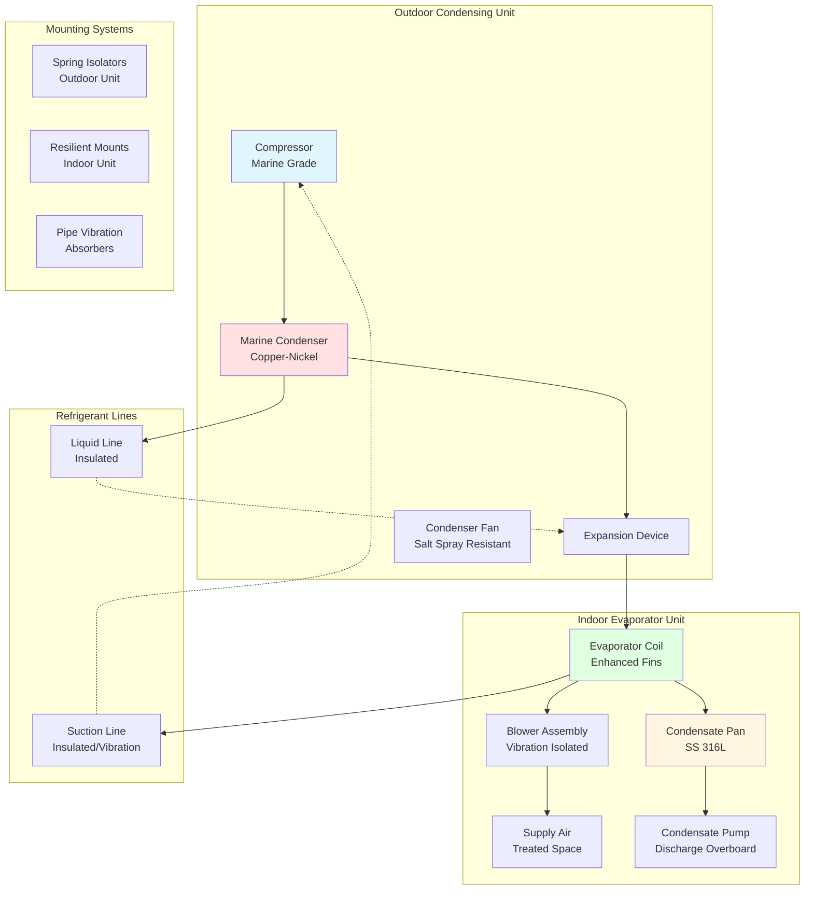

Marine split systems represent a versatile and efficient HVAC solution for ships and offshore installations, offering flexibility in equipment placement while maintaining the operational advantages of direct expansion refrigeration. These systems are specifically engineered to withstand the harsh marine environment, including salt spray, constant vibration, pitch and roll motion, and limited installation space.

## Marine Split System Configuration

Split systems separate the refrigeration circuit into two primary components: an outdoor condensing unit and an indoor evaporator/air handling section. This configuration provides several advantages in marine applications, including flexible equipment placement, reduced noise in occupied spaces, and simplified maintenance access.

## Cooling Capacity Calculations

Marine split system sizing requires consideration of ship-specific heat gains, including solar radiation through portholes and windows, heat transmission through steel hull structures, occupancy loads, equipment heat, and ventilation requirements for fresh air introduction.

The total cooling load for a marine space is calculated as:

$$Q_{total} = Q_{sensible} + Q_{latent}$$

Where sensible heat gain includes:

$$Q_{sensible} = Q_{transmission} + Q_{solar} + Q_{occupants} + Q_{equipment} + Q_{ventilation}$$

Transmission heat gain through marine hull structures:

$$Q_{transmission} = U \cdot A \cdot CLTD_{marine}$$

Where:
- $U$ = overall heat transfer coefficient for marine construction (Btu/h·ft²·°F)
- $A$ = surface area (ft²)
- $CLTD_{marine}$ = cooling load temperature difference adjusted for ship orientation and sea conditions

Solar heat gain through marine glazing:

$$Q_{solar} = A_{glazing} \cdot SHGC \cdot SC \cdot SHGF_{marine}$$

Where:
- $SHGC$ = solar heat gain coefficient
- $SC$ = shading coefficient for marine-grade glazing
- $SHGF_{marine}$ = solar heat gain factor adjusted for latitude and orientation

Latent heat gain from ventilation and infiltration:

$$Q_{latent} = 0.68 \cdot CFM \cdot \Delta W$$

Where $\Delta W$ is the humidity ratio difference between outdoor and indoor conditions (grains/lb).

Compressor power requirement with marine safety factor:

$$P_{comp} = \frac{Q_{total} \cdot 12000}{EER \cdot \eta_{marine}} \cdot SF_{marine}$$

Where $SF_{marine}$ = 1.15 to 1.25 accounts for reduced heat rejection capacity due to elevated seawater temperatures.

## Marine-Rated Equipment Specifications

Marine split systems incorporate specialized materials and construction techniques to ensure long-term reliability in corrosive maritime environments.

| Component | Standard Construction | Marine-Rated Construction | Service Life |
|-----------|----------------------|---------------------------|--------------|
| Condenser Coil | Copper tube/aluminum fin | Copper-nickel tube/epoxy-coated fin | 15-20 years |
| Evaporator Coil | Copper tube/aluminum fin | Copper tube/enhanced coated fin | 12-15 years |
| Cabinet/Housing | Painted steel | 316L stainless steel or marine-grade aluminum | 20+ years |
| Fasteners | Zinc-plated steel | 316 stainless steel | 20+ years |
| Fan Blades | Aluminum | Composite or 316 SS | 15-20 years |
| Electrical Components | Standard enclosure (IP44) | Marine-rated enclosure (IP56/IP65) | 10-15 years |
| Refrigerant Lines | Standard copper | Copper with enhanced wall thickness | 15-20 years |
| Condensate Pan | Galvanized steel | 316L stainless steel | 20+ years |
| Controls | PCB standard coating | Conformal coated PCB, sealed relays | 10-15 years |

## Corrosion Protection Strategies

The marine environment presents severe corrosive challenges due to salt spray, high humidity, and constant exposure to sea air. Comprehensive corrosion protection is essential for reliable system operation.

**Material Selection:**
- Copper-nickel (90/10 or 70/30) condenser tubing resists seawater-accelerated corrosion
- Type 316L stainless steel for all wetted surfaces and structural components
- Epoxy-coated or E-coated aluminum fins with minimum 50-micron thickness
- Marine-grade aluminum alloys (5052, 5086, 6061-T6) for non-structural components

**Protective Coatings:**
- Polyurethane powder coating (minimum 100 microns) for outdoor cabinets
- Epoxy primer + polyurethane topcoat system for steel structures
- Sacrificial zinc anodes on seawater-exposed heat exchangers
- Conformal coating on all electronic circuit boards

**Design Features:**
- Sloped surfaces to prevent water accumulation
- Sealed cable entries with marine-grade glands
- Drainage holes with corrosion-resistant grommets
- Separation of dissimilar metals with insulating barriers

## Vibration Isolation Requirements

Ships experience continuous vibration from propulsion machinery, wave action, and auxiliary equipment. Proper vibration isolation protects HVAC components and prevents structure-borne noise transmission.

**Outdoor Unit Mounting:**
- Spring isolators with deflection 0.5-1.0 inches minimum
- Seismic restraints per classification society requirements
- Mounting frame isolated from deck structure
- Base designed to accommodate ship flexure

**Indoor Unit Mounting:**
- Neoprene or rubber-in-shear isolators
- Suspended ceiling units require independent support
- Clearance from bulkheads to prevent contact during ship motion
- Flexible duct connections (minimum 12 inches)

**Refrigerant Piping:**
- Vibration loop or expansion joint near each connection
- Support spacing 6-8 feet with cushioned clamps
- Brazing procedures per marine specifications
- Nitrogen purge during all refrigerant work

Isolator selection based on disturbing frequency:

$$f_{n} = \frac{1}{2\pi} \sqrt{\frac{k}{m}}$$

Where the natural frequency $f_n$ should be less than 0.25 times the disturbing frequency for 90% isolation efficiency.

## Condensate Management

Effective condensate removal is critical in marine applications due to ship motion, which can cause condensate overflow and water damage to electrical systems and furnishings.

**Condensate Pan Design:**
- Minimum 2-inch depth with baffles to prevent sloshing
- Sloped toward drain connection (minimum 1/4 inch per foot)
- Dual drain connections on opposite corners
- Overflow sensor with alarm/shutdown capability
- 316L stainless steel construction with welded seams

**Condensate Pumps:**
- Marinized condensate pumps with sealed motors
- Redundant pump configuration for critical spaces
- Check valve on discharge to prevent backflow during ship motion
- Float switch with wide differential to prevent short cycling
- Discharge capacity 2-3 times condensate generation rate

**Drain Routing:**
- Discharge through hull fitting or to marine sanitary system
- Trap seal protection against negative pressure
- Vent piping to prevent vacuum formation
- Heat trace in refrigerated spaces to prevent freezing
- Minimum 3/4-inch ID drain lines with cleanout access

Condensate generation rate:

$$Q_{condensate} = \frac{Q_{latent}}{h_{fg}} \cdot 60$$

Where $h_{fg}$ = latent heat of vaporization (approximately 1050 Btu/lb at typical conditions), yielding condensate in gallons per hour.

## Classification Society Requirements

Marine HVAC equipment must comply with classification society rules that govern design, construction, testing, and installation aboard vessels.

**Major Classification Societies:**
- American Bureau of Shipping (ABS)
- Det Norske Veritas - Germanischer Lloyd (DNV-GL)
- Lloyd's Register (LR)
- Bureau Veritas (BV)
- Registro Italiano Navale (RINA)

**Type Approval Requirements:**
- Vibration testing: 2-25 Hz, 0.7g acceleration
- Inclination testing: ±22.5° static, ±10° dynamic
- Ambient temperature capability: 0°C to 50°C
- Salt spray testing per IEC 60068-2-52
- Ingress protection rating minimum IP56
- Electrical safety per IEC 60092 series

**Installation Standards:**
- Refrigerant piping per ASHRAE 15 and IMO requirements
- Electrical installation per IEC 60092-502
- Fire safety per SOLAS regulations
- Noise limits per IMO Resolution A.468(XII)
- Emergency shutdown integration with ship systems

## Refrigerant Considerations

Refrigerant selection for marine split systems balances cooling performance, environmental regulations, and safety requirements specific to maritime operations.

**Approved Marine Refrigerants:**
- R-410A: High efficiency, requires specialized equipment
- R-407C: Retrofit option, moderate GWP
- R-454B: Low-GWP alternative with A2L classification
- R-513A: Replaces R-134a in smaller systems

**Marine-Specific Requirements:**
- Leak detection systems in machinery spaces
- Refrigerant storage for servicing at sea
- Recovery equipment meeting IMO MARPOL Annex VI
- Training for crew on refrigerant handling
- Documentation per international maritime regulations

Critical temperature for condensing with elevated seawater:

$$T_{cond} = T_{seawater} + \Delta T_{approach} + \Delta T_{fouling}$$

Where $\Delta T_{approach}$ = 10-15°F and $\Delta T_{fouling}$ = 5°F allowance.

## Electrical Integration

Marine split systems require specialized electrical design to integrate with ship power systems and meet maritime safety standards.

**Power Supply Characteristics:**
- Voltage: 440V, 3-phase, 60Hz (US vessels) or 380V, 50Hz (international)
- Voltage tolerance: ±10% per IEC 60092-101
- Frequency tolerance: ±5%
- Phase unbalance: maximum 3%
- Short circuit coordination with ship distribution

**Control Integration:**
- Integration with ship automation systems (BMS/SCADA)
- Remote monitoring from bridge or engine control room
- Alarm annunciation to ship alarm system
- Emergency shutdown from multiple locations
- Load shedding capability during emergency power operation

**Safety Features:**
- Ground fault protection per maritime electrical code
- Overcurrent protection coordinated with ship distribution
- Motor thermal protection
- High/low pressure cutouts with manual reset
- Loss of phase protection

## Maintenance Access and Serviceability

Marine split systems must be designed for maintenance in confined spaces with limited access, often while the vessel is underway.

**Accessibility Requirements:**
- Minimum 30-inch clearance for service access
- Removable panels with captive fasteners
- Service valves on all refrigerant connections
- Sight glasses for refrigerant and oil level monitoring
- Test ports for pressure and temperature measurement

**Preventive Maintenance:**
- Coil cleaning every 3-6 months (more frequent in tropical service)
- Filter replacement per manufacturer schedule or pressure drop
- Electrical connection inspection and torque verification quarterly
- Refrigerant charge verification annually
- Vibration isolator inspection semi-annually
- Condensate system cleaning and testing quarterly

**Spare Parts Inventory:**
- Filters (minimum 2 complete sets)
- Condensate pump and float switch
- Control boards and sensors
- Contactors and relays
- Fan motors and capacitors
- Refrigerant for system recharge

Marine operating conditions reduce maintenance intervals by 30-50% compared to shore-based installations. Comprehensive maintenance logs are required by classification societies and port state inspections.

## System Performance Monitoring

Continuous monitoring enables predictive maintenance and ensures optimal system performance throughout the vessel's operational profile.

**Critical Monitoring Points:**
- Suction and discharge pressures
- Suction and discharge temperatures
- Supply air temperature and flow
- Return air temperature and humidity
- Compressor amperage
- Condensate flow rate
- Vibration levels at critical points

**Performance Metrics:**
- Energy Efficiency Ratio (EER) calculation from measured data
- Temperature setpoint deviation
- Runtime hours for maintenance scheduling
- Alarm frequency analysis
- Refrigerant subcooling and superheat trending

Data logging per IMO Data Collection System (DCS) requirements supports SEEMP (Ship Energy Efficiency Management Plan) compliance and identifies energy optimization opportunities.
