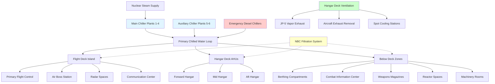

Aircraft carrier HVAC systems represent the most complex marine environmental control installations, supporting floating air bases with populations exceeding 5,000 personnel. These systems integrate aviation fuel vapor control, high-density electronics cooling, weapons environmental conditioning, and crew habitability across 24+ thermal zones spanning 4.5 acres of flight deck and massive internal volumes.

## Load Calculations and System Sizing

Aircraft carrier thermal loads combine conventional marine loads with aviation-specific heat sources. Total cooling capacity for Nimitz-class carriers ranges from 2,500 to 3,500 tons refrigeration distributed across multiple plants.

**Total sensible heat load:**

$$Q_{total} = Q_{solar} + Q_{crew} + Q_{equipment} + Q_{aviation} + Q_{ventilation}$$

Where individual components:

$$Q_{crew} = n_{crew} \times SHG_{person} = 5500 \times 250 \, \text{BTU/hr} = 1,375,000 \, \text{BTU/hr}$$

$$Q_{equipment} = A_{electronics} \times q_{electronics} + P_{machinery}$$

$$Q_{aviation} = Q_{exhaust} + Q_{fuel\,handling} + Q_{ordnance\,cooling}$$

**Hangar deck ventilation load:**

$$Q_{hangar} = 1.08 \times CFM \times \Delta T + 0.68 \times CFM \times \Delta W$$

For hangar deck maintaining 20 air changes per hour in 684 ft × 108 ft × 25 ft volume:

$$V_{hangar} = 684 \times 108 \times 25 = 1,847,700 \, \text{ft}^3$$

$$CFM_{required} = \frac{1,847,700 \times 20}{60} = 615,900 \, \text{CFM}$$

With outside air at 95°F DB/78°F WB and desired 85°F DB/65% RH:

$$Q_{sensible} = 1.08 \times 615,900 \times (95-85) = 6,651,720 \, \text{BTU/hr}$$

**JP-5 fuel vapor dilution:**

$$CFM_{dilution} = \frac{E_{vapor} \times 10^6}{LEL_{fraction} \times 387}$$

Where $E_{vapor}$ is evaporation rate (lb/hr), LEL fraction = 0.25 (25% of Lower Explosive Limit for safety), and 387 is conversion factor. For JP-5 with flash point 140°F and vapor pressure considerations:

$$CFM_{safety} = \frac{Q_{spillage}}{0.01 \times LEL_{JP5}}$$

Maintaining fuel vapor below 0.25% LEL (JP-5 LEL ≈ 0.7% by volume) requires continuous ventilation rates ensuring 50:1 dilution minimum.

## HVAC Zone Configuration

## Environmental Requirements by Space

| Compartment Type | Temperature (°F) | Humidity (%RH) | Ventilation (ACH) | Pressure (in wc) | Priority |
|------------------|------------------|----------------|-------------------|------------------|----------|
| Combat Information Center | 68-72 | 45-55 | 15-20 | +0.05 | 1A |
| Radar Equipment Spaces | 65-70 | 40-50 | 20-30 | +0.03 | 1A |
| Primary Flight Control | 70-75 | 40-60 | 12-15 | +0.02 | 1A |
| Hangar Deck (No aircraft running) | 75-85 | 30-70 | 20 | Neutral | 1B |
| Hangar Deck (Aircraft operations) | 75-90 | 30-70 | 30-40 | -0.02 | 1B |
| Weapons Magazines | 60-80 | 30-60 | 8-12 | +0.01 | 1A |
| Ready Rooms | 70-75 | 40-60 | 10-15 | Neutral | 2 |
| Crew Berthing | 70-78 | 40-65 | 6-10 | Neutral | 3 |
| Galley and Mess Decks | 75-85 | 40-70 | 15-25 | -0.05 | 2 |
| Medical Spaces | 70-75 | 45-55 | 12-18 | +0.03 | 1B |
| Reactor Compartment | 90-110 | N/A | 15-25 | -0.10 | 1A |
| Catapult Equipment Rooms | 75-95 | 30-70 | 10-15 | Neutral | 1B |

**Priority definitions:**
- **1A**: Mission-critical, maintain under all casualty conditions
- **1B**: Mission-essential, maintain unless major plant loss
- **2**: Important for operations, load-shed during casualties
- **3**: Crew comfort, first to load-shed

## Hangar Deck Ventilation Design

Hangar deck systems provide the most demanding ventilation requirements aboard carriers, handling aircraft maintenance operations, fuel vapor control, exhaust gas removal, and fire suppression integration.

**Design criteria:**

1. **Baseline ventilation**: 20 air changes per hour with no aircraft operations
2. **Aircraft running**: 30-40 ACH with supplemental exhaust at engine run positions
3. **Fuel spill response**: Automatic boost to 50+ ACH upon vapor detection
4. **Fire mode**: Coordination with foam suppression systems and smoke evacuation

Supply air distribution uses ceiling-mounted diffusers providing horizontal throw patterns to avoid interference with aircraft movement and maintenance activities. Discharge velocities remain below 800 fpm at 10 feet above deck to prevent FOD (foreign object debris) disturbance.

**Spot cooling stations** provide localized environmental control for maintenance personnel working inside or around parked aircraft. These portable units connect to manifold quick-disconnects providing:

- Chilled air at 50-55°F for cockpit cooling during avionics work
- Heated air at 120-140°F for engine warming in cold weather operations
- Conditioned air for instrument calibration requiring stable thermal environments

Exhaust systems employ both overhead extraction and deck-level pickup points. Overhead exhausts handle general ventilation loads, while deck exhausts activate during aircraft engine runs to capture exhaust gases before dispersion throughout the hangar.

**Explosion protection measures:**

- Electrical equipment rated Class I, Division 2 (formerly Class I, Group D)
- Ductwork bonding and grounding to prevent static accumulation
- Spark-resistant fan construction with aluminum or bronze impellers
- Emergency ventilation activation upon fire alarm or fuel spill detection
- Isolation dampers to prevent flame propagation between hangar bays

## JP-5 Fuel Vapor Control

JP-5 (jet fuel, NATO F-44) serves as the primary aviation fuel aboard carriers due to its high flash point (140°F minimum) providing enhanced safety during shipboard operations. Despite the elevated flash point, vapor control remains critical during fueling operations, fuel tank maintenance, and spill response.

**Vapor generation rates** depend on fuel temperature, surface area, and air movement:

$$E_{evap} = K \times A \times (P_{sat} - P_{partial}) \times M^{0.67}$$

Where:
- $K$ = mass transfer coefficient
- $A$ = liquid surface area (ft²)
- $P_{sat}$ = saturation vapor pressure at fuel temperature
- $P_{partial}$ = partial pressure of fuel vapor in air
- $M$ = molecular weight factor

At 85°F hangar deck temperature, JP-5 vapor pressure remains low (< 0.5 mm Hg), but worst-case scenarios assume fuel heated to 120°F during tropical operations or pump recirculation.

**Vapor detection and response:**

- Continuous monitoring via catalytic bead sensors at 50-foot spacing
- First alarm at 10% LEL (0.07% by volume for JP-5)
- Second alarm at 25% LEL with automatic ventilation boost
- Evacuation alarm at 50% LEL with emergency protocols

Fuel service areas and aviation fuel tanks incorporate dedicated ventilation separate from general hangar deck systems. These systems maintain slight negative pressure (-0.02 to -0.05 inches water column) and exhaust above flight deck level away from air intakes.

**Tank venting systems** employ flame arrestors and pressure-vacuum relief valves preventing tank overpressure during fuel transfer while containing vapors. Vent outlets locate at flight deck edge positions with adequate separation from aircraft parking spots and air intakes.

## Chiller Plant Configuration

Nuclear-powered carriers utilize steam turbine-driven centrifugal chillers as primary cooling plants, leveraging abundant steam from the ship's nuclear reactors. Electrical motor-driven chillers provide backup capacity and support at-sea replenishment alongside operations when steam demand peaks.

**Primary chiller plants (4 typical):**

- Capacity: 600-800 tons refrigeration each
- Steam turbine drive: 2400-3000 HP at 150-300 psig steam
- Seawater-cooled condensers: Titanium tube bundles, 85°F entering seawater basis
- Chilled water supply: 42°F at 3000-4000 GPM per plant
- Refrigerant: R-134a or HFC-125 (low GWP, non-ozone depleting)

**Auxiliary chiller plants (2-4 typical):**

- Capacity: 400-600 tons refrigeration each
- Electric motor drive: 450-600 kW at 450V, 60 Hz
- Emergency diesel generator backup capability
- Rapid start capability (< 5 minutes to full capacity)

**Emergency chillers:**

- Capacity: 200-400 tons refrigeration
- Diesel engine direct drive or emergency electrical bus
- Firemain condenser cooling backup
- Automatic start on main plant failure

Chilled water distribution employs primary-secondary pumping with variable flow secondary loops. Primary pumps maintain constant flow through chillers while secondary pumps modulate based on system demand, reducing parasitic pump energy during reduced load conditions.

**Temperature differential optimization:**

$$\Delta T = \frac{Q_{cooling}}{500 \times GPM}$$

Increasing temperature differential from conventional 10°F to 14-16°F reduces flow rates by 30-40%, decreasing pump energy and enabling smaller piping. However, this requires careful coil selection to maintain adequate heat transfer with reduced flow.

## Crew Habitability Design

Providing acceptable habitability for 5,000+ personnel in confined spaces under extreme external conditions presents unique challenges. Berthing compartments stack 3-high bunks in spaces with 7-8 foot overheads, creating high occupant densities and localized heat loads.

**Berthing ventilation:**

$$CFM_{berthing} = \text{max}\left(15 \times n_{occupants}, \, 6 \times ACH \times \frac{V}{60}\right)$$

Where $n_{occupants}$ is design occupancy and $V$ is compartment volume (ft³).

For typical 60-person berthing compartment (40 ft × 30 ft × 8 ft):

$$CFM_{required} = \text{max}(15 \times 60, \, 6 \times \frac{40 \times 30 \times 8}{60}) = \text{max}(900, \, 576) = 900 \, \text{CFM}$$

Distribution employs linear slot diffusers between bunk rows providing low-velocity (< 50 fpm) air movement. Return air grilles locate at ends of compartments preventing short-circuiting and ensuring air reaches all occupied zones.

**Thermal comfort challenges:**

- Personnel schedules create 24-hour occupancy with shifting loads
- Minimal privacy partitions limit individual zone control
- Vertical temperature stratification in stacked bunks (top bunks 3-5°F warmer)
- High radiant loads from overhead structure heated by flight deck solar gain

Sound attenuation receives critical attention in berthing areas. Ductwork penetrations include acoustically-lined plenums, and air handlers locate remotely from berthing compartments. Target noise levels: NC-30 to NC-35 for berthing, NC-40 to NC-45 for passageways.

## Combat Information Center Cooling

CIC spaces concentrate radar displays, communication equipment, computers, and operators in darkened compartments with heat densities approaching 500 watts/ft². Cooling system design must ensure equipment reliability while maintaining operator comfort during extended general quarters conditions.

**Load characteristics:**

$$Q_{CIC} = A_{floor} \times q_{equipment} + n_{operators} \times SHG_{person} + Q_{lighting}$$

For typical CIC: 3,000 ft² × 400 W/ft² = 1,200,000 W = 4,095,000 BTU/hr

This exceeds typical office buildings by factors of 8-10 and requires 340 tons refrigeration for the CIC space alone.

**Redundant cooling design:**

- Dual air handling units from separate fire zones and chiller plants
- Either AHU capable of 60% capacity (combined = 120% of design load)
- Automatic changeover on failure with < 30 second interruption
- Backup portable cooling units for casualty conditions
- Emergency chilled water from dedicated battle stations system

Supply air quantities reach 15-20 air changes per hour at 52-55°F to offset high heat density. Under-floor air distribution systems provide effective cooling directly at equipment racks while reducing ductwork congestion in overhead spaces packed with cable trays and piping.

**Humidity control** prevents condensation on cold equipment surfaces and maintains comfort for operators. Dehumidification to 45-50% RH occurs at central air handlers using chilled water coils with 38-42°F water temperature achieving apparatus dew points of 48-52°F.

## Flight Deck and Island Cooling

The carrier island houses primary flight control, air boss station, navigation bridge, radar equipment rooms, and communication centers in a structure rising 180+ feet above the waterline. Solar loads, radiant heat from flight deck surfaces reaching 140-160°F, and equipment heat create extreme cooling demands.

**Island cooling challenges:**

- Solar heat gain through large window areas in flight control spaces
- Radiant load from aluminum flight deck (solar absorptivity α = 0.4-0.6)
- Limited equipment space within narrow island structure
- Long refrigerant or chilled water piping runs from central plants
- Vibration from flight operations affecting sensitive equipment

Primary flight control ("Pri-Fly") maintains 70-75°F despite window areas exceeding 300 ft² and direct solar exposure. Laminar flow windows with integrated sun shades reduce gains, while high-velocity supply air (up to 1500 fpm) from overhead diffusers provides rapid cooling without drafts at operator stations.

**Radar equipment cooling** employs dedicated systems separate from habitability HVAC. High-power radar transmitters generate 50-200 kW thermal loads requiring year-round cooling regardless of ambient conditions. These systems utilize:

- Glycol secondary loops isolating seawater from sensitive electronics
- Redundant pumps and heat exchangers for continuous operation
- Automatic temperature control maintaining ±2°F stability
- Filtration to ISO 16890 ePM1 60% minimum (formerly MERV 13)

## Standards and Specifications

Aircraft carrier HVAC systems comply with extensive military standards addressing performance, survivability, and integration requirements:

**Primary specifications:**

- **MIL-STD-2036**: HVAC for surface ships (general requirements)
- **MIL-STD-167-1A**: Mechanical vibration of shipboard equipment
- **MIL-STD-901D**: Shock testing requirements for naval equipment
- **NAVSEA S9AAO-AB-GOS-010**: General specifications for ships of the United States Navy
- **MIL-PRF-32016**: Collective protection equipment NBC filtration
- **NFPA 409**: Aircraft hangars (adapted for naval aviation)
- **UFC 4-211-01**: Naval aviation facilities (shore-based reference)

**Aviation fuel handling:**

- **MIL-DTL-5624**: Turbine fuel, aviation, grades JP-4, JP-5, and JP-8
- **NFPA 30**: Flammable and combustible liquids code
- **NAVSEA OP 5 Vol 1**: Ammunition and explosives ashore safety regulations (weapons magazines)

**Testing and commissioning:**

- **NAVSEA T9074-AS-GIB-010/271**: Requirements for air conditioning, refrigeration, and ventilation systems
- **NEBB Procedural Standards**: Testing, adjusting, and balancing (adapted for naval applications)
- **CNSCINST 9090.1**: Comprehensive ship construction and repair specification

## Operational Considerations

Carrier HVAC systems must maintain performance across operational profiles ranging from Arctic operations to Persian Gulf deployments where seawater temperatures exceed 90°F and ambient air reaches 115°F.

**Tropical operations challenges:**

- Seawater cooling effectiveness decreases 40-50% (85°F vs 55°F water)
- Chiller capacity degrades 15-25% at elevated condenser temperatures
- Flight deck radiant loads increase solar contribution by 30-40%
- Crew heat stress increases, requiring additional cooling to berthing spaces

**Cold weather operations:**

- Seawater temperature below 35°F requires freeze protection systems
- Reduced cooling loads allow plant rotation for maintenance
- Heating loads increase for exposed island structure and weather decks
- Condensation control becomes critical on cold hull surfaces

**At-sea replenishment (UNREP) operations:**

- Steam demand for catapults and aircraft operations peaks simultaneously
- Chiller steam supply may reduce, requiring load management
- Auxiliary electric chillers activate to maintain critical cooling
- Temporary ventilation reductions acceptable in non-critical spaces

---

Aircraft carrier HVAC systems exemplify large-scale marine environmental control engineering, integrating nuclear propulsion systems, aviation operations support, NBC protection, and crew life support into comprehensive platforms supporting extended forward deployments in contested environments.
