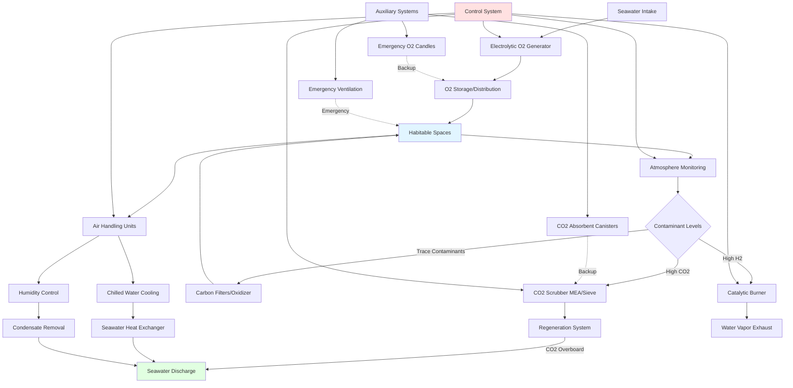

Submarine environmental control systems (ECS) represent the most sophisticated sealed-atmosphere HVAC applications, integrating life support functions with thermal comfort control. These systems maintain breathable atmosphere composition, remove metabolic contaminants, control temperature and humidity, and ensure crew survivability during submerged operations lasting weeks to months without surfacing.

## Atmospheric Composition Control

Submarine atmospheric control maintains precise gas concentrations within physiological limits for extended crew exposure. The system actively manages oxygen levels, removes carbon dioxide, controls trace contaminants, and prevents explosive gas accumulation through continuous monitoring and regeneration.

**Atmospheric component specifications:**

| Parameter | Normal Range | Maximum Limit | Physiological Basis |
|-----------|--------------|---------------|---------------------|
| Oxygen (O₂) | 19-21% | 23% max, 17% min | Hypoxia prevention, fire risk |
| Carbon Dioxide (CO₂) | < 0.5% (5,000 ppm) | 1.0% (10,000 ppm) 24hr | Respiratory acidosis limit |
| Carbon Monoxide (CO) | < 10 ppm | 50 ppm TWA | Carboxyhemoglobin formation |
| Hydrogen (H₂) | < 1% | 2% (LFL consideration) | Explosive hazard from batteries |
| Total Hydrocarbons | < 1 ppm | 5 ppm | Irritation, toxicity threshold |
| Nitrogen (N₂) | Balance | - | Inert diluent |
| Temperature | 70-75°F | 85°F wet bulb | Heat stress prevention |
| Relative Humidity | 30-50% | 60% | Condensation, mold prevention |

The fundamental atmospheric balance equation for a sealed submarine environment:

$$\frac{dC}{dt} = \frac{G - R - V \cdot C}{V}$$

Where:
- $C$ = contaminant concentration (ppm or %)
- $t$ = time (hours)
- $G$ = generation rate (mass/time)
- $R$ = removal rate (mass/time)
- $V$ = habitable volume (cubic feet)

For steady-state operation, $\frac{dC}{dt} = 0$, yielding:

$$C_{ss} = \frac{G}{R + V \cdot \lambda}$$

where $\lambda$ is the natural decay constant for the contaminant.

## Oxygen Generation Systems

Modern submarines generate oxygen electrochemically from seawater rather than carrying compressed gas stores. Electrolysis systems decompose seawater into oxygen and hydrogen through direct current application across specialized electrodes.

The electrolysis reaction:

$$2H_2O \xrightarrow{electrical\ energy} 2H_2 + O_2$$

Oxygen production requirements scale with crew metabolic demand:

$$\dot{m}_{O_2} = n_{crew} \times 0.84 \frac{\text{lb}}{\text{person-day}} \times SF$$

Where:
- $\dot{m}_{O_2}$ = oxygen generation rate (lb/day)
- $n_{crew}$ = number of personnel
- $SF$ = safety factor (typically 1.15-1.25)

For a crew of 140, oxygen demand equals approximately 120 lb/day or 5 lb/hr. At standard conditions, this equates to 42 scfm oxygen generation capacity.

**Electrolytic oxygen generator specifications:**

| System Parameter | Typical Value | Units |
|------------------|---------------|-------|
| Production capacity | 40-60 | scfm O₂ |
| Power consumption | 0.9-1.1 | kWh/lb O₂ |
| Seawater consumption | 1.5-2.0 | gal/lb O₂ |
| Cell voltage | 1.8-2.2 | VDC |
| Operating temperature | 160-180 | °F |
| Purity | 99.5% | % O₂ |
| Hydrogen production | 84 | scfm H₂ (byproduct) |

The hydrogen byproduct requires immediate removal through catalytic burners or venting to prevent accumulation beyond lower flammability limits (4% H₂ in air).

## Carbon Dioxide Removal Systems

CO₂ scrubbing systems remove respiratory carbon dioxide to maintain concentrations below 0.5% (5,000 ppm) for crew health. Submarines employ either chemical absorption (monoethanolamine) or regenerative molecular sieve systems depending on vessel class and operational requirements.

**Monoethanolamine (MEA) absorption:**

The chemical reaction capturing CO₂:

$$2(R-NH_2) + CO_2 + H_2O \rightleftharpoons (R-NH_3)_2CO_3$$

The absorption process operates through countercurrent gas-liquid contact in packed towers. Rich amine solution regenerates in a stripper column at elevated temperature (220-240°F), releasing concentrated CO₂ for overboard discharge and returning lean solution for reuse.

MEA system design capacity:

$$Q_{scrubber} = \frac{n_{crew} \times 2.2 \frac{\text{lb CO}_2}{\text{person-day}}}{C_{in} - C_{out}} \times \frac{1}{\eta}$$

Where:
- $Q_{scrubber}$ = air flow rate through scrubber (cfm)
- $C_{in}$ = inlet CO₂ concentration (lb/ft³)
- $C_{out}$ = outlet CO₂ concentration (lb/ft³)
- $\eta$ = removal efficiency (typically 0.85-0.92)

**Molecular sieve systems:**

Pressure swing adsorption (PSA) or temperature swing adsorption (TSA) systems utilize zeolite beds alternating between adsorption and regeneration cycles. These systems offer lower power consumption than MEA but require larger volume.

| System Type | Removal Rate | Power | Volume | Regeneration |
|-------------|--------------|-------|--------|--------------|
| MEA absorption | 300-400 lb/day CO₂ | 35-45 kW | 120-150 ft³ | Thermal (steam) |
| Molecular sieve (PSA) | 300-400 lb/day CO₂ | 20-30 kW | 200-250 ft³ | Pressure swing |
| Lithium hydroxide | 300-400 lb/day CO₂ | Minimal | 80-100 ft³ | Non-regenerative |

## Trace Contaminant Control

Beyond O₂ and CO₂, submarines must remove trace contaminants from cooking, equipment off-gassing, refrigerants, cleaning chemicals, and incomplete combustion. These contaminants accumulate in the sealed environment and require active removal.

**Primary trace contaminants:**

- Carbon monoxide (CO) from combustion sources
- Volatile organic compounds (VOCs) from solvents, paints, adhesives
- Freon refrigerants from air conditioning and refrigeration leaks
- Hydrogen from battery charging and electrolysis
- Methane and other hydrocarbons from waste systems
- Ozone from electronic equipment

**Removal technologies:**

1. **Catalytic burners**: Oxidize hydrogen, CO, and hydrocarbons at 600-800°F over platinum or palladium catalysts
2. **Activated carbon adsorption**: Remove VOCs and refrigerants through physical adsorption
3. **Catalytic oxidizers**: Low-temperature (400-600°F) oxidation of organics
4. **HEPA filtration**: Remove particulates and bioaerosols (99.97% at 0.3 microns)

Catalytic burner hydrogen removal follows:

$$H_2 + \frac{1}{2}O_2 \xrightarrow{catalyst} H_2O + 242 \frac{\text{kJ}}{\text{mol}}$$

The burner must process all air containing hydrogen above 0.5% concentration, typically 500-1000 cfm during battery charging operations.

## Submarine ECS Architecture

The integrated environmental control system coordinates atmospheric control, thermal management, and ventilation through automated monitoring and control.

## Thermal Load Management

Submarine internal heat loads significantly exceed surface vessel requirements due to dense equipment installation, nuclear propulsion systems, and sealed hull construction preventing natural ventilation.

**Heat load sources:**

| Source | Heat Load | Percentage |
|--------|-----------|------------|
| Electronics and weapons systems | 800-1200 kW | 35-45% |
| Propulsion and auxiliary machinery | 600-900 kW | 25-35% |
| Personnel (140 crew @ 400 BTU/hr) | 165 kW | 7-10% |
| Lighting | 120-180 kW | 5-8% |
| Cooking and galley | 80-120 kW | 3-5% |
| Miscellaneous equipment | 150-250 kW | 7-12% |
| **Total internal load** | **1,915-2,815 kW** | **100%** |

Hull heat transfer provides minimal cooling due to low surface-to-volume ratio and insulation requirements. The net heat gain through the pressure hull:

$$q_{hull} = U \cdot A \cdot (T_{sw} - T_{int})$$

Where:
- $q_{hull}$ = heat transfer through hull (BTU/hr)
- $U$ = overall heat transfer coefficient (0.15-0.25 BTU/hr-ft²-°F with insulation)
- $A$ = wetted hull surface area (40,000-60,000 ft² for SSN)
- $T_{sw}$ = seawater temperature (28-85°F)
- $T_{int}$ = internal temperature (72°F target)

At 1000 ft depth with 35°F seawater and interior temperature of 72°F, a 50,000 ft² hull with U = 0.20 removes only:

$$q_{hull} = 0.20 \times 50,000 \times (35-72) = -370,000 \text{ BTU/hr} = -108 \text{ kW}$$

This represents only 4-6% of total heat generation, requiring active cooling for the remaining 1,800-2,700 kW.

## Air Conditioning and Dehumidification

Chilled water systems provide distributed cooling through air handling units serving compartmentalized zones. The seawater-cooled refrigeration plants utilize R-134a or R-114 refrigerants in hermetic centrifugal or screw compressor configurations.

**Typical submarine AC plant specifications:**

| Parameter | Value |
|-----------|-------|
| Cooling capacity per plant | 150-250 tons |
| Number of plants | 2-3 (redundant) |
| Chilled water supply temperature | 42-45°F |
| Chilled water return temperature | 52-55°F |
| Condenser seawater flow | 800-1200 gpm per 100 tons |
| System COP | 3.5-4.5 |
| Noise level requirement | < 65 dB(A) at 3 ft |

Dehumidification occurs naturally through chilled water coil condensation. Daily moisture removal requirements:

$$\dot{m}_{H_2O} = n_{crew} \times 0.5 \frac{\text{lb}}{\text{person-day}} + \dot{m}_{cooking} + \dot{m}_{equipment}$$

For 140 crew, total moisture generation reaches 85-110 lb/day (10-13 gallons/day), requiring continuous dehumidification to maintain 30-50% RH.

## Atmosphere Monitoring Systems

Continuous atmospheric monitoring provides real-time composition data for automated control and crew safety. Sensor arrays measure critical parameters with redundant instrumentation in multiple compartments.

**Monitoring sensor suite:**

- Oxygen sensors: Electrochemical or paramagnetic (±0.1% accuracy)
- CO₂ sensors: Infrared absorption (±50 ppm accuracy)
- CO sensors: Electrochemical (±1 ppm accuracy)
- H₂ sensors: Catalytic bead or thermal conductivity (±0.1% accuracy)
- Hydrocarbon sensors: Flame ionization detector (±0.5 ppm accuracy)
- Pressure sensors: Differential and absolute (±0.01 psi accuracy)
- Temperature/humidity sensors: RTD and capacitive (±0.5°F, ±2% RH)

Data logging occurs at 1-minute intervals with alarm thresholds triggering automatic system responses. Oxygen concentration below 19% activates supplemental oxygen release; CO₂ above 0.8% increases scrubber flow; hydrogen above 1.5% activates catalytic burners.

## Emergency Systems

Backup life support systems provide redundancy for atmospheric control failures during combat damage or equipment casualties.

**Emergency oxygen sources:**

1. **Oxygen candles** (sodium chlorate): Generate O₂ through thermal decomposition
   $$2NaClO_3 \rightarrow 2NaCl + 3O_2$$
   Each candle produces approximately 6,000 liters O₂ (sufficient for 1 person for 24 hours)

2. **Emergency air banks**: High-pressure compressed air (3,000-4,500 psi) providing 6-12 hours supply

3. **Emergency blow system**: High-pressure air for ballast tank blowing during emergency surfacing

**Emergency CO₂ removal:**

Lithium hydroxide (LiOH) canisters provide non-regenerative CO₂ absorption:

$$2LiOH + CO_2 \rightarrow Li_2CO_3 + H_2O$$

Each pound of LiOH absorbs 0.53 lb CO₂. For 140 crew generating 310 lb CO₂/day, emergency operation requires 585 lb LiOH daily (50-60 canisters).

---

*Submarine environmental control systems integrate life support, thermal management, and atmospheric purification into self-contained platforms supporting extended submerged operations without external atmosphere exchange.*
