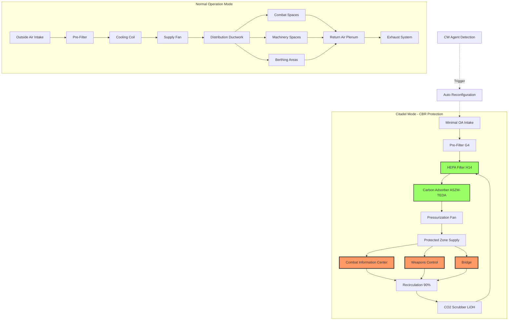

Naval surface ship HVAC systems integrate environmental control with combat survivability, providing life support during CBRN (chemical, biological, radiological, nuclear) threats while maintaining operational capability through battle damage scenarios. These systems employ distributed architecture, shock-resistant construction, and automated reconfiguration protocols aligned with MIL-STD-2036 requirements.

## Design Load Calculations

Surface combatant heat loads differ substantially from commercial vessels due to electronics density and equipment power consumption. Standard calculations apply modified assumptions for military installations.

**Total cooling load equation:**

$$Q_{total} = Q_{sensible} + Q_{latent} + Q_{equipment} + Q_{solar} + Q_{hull}$$

Where individual components are:

$$Q_{sensible} = \dot{m}_{air} \cdot c_p \cdot (T_{outside} - T_{supply})$$

$$Q_{equipment} = \sum_{i=1}^{n} P_i \cdot \eta_i \cdot DF_i$$

$$Q_{hull} = U \cdot A \cdot (T_{ambient} - T_{internal})$$

**Electronics heat load dominates in combat systems spaces:**

| Space Type | Equipment Load | Personnel Load | Ratio |
|------------|---------------|----------------|-------|
| Combat Information Center | 280 W/m² | 25 W/m² | 11:1 |
| Radar Equipment Room | 450 W/m² | 15 W/m² | 30:1 |
| Weapons Control Center | 320 W/m² | 30 W/m² | 10.7:1 |
| Berthing Compartments | 15 W/m² | 85 W/m² | 0.18:1 |
| Galley Spaces | 220 W/m² | 60 W/m² | 3.7:1 |

**Refrigeration capacity sizing per MIL-STD-2036:**

$$\text{Total TR} = \frac{Q_{total}}{12000} \cdot SF \cdot BF$$

Where:
- $SF$ = safety factor (1.15-1.25 for naval applications)
- $BF$ = battle damage factor (1.33 for N-1 survivability, 1.50 for N-2)
- TR = tons refrigeration

For a destroyer-class vessel (DDG) with 85,000 ft² conditioned space:

$$Q_{avg} = 180 \text{ BTU/hr-ft}^2 \times 85000 \text{ ft}^2 = 15.3 \times 10^6 \text{ BTU/hr}$$

$$\text{Required capacity} = \frac{15.3 \times 10^6}{12000} \times 1.20 \times 1.50 = 1913 \text{ TR}$$

This capacity distributes across 4-6 independent plants for battle damage tolerance.

## CBR Protection Architecture

Collective protection systems create positive pressure zones where personnel operate without individual protective equipment during chemical or biological warfare agent attacks. The HVAC system executes coordinated reconfiguration from normal ventilation to citadel mode.

**Citadel pressurization requirements:**

Positive pressure differential maintains contaminant exclusion:

$$\Delta P = P_{citadel} - P_{ambient} \geq 0.15 \text{ in. w.c.}$$

Required leakage makeup airflow:

$$Q_{leakage} = A_{surface} \cdot C \cdot \sqrt{\Delta P}$$

Where:
- $A_{surface}$ = total boundary surface area (ft²)
- $C$ = leakage coefficient (typically 0.65 cfm/ft² for naval construction)
- $\Delta P$ = pressure differential (in. w.c.)

For a 15,000 ft² protected zone:

$$Q_{leakage} = 15000 \times 0.65 \times \sqrt{0.20} = 4368 \text{ cfm}$$

**Filtration train specifications per MIL-PRF-32016:**

| Filter Stage | Type | Efficiency | Pressure Drop |
|--------------|------|------------|---------------|
| Pre-filter | EN 779 G4 | 90% > 10 μm | 0.3 in. w.c. |
| HEPA filter | EN 1822 H14 | 99.995% @ 0.3 μm | 1.2 in. w.c. |
| Carbon adsorber | ASZM-TEDA 12×30 mesh | >99.9% CW agents | 1.8 in. w.c. |
| Total system | Combined | Meets MIL-PRF-32016 | 3.3 in. w.c. clean |

Carbon bed residence time calculation:

$$t_{residence} = \frac{V_{bed}}{Q_{air}} \geq 0.025 \text{ sec}$$

This ensures adequate contact time for chemical warfare agent adsorption.

## Zone Distribution and Redundancy

Surface combatants employ distributed HVAC plants with cross-connected distribution for battle damage survivability. Zone isolation prevents smoke and contaminant propagation while maintaining operational capability.

**DDG-51 Class destroyer typical configuration:**

| Zone | Plant Assignment | Priority | Backup Feed | Isolation Capability |
|------|------------------|----------|-------------|---------------------|
| 1 - Forward Combat Systems | Plant 1, 3 | 1A | Plant 2 | Gas-tight |
| 2 - Bridge and Navigation | Plant 1, 2 | 1A | Plant 3 | Gas-tight |
| 3 - Forward Berthing | Plant 2 | 2 | Plant 1 | Smoke-tight |
| 4 - Midship Machinery | Plant 2, 4 | 1B | Dedicated | Watertight |
| 5 - Weapons Magazine | Plant 3, 4 | 1A | Temp control only | Gastight |
| 6 - Aft Combat Systems | Plant 3, 4 | 1A | Plant 2 | Gas-tight |
| 7 - Aft Berthing | Plant 4 | 2 | Plant 3 | Smoke-tight |
| 8 - Hangar Bay | Plant 1, 4 | 2 | Natural ventilation | Open |

**Environmental requirements by space classification:**

| Space Type | Temperature | Humidity | Pressure | Air Changes |
|------------|-------------|----------|----------|-------------|
| Combat Information Center | 70-75°F ± 2° | 35-55% RH | Neutral | 15-20 ACH |
| Radar Equipment Rooms | 65-72°F ± 3° | 40-60% RH | Positive +0.05" | 25-35 ACH |
| Weapons Magazines | 60-80°F ± 5° | <60% RH | Neutral | 8-12 ACH |
| Machinery Spaces | <120°F max | Uncontrolled | Negative -0.05" | 30-60 ACH |
| Berthing Compartments | 72-78°F ± 3° | 40-65% RH | Neutral | 10-15 ACH |
| Galley Spaces | 75-85°F max | Uncontrolled | Negative -0.10" | 20-30 ACH |
| Bridge | 68-75°F ± 2° | 35-55% RH | Positive +0.03" | 12-18 ACH |
| Medical Spaces | 70-75°F ± 2° | 30-60% RH | Positive +0.05" | 15-25 ACH |

## Shock Hardening and Battle Damage Tolerance

All HVAC equipment undergoes shock testing per MIL-S-901D to verify survivability under underwater explosion (UNDEX) conditions. Three test grades apply based on equipment weight and mounting location.

**MIL-S-901D shock test grades:**

- **Grade A**: Medium weight (151-350 lbs) shock-mounted equipment - hammer test 1000 lbs from 3 ft
- **Grade B**: Heavy weight (>350 lbs) deck-mounted equipment - explosive barge testing
- **Grade C**: Light weight (<150 lbs) hull-mounted equipment - hammer test 500 lbs from 2 ft

**Shock isolation mounting:**

Equipment mounts employ resilient isolators sized for both vibration isolation and shock protection:

$$f_n = \frac{1}{2\pi} \sqrt{\frac{k}{m}}$$

Where:
- $f_n$ = natural frequency (Hz)
- $k$ = spring constant (lb/in)
- $m$ = equipment mass (lb-sec²/in)

For shock isolation, natural frequency must satisfy:

$$f_n \leq 0.5 \times f_{shock}$$

Typical naval shock spectra have dominant frequency content at 30-100 Hz, requiring isolator natural frequencies below 15 Hz.

**Maximum shock acceleration per MIL-S-901D Grade A:**

| Direction | Acceleration | Velocity Change |
|-----------|--------------|-----------------|
| Vertical | 20-35 G | 15-25 ft/sec |
| Athwartship | 10-18 G | 10-18 ft/sec |
| Fore-Aft | 8-15 G | 8-15 ft/sec |

Equipment must continue operation after exposure to these levels with no degradation in performance.

**Battle damage design criteria:**

Systems design assumes simultaneous damage to one complete fire zone. Remaining zones must provide:

1. 100% cooling to Priority 1A spaces (combat systems, bridge, CIC)
2. 75% cooling to Priority 1B spaces (machinery control, communications)
3. 50% cooling to Priority 2 spaces (berthing, galley, administrative)

This requires minimum N+1 redundancy for critical systems, with N+2 preferred for capital ships.

**Automatic load shedding sequence:**

When plant capacity drops below total load demand:

$$\text{Available Capacity} < \sum_{i=1}^{n} \text{Zone Load}_i$$

Control systems execute programmed shedding:

1. Secure Priority 3 zones (storage, workshops) - immediate
2. Reduce Priority 2 zones to minimum ventilation - 30 seconds
3. Reduce Priority 1B to 75% capacity - 60 seconds
4. Maintain Priority 1A at 100% capacity - always

This protocol maintains combat effectiveness while preventing total system overload.

## Ductwork and Piping Shock Resistance

Distribution systems require seismic/shock bracing exceeding commercial marine standards. MIL-STD-2036 establishes maximum unsupported spans and bracing angles.

**Maximum duct span requirements:**

| Duct Size (in) | Round Max Span | Rectangular Max Span | Brace Angle |
|----------------|----------------|----------------------|-------------|
| ≤12 | 8 ft | 6 ft | 45° ± 5° |
| 13-24 | 6 ft | 5 ft | 45° ± 5° |
| 25-36 | 5 ft | 4 ft | 45° ± 5° |
| >36 | 4 ft | 3 ft | 45° ± 5° |

**Piping support spacing for shock resistance:**

Chilled water and refrigerant piping requires closer support spacing than commercial applications:

$$L_{max} = 0.75 \times L_{commercial}$$

For 3-inch schedule 40 steel pipe carrying chilled water:

- Commercial maximum span: 12 ft
- Naval shock-resistant span: 9 ft
- Transverse brace requirement: Every 18 ft alternating direction

**Flexible connections at equipment interfaces:**

All rotating equipment connections use flexible braided stainless steel hoses or expansion joints rated for:

- Axial movement: ± 1.0 inches
- Lateral movement: ± 0.5 inches
- Angular rotation: ± 5 degrees

This prevents stress concentration and piping failure during shock events.

## Fire Boundaries and Gas-Tight Integrity

HVAC penetrations through watertight and gas-tight boundaries must maintain boundary classification. Naval specifications exceed commercial marine requirements.

**Penetration seal requirements:**

| Boundary Type | Seal Method | Test Pressure | Leakage Rate |
|---------------|-------------|---------------|--------------|
| Watertight | Stuffing tube with packing | 5 psi water | Zero visible |
| Gas-tight | Welded sleeve with seal | 1 psi air | <0.1 cfm @ 1" w.c. |
| Fire-rated (A-60) | Intumescent + mineral wool | 1832°F for 60 min | Meets SOLAS |
| Shock-rated | Flexible seal assembly | 20G shock | No degradation |

**Damper specifications for fire zones:**

Automatic fire dampers at main zone boundaries operate on:
- Thermal fusible link (165°F or 212°F rating)
- Smoke detector signal (photoelectric or ionization)
- Manual activation from damage control station
- Loss of control power (fail-safe closed)

Damper closure time: <5 seconds from signal
Leakage rate when closed: <10 cfm per ft² damper area at 4" w.c.

**Emergency ventilation system:**

Independent emergency ventilation operates during casualty scenarios when normal HVAC is secured:

- Portable electric blowers (500-2000 cfm per unit)
- Diesel-driven smoke ejectors for firefighting support
- Emergency escape breathing devices (EEBD) in equipment spaces
- Dedicated purge fans for NBC decontamination

These systems support damage control teams operating in contaminated or smoke-filled compartments.

---

*Surface ship HVAC systems exemplify the integration of environmental control with combat survivability, employing distributed redundancy, shock-resistant construction, and automated reconfiguration to maintain operational capability under battle damage and CBRN threat conditions specified in MIL-STD-2036 and related naval engineering standards.*
