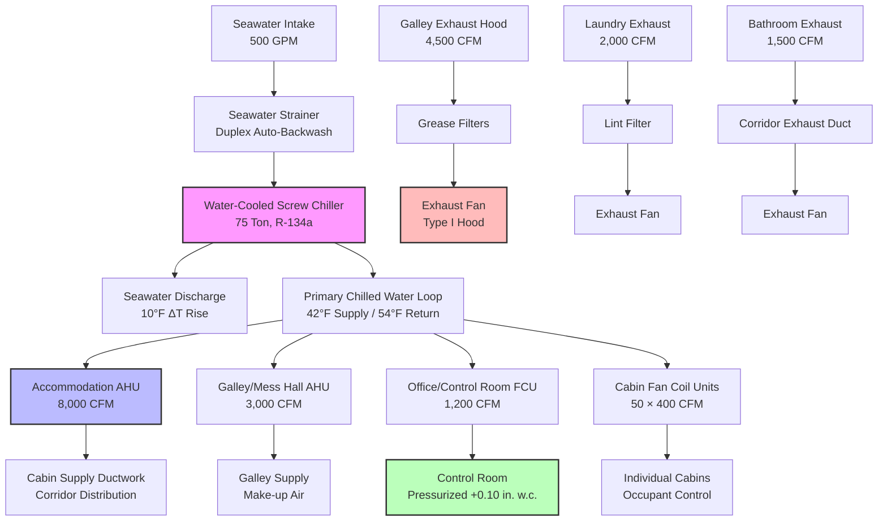

## Drilling Platform HVAC Requirements

Drilling platforms combine intensive industrial operations with residential accommodations in hazardous offshore environments. HVAC systems must provide drill floor ventilation for gas dispersal, mud room exhaust for hydrogen sulfide and particulate control, climate-controlled spaces for precision drilling electronics, and comfortable living quarters for crews working 12-hour shifts over multi-week rotations.

Platform configurations requiring specialized HVAC:
- Jack-up drilling rigs (300-400 ft leg extensions)
- Semi-submersible drilling platforms (floating, dynamically positioned)
- Drill ships (vessel-based drilling operations)
- Platform rigs (fixed structure drilling units)
- Tender-assisted drilling (accommodation barge plus wellhead platform)

HVAC systems must accommodate:
- Drill floor area ventilation (Zone 1/2 hazardous classification)
- Mud processing room exhaust (H₂S, drilling fluid aerosols, bentonite dust)
- Shale shaker area ventilation (high particulate loading)
- Subsea control room cooling (precision temperature control ±2°F)
- Accommodation for 80-150 personnel (24/7 occupancy)
- Driller cabin climate control (visibility through large glass panels)
- Continuous operation during well drilling (no shutdown periods)

## Hazardous Area Classification - Drilling Operations

Drilling platforms contain multiple hazardous zones requiring explosion-proof HVAC equipment and positive pressure ventilation.

### Drill Floor Classification

**Zone 1 Areas** (explosive atmosphere likely during normal operations):
- Rotary table area during drilling
- Wellhead area during circulation and tripping
- Shale shaker pits (gas-laden drilling fluid exposure)
- Mud return line vicinity
- Degasser area (evolved gas concentration)

**Zone 2 Areas** (explosive atmosphere unlikely but possible):
- General drill floor area beyond 15 ft from wellhead
- Driller's cabin (pressurized, outside air intakes in safe areas)
- Pipe handling areas
- Setback area for drill pipe storage

### Mud Processing Area Classification

**Zone 1 Areas**:
- Mud gas separator discharge vicinity (high gas concentration)
- Degasser unit area (continuous gas evolution)
- Shale shaker fluid discharge points
- Mud mixing area (hydrogen sulfide release potential)

**Zone 2 Areas**:
- Mud pump room (enclosed space, potential releases from packing glands)
- Mud tank area (drilling fluid storage and conditioning)
- Centrifuge area (enclosed processing equipment)

Ventilation rates must achieve gas concentrations below 25% of Lower Explosive Limit (LEL) during normal operations and below 60% LEL during abnormal release scenarios.

## Drill Floor Ventilation Design

Drill floor ventilation disperses hydrocarbon gases released from drilling fluid returns and prevents explosive atmosphere accumulation.

### Ventilation Load Calculation

Total airflow requirement combines dilution ventilation for gas dispersal with general area ventilation:

$$Q_{total} = \max(Q_{dilution}, Q_{area})$$

**Gas Dilution Airflow**:

$$Q_{dilution} = \frac{G \times 10^6 \times SG}{LEL \times 0.25 \times \rho_{air}}$$

Where:
- $G$ = gas evolution rate from drilling fluid (scfm at standard conditions)
- $SG$ = specific gravity of gas (methane = 0.554, H₂S = 1.19)
- $LEL$ = lower explosive limit (methane = 5.0%, H₂S = 4.3%)
- $\rho_{air}$ = air density (0.075 lb/ft³ at standard conditions)
- 0.25 factor maintains concentration at 25% of LEL for safety margin

For drilling operation with 100 scfm methane evolution from mud returns:

$$Q_{dilution} = \frac{100 \times 10^6 \times 0.554}{50,000 \times 0.075} = 14,773 \text{ cfm}$$

**Area Ventilation Airflow**:

$$Q_{area} = V \times ACH$$

For typical drill floor (60 ft × 80 ft × 25 ft height = 120,000 ft³):
- Zone 1 requirement: 15 ACH minimum
- $Q_{area} = 120,000 \times 15 / 60 = 30,000$ cfm

Design airflow: 30,000 cfm (area ventilation governs)

Add 25% margin for wind effects and equipment degradation: **37,500 cfm total supply**

### Airflow Patterns

Drill floor ventilation creates directed airflow from safe areas toward hazardous zones:

**Supply Air Distribution**:
- Low-velocity diffusers around drill floor perimeter (safe areas)
- Supply temperature 10-15°F below ambient for downward airflow (heavier cold air sweeps floor level)
- Distributed supply prevents dead zones and stagnant pockets
- Supply airflow 5-10% greater than exhaust maintains slight positive pressure relative to exterior

**Exhaust Air Removal**:
- Exhaust points located at shale shakers (highest gas concentration)
- Additional exhaust at rotary table area and degasser
- Low-level exhaust removes heavier-than-air gases (propane, butane, H₂S)
- High-level exhaust removes lighter-than-air gases (methane)
- Exhaust fans located in non-hazardous areas with ducted intake from drill floor

**Gas Detection Integration**:
- Continuous gas monitoring at rotary table, shale shakers, degasser
- Normal operation: ventilation at design airflow
- Low gas alarm (25% LEL): increase to maximum airflow, visual/audible alarm
- High gas alarm (60% LEL): emergency shutdown, area evacuation, activate emergency ventilation
- Interlock prevents drilling restart until ventilation confirmed operational

## Mud Room Exhaust Systems

Mud processing rooms require high exhaust rates for hydrogen sulfide removal, particulate control, and heat extraction from equipment.

### Exhaust Requirements by Area

| Area | Exhaust Rate | Contaminant | Design Basis |
|------|--------------|-------------|--------------|
| Shale shakers | 20-30 ACH | Drilling fluid aerosols, bentonite dust, gas | API RP 500, particulate control |
| Degasser room | 30-40 ACH | Methane, H₂S, CO₂ | Gas dilution to <25% LEL |
| Mud mixing area | 15-20 ACH | Barite dust, bentonite, caustic vapors | ACGIH TLV compliance |
| Mud pump room | 12-15 ACH | Heat, oil mist, minor gas releases | Equipment cooling, operator comfort |
| Centrifuge area | 20-25 ACH | Fine particulates, fluid mist | Visibility, slip hazard control |

### Hydrogen Sulfide Ventilation

Drilling in sour gas formations (H₂S present) requires enhanced ventilation and monitoring:

**Dilution Airflow for H₂S**:

$$Q_{H_2S} = \frac{R_{H_2S} \times 10^6}{C_{safe} \times 60}$$

Where:
- $R_{H_2S}$ = H₂S release rate (lb/hr from drilling fluid)
- $C_{safe}$ = safe concentration (10 ppm = 14.3 mg/m³ for continuous exposure)
- Conversion factors: 10⁶ mg/lb, 60 min/hr

For 5 lb/hr H₂S release from degasser:

$$Q_{H_2S} = \frac{5 \times 10^6}{14.3 \times 35.3 \times 60} = 16,566 \text{ cfm}$$

(35.3 ft³/m³ conversion factor)

**H₂S Monitoring and Control**:
- Continuous detection at degasser, shale shakers, mud tanks
- Low alarm: 10 ppm (OSHA 8-hour TWA limit)
- High alarm: 20 ppm (increase ventilation, investigate source)
- Evacuation alarm: 50 ppm (area evacuation, SCBA required for entry)
- Interlock with drilling operations prevents mud circulation if ventilation fails

### Particulate Control

Shale shakers and mud mixing areas generate high particulate concentrations requiring source capture and filtration:

**Shale Shaker Enclosures**:
- Enclosed shaker units with integral exhaust connections
- Capture velocity: 100-150 fpm at enclosure openings
- Exhaust to bag filters or cyclone separators
- Return air to drill floor after filtration (heat recovery)
- Collected solids disposal per hazardous waste regulations

**Dust Collection Airflow**:

$$Q_{capture} = V_{capture} \times A_{opening}$$

For shaker enclosure with 40 ft² opening area, 125 fpm capture velocity:

$$Q_{capture} = 125 \times 40 = 5,000 \text{ cfm per shaker}$$

Triple shaker installation: 15,000 cfm total exhaust through dust collection system.

## Accommodation HVAC - Drilling Platforms

Drilling platform accommodations house crews for 14-28 day rotations requiring comfort conditions equivalent to shoreside facilities.

### Design Conditions and Loads

**Exterior Design Conditions** (Gulf of Mexico example):
- Summer: 95°F DB, 80°F WB, 90% RH
- Winter: 35°F DB, 80% RH, 20 mph wind
- Solar radiation: latitude-dependent, water reflection increases load 10-15%
- Salt spray: continuous, requires corrosion-resistant materials

**Interior Design Conditions**:

| Space Type | Temperature (°F) | Relative Humidity | Outdoor Air (cfm/person) | Notes |
|------------|------------------|-------------------|--------------------------|-------|
| Sleeping cabins | 72-74 | 45-55% | 25 | Individual control ±2°F |
| Offices/control rooms | 72-75 | 40-50% | 20 | Precision control ±1°F electronics |
| Mess hall/galley | 74-76 | 50-60% | 25 | Higher latent load from occupancy |
| Recreation room | 74-76 | 45-55% | 20 | Occasional high occupancy |
| Gym/fitness | 70-72 | 40-50% | 30 | Higher ventilation for exercise |
| Medical facility | 72-74 | 40-60% | 25 | Positive pressure, HEPA filtration |
| Laundry | 75-80 | 50-70% | N/A | High exhaust, moisture removal |

**Sensible Cooling Load**:

$$Q_{sensible} = 1.08 \times Q \times \Delta T$$

$$Q_{sensible} = U \times A \times \Delta T + q_{solar} + q_{occupants} + q_{equipment} + q_{lighting}$$

Typical 150-person accommodation module:
- Building envelope: 180,000 Btu/hr (walls, roof, windows)
- Solar gain: 120,000 Btu/hr (south/west exposure)
- Occupants sensible: 30,000 Btu/hr (150 people × 200 Btu/hr sensible)
- Equipment: 75,000 Btu/hr (kitchen, computers, pumps)
- Lighting: 45,000 Btu/hr (LED fixtures, 1.2 W/ft²)
- **Total sensible: 450,000 Btu/hr**

**Latent Cooling Load**:

$$Q_{latent} = 0.68 \times Q \times \Delta W$$

$$Q_{latent} = m_{moisture} \times h_{fg}$$

- Occupants latent: 37,500 Btu/hr (150 people × 250 Btu/hr latent)
- Kitchen/galley: 80,000 Btu/hr (cooking, dishwashing)
- Laundry: 40,000 Btu/hr (washing, drying exhaust)
- Shower/bathroom: 25,000 Btu/hr (bathing moisture)
- Outdoor air: 110,000 Btu/hr (4,000 cfm OA, 95°F/80°F WB to 75°F/50% RH)
- **Total latent: 292,500 Btu/hr**

**Total Cooling Load**: 450,000 + 292,500 = 742,500 Btu/hr ≈ **62 tons**

Add 20% safety factor and diversity: **75 ton chiller capacity**

### System Configuration

### Pressurization Strategy

Accommodation modules maintain positive pressure relative to industrial areas preventing hydrocarbon vapor intrusion:

**Pressure Cascade**:
1. Clean areas (medical, control room): +0.15 in. w.c. relative to exterior
2. Living quarters (cabins, corridors): +0.10 in. w.c.
3. Semi-clean areas (mess hall, recreation): +0.05 in. w.c.
4. Service areas (laundry, storage): +0.02 in. w.c.
5. Industrial areas (drill floor, mud room): 0.00 in. w.c. (reference)

**Pressurization Airflow**:

$$Q_{press} = Q_{leakage} + Q_{doors}$$

$$Q_{leakage} = C \times A \times \sqrt{\Delta P}$$

Where:
- $C$ = flow coefficient (0.65 typical for building construction)
- $A$ = leakage area (ft²)
- $\Delta P$ = pressure differential (in. w.c.)

For accommodation module (12,000 ft² floor area, 0.05 in. w.c. differential):
- Construction leakage: 0.15 ft²/100 ft² = 1.8 ft² total
- Door leakage (8 doors): 0.10 ft²/door = 0.8 ft²
- Total leakage area: 2.6 ft²

$$Q_{leakage} = 0.65 \times 2.6 \times 2610 \times \sqrt{0.05} = 985 \text{ cfm}$$

Add door opening allowance (250 cfm per door × 8 doors × 5% duty cycle) = 100 cfm

**Total pressurization airflow: 1,085 cfm excess supply over exhaust**

## Subsea Control Room HVAC

Subsea control rooms house electronics for BOP (blowout preventer) control, dynamic positioning, and drilling automation requiring precision temperature and humidity control.

### Cooling Load Analysis

**Electronic Equipment Heat Dissipation**:

| Equipment Type | Quantity | Heat Load (Btu/hr) | Total (Btu/hr) |
|----------------|----------|-------------------|----------------|
| Drilling control computers | 4 | 2,500 | 10,000 |
| BOP control panels | 2 | 3,000 | 6,000 |
| Dynamic positioning system | 1 | 8,000 | 8,000 |
| Communication equipment | 3 | 1,200 | 3,600 |
| UPS systems | 2 | 4,000 | 8,000 |
| Monitors and displays | 12 | 400 | 4,800 |
| **Total electronics** | - | - | **40,400** |

**Total Cooling Load** (400 ft² control room):
- Electronic equipment: 40,400 Btu/hr
- Envelope (insulated, interior): 2,000 Btu/hr
- Lighting (LED, 1.0 W/ft²): 1,360 Btu/hr
- Occupants (4 people × 400 Btu/hr): 1,600 Btu/hr
- Outdoor air (minimal, pressurization only): 800 Btu/hr
- **Total: 46,160 Btu/hr ≈ 3.85 tons**

**Design Capacity**: 5 ton dedicated precision air conditioning unit (N+1 redundancy: 2 × 5 ton units)

### Temperature Control Requirements

Precision equipment requires tight temperature control:
- Set point: 72°F ± 1°F (ASHRAE TC 9.9 Class A1 data center requirements)
- Rate of change: <5°F/hr prevents thermal shock to electronics
- Redundant cooling units with automatic switchover on failure
- Temperature monitoring with alarms at ±2°F deviation
- Emergency cooling maintains operation during primary system failure

## Driller Cabin Climate Control

Driller cabin requires visibility through large glass panels while maintaining comfortable temperature for operator during 12-hour shifts.

### Solar Load Calculation

**Glass Area Cooling Load**:

$$Q_{glass} = U \times A \times \Delta T + A \times SHGC \times I_{solar}$$

Where:
- $U$ = overall heat transfer coefficient (0.50 Btu/hr·ft²·°F for double-pane glass)
- $A$ = glass area (120 ft² typical driller cabin windows)
- $\Delta T$ = temperature difference (95°F - 72°F = 23°F)
- $SHGC$ = solar heat gain coefficient (0.35 for tinted, low-E glass)
- $I_{solar}$ = solar intensity (250 Btu/hr·ft² peak, south/west exposure)

$$Q_{glass} = 0.50 \times 120 \times 23 + 120 \times 0.35 \times 250$$

$$Q_{glass} = 1,380 + 10,500 = 11,880 \text{ Btu/hr}$$

**Total Driller Cabin Load**:
- Glass transmission and solar: 11,880 Btu/hr
- Walls/roof: 2,400 Btu/hr
- Occupants (2 people): 800 Btu/hr
- Equipment (computers, controls): 1,500 Btu/hr
- Outdoor air (50 cfm): 600 Btu/hr
- **Total: 17,180 Btu/hr ≈ 1.5 tons**

**System Design**:
- Dedicated split system or fan coil unit
- Overhead supply diffusers prevent downdrafts on windows
- Radiant heating panels at glass surfaces prevent condensation in cold weather
- Pressurization maintains +0.05 in. w.c. relative to drill floor
- Backup cooling unit provides redundancy for continuous operation

## Applicable Standards and Codes

Drilling platform HVAC design complies with multiple international standards governing offshore safety and equipment certification.

### API Recommended Practices

**API RP 14C**: Analysis, Design, Installation, and Testing of Basic Surface Safety Systems for Offshore Production Platforms
- Ventilation requirements for hazardous areas
- Gas detection system integration with HVAC
- Emergency shutdown sequences
- Accommodation pressurization criteria

**API RP 500**: Recommended Practice for Classification of Locations for Electrical Installations at Petroleum Facilities
- Hazardous area extent determination
- Equipment certification requirements for Zone 1/2
- Ventilation adequacy criteria for area declassification

**API RP 14F**: Design and Installation of Electrical Systems for Fixed and Floating Offshore Petroleum Facilities
- Explosion-proof HVAC electrical requirements
- Purged and pressurized enclosure specifications
- Wiring methods in hazardous locations

### International Standards

**NORSOK S-002**: Working Environment (Norwegian Continental Shelf)
- Indoor climate requirements for accommodation
- Ventilation rates for offshore living quarters
- Noise and vibration criteria for HVAC equipment

**IEC 60079 Series**: Explosive Atmospheres
- Equipment certification for Zone 1/2 applications
- Temperature class ratings for HVAC components
- Inspection and maintenance requirements

**IMO MODU Code**: Mobile Offshore Drilling Units Code
- Accommodation space ventilation requirements
- Heating and cooling capacity criteria
- Emergency ventilation for evacuation scenarios

**ISO 13702**: Control and Mitigation of Fires and Explosions on Offshore Production Installations
- Fire damper and smoke control requirements
- HVAC shutdown sequences during fire events
- Smoke purge ventilation for enclosed spaces

**DNVGL-OS-D201**: Electrical Installations (Det Norske Veritas)
- HVAC equipment certification for marine environments
- Corrosion protection requirements
- Vibration and shock resistance specifications

Drilling platform HVAC systems provide hazardous area ventilation for gas dispersal, exhaust systems for mud room contaminant control, precision cooling for drilling electronics, and comfortable accommodation for offshore crews. Compliance with API recommended practices and international offshore standards ensures personnel safety while maintaining operational reliability in demanding marine environments. Proper integration of ventilation with gas detection systems, robust pressurization of safe areas, and redundant cooling for critical equipment enable continuous drilling operations under hazardous and corrosive conditions.
