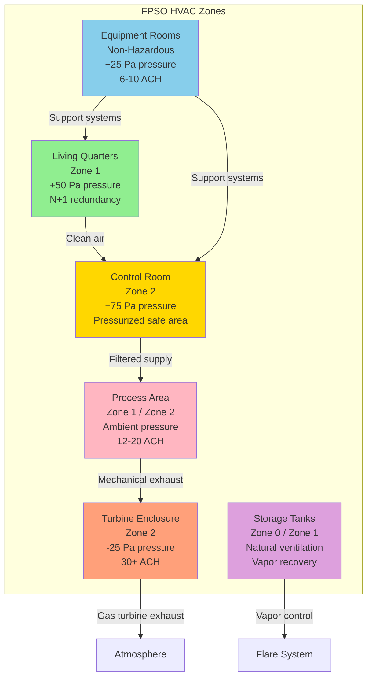

## FPSO Vessel Overview

Floating Production Storage and Offloading (FPSO) vessels combine oil and gas production facilities with storage capacity and living quarters on converted or purpose-built tanker hulls. These vessels operate in remote offshore locations, processing crude oil and natural gas from subsea wells while storing product for periodic offloading to shuttle tankers.

FPSO HVAC systems face unique challenges integrating residential comfort systems for 100-200 personnel with industrial ventilation for hazardous hydrocarbon processing areas, all within the constraints of ship motion, salt spray exposure, limited space, and stringent explosion protection requirements.

### Vessel Characteristics

Typical FPSO dimensions and layout:
- Length: 250-350 meters (820-1,150 ft)
- Beam: 40-60 meters (130-200 ft)
- Displacement: 150,000-350,000 DWT
- Personnel capacity: 100-200 persons
- Process deck area: 3,000-8,000 m² (32,000-86,000 ft²)
- Living quarters: 2,500-5,000 m² (27,000-54,000 ft²)
- Storage capacity: 1-2 million barrels crude oil

HVAC zones distributed across multiple decks:
- **Upper decks**: Living quarters, helideck, radio room
- **Main deck**: Process equipment, separators, pumps, compressors
- **Tank deck**: Storage tanks (normally unmanned)
- **Engine room**: Power generation, utilities

## HVAC Load Calculations for FPSO Vessels

FPSO cooling loads combine marine vessel heat gains with industrial process loads and motion-induced factors.

### Living Quarters Cooling Load

Total cooling load for accommodation module:

$$Q_{total} = Q_{sensible} + Q_{latent}$$

**Sensible heat components**:

$$Q_{sensible} = Q_{solar} + Q_{transmission} + Q_{occupants,sens} + Q_{lighting} + Q_{equipment} + Q_{ventilation,sens}$$

**Solar radiation load** (enhanced for ship superstructure):

$$Q_{solar} = A_{wall} \times SHGC \times I_{solar} \times CLF$$

Where:
- $A_{wall}$ = exposed wall area (m²)
- $SHGC$ = solar heat gain coefficient (0.25-0.40 for tinted glass)
- $I_{solar}$ = incident solar radiation (300-1000 W/m² depending on latitude)
- $CLF$ = cooling load factor (0.6-0.85 for thermal mass)

For equatorial FPSO with extensive glazing:
- Wall area: 800 m² (8,600 ft²)
- Peak solar: 800 W/m²
- SHGC: 0.30
- CLF: 0.70

$$Q_{solar} = 800 \times 0.30 \times 800 \times 0.70 = 134,400 \text{ W} = 134.4 \text{ kW}$$

**Transmission load** through walls and roof:

$$Q_{transmission} = U \times A \times \Delta T$$

FPSO accommodation typically insulated to:
- Walls: U = 0.30 W/m²·K (R-19 equivalent)
- Roof: U = 0.20 W/m²·K (R-28 equivalent)
- Windows: U = 2.0 W/m²·K (double-pane)

For exterior temperature 35°C (95°F), interior 24°C (75°F):
- Wall area: 1,200 m² × 0.30 × 11°C = 3,960 W
- Roof area: 500 m² × 0.20 × 11°C = 1,100 W
- Window area: 200 m² × 2.0 × 11°C = 4,400 W

$$Q_{transmission} = 9,460 \text{ W} = 9.5 \text{ kW}$$

**Occupancy load** (150 persons):

$$Q_{occupants} = N \times (Q_{sens,person} + Q_{lat,person})$$

- Sensible: 150 persons × 75 W/person = 11,250 W
- Latent: 150 persons × 55 W/person = 8,250 W

**Lighting and equipment**:
- Lighting: 2,500 m² × 15 W/m² = 37,500 W
- Equipment: 2,500 m² × 10 W/m² = 25,000 W

**Ventilation load** (outdoor air requirement):

$$Q_{ventilation} = \dot{m}_{air} \times c_p \times \Delta T$$

Outdoor air: 150 persons × 25 cfm/person = 3,750 cfm (1,770 L/s)

$$\dot{m}_{air} = 1,770 \text{ L/s} \times 1.2 \text{ kg/m}^3 = 2.12 \text{ kg/s}$$

Sensible load (35°C outdoor, 24°C indoor):

$$Q_{vent,sens} = 2.12 \times 1006 \times 11 = 23,460 \text{ W} = 23.5 \text{ kW}$$

Latent load (outdoor humidity ratio 0.020 kg/kg, indoor 0.009 kg/kg):

$$Q_{vent,lat} = \dot{m}_{air} \times h_{fg} \times \Delta W = 2.12 \times 2,501 \times 0.011 = 58,350 \text{ W} = 58.4 \text{ kW}$$

**Total cooling load**:
- Sensible: 134.4 + 9.5 + 11.3 + 37.5 + 25.0 + 23.5 = 241.2 kW (68.6 tons)
- Latent: 8.3 + 58.4 = 66.7 kW (19.0 tons)
- **Total: 307.9 kW (87.6 tons)**

With safety factor (1.15) and simultaneous load factor (0.90):

$$Q_{design} = 307.9 \times 1.15 \times 0.90 = 318 \text{ kW} (90 \text{ tons})$$

### Process Area Ventilation Load

Process deck ventilation removes heat from equipment and dilutes fugitive hydrocarbon emissions:

$$Q_{process} = Q_{equipment} + Q_{solar,deck} + Q_{ventilation}$$

Equipment heat release (rules of thumb):
- Gas turbines: 300-500 kW heat radiated per MW shaft power
- Electric motors: 2.5% of rated power as heat
- Pumps: 10-15% of hydraulic power as heat to surrounding
- Process vessels: 1-3 W/m² surface area for insulated vessels

For process deck with 10 MW installed equipment:

$$Q_{equipment} \approx 10,000 \text{ kW} \times 0.03 = 300 \text{ kW}$$

Ventilation removes heat assuming temperature rise:

$$Q_{ventilation} = \dot{V} \times \rho \times c_p \times \Delta T$$

For 5°C temperature rise above ambient and 20 ACH for 6,000 m² deck:

$$\dot{V} = 6,000 \text{ m}^3 \times 20 \text{ ACH} = 120,000 \text{ m}^3/\text{hr} = 33.3 \text{ m}^3/\text{s}$$

$$Q_{ventilation} = 33.3 \times 1.2 \times 1006 \times 5 = 201,000 \text{ W} = 201 \text{ kW}$$

## Living Quarters HVAC Systems

Accommodation modules provide residential-grade comfort for offshore personnel working 12-hour shifts over 2-4 week rotations.

### Design Conditions

| Parameter | Requirement | Notes |
|-----------|-------------|-------|
| **Interior Temperature** | 22-24°C (72-75°F) | Individual cabin control ±2°C |
| **Relative Humidity** | 40-60% | Prevent condensation and dryness |
| **Air Changes** | 6-8 ACH | Sleeping quarters |
| **Outdoor Air** | 25 cfm/person (12 L/s) | Continuous ventilation |
| **Pressure** | +50 Pa (+0.20 in. w.c.) | Relative to process areas |
| **Noise Level** | NC 30-35 | Sleeping quarters |
| **Filtration** | MERV 13 minimum | Salt and particulate removal |

### System Configuration

**Central Chilled Water Plant**:
- Two 50% capacity chillers (N+1 redundancy): 200-300 kW (57-85 tons) each
- Seawater-cooled condensers with titanium tubes
- Chilled water: 7°C supply / 12°C return (44°F/54°F)
- Primary-secondary pumping with variable flow
- Redundant seawater pumps and heat exchangers

**Air Distribution**:
- Central air handling units (AHUs) for each accommodation deck
- Supply air: 15-18°C (59-64°F) at 90% RH
- Fan coil units in individual cabins (2-pipe or 4-pipe systems)
- High sidewall supply diffusers for good mixing
- Low return air grilles prevent short-circuiting

**Heating System** (cold climate operations):
- Hot water from waste heat recovery (jacket water from generators)
- Backup steam or electric boilers
- Hot water: 80°C supply / 60°C return (176°F/140°F)
- Perimeter heating via fan coils or radiant panels
- Freeze protection for seawater systems

### Cabin HVAC Design

Individual sleeping quarters (10-15 m²):
- Fan coil unit: 0.8-1.2 kW (0.23-0.34 tons) cooling capacity
- Supply airflow: 100-150 cfm (50-75 L/s)
- Individual thermostat control
- Fresh air ventilation: 25-35 cfm (12-17 L/s) from central AHU
- Acoustic insulation: NRC 0.80 minimum on walls/ceiling
- Humidity control via central AHU dehumidification

## Process Area Ventilation

Hazardous area ventilation maintains safe atmosphere in hydrocarbon processing zones.

### Hazardous Area Classification

FPSO process areas classified per IEC 60079-10-1 or API RP 505:

| Location | Classification | Equipment Requirements | Ventilation |
|----------|---------------|----------------------|-------------|
| Separation modules | Zone 1 | Ex d, Ex p, Ex e | 15-20 ACH |
| Compressor enclosures | Zone 1 | Ex d motors, Ex p controls | 20-30 ACH |
| Pump modules | Zone 2 | Ex e motors | 12-15 ACH |
| Turbine enclosures | Zone 2 | Ex e / general purpose | 30-40 ACH |
| Electrical rooms | Non-hazardous | General purpose | 8-10 ACH |
| Battery rooms | Hazardous (H₂) | Ex d, forced ventilation | 20-30 ACH |

### Ventilation Design Methodology

**Air change rate calculation**:

$$ACH = \frac{Q_{required}}{V_{space}} \times 3600$$

Where:
- $Q_{required}$ = volumetric flow rate (m³/s)
- $V_{space}$ = volume of space (m³)
- 3600 = seconds per hour

For compressor module (200 m² × 6 m height = 1,200 m³):

$$Q = \frac{1,200 \times 20}{3600} = 6.67 \text{ m}^3/\text{s} = 14,120 \text{ cfm}$$

**Dilution ventilation** for fugitive emissions:

$$Q_{dilution} = \frac{G \times K}{C_{max} - C_{ambient}}$$

Where:
- $G$ = gas generation rate (L/min)
- $K$ = safety factor (4-10 for flammable gases)
- $C_{max}$ = maximum allowable concentration (typically 25% LEL)
- $C_{ambient}$ = ambient concentration (0 for fresh air)

For methane leak (LEL = 5% by volume):
- $C_{max}$ = 0.05 × 0.25 = 0.0125 (1.25% by volume)
- Assumed leak: 10 L/min methane
- Safety factor: 6

$$Q_{dilution} = \frac{10 \times 6}{0.0125} = 4,800 \text{ L/min} = 80 \text{ L/s} = 170 \text{ cfm}$$

### Ventilation System Features

**Airflow pattern design**:
- Supply air at high level sweeps downward
- Low-level exhaust removes heavier-than-air hydrocarbons (propane, butane)
- High-level exhaust removes lighter-than-air gases (methane)
- Directed flow from non-hazardous toward hazardous areas
- CFD modeling validates adequate mixing and gas removal

**Fan selection**:
- Explosion-proof motors (Ex d) in Zone 1 areas
- Non-sparking impellers (aluminum or spark-resistant alloys)
- Belt-driven arrangement isolates motor from airstream
- Variable speed drives for energy optimization
- Redundant fans: 2×100% capacity for critical areas

**Gas detection integration**:
- Continuous monitoring at potential release points
- Normal operation: design ventilation rate
- Gas detected (>10% LEL): increase to maximum flow
- High gas (>25% LEL): alarm and emergency procedures
- Ventilation interlock prevents equipment start without adequate airflow

## Control Room Pressurization

Central control rooms maintain explosion-free environment for personnel and instrumentation during gas release events.

### Pressurization Requirements

Design differential pressure: +75 Pa (+0.30 in. w.c.) relative to external atmosphere

**Leakage calculation**:

$$Q_{leakage} = C \times A_{leak} \times \sqrt{\Delta P}$$

Where:
- $C$ = flow coefficient = 776 for SI units (cfm/ft² at 1 in. w.c.)
- $A_{leak}$ = equivalent leakage area (m² or ft²)
- $\Delta P$ = pressure differential (Pa or in. w.c.)

For control room (250 m², 4 doors, tight construction):
- Door leakage: 0.014 m² per door = 0.056 m² total
- Wall/ceiling leakage: 0.001 m²/m² × 350 m² = 0.350 m²
- Total leakage: 0.406 m² (4.37 ft²)

Converting to IP units for standard equation:

$$Q_{leakage} = 776 \times 4.37 \times \sqrt{0.30} = 1,856 \text{ cfm}$$

Add safety factor (1.20) and account for door openings:

$$Q_{supply} = 1,856 \times 1.20 = 2,227 \text{ cfm} \approx 2,250 \text{ cfm}$$

### Pressurization System Design

**Supply air system**:
- Dedicated supply fans: 2×100% capacity with automatic switchover
- HEPA filters: H13 grade removes 99.95% of 0.3 μm particles
- Activated carbon filters: remove hydrocarbon vapors (optional)
- Air intake location: upwind and elevated above process deck
- Supply airflow: 2,500 cfm (1,180 L/s) accounting for door usage

**Pressure control**:
- Differential pressure transmitter: ±0.05 Pa accuracy
- Modulating relief damper maintains setpoint
- Low pressure alarm: <50 Pa triggers audible/visual warning
- High pressure limit: >100 Pa opens relief to prevent door operation issues
- Building automation system integration

**Emergency response**:
- Gas detected external to control room: close intake dampers, seal room
- Internal emergency bottled air (30-60 minutes supply)
- Emergency depressurization allows firefighter access
- Post-event purge cycle restores safe atmosphere

## Explosion-Proof Equipment Requirements

Electrical equipment in hazardous areas must prevent ignition of explosive atmospheres.

### Equipment Selection by Zone

**Zone 1 Requirements** (Ex d - Flameproof):
- Motor starters and contactors in explosion-proof enclosures
- Cast aluminum or steel housings rated for gas group IIB, temperature class T3
- Cable entries via certified glands with proper thread engagement
- Control panels in purged/pressurized enclosures (Ex p)

**Zone 2 Requirements** (Ex e - Increased Safety):
- Motors with enhanced insulation and temperature monitoring
- Non-sparking fans and impellers
- Enclosed and gasketed electrical boxes
- General purpose equipment acceptable if proven non-incendive

### Equipment Specifications

Typical explosion-proof fan motor:
- Rating: 15 kW (20 HP), 1,750 RPM
- Enclosure: Ex d IIB T3 (flameproof, gas group IIB, temperature class T3)
- Certification: IECEx, ATEX, or local authority
- Maximum surface temperature: 200°C (well below methane ignition of 537°C)
- Weight penalty: 2.0× standard motor weight

## Corrosion Protection and Materials

Marine atmosphere and continuous salt spray require comprehensive corrosion prevention.

### Materials Selection

| Component | Material | Coating/Protection | Life Expectancy |
|-----------|----------|-------------------|-----------------|
| Ductwork (exterior) | 5086 aluminum alloy | Anodized + epoxy paint | 20-25 years |
| Ductwork (interior) | Galvanized steel | None (protected environment) | 20+ years |
| Fans (seawater exposure) | 316 stainless steel | None required | 25+ years |
| AHU casings | Aluminum or GRP | Polyester gelcoat | 15-20 years |
| Piping (seawater) | Titanium or 90/10 CuNi | None (inherent corrosion resistance) | 30+ years |
| Piping (chilled water) | Carbon steel | Internal galvanizing | 20-25 years |
| Louvers and grilles | Aluminum 6063 | Anodized, powder coated | 15-20 years |
| Dampers | Stainless steel 316 | None required | 25+ years |

### Corrosion Prevention Strategies

**Design features**:
- Enclose equipment in climate-controlled rooms where possible
- Drainage provisions prevent water accumulation in ductwork
- Sloped duct runs avoid horizontal flat sections
- Removable access panels allow internal inspection
- Sacrificial anodes on seawater-cooled equipment

**Maintenance program**:
- Quarterly inspection of coating condition
- Annual freshwater washdown of exposed equipment
- Bi-annual thickness testing of critical metal components
- Immediate touch-up of coating damage
- Cathodic protection monitoring on seawater systems

## Applicable Standards and Codes

### International Maritime Standards

**Classification Society Rules**:
- DNV-GL Rules for Classification of Ships, Part 6 Chapter 6: HVAC systems
- ABS Rules for Building and Classing Steel Vessels: Machinery and piping systems
- Lloyd's Register Rules and Regulations: Environmental control systems

### Hazardous Area Standards

**Equipment Certification**:
- IEC 60079 series: Explosive atmospheres - Equipment requirements
- IEC 60079-10-1: Classification of areas - Explosive gas atmospheres
- ATEX Directive 2014/34/EU: Equipment for explosive atmospheres (European)
- IECEx System: International certification for explosive atmosphere equipment

**Installation Requirements**:
- API RP 505: Recommended Practice for Classification of Locations for Electrical Installations at Petroleum Facilities
- NFPA 70 (NEC) Article 500-505: Hazardous locations
- IEC 60092-502: Electrical installations in ships - Tankers

### HVAC Design Standards

**Ventilation and Comfort**:
- ISO 8861: Shipbuilding - Engine room ventilation in diesel-engined ships
- ISO 7547: Ships - Air-conditioning and ventilation of accommodation spaces
- ASHRAE 62.1: Ventilation for acceptable indoor air quality (adapted for marine)

**Offshore-Specific**:
- API RP 14C: Analysis, Design, Installation, and Testing of Basic Surface Safety Systems
- NORSOK S-002: Working environment (Norwegian offshore standard)
- ISO 13702: Control and mitigation of fires and explosions on offshore production installations

FPSO HVAC systems integrate diverse requirements - providing comfortable living quarters for extended offshore rotations while maintaining safe atmospheres in hazardous process areas. Successful designs balance personnel comfort, safety system integration, equipment redundancy, marine environment corrosion resistance, and compliance with multiple international standards governing both marine vessels and offshore petroleum facilities.
