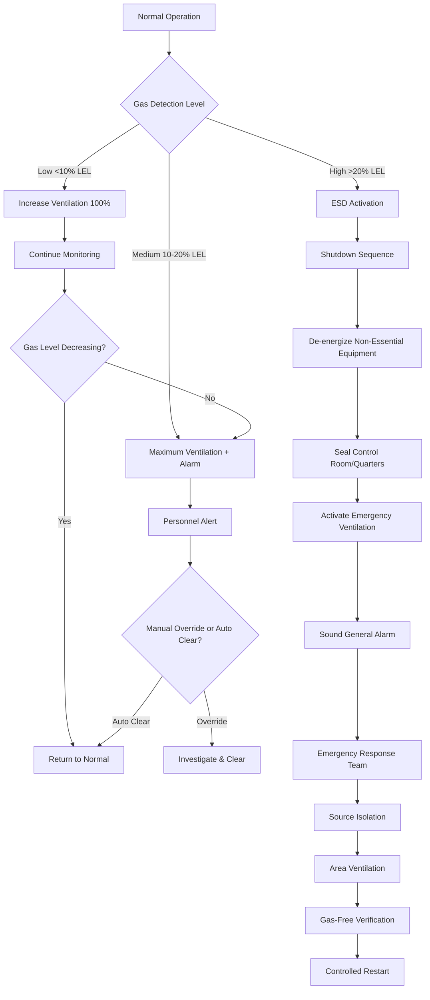

## Oil Rig HVAC Design Fundamentals

Oil rig HVAC systems operate in the most challenging industrial environment, combining explosive atmosphere risks with continuous personnel accommodation requirements. These installations demand simultaneous compliance with petroleum safety codes, electrical hazardous location standards, and human comfort criteria while maintaining 24/7 operation in corrosive marine conditions.

Fixed and floating production platforms represent the pinnacle of HVAC engineering complexity. Systems must prevent explosive gas accumulation in process areas, maintain positive pressure in control rooms and living quarters, provide emergency shutdown capability coordinated with fire and gas detection, and resist accelerated degradation from salt spray and temperature extremes.

## Hazardous Area Classification Impact on HVAC

Area classification fundamentally determines equipment selection, installation methods, and system operating strategies. The classification process identifies locations where flammable concentrations of hydrocarbons may exist during normal or abnormal operations.

### Zone Classification for HVAC Equipment

HVAC equipment placement follows API RP 500 and NFPA 70 Article 500 area classification methodologies:

**Class I, Division 1 Zones**:
- Drilling floor during well operations
- Wellhead platforms and process decks
- Inside mud pits and shale shaker areas
- Pump rooms with light hydrocarbon service
- Emergency generator enclosures using diesel fuel

HVAC equipment in Division 1 zones requires explosion-proof construction (NFPA 70 Type X, Y, or Z purged enclosures) or removal from classified areas. Most designs eliminate HVAC devices from Division 1 locations through proper area segregation and ventilation.

**Class I, Division 2 Zones**:
- Areas adjacent to Division 1 locations
- Enclosed drill floor areas
- Equipment rooms containing hydrocarbon piping
- Battery rooms and chemical storage
- Pipe alleys and transfer zones

Division 2 permits standard industrial HVAC equipment with restrictions on arcing components and surface temperatures. Motors must be totally enclosed, electrical enclosures must prevent ignitable spark emission, and surface temperatures must remain below T3 classification (200°C).

**Unclassified Areas**:
- Living quarters and accommodation modules
- Control rooms with positive pressurization
- Radio/communication rooms
- Offices and dining facilities
- Medical and recreation spaces

Standard commercial HVAC equipment acceptable with appropriate environmental protection for marine service.

### HVAC Equipment Selection by Classification

| Zone Classification | Fan Motors | Electrical Controls | Ductwork | Air Intakes | Typical Applications |
|---------------------|------------|---------------------|----------|-------------|---------------------|
| Division 1 | Explosion-proof (Ex d) or purged (Ex p) | Intrinsically safe or explosion-proof | Spark-resistant, bonded/grounded | Located in safe area | Process ventilation, wellhead cooling |
| Division 2 | TEFC motors, surface temp <200°C | Sealed contactors, enclosed starters | Standard industrial, grounded | Screened, bird-proofed | Enclosed drill floor, equipment rooms |
| Unclassified | Standard industrial motors | Standard controls | Standard HVAC ductwork | Weather-protected louvers | Accommodation HVAC, control rooms |

## Positive Pressure Protection Systems

Positive pressurization prevents hazardous atmosphere intrusion into critical spaces housing personnel or ignition-capable equipment. These systems represent the primary defense against explosive gas migration.

### Control Room Pressurization Design

Control rooms require continuous positive pressure per API RP 14C Section 7. The design maintains explosion-free environment for operating personnel and electrical/electronic equipment.

**Pressure Differential Requirements**:

Minimum differential pressure:

$$\Delta P_{min} = 0.05 \text{ in. w.c.} = 12.5 \text{ Pa}$$

Typical operating differential:

$$\Delta P_{operating} = 0.10 - 0.15 \text{ in. w.c.} = 25 - 37 \text{ Pa}$$

Maximum differential (door operability limit):

$$\Delta P_{max} = 0.30 \text{ in. w.c.} = 75 \text{ Pa}$$

**Leakage Airflow Calculation**:

Supply airflow must overcome envelope leakage at design pressure differential:

$$Q_{leakage} = A_{leak} \cdot C \cdot \sqrt{\Delta P}$$

Where:
- $Q_{leakage}$ = leakage airflow (cfm)
- $A_{leak}$ = total effective leakage area (ft²)
- $C$ = 2,610 (constant for standard air)
- $\Delta P$ = pressure differential (in. w.c.)

**Leakage Area Estimation**:

For typical offshore control room construction:

Door leakage per door:

$$A_{door} = 0.12 - 0.18 \text{ ft}^2 \text{ per door}$$

Wall/ceiling construction leakage:

$$A_{construction} = 0.001 - 0.003 \text{ ft}^2 \text{ per ft}^2 \text{ of surface area}$$

Penetration leakage (conduits, piping):

$$A_{penetration} = 0.05 - 0.10 \text{ ft}^2 \text{ total}$$

**Design Example**:

Control room specifications:
- Floor area: 2,000 ft²
- Ceiling height: 10 ft
- 4 personnel doors
- Estimated wall area: 800 ft²
- Design differential: 0.10 in. w.c.

Calculate total leakage area:

$$A_{leak} = (4 \times 0.15) + (800 \times 0.002) + 0.08 = 0.60 + 1.60 + 0.08 = 2.28 \text{ ft}^2$$

Calculate required supply airflow:

$$Q_{supply} = 2.28 \times 2,610 \times \sqrt{0.10} = 2,370 \text{ cfm}$$

Add safety factor (25%):

$$Q_{design} = 2,370 \times 1.25 = 2,963 \text{ cfm}$$

Add outdoor air ventilation requirement (20 cfm/person, 15 occupants):

$$Q_{total} = 2,963 + 300 = 3,263 \text{ cfm minimum supply}$$

### Accommodation Module Pressure Cascade

Living quarters employ pressure staging to create multiple barriers against hazardous gas intrusion:

**Pressure Cascade Design**:

$$P_{quarters} > P_{corridors} > P_{vestibules} > P_{industrial} > P_{process}$$

Typical differential staging:

| Zone | Pressure Relative to Exterior | Pressure Relative to Industrial Area |
|------|------------------------------|-------------------------------------|
| Sleeping quarters | +0.10 in. w.c. | +0.10 in. w.c. |
| Corridors/common areas | +0.07 in. w.c. | +0.07 in. w.c. |
| Vestibules | +0.05 in. w.c. | +0.05 in. w.c. |
| Industrial/equipment areas | 0.00 in. w.c. | 0.00 in. w.c. (reference) |
| Process deck (open) | -0.02 in. w.c. | -0.02 in. w.c. |

**Vestibule Airflow Loss**:

Personnel passage causes temporary pressure loss. Vestibule volume provides buffer:

$$V_{vestibule} = Q_{loss} \times t_{passage} / (\Delta P_{drop,max})$$

Where:
- $V_{vestibule}$ = vestibule volume (ft³)
- $Q_{loss}$ = airflow loss during door opening (cfm)
- $t_{passage}$ = passage time (minutes)
- $\Delta P_{drop,max}$ = allowable pressure drop (in. w.c.)

Typical vestibule: 6 ft × 6 ft × 8 ft = 288 ft³

## Emergency Shutdown Integration

HVAC systems integrate with emergency shutdown (ESD) logic to respond to gas detection, fire, or process upset conditions.

### ESD Response Sequences

### HVAC ESD Functions by Zone

| Zone/System | ESD Level 1 (Low Gas) | ESD Level 2 (Medium Gas) | ESD Level 3 (High Gas/Fire) |
|-------------|----------------------|-------------------------|---------------------------|
| Process area ventilation | Increase to 100% capacity | Increase to max capacity | Continue operation (purge mode) |
| Accommodation supply | Normal operation | Increase filtration | Seal off, recirculation only |
| Control room | Maintain positive pressure | Increase supply 25% | Seal mode, emergency air supply |
| Equipment rooms | Normal ventilation | Maximum ventilation | Shutdown if in affected area |
| Drilling floor | Normal operation | Maximum exhaust | Shutdown non-essential, maintain emergency |
| Emergency generator room | Normal operation | Increase cooling capacity | Maximum cooling, ensure operation |

## Hazardous Area Ventilation Requirements

Process and drilling areas require continuous mechanical ventilation to prevent explosive atmosphere accumulation.

### Ventilation Rate Calculations

**Minimum air change method**:

$$Q_{ACH} = \frac{V_{space} \times ACH}{60}$$

Where:
- $Q_{ACH}$ = airflow rate (cfm)
- $V_{space}$ = space volume (ft³)
- $ACH$ = air changes per hour (hr⁻¹)

**Dilution ventilation for continuous gas sources**:

$$Q_{dilution} = \frac{G_{release} \times 10^6}{C_{safe} \times \rho_{air}}$$

Where:
- $Q_{dilution}$ = dilution airflow (cfm)
- $G_{release}$ = gas release rate (lb/min)
- $C_{safe}$ = safe concentration (typically 25% of LEL, ppm)
- $\rho_{air}$ = air density (0.075 lb/ft³ standard)

**API RP 500 volumetric dilution approach**:

For enclosed areas containing Class I equipment:

$$Q_{API} = \frac{V_{space}}{2} \times \frac{1}{60}$$

This provides 30 air changes per hour minimum for enclosed process areas.

### Ventilation Rates by Area Type

| Area Classification | Minimum ACH | Typical Design ACH | Exhaust Location | Supply Location |
|---------------------|-------------|-------------------|------------------|-----------------|
| Enclosed drilling floor | 12 | 15-20 | High level (methane) + Low level (diesel) | Sidewall low level |
| Mud pit area | 15 | 20-30 | High level, continuous | Directional, away from ignition |
| Process equipment rooms | 15 | 20-25 | High + low level | Multiple points |
| Battery rooms | 12 | 15-20 | High level (hydrogen) | Low level supply |
| Paint/chemical storage | 20 | 30-40 | Low level (vapor removal) | High level supply |
| Enclosed wellhead areas | 12 | 15-20 | High level | Weather-protected |

## Explosion-Proof HVAC Equipment

Equipment installed in Division 1 or Division 2 locations requires specific construction and certification.

### Motor and Drive Requirements

**Division 1 motors**:
- Explosion-proof construction per NFPA 70 Section 501.125
- Flamepath joint design prevents ignition transmission
- External cooling only (no internal ventilation)
- T3 temperature classification (200°C surface maximum)
- Certified by NRTL (FM, UL, CSA) for Class I, Group C or D
- Typical derating: 15-25% capacity reduction vs. standard motor

**Division 2 motors**:
- Totally enclosed fan-cooled (TEFC) construction
- No exposed arcing components
- Surface temperature below ignition temperature
- Standard NEMA design acceptable with restrictions
- Non-sparking fan materials (aluminum, plastic)

### Electrical Controls and Devices

| Component | Division 1 Requirement | Division 2 Requirement | Typical Application |
|-----------|----------------------|----------------------|---------------------|
| Motor starters | Explosion-proof or purged enclosure | Sealed contactors in general-purpose enclosure | Fan/pump starters |
| Disconnect switches | Explosion-proof enclosure | Standard enclosed switch | Equipment isolation |
| Variable frequency drives | Purged/pressurized enclosure (Type Z) | Enclosed in ventilated room | Process fan control |
| Thermostats/sensors | Intrinsically safe circuits or explosion-proof | Standard enclosed | Temperature monitoring |
| Damper actuators | Explosion-proof motor, sealed electronics | TEFC motor, enclosed control | Ventilation control |

### Purged and Pressurized Enclosures

NFPA 496 and ISA 12.4.01 define purged enclosure classifications:

**Type X (Division 1 service)**:
- Reduces hazardous classification inside enclosure to unclassified
- Protective gas pressure maintained during operation
- Interlocks prevent energization until purge complete
- Minimum 4 enclosure volume changes required before energization
- Continuous monitoring of pressure and flow
- Alarm and shutdown on pressure loss

**Type Y (Division 1/Division 2 interface)**:
- Reduces Division 1 inside enclosure to Division 2
- Lower protective gas volume requirements
- Simplified interlock logic

**Type Z (Division 2 service)**:
- Prevents Division 2 atmosphere entry
- Minimal pressurization required
- Used for motor control centers, analyzer houses

Purge volume calculation:

$$V_{purge} = V_{enclosure} \times N_{volumes} \times \frac{P_{operating} + 14.7}{14.7}$$

Where:
- $V_{purge}$ = total purge volume (ft³)
- $V_{enclosure}$ = enclosure internal volume (ft³)
- $N_{volumes}$ = number of volume changes (4 for Type X)
- $P_{operating}$ = operating gauge pressure (psig)

## Oil Rig HVAC System Architecture

```mermaid
graph TB
    subgraph "Process Deck - Division 1/2"
        A[Wellhead Area] --> B[Exhaust Fans - Ex d Motors]
        C[Separator Area] --> B
        D[Compressor Room] --> E[Dedicated Exhaust - Type Z VFD]
    end

    subgraph "Drilling Deck - Division 2"
        F[Drilling Floor] --> G[High-Capacity Exhaust]
        H[Mud Pit Area] --> G
        I[Shale Shaker] --> G
        G --> J[Explosion-Proof Exhaust Fans]
    end

    subgraph "Equipment Deck - Division 2/Unclassified"
        K[Generator Room] --> L[Combustion Air + Cooling]
        M[Electrical Room] --> N[Precision Cooling Units]
        O[Battery Room] --> P[Hydrogen Exhaust - High Level]
    end

    subgraph "Accommodation Module - Unclassified"
        Q[Central AHU] --> R[Chilled Water Coils]
        S[Seawater-Cooled Chiller] --> R
        Q --> T[HEPA + Carbon Filtration]
        T --> U[Positive Pressure Supply]
        U --> V[Living Quarters +0.10 in. w.c.]
        U --> W[Corridors +0.07 in. w.c.]
        U --> X[Vestibules +0.05 in. w.c.]
    end

    subgraph "Control Room - Pressurized Safe Area"
        Y[Dedicated Supply Fan] --> Z[Backup Supply Fan]
        Z --> AA[Filtration Train]
        AA --> AB[Control Room +0.15 in. w.c.]
        AB --> AC[Pressure Monitor]
        AC --> AD{Pressure OK?}
        AD -->|No| AE[Low Pressure Alarm]
        AD -->|Yes| AF[Normal Operation]
    end

    subgraph "Emergency Systems"
        AG[Gas Detection System] --> AH{Gas Level}
        AH -->|Low| AI[Increase Ventilation]
        AH -->|High| AJ[ESD Activation]
        AJ --> AK[Seal Accommodation]
        AJ --> AL[Seal Control Room]
        AJ --> AM[Maximum Process Ventilation]
    end

    B --> AN[Discharge to Atmosphere]
    J --> AN
    P --> AN

    style A fill:#ff9999
    style C fill:#ff9999
    style F fill:#ffcc99
    style H fill:#ffcc99
    style V fill:#99ff99
    style AB fill:#99ccff
```

## Load Calculation Considerations

Oil rig HVAC loads differ significantly from conventional buildings due to continuous operation, high internal gains, and extreme environmental exposure.

### Accommodation Module Cooling Loads

**Solar heat gain**:

$$Q_{solar} = A_{surface} \times SHGC \times SHGF \times CLF$$

Where:
- $A_{surface}$ = exposed surface area (ft²)
- $SHGC$ = solar heat gain coefficient
- $SHGF$ = solar heat gain factor (Btu/hr-ft²)
- $CLF$ = cooling load factor

For low-latitude platforms, solar gains increase 15-25% vs. mid-latitude design due to high solar angle and intensity.

**Transmission loads through insulated walls**:

$$Q_{transmission} = U \times A \times (T_{outdoor} - T_{indoor}) \times CLTD$$

With marine exposure and white-painted surfaces:

$$U_{effective} = \frac{1}{R_{insulation} + R_{interior} + R_{exterior,marine}}$$

$R_{exterior,marine}$ reduced by 20% due to wind exposure.

**Personnel sensible and latent heat**:

High activity levels in offshore work:

$$Q_{sensible,person} = 250 - 300 \text{ Btu/hr per person}$$
$$Q_{latent,person} = 200 - 250 \text{ Btu/hr per person}$$

**Equipment loads**:

- Office equipment: 5-10 W/ft²
- Galley equipment: 40,000-80,000 Btu/hr total
- Laundry equipment: 30,000-50,000 Btu/hr
- Gym equipment: 2,000-3,000 Btu/hr per machine

### Process Area Cooling Loads

Equipment heat rejection dominates process area loads:

**Compressor heat rejection**:

$$Q_{compressor} = \frac{HP_{brake} \times 2,545}{efficiency} \times (1 - \eta_{motor})$$

**Transformer losses**:

$$Q_{transformer} = kVA_{rating} \times (losses_{no-load} + losses_{load})$$

Typical: 1.5-2.5% of transformer rating as heat.

**Pipe and vessel heat gain** (uninsulated or degraded insulation):

$$Q_{pipe} = \frac{2\pi L k (T_{fluid} - T_{ambient})}{\ln(r_{outer}/r_{inner})}$$

## Applicable Codes and Standards

### Primary Design Standards

**API Recommended Practices**:
- API RP 500: Recommended Practice for Classification of Locations for Electrical Installations at Petroleum Facilities (Class I, Division 1 and 2)
- API RP 505: Recommended Practice for Classification of Locations for Electrical Installations at Petroleum Facilities (Zone 0, 1, and 2)
- API RP 14C: Analysis, Design, Installation, and Testing of Basic Surface Safety Systems for Offshore Production Platforms
- API RP 14F: Design and Installation of Electrical Systems for Fixed and Floating Offshore Petroleum Facilities

**NFPA Standards**:
- NFPA 70 (NEC): National Electrical Code, Articles 500-505 (Hazardous Locations)
- NFPA 496: Standard for Purged and Pressurized Enclosures for Electrical Equipment
- NFPA 30: Flammable and Combustible Liquids Code

**International Standards**:
- IEC 60079-10-1: Explosive atmospheres - Classification of areas (gas and vapor)
- IEC 60079-0: Explosive atmospheres - Equipment - General requirements
- ISO 13702: Petroleum and natural gas industries - Control and mitigation of fires and explosions

**Marine Classification**:
- ABS Rules for Building and Classing Mobile Offshore Drilling Units (MODU)
- DNV-GL Offshore Standards
- Lloyd's Register Rules for Offshore Units

### Ventilation and Air Quality

- ASHRAE 62.1: Ventilation for Acceptable Indoor Air Quality (accommodation basis)
- API RP 14J: Recommended Practice for Design and Hazards Analysis for Offshore Production Facilities
- NORSOK S-002: Working environment (Norwegian offshore standards)

## Maintenance and Reliability Considerations

Continuous operation requirements demand exceptional reliability and maintainability:

**Redundancy requirements**:
- Critical cooling: N+1 chiller configuration
- Control room pressurization: 2 × 100% supply fans with auto-switchover
- Process ventilation: 2 × 100% or 3 × 50% fan arrays
- Emergency power: All life safety HVAC on emergency generator

**Preventive maintenance intervals**:
- Filter replacement: every 3-6 months (salt loading)
- Coil cleaning: quarterly (seawater-cooled equipment)
- Motor/bearing inspection: semi-annually
- Explosion-proof device inspection: annually per NFPA 70
- Pressure testing of purged enclosures: annually

**Spare parts inventory**:
- Motors up to 50 HP: 1 spare per 4 installed
- Critical fans: 1 complete spare assembly
- Filters: 6-month supply on platform
- Explosion-proof devices: specialized components stocked onshore with rapid delivery

Oil rig HVAC systems represent the intersection of safety-critical design, continuous operation reliability, and hostile environment engineering. Successful implementations balance hazardous area protection, personnel comfort, and maintainability while adhering to the comprehensive regulatory framework governing offshore petroleum facilities.
