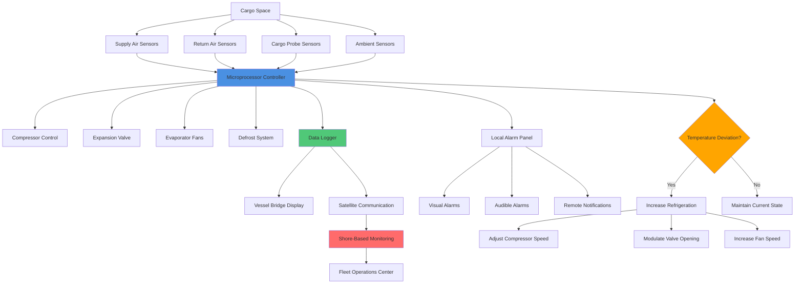

Cargo temperature control systems maintain precise thermal conditions throughout the maritime cold chain from loading through discharge. Effective temperature management requires understanding cargo thermal properties, implementing proper precooling protocols, maintaining continuous monitoring, and responding rapidly to deviations. Modern systems integrate automated controls with remote monitoring capabilities to ensure cargo quality and regulatory compliance.

## Cargo-Specific Temperature Requirements

Different cargo types demand distinct temperature regimes and tolerances based on physiological characteristics and quality preservation needs.

| Cargo Category | Setpoint Range | Tolerance | Precool Target | Critical Notes |
|----------------|---------------|-----------|----------------|----------------|
| Frozen fish/seafood | -25°C to -18°C | ±1.0°C | -25°C minimum | Prevents enzymatic activity |
| Frozen meat products | -18°C to -12°C | ±1.5°C | -18°C minimum | Ice crystal formation control |
| Ice cream, frozen dairy | -28°C to -23°C | ±0.5°C | -28°C minimum | Texture preservation critical |
| Fresh meat (chilled) | -1.5°C to 0°C | ±0.3°C | 0°C before loading | Avoid freeze damage |
| Fresh fish (chilled) | -1°C to +2°C | ±0.5°C | +1°C ideal | Ice contact recommended |
| Dairy products | +2°C to +4°C | ±0.5°C | +2°C minimum | Bacterial growth prevention |
| Pharmaceuticals (cold) | +2°C to +8°C | ±0.3°C | Within range 24hr prior | Validation required |
| Vaccines (frozen) | -25°C to -15°C | ±0.2°C | Continuous cold chain | No excursions permitted |
| Bananas (green) | +13°C to +14°C | ±0.3°C | +13.5°C optimal | Ripening suppression |
| Citrus fruits | +4°C to +10°C | ±1.0°C | +8°C typical | Variety-dependent |
| Stone fruits | -1°C to +4°C | ±0.5°C | +2°C recommended | Respiration control |
| Berries (fresh) | 0°C to +2°C | ±0.3°C | 0°C immediately | High perishability |
| Tropical fruits | +10°C to +15°C | ±1.0°C | +12°C typical | Chill damage avoidance |
| Cut flowers | +1°C to +4°C | ±0.5°C | +2°C optimal | Ethylene control needed |
| Wine (bottled) | +12°C to +16°C | ±1.0°C | +14°C stable | Avoid temperature shock |

Temperature uniformity across cargo space must remain within the specified tolerance, accounting for air circulation patterns and cargo loading configuration.

## Precooling Strategies and Calculations

Precooling cargo to the required setpoint temperature before loading prevents excessive refrigeration load during voyage and minimizes quality degradation.

### Precooling Heat Removal

The total heat that must be removed during precooling combines sensible heat reduction and, for produce, respiration heat generation:

$$Q_{precool} = m \cdot c_p \cdot (T_{initial} - T_{target}) + q_{resp} \cdot t_{precool}$$

Where:
- $Q_{precool}$ = total heat removal required (kJ)
- $m$ = cargo mass (kg)
- $c_p$ = specific heat capacity of cargo (kJ/kg·K)
- $T_{initial}$ = initial cargo temperature (°C)
- $T_{target}$ = target precool temperature (°C)
- $q_{resp}$ = respiration heat generation rate (W)
- $t_{precool}$ = precooling duration (s)

### Precooling Time Calculation

Required precooling time depends on available refrigeration capacity and cargo thermal properties:

$$t_{precool} = \frac{m \cdot c_p \cdot \Delta T}{Q_{ref} - q_{resp}}$$

Where:
- $Q_{ref}$ = available refrigeration capacity (W)
- $\Delta T$ = temperature reduction required (K)

### Effective Precooling Rate

For cargo with non-uniform temperature distribution, the effective precooling follows exponential decay:

$$T(t) = T_{ambient} + (T_{initial} - T_{ambient}) \cdot e^{-\frac{t}{\tau}}$$

Where the time constant $\tau$ depends on thermal mass and heat transfer characteristics:

$$\tau = \frac{m \cdot c_p}{h \cdot A}$$

Where:
- $h$ = convective heat transfer coefficient (W/m²·K)
- $A$ = effective surface area for heat transfer (m²)

### Practical Precooling Example

For 20,000 kg of bananas precooled from 25°C to 13.5°C:

Given:
- $c_p = 3.35$ kJ/kg·K (bananas)
- $q_{resp} = 1,200$ W (at 20°C)
- Available $Q_{ref} = 15,000$ W

$$Q_{precool} = 20,000 \times 3.35 \times (25 - 13.5) + 1,200 \times t$$

$$t_{precool} = \frac{20,000 \times 3.35 \times 11.5}{15,000 - 1,200} = \frac{770,500}{13,800} = 55,833 \text{ s} = 15.5 \text{ hours}$$

This calculation assumes continuous operation and does not account for thermal lag in palletized cargo, which typically increases actual time by 20-40%.

## Temperature Monitoring and Control Architecture

Modern cargo temperature control integrates multiple monitoring layers with automated response systems.

### Sensor Placement and Configuration

**Supply Air Temperature Sensors:**
- Location: Immediately downstream of evaporator coil
- Accuracy: ±0.1°C for pharmaceutical cargo, ±0.3°C standard
- Response time: <30 seconds to 90% of step change
- Redundancy: Dual sensors with automatic switchover

**Return Air Temperature Sensors:**
- Location: Cargo space return air path before evaporator
- Purpose: Indicates actual cargo cooling load
- Differential control: Maintains supply-return ΔT of 8-12°C for frozen cargo, 4-6°C for chilled

**Cargo Probe Sensors (wireless):**
- Placement: Within palletized cargo at geometric center
- Battery life: 30-60 days continuous operation
- Transmission: 433 MHz or 2.4 GHz protocols
- Critical for pharmaceutical validation

### Control Algorithms

Modern controllers employ proportional-integral-derivative (PID) control logic:

$$u(t) = K_p \cdot e(t) + K_i \int_0^t e(\tau)d\tau + K_d \frac{de(t)}{dt}$$

Where:
- $u(t)$ = control output (compressor speed, valve position)
- $e(t)$ = error signal (setpoint - measured temperature)
- $K_p, K_i, K_d$ = tuning constants

Typical tuning parameters for reefer temperature control:
- $K_p = 0.5$ to 1.5 (proportional gain)
- $K_i = 0.1$ to 0.3 (integral time constant)
- $K_d = 0.05$ to 0.15 (derivative time constant)

## Continuous Monitoring Systems

### Data Logging Requirements

Marine cold chain compliance requires continuous recording of temperature data throughout voyage:

**Recording Parameters:**
- Supply air temperature (primary control variable)
- Return air temperature (load indicator)
- Setpoint value
- Defrost cycle start/stop times
- Alarm events with timestamps
- Power interruptions
- Compressor runtime hours

**Recording Intervals:**
- Standard cargo: 10-15 minute intervals
- Pharmaceutical cargo: 1-5 minute intervals
- High-value/sensitive cargo: Continuous (30-60 second intervals)

**Data Storage:**
- Minimum retention: 3 years for regulatory compliance
- Format: Downloadable CSV, XML, or proprietary formats
- Tamper-evident: Cryptographic signatures for pharmaceutical shipments

### Remote Monitoring Integration

Satellite-based monitoring systems transmit real-time cargo status to shore facilities:

**Communication Protocols:**
- Iridium satellite network (global coverage)
- Inmarsat C or FleetBroadband
- GSM/cellular when in coastal range
- Transmission frequency: Every 4-8 hours standard, hourly for critical cargo

**Transmitted Data:**
- Current temperatures (supply, return, setpoint)
- Alarm status and history
- GPS position and estimated arrival
- Refrigeration system operational parameters
- Battery backup status

**Shore-Based Response:**
- 24/7 monitoring centers track fleet status
- Automated alerts for temperature deviations >30 minutes
- Technical support for troubleshooting
- Route optimization to minimize cargo exposure

## Controlled Atmosphere Integration

Cargo requiring controlled atmosphere (CA) in addition to temperature control demands integrated monitoring of gas composition.

### Atmospheric Parameters

**Oxygen Control:**
- Target: 2-5% O₂ for most CA applications
- Tolerance: ±0.5% for critical applications
- Monitoring: Electrochemical or paramagnetic sensors
- Adjustment: Nitrogen injection or CO₂ scrubbing

**Carbon Dioxide Control:**
- Target: 3-10% CO₂ depending on commodity
- Tolerance: ±1.0% typical
- Monitoring: NDIR (non-dispersive infrared) sensors
- Adjustment: CO₂ injection or lime scrubbing

**Ethylene Removal:**
- Target: <0.02 ppm for ethylene-sensitive produce
- Methods: Potassium permanganate scrubbers, catalytic oxidation
- Critical for: Kiwi fruit, broccoli, lettuce, cut flowers

### CA Temperature Interaction

Controlled atmosphere effectiveness depends strongly on temperature maintenance:

$$RR = RR_{ref} \cdot Q_{10}^{\frac{T-T_{ref}}{10}}$$

Where:
- $RR$ = respiration rate at temperature $T$
- $RR_{ref}$ = reference respiration rate at $T_{ref}$
- $Q_{10}$ = temperature coefficient (typically 2.0-3.0 for produce)

A 1°C temperature increase can raise respiration rate by 7-12%, dramatically reducing storage life even with optimal atmospheric composition.

## Cold Chain Compliance and Standards

### Regulatory Framework

**International Standards:**
- **ATP Agreement (UN)**: Agreement on International Carriage of Perishable Foodstuffs
  - Equipment classification: FRC class for mechanically refrigerated containers
  - Testing requirements: K-coefficient verification
  - Minimum interior air temperature capability

- **ISO 1496-2**: Thermal container specifications
  - Temperature maintenance test: 18 hours at specified conditions
  - Cool-down performance verification
  - Structural and safety requirements

- **ISTA (International Safe Transit Association)**:
  - Protocols for temperature-controlled shipments
  - Packaging qualification standards

**Pharmaceutical-Specific:**
- **WHO TRS 961**: Temperature monitoring for vaccine transport
  - Continuous monitoring required
  - Maximum 2°C to 8°C range
  - No freeze events permitted

- **EU GDP (Good Distribution Practice)**:
  - Qualification of refrigerated containers
  - Mapping studies required
  - Annual recalibration of sensors

- **FDA Title 21 CFR Part 11**:
  - Electronic records validation
  - Audit trail requirements
  - System access controls

### Alarm Response Protocols

**Temperature Deviation Levels:**

| Deviation | Action Required | Response Time |
|-----------|----------------|---------------|
| ±0.5°C from setpoint | Log event, monitor trend | Immediate awareness |
| ±1.0°C for >30 min | Investigate cause, adjust controls | Within 1 hour |
| ±2.0°C for >15 min | Engineering intervention required | Within 30 minutes |
| ±3.0°C or freeze event | Emergency response, cargo assessment | Immediate |

**Common Intervention Actions:**
1. Verify sensor accuracy (compare redundant sensors)
2. Check refrigeration system operation (compressor, fans)
3. Inspect cargo loading pattern (air circulation blockage)
4. Verify external conditions (ambient temperature, power supply)
5. Initiate backup refrigeration if available
6. Document all findings and corrective actions

## Performance Optimization

### Pull-Down Efficiency

Rapid temperature pull-down after loading minimizes product degradation:

$$\eta_{pulldown} = \frac{m \cdot c_p \cdot \Delta T}{E_{consumed}}$$

Where:
- $\eta_{pulldown}$ = pull-down efficiency (dimensionless)
- $E_{consumed}$ = electrical energy consumed during pull-down (kJ)

Target efficiency values:
- Modern reefer containers: 0.6-0.8
- Older equipment: 0.4-0.6
- Well-precooled cargo: 0.8-1.0

### Energy Management

Minimizing energy consumption while maintaining temperature:

**Load-Matching Strategies:**
- Variable-speed compressor operation (30-100% capacity)
- Demand-based fan speed control
- Optimized defrost scheduling (only when necessary)
- Night setback for non-critical temperature bands

**Typical Power Consumption:**
- Frozen cargo (-20°C): 8-12 kW average
- Chilled cargo (+2°C): 4-7 kW average
- Controlled atmosphere: +10-15% above standard refrigeration

Proper precooling reduces voyage energy consumption by 15-25% compared to loading warm cargo.

## System Validation and Commissioning

### Temperature Mapping

Before placing refrigerated cargo spaces into service, comprehensive temperature distribution studies verify uniform conditions:

**Mapping Procedure:**
1. Install minimum 9-point sensor array (corners, center, mid-faces)
2. Operate system at setpoint for minimum 12 hours
3. Record temperatures at 5-minute intervals
4. Calculate maximum temperature differential
5. Verify all points remain within tolerance

**Acceptance Criteria:**
- Maximum point-to-point differential ≤2.0°C for standard cargo
- Maximum point-to-point differential ≤1.0°C for pharmaceuticals
- All points must remain within specified range continuously

### Calibration Requirements

**Sensor Calibration:**
- Frequency: Annually or per regulatory requirement
- Method: NIST-traceable reference standards
- Accuracy verification: ±0.2°C over operating range
- Documentation: Certificate of calibration with traceability

**System Performance Testing:**
- Cool-down time verification
- K-coefficient measurement (heat ingress rate)
- Defrost cycle validation
- Alarm system functional testing

Proper calibration and validation ensure reliable temperature control throughout the cargo's journey, maintaining quality from origin to destination while meeting international cold chain compliance requirements.
