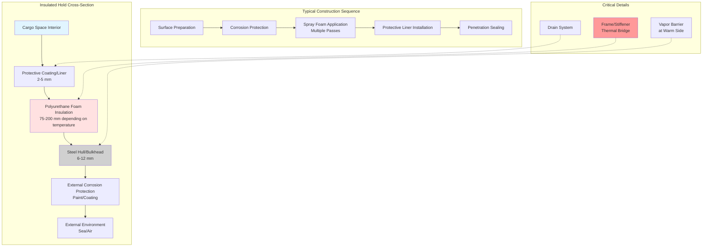

Insulated cargo holds form the thermal envelope for refrigerated marine transport, maintaining cargo temperatures from -30°C to +15°C while exposed to exterior ambient conditions ranging from -20°C to +50°C. Proper insulation design balances thermal performance, structural integrity, moisture control, and economic constraints. The multilayer construction must withstand ship motion, cargo loading stresses, and decades of service in corrosive marine environments.

## Insulation Material Selection

Material selection considers thermal conductivity, compressive strength, moisture resistance, fire safety, and installation requirements.

### Common Marine Insulation Materials

| Material | Thermal Conductivity (W/mK) | R-Value per inch (°F·ft²·hr/BTU) | Density (kg/m³) | Compressive Strength (kPa) | Moisture Absorption |
|----------|----------------------------|----------------------------------|----------------|---------------------------|-------------------|
| Polyurethane foam (rigid) | 0.020-0.023 | 6.5-7.0 | 30-40 | 150-250 | Very low (<3%) |
| Expanded polystyrene (EPS) | 0.033-0.038 | 3.8-4.4 | 15-30 | 70-120 | Low (<5%) |
| Extruded polystyrene (XPS) | 0.028-0.032 | 4.5-5.2 | 25-40 | 200-400 | Very low (<1%) |
| Polyisocyanurate (PIR) | 0.021-0.024 | 6.0-6.8 | 30-45 | 120-200 | Very low (<2%) |
| Cork board | 0.040-0.045 | 3.2-3.6 | 110-140 | 300-500 | Moderate (8-12%) |
| Mineral wool (high density) | 0.036-0.042 | 3.4-4.0 | 100-150 | 30-60 | High (requires protection) |

Polyurethane foam dominates modern marine refrigerated hold construction due to optimal thermal performance, structural capacity, and in-place application methods enabling seamless installation.

### Polyurethane Foam Systems

Two-component polyurethane foam reacts in place to form rigid closed-cell insulation adhering to steel substrates.

**Formulation characteristics:**

- **Density**: 32-40 kg/m³ provides optimal thermal and structural properties
- **Closed-cell content**: >90% ensures moisture resistance and dimensional stability
- **Flame spread**: Class 1 or Class A ratings meet maritime fire safety requirements
- **Temperature resistance**: Stable from -40°C to +110°C for service and occasional deicing operations
- **Blowing agents**: HFC-245fa or HFO-1233zd(E) replacing legacy HCFC-141b for environmental compliance

Application occurs in multiple passes of 25-50 mm thickness per pass to control exothermic reaction temperature and prevent core cracking. Spray application fills irregular spaces and creates monolithic insulation eliminating joints and voids.

## Heat Transfer Through Insulated Structures

Accurate thermal analysis determines required insulation thickness to limit heat gain to design values.

### Steady-State Heat Transfer

Heat flux through multilayer insulation follows one-dimensional conduction equation:

$$Q = \frac{A \cdot \Delta T}{R_{total}}$$

where:
- $Q$ = heat transfer rate (W)
- $A$ = surface area (m²)
- $\Delta T$ = temperature difference inside to outside (K)
- $R_{total}$ = total thermal resistance (m²K/W)

Total thermal resistance includes all layers and surface resistances:

$$R_{total} = R_{si} + \frac{L_1}{k_1} + \frac{L_2}{k_2} + \cdots + \frac{L_n}{k_n} + R_{so}$$

where:
- $R_{si}$ = inside surface resistance = 0.12-0.17 m²K/W (depending on air velocity)
- $L_i$ = thickness of layer $i$ (m)
- $k_i$ = thermal conductivity of layer $i$ (W/mK)
- $R_{so}$ = outside surface resistance = 0.04-0.06 m²K/W (marine conditions)

### Overall Heat Transfer Coefficient

The U-value represents overall heat transfer performance:

$$U = \frac{1}{R_{total}}$$

Target U-values for refrigerated holds range from 0.15 to 0.35 W/m²K depending on cargo temperature and economic optimization. Lower cargo temperatures require lower U-values (thicker insulation) to limit heat gain.

### Required Insulation Thickness

Solving for required insulation thickness to achieve target U-value:

$$L = k \cdot \left(\frac{1}{U} - R_{si} - R_{so} - \frac{L_{steel}}{k_{steel}} - \frac{L_{barrier}}{k_{barrier}}\right)$$

For polyurethane foam with $k$ = 0.022 W/mK achieving U = 0.25 W/m²K:

$$L = 0.022 \cdot \left(\frac{1}{0.25} - 0.15 - 0.05 - 0.00013 - 0.0005\right)$$

$$L = 0.022 \cdot (4.0 - 0.15 - 0.05 - 0.00163)$$

$$L = 0.022 \cdot 3.798 = 0.0836 \text{ m} = 84 \text{ mm}$$

Standard marine practice applies 100-150 mm polyurethane foam for frozen cargo holds (-20°C to -25°C) and 75-100 mm for chilled cargo holds (0°C to +5°C).

## Vapor Barrier Systems

Moisture migration through insulation degrades thermal performance and causes structural corrosion. Vapor barriers prevent water vapor transmission from warm exterior to cold interior surfaces.

### Vapor Barrier Requirements

Vapor barrier placement on the warm side of insulation prevents condensation within the insulation system. For refrigerated holds below ambient temperature, the exterior steel shell serves as the vapor barrier when properly sealed.

**Vapor permeance criteria:**

- Primary vapor barrier: <0.06 perm (3.5 ng/Pa·s·m²)
- Interior protective coating: 0.5-2.0 perm (depends on cargo requirements)
- Total system: Minimize inward vapor drive under all operating conditions

### Common Vapor Barrier Materials

**Steel substrate**: 6-10 mm steel hull and bulkhead plating provides inherent vapor barrier when joints are welded.

**Aluminum foil facings**: 0.05-0.10 mm aluminum foil laminated to foam panels or applied as separate layer achieves 0.01-0.02 perm.

**Vapor-retardant coatings**: Epoxy or polyurethane coatings applied to interior surfaces provide 0.1-0.5 perm protection while allowing some moisture tolerance.

**Critical sealing locations:**

- Penetrations for refrigeration piping, electrical conduit, and drain lines
- Insulation panel joints (if using prefabricated panels vs. sprayed foam)
- Structural frames and stiffeners creating thermal bridges
- Access hatches and doorways

Spray-applied polyurethane foam creates monolithic insulation with minimal joints, reducing vapor barrier failure points compared to panel systems.

## Thermal Bridging Control

Structural steel members penetrating insulation create thermal bridges with local heat transfer rates 10-50 times higher than insulated areas.

### Thermal Bridge Analysis

Heat flow through a thermal bridge follows:

$$Q_{bridge} = \psi \cdot L_{bridge} \cdot \Delta T$$

where:
- $\psi$ = linear thermal transmittance (W/mK)
- $L_{bridge}$ = length of thermal bridge (m)

For an uninsulated steel frame (100×50 mm angle):

$$\psi \approx k_{steel} \cdot A_{steel} / L_{insulation} = 45 \cdot 0.005 / 0.1 = 2.25 \text{ W/mK}$$

A 10-meter frame length at 30°C temperature difference:

$$Q_{bridge} = 2.25 \cdot 10 \cdot 30 = 675 \text{ W}$$

This single frame creates heat gain equivalent to 9 m² of insulated surface at U = 0.25 W/m²K.

### Thermal Bridge Mitigation

**Complete insulation coverage**: Spray foam or panel insulation applied over structural frames where possible.

**Thermal breaks**: Non-metallic spacers or low-conductivity materials interrupt steel continuity.

**Interior framing**: Steel framing on warm side of insulation eliminates cold-side bridges (not practical for cargo holds).

**Increased insulation thickness**: 25-50% additional thickness at bridge locations partially compensates for increased heat flow.

Modern refrigerated hold design minimizes thermal bridging through optimized structural layout and complete insulation coverage.

## Insulated Hold Construction Layers

Refrigerated cargo holds employ multilayer construction from interior cargo space outward.

### Layer Functions

**Protective coating/liner** (interior surface):
- Provides washable sanitary surface for food cargo
- Protects insulation from mechanical damage during cargo operations
- Materials: Galvanized steel, aluminum, FRP (fiberglass reinforced plastic), or epoxy coating
- Thickness: 0.5-3.0 mm for metal liners, 2-5 mm for FRP

**Polyurethane foam insulation**:
- Primary thermal resistance layer
- Continuous coverage eliminates thermal bridges
- Adheres to substrate providing structural composite action
- Thickness: 75-200 mm based on cargo temperature requirements

**Steel hull/bulkhead**:
- Structural component carrying cargo and sea loads
- Vapor barrier preventing moisture ingress
- Corrosion protection required on both faces

**External corrosion protection**:
- Marine-grade coatings resist saltwater exposure
- Periodic maintenance required throughout vessel life

## Installation Procedures

Proper installation ensures design thermal performance and long-term durability.

### Surface Preparation

Steel surfaces must be clean, dry, and free of rust, oil, or loose mill scale. Abrasive blasting to SSPC-SP6 (commercial blast) or SP10 (near-white blast) provides optimal foam adhesion. Surface preparation immediately precedes foam application to prevent flash rusting.

### Spray Foam Application

Two-component polyurethane foam applies using plural-component spray equipment:

1. **Equipment setup**: Heated hoses maintain component temperature at 40-50°C, mix ratio 1:1 by volume
2. **Application passes**: 25-50 mm per pass allows exothermic heat dissipation, 15-30 minute cure between passes
3. **Thickness control**: Witness pins or measuring guides ensure uniform thickness, typically +10% tolerance
4. **Coverage**: Overlap adjacent areas ensuring no voids or thin spots
5. **Quality control**: Core samples verify density (32-40 kg/m³) and closed-cell content (>90%)

### Protective Liner Installation

Metal or FRP liners attach over cured foam using adhesive and mechanical fasteners. Panel joints require sealant to maintain vapor-tight interior surface. Liner must accommodate thermal expansion/contraction cycles without buckling or opening joints.

## Performance Standards and Testing

Marine refrigerated hold insulation meets international standards and classification society requirements.

### Applicable Standards

**IMO (International Maritime Organization)**:
- SOLAS Chapter II-2: Fire safety requirements for insulation materials
- Carriage of perishable foodstuffs guidelines

**ISO Standards**:
- ISO 1496-2: Thermal container specifications including U-value testing
- ISO 8568: Mechanical refrigeration systems for ships

**Classification Societies**:
- ABS Guide for Refrigeration Cargo Systems
- DNV Rules for Classification of Ships Part 5 Chapter 13
- Lloyd's Register Rules for Ships Part 5 Chapter 11

### Thermal Performance Testing

Hold insulation undergoes thermal testing to verify design U-values:

**Heat transfer test**: Measure heat flow under controlled temperature difference
- Interior maintained at design cargo temperature (e.g., -20°C)
- Exterior at ambient or controlled temperature (e.g., +25°C)
- Heat input to maintain interior temperature recorded
- Actual U-value calculated from measured data

**Acceptance criteria**: Measured U-value must not exceed design value by more than 10%.

### Fire Testing

Insulation materials require fire testing per IMO Fire Test Procedures Code:
- Surface flammability (flame spread and smoke generation)
- Non-combustibility testing for critical areas
- Toxicity of combustion products

Polyurethane foam formulations meet Class 1 or Class A flame spread ratings with appropriate fire retardants.

## Maintenance and Service Life

Proper maintenance preserves insulation performance over the 20-30 year vessel service life.

**Inspection intervals**: Annual surveys examine interior liner condition, joint sealing, and evidence of moisture intrusion. Five-year surveys include insulation core sampling to verify retained physical properties.

**Common degradation modes**:
- Physical damage from cargo handling equipment
- Moisture intrusion through failed vapor barriers
- Thermal cycling fatigue at joints and penetrations
- Corrosion of substrate steel reducing structural integrity

**Repair procedures**: Damaged insulation requires removal and replacement maintaining continuity with surrounding material. Spray foam facilitates field repairs with proper surface preparation and application technique.

Properly designed and installed polyurethane foam insulation systems routinely achieve full vessel service life with minimal degradation in thermal performance.

## Economic Optimization

Insulation thickness represents a trade-off between initial material cost and ongoing energy savings from reduced refrigeration load.

**Life-cycle cost analysis** determines optimal thickness:

$$LCC = C_{insulation} + C_{energy} \cdot PW$$

where:
- $C_{insulation}$ = installed insulation cost ($/m²)
- $C_{energy}$ = annual energy cost from heat gain ($/m²-year)
- $PW$ = present worth factor for energy costs over vessel life

Energy cost depends on heat gain, refrigeration system efficiency, and electrical generation costs (typically $0.15-0.30/kWh shipboard power). Optimal insulation thickness typically ranges from 100-150 mm for frozen cargo holds, determined by economic analysis rather than thermal requirements alone.

---

**References:**
- ASHRAE Handbook - HVAC Applications, Chapter 26: Ships
- IMO Guidelines for the Carriage of Perishable Foodstuffs
- SOLAS Consolidated Edition 2020, Chapter II-2
- ISO 1496-2:2018 Thermal Container Testing
