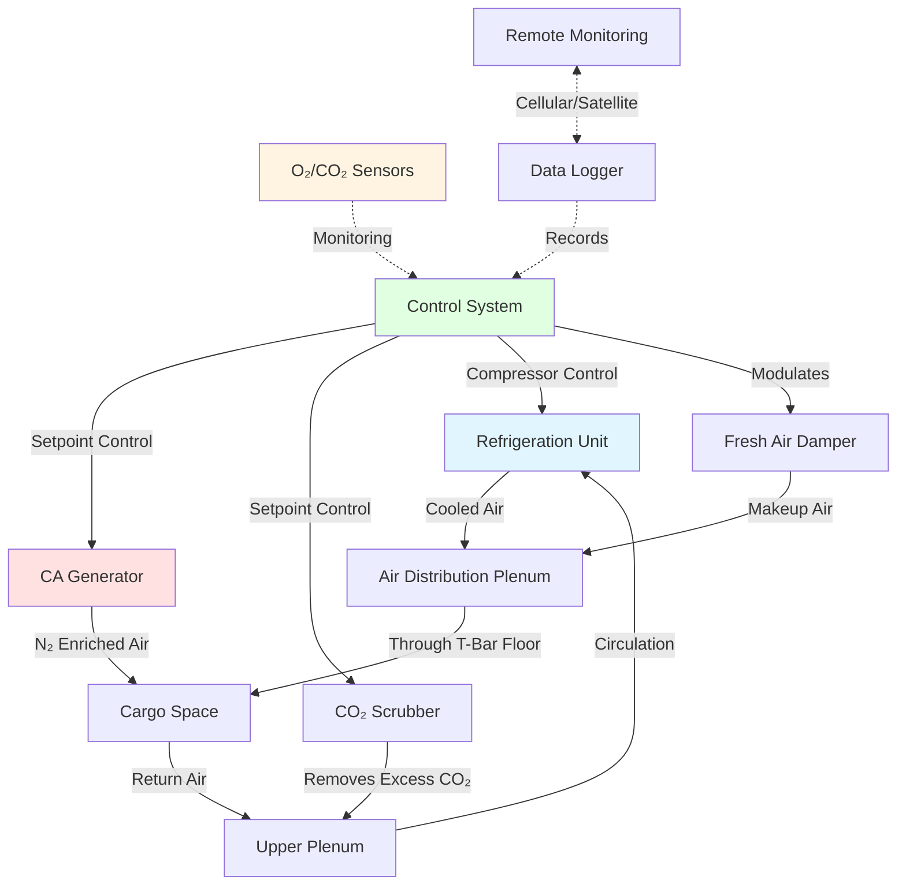

## Integral Refrigeration Units

Refrigerated shipping containers (reefers) incorporate self-contained refrigeration systems designed for intermodal transport across ship, rail, and truck modes. The integral refrigeration unit mounts at the front of the container, drawing power from vessel electrical systems (440V three-phase), shore power, or generator sets during land transport.

The refrigeration cycle uses scroll or reciprocating compressors with R-134a or R-452A refrigerants. Air distribution systems circulate air through T-bar aluminum flooring, up through the cargo, and return through the top plenum space. This bottom-to-top airflow pattern ensures uniform temperature distribution throughout the cargo space.

Evaporator coils feature automatic defrost cycles (hot gas or electric resistance) to prevent ice accumulation that would reduce heat transfer efficiency. The cycle operates on time or demand basis, typically every 6-8 hours depending on ambient conditions and cargo respiration heat loads.

## Container Reefer Design Standards

ISO 1496-2 specifies dimensional and structural requirements for refrigerated containers. Standard sizes include:

| Container Type | External Dimensions | Internal Volume | Refrigeration Capacity |
|----------------|---------------------|-----------------|----------------------|
| 20-foot reefer | 6.06 × 2.44 × 2.59 m | 28.3 m³ | 5.0-7.0 kW |
| 40-foot standard | 12.19 × 2.44 × 2.59 m | 67.5 m³ | 8.5-10.5 kW |
| 40-foot high cube | 12.19 × 2.44 × 2.90 m | 76.2 m³ | 9.5-11.5 kW |

The container envelope consists of polyurethane foam insulation (100-120 mm thickness) with K-factor 0.019-0.022 W/(m·K), stainless steel interior liners, and corrugated steel exterior panels. Corner castings meet ISO 1161 strength requirements for stacking and lifting operations.

## Refrigeration Capacity Calculations

The required refrigeration capacity for a reefer container accounts for multiple heat load components:

$$Q_{total} = Q_{transmission} + Q_{air} + Q_{product} + Q_{respiration} + Q_{equipment}$$

Where:

**Transmission load through insulated walls:**

$$Q_{transmission} = U \cdot A \cdot (T_{ambient} - T_{setpoint})$$

- $U$ = overall heat transfer coefficient, typically 0.35-0.45 W/(m²·K)
- $A$ = total surface area of container envelope (m²)
- $T_{ambient}$ = outside air temperature (°C)
- $T_{setpoint}$ = cargo setpoint temperature (°C)

**Air infiltration load:**

$$Q_{air} = \dot{m}_{air} \cdot c_{p,air} \cdot (T_{ambient} - T_{setpoint}) + \dot{m}_{air} \cdot h_{fg} \cdot (\omega_{ambient} - \omega_{setpoint})$$

- $\dot{m}_{air}$ = air infiltration mass flow rate (kg/s)
- $c_{p,air}$ = specific heat of air, 1.006 kJ/(kg·K)
- $h_{fg}$ = latent heat of vaporization, 2501 kJ/kg at 0°C
- $\omega$ = humidity ratio (kg water/kg dry air)

**Product cooling load:**

$$Q_{product} = \frac{m_{product} \cdot c_{p,product} \cdot (T_{initial} - T_{final})}{\Delta t}$$

- $m_{product}$ = mass of cargo (kg)
- $c_{p,product}$ = specific heat of product (kJ/(kg·K))
- $\Delta t$ = time to achieve pulldown (s)

**Respiration heat for living products:**

$$Q_{respiration} = m_{product} \cdot q_{resp}$$

- $q_{resp}$ = specific heat of respiration (W/kg), temperature-dependent

For a 40-foot high cube container at design conditions (38°C ambient, +2°C setpoint, 20-ton fruit load with 0.08 W/kg respiration):

$$Q_{total} = 3.2 + 0.8 + 1.5 + 1.6 + 0.4 = 7.5 \text{ kW}$$

Adding 25% safety factor yields 9.4 kW capacity requirement.

## Temperature Range Capabilities

Reefer containers maintain precise temperature control across a wide operating range:

| Cargo Category | Temperature Range | Relative Humidity | Typical Products |
|----------------|-------------------|-------------------|------------------|
| Deep frozen | -30 to -18°C | Not controlled | Fish, meat, ice cream |
| Frozen | -18 to -10°C | Not controlled | Frozen vegetables, poultry |
| Chilled meat | -2 to +2°C | 85-90% | Beef, pork, lamb |
| Fresh produce | 0 to +15°C | 85-95% | Fruits, vegetables |
| Pharmaceuticals | +2 to +8°C | 50-60% | Vaccines, biologics |
| Bananas | +12.5 to +14.5°C | 85-92% | Bananas (prevents chilling injury) |
| Flowers | +2 to +5°C | 90-95% | Cut flowers |
| Chocolate | +15 to +18°C | 50-65% | Confections |

Temperature uniformity specifications require ±0.5°C deviation throughout the cargo space under steady-state conditions per ATP Agreement standards.

## Controlled Atmosphere Systems

Advanced reefer containers incorporate controlled atmosphere (CA) technology to extend shelf life by modifying oxygen and carbon dioxide concentrations. CA systems maintain:

- **Oxygen (O₂):** Reduced from 21% to 1-5% depending on commodity
- **Carbon dioxide (CO₂):** Elevated from 0.04% to 1-10%
- **Nitrogen (N₂):** Remainder as inert filler gas

**CA Generator Operation:**

Membrane or pressure swing adsorption (PSA) generators separate nitrogen from compressed air. The nitrogen-enriched stream (95-99% N₂) displaces oxygen within the sealed container. Typical generation rate: 40-60 Nm³/hr for a 40-foot container.

**CO₂ Management:**

Active removal uses carbon molecular sieve scrubbers when CO₂ exceeds setpoint (typically 5-10% for most fruits). Passive control relies on fresh air exchange through modulating dampers.

## Power Requirements

Reefer container electrical specifications:

| Power Parameter | 20-Foot Container | 40-Foot Container | High Cube 40-Foot |
|-----------------|-------------------|-------------------|-------------------|
| Voltage | 440V 3-phase 60Hz | 440V 3-phase 60Hz | 440V 3-phase 60Hz |
| Full load amps | 10-12 A | 14-18 A | 16-20 A |
| Peak inrush | 45-60 A | 60-80 A | 65-85 A |
| Power consumption | 7.5-9.0 kW | 10.5-13.5 kW | 12.0-15.0 kW |
| Daily energy (avg) | 55-75 kWh | 85-110 kWh | 95-120 kWh |

Shore power installations require soft-start circuitry or time-delay relays to prevent circuit breaker tripping during compressor startup. Vessel electrical systems provide dedicated reefer receptacles with circuit protection rated 125% of full load current.

Generator sets for truck transport typically provide 15-20 kW capacity with diesel fuel consumption 3-4 L/hr under full refrigeration load.

## Container Monitoring Systems

Modern reefer containers incorporate comprehensive monitoring and data logging:

**Local Display Parameters:**
- Supply air temperature (measured at evaporator outlet)
- Return air temperature (cargo space ambient)
- Setpoint temperature with ±0.1°C resolution
- Defrost status and cycle counter
- Compressor run hours
- Alarm codes and fault history

**Remote Monitoring Capabilities:**

Telematics systems transmit data via cellular or satellite networks:
- GPS location tracking
- Temperature trend recording (1-minute intervals)
- Door open/close events
- Power interruption logging
- Humidity levels (if equipped)
- O₂/CO₂ concentrations (CA units)

**Alarm Conditions:**

Systems generate alerts for:
- Temperature deviation >±2°C from setpoint for >30 minutes
- Compressor failure or high discharge pressure
- Loss of electrical power
- Door open >5 minutes during transport
- CA atmosphere out of specification

Data loggers maintain 60-90 day historical records for cold chain verification and cargo insurance documentation. USB download ports provide access to complete trip data for quality assurance audits.

## ISO Standards and Cold Chain Compliance

Reefer container operations conform to multiple international standards:

**ISO 1496-2:** Refrigerated freight containers - specifications and testing for thermal efficiency, structural integrity, and refrigeration performance.

**ATP Agreement (UN):** Agreement on International Carriage of Perishable Foodstuffs - defines insulation classifications (IN/IR) and equipment testing requirements.

**ISO 10368:** Freight thermal containers - remote condition monitoring - standardizes data communication protocols for reefer tracking systems.

Testing certification requires:
- K-factor verification (heat transmission coefficient)
- Cooling capacity at specified ambient conditions
- Temperature uniformity survey with 9+ sensors
- 24-hour temperature recording under load

Containers display ATP certification plates indicating insulation class and effective refrigeration capacity under normalized test conditions (30°C ambient, 0°C or -20°C setpoint).

Cold chain documentation includes pre-trip inspection reports (PTI), continuous temperature records, and certificate of inspection validating proper operation before cargo loading.

---

## Related Topics

- [Refrigerated Cargo Holds](../cargo-holds/)
- [Cold Chain Monitoring](../monitoring-systems/)
- [Marine HVAC Systems](../../)
