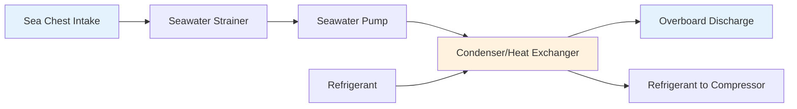
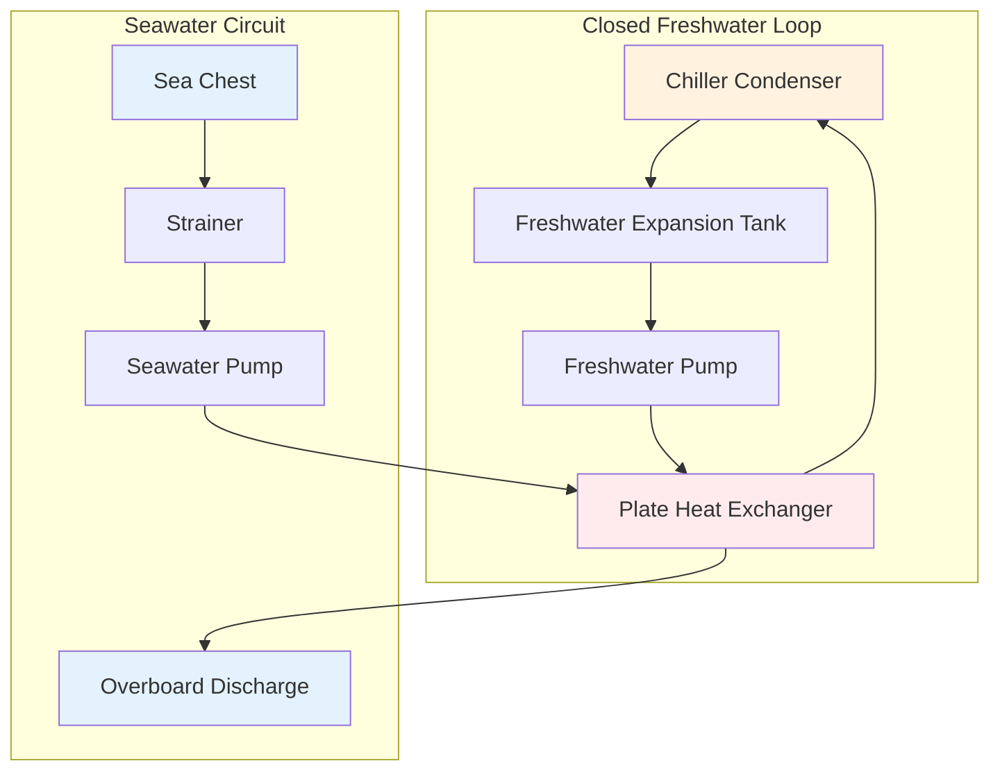

Seawater cooling systems provide heat rejection for marine HVAC installations by utilizing the ocean as an infinite heat sink. The design approach differs fundamentally from land-based cooling towers or air-cooled condensers due to seawater's corrosive properties, variable temperature, and biological fouling characteristics. System configuration selection between once-through and closed-loop arrangements depends on vessel type, operational profile, and equipment protection requirements.

## Thermodynamic Considerations

Seawater temperature directly affects refrigeration system performance through condensing pressure relationships.

**Condensing Temperature Relations**

The refrigeration cycle condensing temperature must exceed seawater temperature by an amount sufficient to drive heat transfer through the condenser. For a typical marine chiller:

$$T_{\text{cond}} = T_{\text{sw,in}} + \Delta T_{\text{approach}} + \Delta T_{\text{rise}}$$

where:
- $T_{\text{cond}}$ = refrigerant condensing temperature (°C)
- $T_{\text{sw,in}}$ = seawater inlet temperature (°C)
- $\Delta T_{\text{approach}}$ = approach temperature difference (3-5°C)
- $\Delta T_{\text{rise}}$ = seawater temperature rise through condenser (5-8°C)

With tropical seawater at 30°C, the condensing temperature reaches approximately 40-43°C. This elevated condensing pressure increases compressor work and reduces system coefficient of performance compared to operation in colder waters.

**Heat Rejection Calculation**

Total heat rejection from a refrigeration system combines evaporator load and compressor work:

$$Q_{\text{reject}} = Q_{\text{evap}} + W_{\text{comp}} = Q_{\text{evap}} \left(1 + \frac{1}{\text{COP}}\right)$$

For a 500 kW cooling capacity chiller operating at COP = 4.5, the condenser must reject:

$$Q_{\text{reject}} = 500 \times \left(1 + \frac{1}{4.5}\right) = 611 \text{ kW}$$

The seawater mass flow rate required follows from:

$$\dot{m}_{\text{sw}} = \frac{Q_{\text{reject}}}{c_p \Delta T_{\text{rise}}}$$

Using $c_p = 3.99$ kJ/kg·K for seawater and $\Delta T_{\text{rise}} = 7°C$:

$$\dot{m}_{\text{sw}} = \frac{611}{3.99 \times 7} = 21.9 \text{ kg/s} = 78.8 \text{ m³/h}$$

## Once-Through Cooling Systems

Once-through configurations pump seawater directly through condenser tubes and discharge it overboard after a single pass.

**Advantages**

- Simplest configuration with minimal components
- No secondary heat exchanger required
- Lower initial cost for small installations
- Direct heat rejection to ultimate heat sink
- Reduced pumping energy from single heat transfer stage

**Limitations**

- Refrigerant-side heat exchanger exposed to corrosive seawater
- Requires expensive corrosion-resistant materials (cupronickel, titanium)
- Vulnerable to biofouling on seawater-wetted surfaces
- Contamination risk if condenser tube failure occurs
- Difficult maintenance access when integrated into refrigeration equipment

**Design Parameters**

| Parameter | Typical Range | Design Basis |
|-----------|---------------|--------------|
| Seawater velocity | 2.0-2.5 m/s | Balance heat transfer vs erosion |
| Temperature rise | 5-8°C | Minimize thermal pollution |
| Approach temperature | 3-5°C | Economic heat exchanger sizing |
| Tube material | 90/10 CuNi | Standard corrosion resistance |
| Tube wall thickness | 1.2-1.6 mm | Includes corrosion allowance |
| Fouling factor | 0.000035 m²K/W | Marine biological fouling |

Seawater velocity through tubes represents a critical design parameter. Excessive velocity causes erosion-corrosion where protective oxide films cannot form. Insufficient velocity permits sediment deposition and enhanced biofouling. The Reynolds number in condenser tubes typically exceeds 40,000 for turbulent flow:

$$Re = \frac{\rho v D}{\mu} = \frac{1025 \times 2.2 \times 0.019}{0.001} = 42,845$$

This turbulent regime provides heat transfer coefficients of 3500-4500 W/m²K on the seawater side.

## Closed-Loop Cooling Systems

Closed-loop configurations employ an intermediate freshwater circuit between the refrigeration equipment and seawater, with heat transfer occurring in a dedicated seawater heat exchanger.

**Advantages**

- Refrigeration equipment uses standard freshwater condensers
- Centralized seawater heat exchanger serves multiple chillers
- Easier maintenance access to seawater-exposed components
- Allows chemical treatment of freshwater circuit
- Provides thermal buffering during seawater temperature variations
- Reduced contamination risk from condenser tube failures

**Disadvantages**

- Additional heat exchanger adds cost and complexity
- Increased pumping energy from two circulation systems
- Higher approach temperature reduces system efficiency
- Requires additional space for heat exchanger installation
- Added maintenance for freshwater treatment and expansion tank

**Heat Transfer Analysis**

The closed-loop system introduces an additional temperature difference between refrigerant and seawater:

$$T_{\text{cond}} = T_{\text{sw,in}} + \Delta T_{\text{HX}} + \Delta T_{\text{FW}} + \Delta T_{\text{approach}}$$

where $\Delta T_{\text{HX}}$ represents the approach in the seawater/freshwater heat exchanger (2-4°C) and $\Delta T_{\text{FW}}$ represents the freshwater circuit temperature rise (3-5°C).

This additional resistance elevates condensing temperature by 5-9°C compared to once-through systems, increasing compressor power consumption by approximately 3-6% depending on refrigerant type and operating conditions.

## Heat Exchanger Selection and Design

Material selection and configuration determine heat exchanger longevity and performance in marine service.

**Tube Materials**

| Material | Composition | Corrosion Resistance | Heat Transfer | Relative Cost |
|----------|-------------|---------------------|---------------|---------------|
| 90/10 Cupronickel | 90% Cu, 10% Ni | Good | 50 W/m·K | 1.0× (baseline) |
| 70/30 Cupronickel | 70% Cu, 30% Ni | Excellent | 29 W/m·K | 1.8× |
| Titanium Grade 2 | Pure Ti | Superior | 16 W/m·K | 8.0× |
| AL-6XN Stainless | High Mo SS | Excellent | 14 W/m·K | 3.5× |

The material thermal conductivity directly affects required heat transfer area. For equivalent performance, a titanium heat exchanger requires approximately 3 times the surface area of 90/10 cupronickel due to lower thermal conductivity.

**Shell-and-Tube Configuration**

Traditional marine condensers employ shell-and-tube construction with seawater in tubes to minimize corrosion of the shell. Key design features include:

- Tube diameter: 19-25 mm (3/4" to 1" nominal)
- Tube pitch: 1.25-1.5 times tube OD (square or triangular)
- Baffle spacing: 0.3-0.5 shell diameter
- Tube-side passes: 2-4 passes for required velocity
- End caps: Removable for mechanical cleaning access

The overall heat transfer coefficient accounting for fouling:

$$\frac{1}{U} = \frac{1}{h_i} + \frac{x_w}{k_w} + R_{f,i} + \frac{1}{h_o} + R_{f,o}$$

where $h_i$ and $h_o$ represent inside and outside film coefficients, $x_w/k_w$ represents tube wall resistance, and $R_f$ terms represent fouling resistances.

For a typical cupronickel condenser with clean surfaces, overall U-values range from 2500-3500 W/m²K. Marine biofouling reduces this to 1500-2500 W/m²K after several months of operation without cleaning.

**Plate Heat Exchangers**

Modern closed-loop systems increasingly employ gasketed plate heat exchangers for the seawater-to-freshwater interface. Corrugated plates create turbulent flow at lower Reynolds numbers, providing:

- Compact footprint (5-10 times less volume than shell-and-tube)
- Higher overall U-values (4000-6000 W/m²K)
- Easy capacity modification by adding/removing plates
- Complete disassembly for mechanical cleaning

Plate materials must resist seawater corrosion, with 316L stainless steel suitable for clean seawater and titanium required for polluted or high-temperature applications.

## Biological Fouling Control

Marine organisms colonize heat transfer surfaces, reducing performance and increasing pressure drop.

**Fouling Mechanisms**

Biofouling occurs in stages:

1. **Organic conditioning** (hours): Protein and polysaccharide film formation
2. **Bacterial colonization** (days): Biofilm development
3. **Macro-organism settlement** (weeks): Barnacles, mussels, algae attachment
4. **Mature fouling community** (months): Established ecosystem

Fouling rate depends exponentially on seawater temperature:

$$\frac{dR_f}{dt} = k_f e^{-E_a/RT}$$

where $k_f$ is a fouling rate constant and $E_a$ represents activation energy for biological processes.

**Mitigation Strategies**

| Method | Mechanism | Effectiveness | Limitations |
|--------|-----------|---------------|-------------|
| High velocity | Shear stress prevents settlement | Good for macrofouling | Erosion risk, high pumping power |
| Chlorination | Chemical biocide | Excellent short-term | Environmental restrictions |
| Ultrasonic | Cavitation damage to organisms | Moderate | High energy consumption |
| UV irradiation | DNA damage prevents reproduction | Good | Limited to clear water |
| Copper-nickel tubes | Oligodynamic effect | Good long-term | Material cost premium |

The copper-nickel tube alloys provide inherent antifouling properties through continuous release of copper ions. This electrochemical process creates a hostile surface environment while maintaining structural integrity.

## System Integration and Control

Proper integration with vessel systems ensures reliable operation across varying conditions.

**Seawater Temperature Compensation**

As seawater temperature varies with geographic location and season, control systems must adjust chiller operation:

- **Head pressure control**: Maintains minimum condensing pressure during cold water operation to ensure proper refrigerant flow and oil return
- **Capacity staging**: Brings additional chillers online as seawater temperature increases and COP decreases
- **Flow modulation**: Reduces seawater flow during cold conditions to maintain temperature rise and prevent overcooling

**Sea Chest Design**

The sea chest intake must prevent cavitation at pump suction while excluding debris:

$$NPSH_{\text{available}} = P_{\text{atm}} + \rho g h - P_{\text{vapor}} - \Delta P_{\text{losses}}$$

where $h$ represents submergence depth below waterline and $\Delta P_{\text{losses}}$ includes screen and piping pressure drops.

Multiple sea chest locations on port and starboard sides provide intake redundancy and maintain flow during vessel maneuvering or heavy weather conditions.

Seawater cooling systems represent the most common heat rejection method for marine HVAC due to the ocean's enormous thermal capacity. Configuration selection between once-through and closed-loop approaches requires balancing initial cost, operational efficiency, maintenance requirements, and equipment protection. Proper material selection and fouling control ensure reliable operation throughout the vessel's service life across all operating environments.
