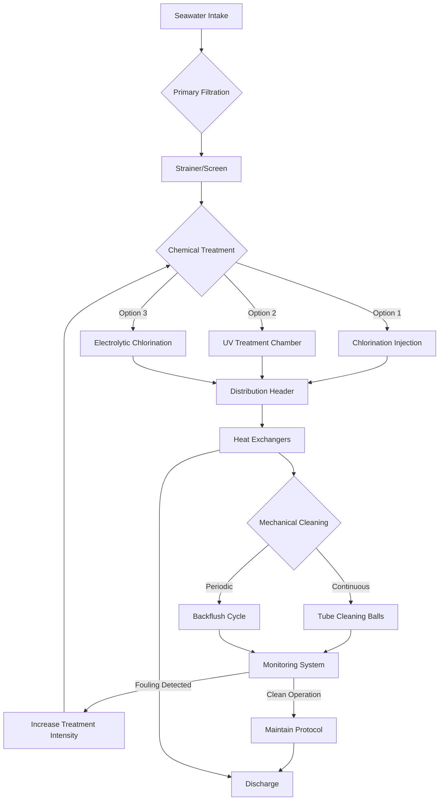

Biofouling in marine seawater cooling systems represents a critical operational challenge that degrades heat transfer efficiency, increases pressure drop, accelerates corrosion, and reduces system reliability. Biological organisms including bacteria, algae, barnacles, mussels, and other marine life colonize heat exchanger surfaces, piping, and strainers, forming insulating layers that severely compromise thermal performance.

## Physics of Biofouling Heat Transfer Impact

The presence of biofouling creates an additional thermal resistance in the heat transfer pathway. The overall heat transfer coefficient with fouling is:

$$\frac{1}{U_f} = \frac{1}{U_c} + R_f$$

where $U_f$ is the fouled heat transfer coefficient (W/m²·K), $U_c$ is the clean coefficient, and $R_f$ is the fouling resistance (m²·K/W). For marine biofouling, $R_f$ ranges from 0.0002 to 0.0009 m²·K/W depending on organism type and thickness.

The heat transfer reduction percentage is:

$$\eta_{reduction} = \left(1 - \frac{U_f}{U_c}\right) \times 100\%$$

A biofilm layer of just 0.5 mm thickness can reduce heat transfer effectiveness by 20-40%, while macrofouling (barnacles, mussels) exceeding 3 mm can reduce capacity by 60-80%.

## Chemical Biofouling Control Methods

### Chlorination Systems

Chlorination remains the most widely used biofouling control method for marine cooling systems. The oxidizing action of hypochlorous acid (HOCl) disrupts cellular processes in microorganisms.

**Continuous Chlorination:**
- Residual concentration: 0.2-0.5 mg/L free chlorine
- Effective against microbial films and algae
- Higher chemical consumption
- Environmental discharge concerns

**Shock Dosing (Intermittent Chlorination):**
- Dosing concentration: 1.0-2.0 mg/L free chlorine
- Duration: 15-30 minutes per treatment
- Frequency: 2-6 times daily depending on water temperature
- Reduces chemical usage by 70-85% compared to continuous dosing

The required chlorine mass flow rate for continuous dosing is:

$$\dot{m}_{Cl_2} = C_{target} \times \dot{V}_{sw} \times \rho_{sw} \times 10^{-6}$$

where $C_{target}$ is target concentration (mg/L), $\dot{V}_{sw}$ is seawater flow rate (m³/h), and $\rho_{sw}$ is seawater density (1025 kg/m³).

For a 500 m³/h seawater system with 0.3 mg/L target:

$$\dot{m}_{Cl_2} = 0.3 \times 500 \times 1025 \times 10^{-6} = 0.154 \text{ kg/h}$$

**Electrolytic Chlorination Systems:**

These systems generate sodium hypochlorite (NaOCl) on-board by electrolyzing seawater:

$$2NaCl + 2H_2O \rightarrow Cl_2 + H_2 + 2NaOH$$

$$Cl_2 + 2NaOH \rightarrow NaOCl + NaCl + H_2O$$

Advantages include elimination of chemical storage, automatic production, and precise dosing control. Typical electrolytic cell efficiency is 90-95% with power consumption of 3-4 kWh/kg Cl₂.

### UV Radiation Treatment

Ultraviolet radiation at 254 nm wavelength damages DNA and RNA in microorganisms, preventing reproduction. UV systems are installed in-line upstream of heat exchangers.

The UV dose required for biofouling control is:

$$D_{UV} = I \times t$$

where $D_{UV}$ is dose (mJ/cm²), $I$ is UV intensity (mW/cm²), and $t$ is exposure time (seconds).

Effective biofouling control requires doses of 40-100 mJ/cm² depending on organism type. For a cylindrical UV chamber:

$$t = \frac{L}{v} = \frac{L \times A}{\dot{V}}$$

where $L$ is chamber length (m), $A$ is flow cross-section (m²), and $\dot{V}$ is volumetric flow rate (m³/s).

**UV System Advantages:**
- No chemical addition or discharge
- No corrosion acceleration
- Effective against chlorine-resistant organisms
- Low maintenance (lamp replacement annually)

**UV System Limitations:**
- High turbidity reduces effectiveness (>10 NTU problematic)
- Requires upstream filtration
- Higher capital cost than chlorination
- UV transmission reduced by fouled quartz sleeves

## Physical and Mechanical Control Methods

### Antifouling Coatings

Surface coatings prevent organism attachment through chemical or physical mechanisms.

| Coating Type | Mechanism | Effectiveness Duration | Application |
|--------------|-----------|------------------------|-------------|
| Copper-based | Biocidal ion release | 18-36 months | Pipe internals, sea chests |
| Tin-based | Biocidal ion release | 24-48 months | Heat exchanger tubes |
| Silicone foul-release | Low surface energy | 36-60 months | Large surface areas |
| Fluoropolymer | Ultra-low adhesion | 48-72 months | High-value components |

The effectiveness of biocidal coatings depends on the release rate of active ingredients. For copper-based coatings, the required release rate is:

$$R_{Cu} = 10-20 \text{ μg/cm}^2\text{·day}$$

This provides localized copper concentrations sufficient to inhibit settlement (>50 μg/L near surface) while meeting discharge limits in bulk flow.

### Mechanical Cleaning Systems

**Automated Tube Cleaning (Brush Systems):**

Sponge rubber balls or nylon brushes are circulated through condenser tubes, mechanically removing biofilm and deposits. The cleaning frequency is determined by the fouling rate:

$$f_{clean} = \frac{R_{f,max} - R_{f,initial}}{\dot{R}_f}$$

where $f_{clean}$ is time between cleanings (days), $R_{f,max}$ is maximum acceptable fouling resistance, and $\dot{R}_f$ is fouling rate (m²·K/W per day).

Typical cleaning frequencies range from continuous (balls recirculating) to weekly depending on fouling severity.

**Backflushing Systems:**

Periodic flow reversal dislodges loosely attached organisms and debris. Effective backflushing parameters:
- Velocity: 1.5-2.5 m/s (50-100% higher than normal flow)
- Duration: 30-90 seconds
- Frequency: Every 4-8 hours of operation

## Biofouling Control Process Flow

## Integrated Biofouling Control Strategy

Effective biofouling control requires multiple complementary methods:

| System Component | Primary Method | Secondary Method | Monitoring Parameter |
|------------------|----------------|------------------|----------------------|
| Sea chest/intake | Antifouling coating | Periodic inspection | Visual inspection quarterly |
| Strainers | Backflushing | Manual cleaning | Differential pressure |
| Piping | Chlorination/UV | Velocity maintenance | Flow rate verification |
| Heat exchanger tubes | Automated brushes | Shock chlorination | Heat transfer coefficient |
| Distribution headers | Chlorination | Coating | Temperature differential |

## Maintenance Schedule and Monitoring

**Daily Operations:**
- Monitor chlorine residual (if applicable): 0.2-0.5 mg/L continuous, 1.0-2.0 mg/L shock
- Check UV system operation and intensity
- Log heat exchanger temperature differential
- Verify flow rates and pressures

**Weekly Tasks:**
- Inspect strainer differential pressure
- Clean UV quartz sleeves if transmission <85%
- Verify automated cleaning system operation
- Test chlorination system output

**Monthly Maintenance:**
- Inspect sea chest and intake grating
- Verify heat exchanger performance vs. baseline
- Calibrate chlorine residual analyzers
- Review fouling trend data

**Annual Overhaul:**
- Drydock inspection of sea chest condition
- Heat exchanger tube inspection (videoscope)
- Replace UV lamps (effectiveness drops 20-30% annually)
- Reapply antifouling coatings as needed
- Eddy current testing of condenser tubes

## Performance Monitoring

Heat exchanger fouling is quantified by the cleanliness factor:

$$CF = \frac{U_{actual}}{U_{design}}$$

Acceptable operation typically requires $CF > 0.85$. When $CF < 0.80$, intensive cleaning or treatment adjustment is necessary.

The fouling resistance can be calculated from operating data:

$$R_f = \frac{1}{U_{actual}} - \frac{1}{U_{clean}} = \frac{1}{\frac{\dot{Q}}{A \times LMTD}} - \frac{1}{U_{design}}$$

where $\dot{Q}$ is measured heat transfer rate (W), $A$ is heat transfer area (m²), and $LMTD$ is log mean temperature difference (K).

## Environmental and Regulatory Considerations

Chlorination discharge is regulated under IMO guidelines and regional regulations. Maximum allowable discharge concentrations typically range from 0.1-0.2 mg/L total residual oxidants (TRO). Dechlorination with sodium bisulfite may be required:

$$NaHSO_3 + HOCl \rightarrow NaHSO_4 + HCl$$

The stoichiometric ratio is approximately 1.5:1 (sodium bisulfite:chlorine by weight), though 2:1 is commonly used to ensure complete neutralization.

Alternative treatment methods (UV, non-oxidizing biocides, physical methods) are increasingly favored in environmentally sensitive areas where chlorine discharge restrictions are stringent.

## Components

- Marine Organism Growth Mechanisms
- Fouling Heat Transfer Reduction Physics
- Chemical Antifouling Systems
- Chlorination Systems (Continuous and Shock)
- Electrolytic Chlorination Generation
- UV Radiation Treatment Systems
- Antifouling Coating Technologies
- Mechanical Cleaning Systems
- Automated Tube Cleaning Brushes
- Backflushing Systems and Protocols
- Integrated Control Strategies
- Performance Monitoring Methods
