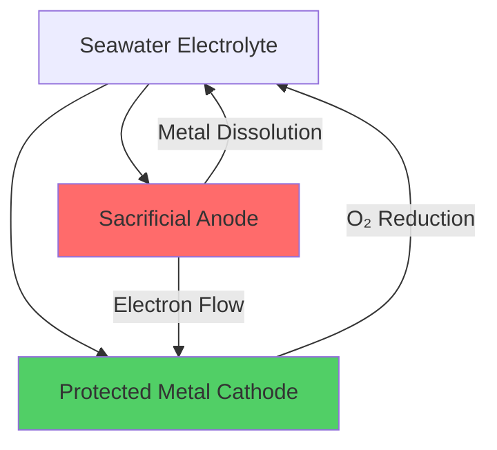
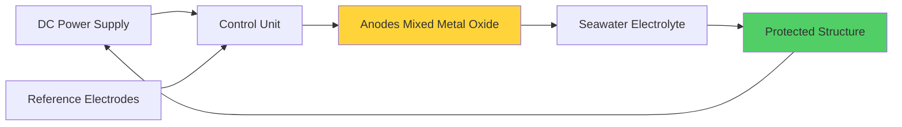

Corrosion in marine seawater cooling systems represents one of the most significant engineering challenges in shipboard HVAC applications. Seawater's aggressive electrochemical nature, combined with dissolved oxygen, chlorides, and biological activity, creates a corrosive environment that can rapidly degrade improperly protected systems. Effective corrosion control requires integrated strategies combining material selection, electrochemical protection, and design optimization.

## Corrosion Mechanisms in Seawater

The primary corrosion processes affecting marine cooling systems are governed by electrochemical reactions at the metal-seawater interface.

### Anodic Dissolution

Metal oxidation occurs at anodic sites where metal atoms lose electrons:

$$M \rightarrow M^{n+} + ne^-$$

For common marine materials, typical half-cell reactions include:

$$Fe \rightarrow Fe^{2+} + 2e^- \quad E^0 = -0.44 \text{ V}$$

$$Cu \rightarrow Cu^{2+} + 2e^- \quad E^0 = +0.34 \text{ V}$$

### Cathodic Reactions

Electrons released at anodic sites are consumed at cathodic sites. In oxygenated seawater, the primary cathodic reaction is oxygen reduction:

$$O_2 + 2H_2O + 4e^- \rightarrow 4OH^-$$

The corrosion rate is controlled by the limiting current density, typically the oxygen diffusion rate to the metal surface:

$$i_{lim} = \frac{nFD_O C_O}{\delta}$$

Where:
- $i_{lim}$ = limiting current density (A/m²)
- $n$ = number of electrons (4 for O₂ reduction)
- $F$ = Faraday constant (96,485 C/mol)
- $D_O$ = oxygen diffusion coefficient (≈2×10⁻⁹ m²/s)
- $C_O$ = oxygen concentration (≈8 mg/L in seawater)
- $\delta$ = diffusion boundary layer thickness (m)

## Material Selection Strategy

### Copper-Nickel Alloys

Cupronickel alloys (90/10 and 70/30 Cu-Ni) are the traditional standard for marine heat exchangers due to their excellent corrosion resistance and biofouling resistance.

**90/10 Cupronickel (UNS C70600):**
- Composition: 90% Cu, 10% Ni, 1.5% Fe
- Corrosion rate: 0.025-0.05 mm/year
- Maximum velocity: 2.5 m/s
- Cost: Moderate
- Applications: Condenser tubes, piping

**70/30 Cupronickel (UNS C71500):**
- Composition: 70% Cu, 30% Ni, 0.5% Fe
- Corrosion rate: 0.01-0.025 mm/year
- Maximum velocity: 3.5 m/s
- Cost: Higher than 90/10
- Applications: High-velocity applications, offshore platforms

The iron content is critical for forming protective ferric hydroxide films:

$$Fe^{2+} + 2OH^- \rightarrow Fe(OH)_2 \rightarrow Fe(OH)_3$$

### Titanium

Titanium offers superior corrosion resistance due to its stable passive oxide film (TiO₂):

| Property | Titanium Grade 2 | 90/10 Cupronickel |
|----------|------------------|-------------------|
| Corrosion Rate | <0.001 mm/year | 0.025-0.05 mm/year |
| Maximum Velocity | >6 m/s | 2.5 m/s |
| Seawater Temperature Limit | No practical limit | 60°C |
| Relative Cost | 3-5× | 1× (baseline) |
| Density | 4.51 g/cm³ | 8.90 g/cm³ |
| Thermal Conductivity | 17 W/(m·K) | 50 W/(m·K) |

Titanium's passive film regenerates immediately when damaged, providing exceptional resistance to erosion-corrosion and cavitation.

### Stainless Steels

Super duplex and 6-moly austenitic stainless steels offer intermediate performance:

**Super Duplex 2507 (UNS S32750):**
- PREN = %Cr + 3.3(%Mo) + 16(%N) = 42+
- Maximum seawater temperature: 30-40°C
- Susceptible to crevice corrosion above critical temperature

## Cathodic Protection Systems

Cathodic protection shifts the electrochemical potential of protected metals to eliminate or reduce corrosion.

### Sacrificial Anode Systems

Sacrificial anodes are more electronegative than the protected structure, providing galvanic protection:

**Anode Material Selection:**

| Material | Open Circuit Potential vs Ag/AgCl | Capacity Ah/kg | Applications |
|----------|-----------------------------------|----------------|--------------|
| Zinc | -1.05 V | 780 | General seawater, <60°C |
| Aluminum Alloy | -1.10 V | 2600 | High efficiency, all temperatures |
| Magnesium | -1.60 V | 1100 | Freshwater, high driving voltage |

**Anode Mass Calculation:**

Required anode mass:

$$M = \frac{I_p \cdot t \cdot 8760}{U \cdot \eta}$$

Where:
- $M$ = anode mass (kg)
- $I_p$ = protection current (A)
- $t$ = design life (years)
- $U$ = anode capacity (Ah/kg)
- $\eta$ = utilization factor (0.85 typical)

Protection current density for steel in seawater: 0.08-0.15 A/m²

### Impressed Current Cathodic Protection (ICCP)

ICCP systems use external DC power to drive protective current:

$$E_{protection} = E_{corrosion} - \eta_{polarization}$$

Target protection potential: -0.80 to -1.05 V vs Ag/AgCl

**System Components:**

**Anode Materials:**
- Mixed Metal Oxide (MMO): Platinum group metals on titanium substrate
- High silicon cast iron: Traditional, requires periodic replacement
- Graphite: Low cost, high consumption rate

## Galvanic Corrosion Prevention

### Galvanic Series in Seawater

When dissimilar metals contact in seawater, the more active metal corrodes preferentially:

| Metal/Alloy | Potential (V vs Ag/AgCl) |
|-------------|--------------------------|
| Magnesium | -1.60 |
| Zinc | -1.05 |
| Aluminum Alloys | -1.10 to -0.75 |
| Mild Steel | -0.60 to -0.70 |
| Cast Iron | -0.60 |
| 90/10 Cupronickel | -0.25 to -0.20 |
| Titanium | -0.05 (passive) |
| Graphite | +0.25 |

### Prevention Strategies

**1. Material Compatibility:**
Select metals close in the galvanic series (potential difference <0.25 V).

**2. Insulation:**
Use dielectric isolators at dissimilar metal junctions:
- Non-metallic gaskets
- Plastic washers and sleeves
- Insulating flanges

**3. Area Ratio Control:**

Galvanic current density at anode:

$$i_a = \frac{\Delta E}{R_{total}} \cdot \frac{1}{A_a}$$

Where $A_a$ is anode area. Minimize anode area relative to cathode area (opposite of favorable condition).

**4. Coatings:**
Coat the more noble (cathodic) metal to reduce effective cathode area.

## Design Considerations

### Flow Velocity Optimization

Corrosion rate initially decreases with velocity (improved oxygen transport enhances passive film formation), then increases due to erosion-corrosion:

$$CR = CR_0 + k \cdot (v - v_{crit})^n$$

Where:
- $CR$ = corrosion rate
- $v$ = flow velocity
- $v_{crit}$ = critical velocity for material
- $n$ = exponent (typically 2-3)

**Maximum Design Velocities:**
- 90/10 Cupronickel: 2.5 m/s
- 70/30 Cupronickel: 3.5 m/s
- Titanium: >6 m/s (erosion-corrosion immune)

### Temperature Effects

Corrosion rates typically double for each 10°C temperature increase (up to ≈60°C), following Arrhenius behavior:

$$k_T = k_{T_0} \exp\left[\frac{-E_a}{R}\left(\frac{1}{T} - \frac{1}{T_0}\right)\right]$$

Where:
- $E_a$ = activation energy (40-80 kJ/mol for seawater corrosion)
- $R$ = gas constant (8.314 J/(mol·K))

### Crevice Corrosion Prevention

Crevice corrosion accelerates in oxygen-depleted regions:

**Design Guidelines:**
- Eliminate or seal crevices <0.5 mm
- Ensure complete drainage during shutdown
- Use solid gaskets rather than spiral wound
- Maintain flow turbulence to prevent deposits
- Design tube-to-tubesheet joints for zero crevice

## Monitoring and Maintenance

**Inspection Intervals:**
- Visual inspection: 6 months
- Ultrasonic thickness testing: Annual
- Anode consumption measurement: 6-12 months
- ICCP system verification: Quarterly

**Corrosion Rate Assessment:**

Weight loss method:

$$CR = \frac{K \cdot W}{A \cdot t \cdot \rho}$$

Where:
- $CR$ = corrosion rate (mm/year)
- $K$ = constant (8.76×10⁴)
- $W$ = weight loss (g)
- $A$ = exposed area (cm²)
- $t$ = exposure time (hours)
- $\rho$ = density (g/cm³)

Effective corrosion protection in marine seawater systems requires comprehensive integration of appropriate materials, electrochemical protection methods, and sound engineering design that accounts for the unique operational environment of shipboard HVAC applications.
