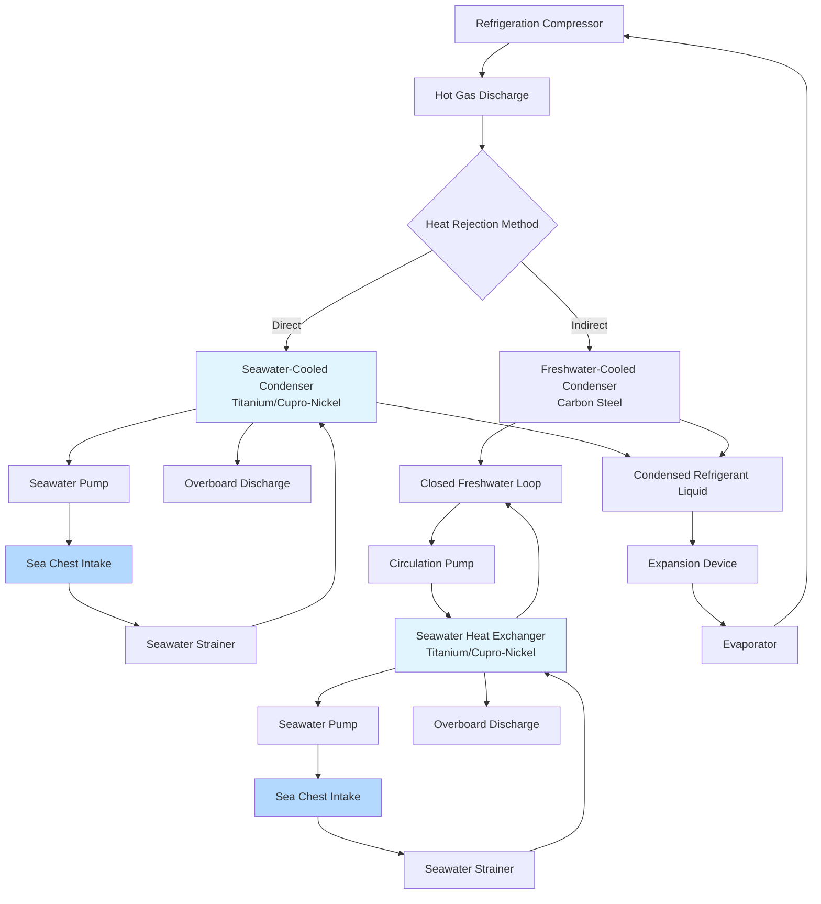

## Physical Principles of Seawater Heat Rejection

Seawater serves as the ultimate heat sink for marine HVAC systems, absorbing heat from refrigeration condensers, chiller systems, and cooling loads. The heat transfer process relies on the thermal capacity of ocean water and the temperature differential between the refrigerant and seawater. Unlike land-based systems that reject heat to ambient air, marine systems exploit the consistent thermal mass and availability of seawater, providing superior heat rejection performance with minimal energy consumption for heat transfer.

The fundamental heat transfer occurs through conduction across heat exchanger surfaces, where the refrigerant's latent heat of condensation transfers through metallic walls to flowing seawater. The effectiveness depends on exchanger surface area, material thermal conductivity, flow velocities, and the temperature gradient between hot refrigerant and cool seawater.

## Seawater Heat Exchanger Capacity Calculations

The heat rejection capacity of a seawater-cooled condenser is calculated using the sensible heat equation applied to the seawater flow:

$$Q = \dot{m}_{sw} \cdot c_{p,sw} \cdot \Delta T_{sw}$$

Where:
- $Q$ = Heat rejection capacity (kW)
- $\dot{m}_{sw}$ = Seawater mass flow rate (kg/s)
- $c_{p,sw}$ = Specific heat of seawater ≈ 3.93 kJ/(kg·K) at 35 ppt salinity
- $\Delta T_{sw}$ = Seawater temperature rise (K)

The overall heat transfer is governed by:

$$Q = U \cdot A \cdot LMTD$$

Where:
- $U$ = Overall heat transfer coefficient (W/m²·K)
- $A$ = Heat exchanger surface area (m²)
- $LMTD$ = Log mean temperature difference (K)

The log mean temperature difference for counterflow heat exchangers:

$$LMTD = \frac{(T_{r,in} - T_{sw,out}) - (T_{r,out} - T_{sw,in})}{\ln\left(\frac{T_{r,in} - T_{sw,out}}{T_{r,out} - T_{sw,in}}\right)}$$

Where:
- $T_{r,in}$ = Refrigerant inlet temperature (K)
- $T_{r,out}$ = Refrigerant outlet temperature (K)
- $T_{sw,in}$ = Seawater inlet temperature (K)
- $T_{sw,out}$ = Seawater outlet temperature (K)

The required seawater flow rate for a given heat load:

$$\dot{V}_{sw} = \frac{Q}{c_{p,sw} \cdot \rho_{sw} \cdot \Delta T_{sw}}$$

Where:
- $\dot{V}_{sw}$ = Volumetric seawater flow rate (m³/s)
- $\rho_{sw}$ = Seawater density ≈ 1025 kg/m³ at 15°C and 35 ppt salinity

## Direct vs Indirect Heat Rejection Methods

Marine HVAC systems employ two primary heat rejection configurations, each with distinct thermodynamic and operational characteristics.

| Parameter | Direct Seawater Cooling | Indirect Seawater Cooling |
|-----------|-------------------------|---------------------------|
| Configuration | Seawater flows directly through condenser | Closed freshwater loop with seawater heat exchanger |
| Heat Transfer Stages | Single stage (refrigerant → seawater) | Two stages (refrigerant → freshwater → seawater) |
| Thermal Efficiency | Higher (fewer thermal barriers) | Lower (additional temperature differential) |
| Fouling Risk | High (marine growth on refrigerant side) | Low (marine growth isolated to seawater side) |
| Corrosion Risk | Severe (seawater contacts refrigerant circuit) | Minimal (seawater isolated from refrigerant) |
| Material Requirements | Titanium or cupro-nickel mandatory | Carbon steel acceptable for condenser |
| Maintenance Frequency | High (chemical cleaning, tube replacement) | Moderate (seawater exchanger cleaning only) |
| Initial Cost | Lower (single heat exchanger) | Higher (two heat exchangers, circulation pump) |
| Operating Cost | Lower (no circulation pump) | Higher (pump energy for closed loop) |
| Temperature Approach | 2-3°C typical | 5-8°C typical (cumulative from both stages) |
| System Complexity | Simple | Complex (requires expansion tank, controls) |
| Typical Application | Small vessels, auxiliary systems | Large vessels, critical HVAC systems |

## Seawater Heat Rejection System Flow

## Seawater Temperature Design Considerations

Seawater temperature varies significantly with geographic location, ocean depth, and season, requiring careful system design to ensure adequate heat rejection across operational profiles.

**Tropical Waters:** Surface temperatures reach 28-32°C in equatorial regions, reducing condensing temperature differential and system efficiency. Design condensing temperatures must account for peak seawater temperatures plus approach temperature, typically requiring 38-42°C condensing for R-134a systems. The reduced density and specific heat at elevated temperatures further decrease heat transfer effectiveness.

**Temperate Waters:** Mid-latitude oceans exhibit 8-22°C surface temperatures with seasonal variation. Design calculations use maximum expected temperature (typically 22-24°C) to ensure adequate capacity during summer operations. The wider temperature range allows lower condensing pressures during winter, improving system efficiency and reducing compressor power consumption.

**Polar Waters:** Arctic and Antarctic operations encounter -2 to 8°C seawater temperatures. While excellent for heat rejection, these conditions create two challenges: potential freezing in overboard discharge piping when the ship is stationary, and reduced system capacity during partial-load operation as condensing pressure drops below optimal operating range. Some systems incorporate hot gas bypass or variable-speed compressors to maintain minimum condensing pressure.

**Intake Depth Considerations:** Seawater temperature decreases with depth due to thermal stratification. Ships with deep intake sea chests (5-8 m below waterline) access cooler water than surface intakes, improving heat rejection by 2-4°C in calm seas. However, shallow-draft vessels and high-speed craft must design for surface temperature conditions.

**Fouling and Biofouling Impact:** Marine organisms, calcium carbonate deposits, and sediment accumulation reduce heat transfer coefficients by 20-40% over time. Design calculations apply fouling factors of 0.0001-0.0002 m²·K/W for seawater-wetted surfaces, increasing required surface area by 15-25% compared to clean conditions. Regular mechanical or chemical cleaning restores performance.

**Material Selection:** Direct seawater contact demands corrosion-resistant materials. Titanium offers superior corrosion resistance but costs 4-6 times more than cupro-nickel (90-10 or 70-30 alloys). Cupro-nickel provides adequate service life at reduced cost for most applications, with minimum water velocity of 1.5-2.0 m/s to prevent marine growth while avoiding erosion above 3.0 m/s. Admiralty brass serves budget applications in freshwater or low-salinity estuarine environments only.

## System Design Integration

Effective seawater heat rejection requires integration with vessel machinery systems. Seawater pump sizing must account for piping friction losses, strainer pressure drop (typically 20-35 kPa when clean), and heat exchanger pressure drop (15-30 kPa), while maintaining sufficient flow velocity to prevent fouling. Pump selection considers net positive suction head (NPSH) requirements, particularly for installations above the waterline where suction lift reduces available NPSH.

Sea chest design incorporates multiple intakes to ensure seawater availability across vessel heel and trim angles, with intake velocity below 1.5 m/s to minimize marine organism entrainment and prevent vortex formation. Overboard discharge locations prevent recirculation of heated water back to intake systems, maintaining design temperature differentials.
