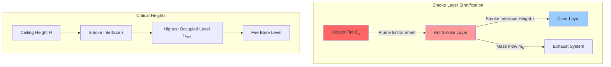
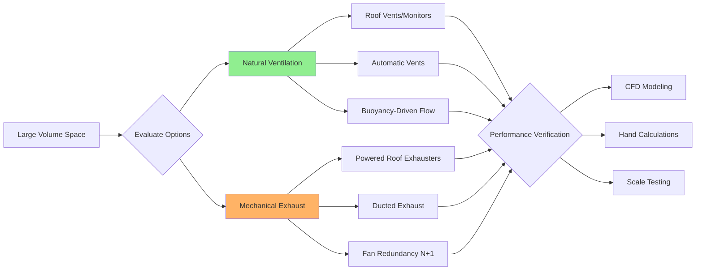

## Overview

Smoke control in large volume spaces presents unique engineering challenges distinct from conventional compartmented buildings. Atriums, warehouses, aircraft hangars, convention centers, and sports arenas require specialized smoke management approaches that account for natural smoke stratification, volumetric effects, and extended egress times. These systems must maintain tenable conditions at the occupied level while managing smoke accumulation in the upper volume.

Large volume smoke control relies on the physical principle that hot smoke rises and stratifies beneath the ceiling, creating a smoke layer interface. The engineering objective is to maintain this interface above the highest occupied level for the duration of required egress time, typically calculated at 1.5 to 2 times the expected evacuation period.

## Code Requirements and Standards

### NFPA 92: Smoke Control Systems

NFPA 92 (Standard for Smoke Control Systems) provides the foundational engineering methodology for large volume spaces:

**Applicability Thresholds:**
- Atrium height > 15 m (50 ft)
- Floor area > 2,000 m² (21,500 ft²) per level
- Ceiling height > 6 m (20 ft) in assembly/mercantile occupancies
- Special high-hazard applications regardless of size

**Design Fire Requirements:**
- Steady-state heat release rate (HRR) analysis
- Fuel load assessment and fire growth curve (t-squared profiles)
- Minimum design fires: 5 MW for typical applications, 10-20 MW for high-hazard

### IBC and IFC Provisions

The International Building Code Section 909 mandates engineered smoke control for atriums and certain covered mall buildings. These requirements trigger performance-based analysis using NFPA 92 methodologies and computational fluid dynamics (CFD) validation for complex geometries.

## Smoke Control Design Approaches

### Mass Exhaust Method

The mass exhaust approach calculates the required volumetric exhaust rate to maintain the smoke layer interface at a specified height above the floor. This method assumes a steady-state fire with continuous smoke production balanced by mechanical exhaust.

The fundamental exhaust flow requirement:

$$V_e = \frac{m_s}{\rho_s}$$

where $V_e$ is exhaust volumetric flow rate (m³/s), $m_s$ is smoke mass flow rate (kg/s), and $\rho_s$ is smoke density (kg/m³).

The smoke mass production rate from the plume:

$$m_s = 0.071 Q_c^{1/3} (z - z_0)^{5/3} + 0.0018 Q_c$$

where $Q_c$ is convective heat release rate (kW), $z$ is height above fire base (m), and $z_0$ is virtual origin height (m).

For axisymmetric plumes, the virtual origin:

$$z_0 = -1.02 D + 0.083 Q_c^{2/5}$$

where $D$ is fire diameter (m).

### Smoke Filling Analysis

Natural smoke filling predicts the descent rate of the smoke layer interface with no mechanical exhaust, useful for determining available safe egress time (ASET):

$$\frac{dz}{dt} = -\frac{m_s}{\rho_s A}$$

where $A$ is floor area (m²). Integrating over time provides the interface descent:

$$z(t) = z_i - \int_0^t \frac{m_s}{\rho_s A} \, dt$$

where $z_i$ is initial clear height (typically ceiling height).

## System Design Parameters

### Smoke Layer Interface Height

The minimum acceptable interface height:

$$z_{min} = h_{occ} + 2.0 \text{ m (6.6 ft)}$$

This provides adequate visibility and thermal protection for evacuating occupants. For spaces with mezzanines or elevated walkways, $h_{occ}$ represents the highest egress path elevation.

### Exhaust System Sizing

| Space Type | Design Fire (MW) | Typical Exhaust Rate | Air Changes per Hour |
|------------|------------------|----------------------|----------------------|
| Shopping Mall Atrium | 5-10 | 10-20 m³/s per MW | 4-8 ACH |
| Warehouse (Standard) | 5-15 | 15-30 m³/s per MW | 2-4 ACH |
| Warehouse (High-Hazard) | 15-30 | 30-50 m³/s per MW | 4-6 ACH |
| Convention Center | 5-10 | 12-25 m³/s per MW | 3-6 ACH |
| Aircraft Hangar | 20-50 | 40-80 m³/s per MW | 2-5 ACH |

### Make-Up Air Requirements

Supply air must replace exhausted smoke to prevent building depressurization and maintain exhaust effectiveness:

$$V_{ma} \geq 0.85 V_e$$

Make-up air should be introduced at low velocity (< 1.5 m/s) below the smoke layer interface to prevent layer disruption and smoke mixing.

## Natural vs. Mechanical Systems

### Natural Ventilation Advantages

- No electrical power requirement (gravity/buoyancy driven)
- Lower installation and maintenance costs
- Inherent reliability (no mechanical failure modes)
- Effective for warehouse and industrial applications

Natural vent area calculation:

$$A_v = \frac{V_e}{C_d \sqrt{2 g \Delta T / T_\infty}}$$

where $C_d$ is discharge coefficient (typically 0.6-0.7), $g$ is gravitational acceleration (9.81 m/s²), $\Delta T$ is temperature rise (K), and $T_\infty$ is ambient temperature (K).

### Mechanical Exhaust Advantages

- Precise flow control and verification
- Effective in low-ceiling or geometrically complex spaces
- Integration with building automation systems
- Rapid smoke removal rates

## Design Considerations

**Plume Interaction:** Multiple fires or obstructions can cause plume deflection and non-axisymmetric behavior, requiring CFD analysis for accurate predictions.

**Beam and Joist Effects:** Deep structural members create pocketing that traps smoke, reducing effective exhaust. Channel spacing should not exceed 3:1 depth-to-spacing ratio.

**Detector Placement:** Smoke detectors must be located within the smoke layer, typically at 90-95% of ceiling height, accounting for stratification effects.

**Commissioning:** Full functional testing with theatrical smoke tracers verifies interface height, exhaust rates, and alarm integration before occupancy.

## Application Summary

| Design Aspect | NFPA 92 Requirement | Engineering Approach |
|---------------|---------------------|----------------------|
| Design Fire | Fuel-based or prescriptive | HRR analysis, t² growth |
| Smoke Production | Plume equations | Mass flow calculations |
| Interface Height | Above highest egress path + 2 m | Volumetric analysis |
| Exhaust Rate | Physics-based calculation | Mass exhaust method |
| Make-Up Air | ≥85% of exhaust | Low-level introduction |
| Verification | CFD or testing required | Performance-based |

Large volume smoke control demands rigorous engineering analysis integrating fire dynamics, fluid mechanics, and building systems coordination to achieve code compliance and life safety objectives.
