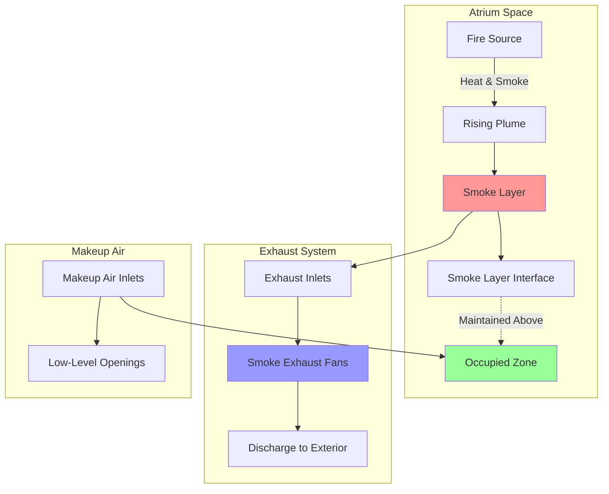
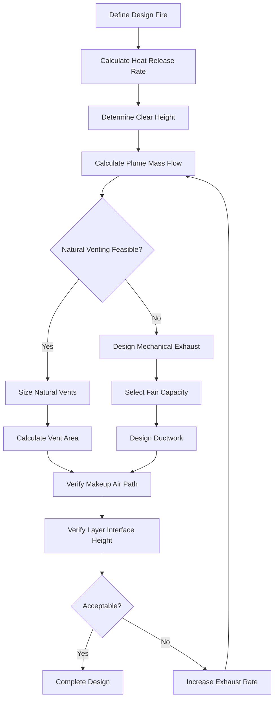

Atrium smoke control systems protect occupants in large-volume spaces by managing smoke movement and maintaining tenable conditions during fire events. These systems address unique challenges posed by multi-story open spaces where conventional compartmentation strategies cannot be applied.

## Design Philosophy

Atrium smoke control relies on maintaining a smoke layer above the occupied zone while providing sufficient time for evacuation. The primary objective is to keep the smoke layer interface at least 6 feet above the highest walking surface or occupiable level within the atrium.

### Design Approaches

Three fundamental strategies govern atrium smoke control design:

| Approach | Method | Application | Advantages |
|----------|--------|-------------|------------|
| Smoke Filling | Allow smoke accumulation with calculated fill time | Low-rise atriums with rapid egress | Minimal mechanical systems |
| Steady Smoke Layer | Exhaust smoke at rate equal to plume production | Mid-rise atriums | Maintains constant layer height |
| Natural Venting | Utilize buoyancy-driven flow through roof openings | Tall atriums with adequate height | No mechanical power required |

## Fire Plume Characteristics

The smoke production rate from a fire determines exhaust requirements. The axisymmetric plume model provides the foundation for calculations.

### Plume Mass Flow Rate

For fires not impinging on walls, the plume mass flow rate at height $z$ above the fire source:

$$\dot{m}_p = 0.071 Q_c^{1/3} (z - z_0)^{5/3}$$

Where:
- $\dot{m}_p$ = plume mass flow rate (kg/s)
- $Q_c$ = convective heat release rate (kW)
- $z$ = height above fire source (m)
- $z_0$ = virtual origin height (m)

### Virtual Origin Correction

For fires with characteristic diameter $D$, the virtual origin:

$$z_0 = -1.02D + 0.083Q_c^{2/5}$$

This correction accounts for the physical size of the fuel source and prevents overestimation of plume entrainment near the fire base.

## Exhaust Volumetric Flow Rate

The required volumetric exhaust rate depends on the plume mass flow and smoke layer temperature:

$$V = \frac{\dot{m}_p}{\rho_s}$$

Where $\rho_s$ is the smoke density at the layer temperature. For engineering calculations:

$$V = \dot{m}_p \left(\frac{T_s}{353}\right)$$

With $V$ in m³/s, $\dot{m}_p$ in kg/s, and $T_s$ in Kelvin.

## System Configuration

## Design Process Flow

## Code Requirements per NFPA 92

### Design Fire Specifications

NFPA 92 provides guidance on design fire selection based on occupancy and fuel characteristics:

- **Retail spaces**: 5 MW steady-state fire
- **Office atriums**: 3 MW steady-state fire
- **Assembly occupancies**: Evaluate based on specific fuel loads

Design fires must consider both fire growth rate and steady-state heat release for time-dependent analysis.

### Clear Height Requirements

Minimum clear height beneath the smoke layer:

- 6 feet above highest occupied level
- Additional height for thermal radiation consideration when layer temperature exceeds 200°F

### Makeup Air Provisions

Makeup air must equal exhaust rate and enter below the smoke layer to prevent disruption of the stratified smoke layer. Maximum makeup air velocity: 200 fpm in occupied areas.

## Mechanical vs. Natural Systems

### Mechanical Exhaust Systems

**Advantages:**
- Precise control of exhaust rate
- Independent of environmental conditions
- Suitable for any atrium height
- Can integrate with HVAC systems

**Design considerations:**
- Fan temperature rating minimum 250°F
- Redundant fan capacity or backup power
- Inlet placement minimum 10 feet from plume centerline
- Ductwork slope to drain condensate

### Natural Venting Systems

Required vent area for natural venting:

$$A_v = \frac{\dot{m}_p}{\rho_\infty C_v \sqrt{2g\Delta\rho h / \rho_\infty}}$$

Where:
- $A_v$ = vent area (m²)
- $C_v$ = vent coefficient (typically 0.6-0.7)
- $g$ = gravitational acceleration (9.81 m/s²)
- $\Delta\rho$ = density difference across vent
- $h$ = height of neutral plane above vent

**Critical factors:**
- Adequate atrium height (typically >60 feet)
- Reliable vent actuation mechanisms
- Wind effects on discharge
- Winter heating load impacts

## System Integration

Atrium smoke control systems must coordinate with building HVAC:

1. **Normal operation**: Standard HVAC maintains comfort conditions
2. **Smoke control mode**: HVAC systems shut down or reconfigure to prevent smoke circulation
3. **Pressurization**: Adjacent spaces may require pressurization to prevent smoke migration

Control sequences must be programmed in the fire alarm system with hardwired interfaces to HVAC controls for reliability.

## Performance Verification

Computational fluid dynamics (CFD) modeling validates design assumptions for complex geometries or unusual fire scenarios. Physical testing after installation confirms:

- Exhaust flow rates within 10% of design
- Smoke layer interface maintenance at design height
- Makeup air flow patterns do not disrupt stratification
- Control system activation and sequencing

Periodic testing per NFPA 92 requirements ensures ongoing system functionality and compliance with the original design intent.
