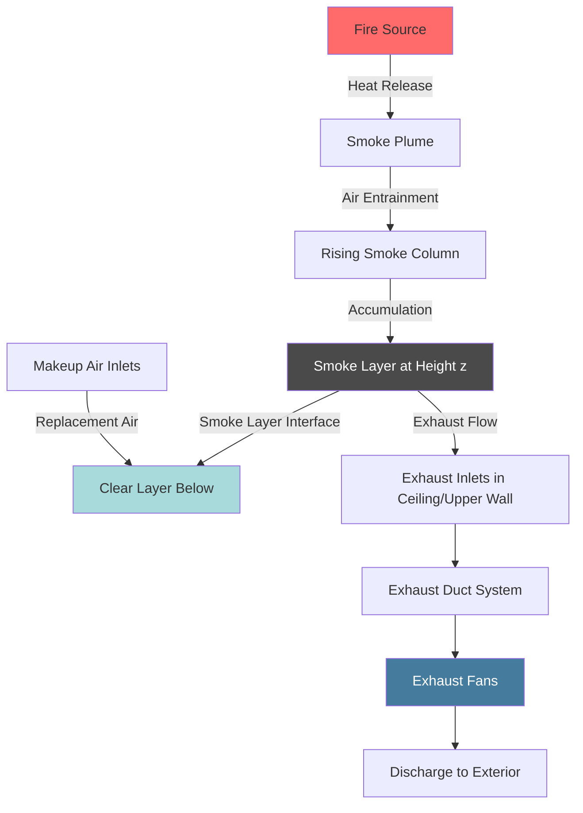

## Fundamental Principles

Atrium exhaust rate calculations determine the volumetric flow rate required to maintain a smoke layer interface at a specified height above the fire source. The design basis follows NFPA 92 methodologies, which relate fire heat release rate to plume mass flow and required exhaust capacity.

The objective is to maintain tenable conditions below the smoke layer for occupant egress while preventing smoke descent to occupied levels.

## Fire Size and Heat Release Rate

### Design Fire Basis

The design fire represents the assumed steady-state heat release rate (HRR) used for exhaust calculations. NFPA 92 provides guidance for selecting design fires based on occupancy and combustible loading.

**Common Design Fire Categories:**

| Occupancy Type | Design HRR | Basis |
|----------------|------------|-------|
| Retail/Mercantile | 5,000 kW | Multiple burning items |
| Office | 2,500-5,000 kW | Workstation fire |
| Assembly | 2,500 kW | Seating/furnishings |
| High-Hazard Storage | 10,000+ kW | Commodity storage |

### Heat Release Rate Assumptions

The heat release rate determines plume characteristics and mass flow. Selection criteria include:

- Expected fuel load and configuration
- Fire growth rate (t-squared fire development)
- Sprinkler activation effects (if applicable)
- Code-mandated minimum values

For unsprinklered spaces, use steady-state HRR values. For sprinklered spaces, HRR may be reduced to account for fire suppression, though NFPA 92 recommends conservative approaches.

## Plume Mass Flow Rate Calculations

### Axisymmetric Plume Equation

For fires located away from walls with unlimited air entrainment, the axisymmetric plume equation applies:

$$\dot{m}_p = 0.071 \, Q_c^{1/3} \, z^{5/3} + 0.0018 \, Q_c$$

Where:
- $\dot{m}_p$ = plume mass flow rate (kg/s)
- $Q_c$ = convective heat release rate (kW)
- $z$ = height above fire source to smoke layer interface (m)

The convective heat release rate is:

$$Q_c = \chi_c \, Q$$

Where:
- $Q$ = total heat release rate (kW)
- $\chi_c$ = convective fraction (typically 0.60-0.70)

### Balcony Spill Plume Equation

For fires beneath balconies or adjacent to walls, use the balcony spill plume equation:

$$\dot{m}_p = 0.36 \, (z - z_b)^{1/3} \, W \, Q_c^{1/3}$$

Where:
- $z_b$ = height of balcony above fire (m)
- $W$ = effective width of balcony opening (m)

### Wall Plume Equation

For fires against walls with restricted air entrainment:

$$\dot{m}_p = 0.058 \, Q_c^{1/3} \, z^{5/3} + 0.0018 \, Q_c$$

The coefficient reduces from 0.071 to 0.058 due to restricted entrainment on one side.

## Volumetric Exhaust Rate Calculation

### Basic Exhaust Rate Formula

Convert plume mass flow rate to volumetric exhaust rate:

$$V_e = \frac{\dot{m}_p}{\rho_s}$$

Where:
- $V_e$ = volumetric exhaust rate (m³/s)
- $\rho_s$ = smoke layer density (kg/m³)

For typical conditions, smoke layer density:

$$\rho_s = \rho_{\infty} \, \frac{T_{\infty}}{T_s}$$

Where:
- $\rho_{\infty}$ = ambient air density (1.20 kg/m³ at 20°C)
- $T_{\infty}$ = ambient temperature (K)
- $T_s$ = smoke layer temperature (K)

### Smoke Layer Temperature Estimation

The average smoke layer temperature rise above ambient:

$$\Delta T = \frac{Q_c}{\dot{m}_p \, c_p}$$

Where:
- $c_p$ = specific heat of air (1.01 kJ/kg·K)

## Exhaust Capacity and CFM Calculations

### Conversion to CFM

For US practice, convert m³/s to CFM:

$$V_e \, (\text{CFM}) = V_e \, (\text{m}^3/\text{s}) \times 2119$$

### Design Margin

Add design margin to calculated exhaust rate:

$$V_{design} = V_e \times (1 + \text{margin})$$

Typical margins range from 10-20% to account for:
- Calculation uncertainties
- System leakage
- Plug-holing effects
- Non-uniform smoke layer

## Exhaust Rate Tables

### Axisymmetric Plume Exhaust Requirements

**Fire Size: 2,500 kW (χc = 0.65)**

| Clear Height (m) | Clear Height (ft) | Mass Flow (kg/s) | Exhaust Rate (m³/s) | Exhaust Rate (CFM) |
|------------------|-------------------|------------------|---------------------|---------------------|
| 6 | 20 | 29.2 | 25.7 | 54,500 |
| 9 | 30 | 51.8 | 45.6 | 96,600 |
| 12 | 40 | 79.7 | 70.2 | 148,700 |
| 15 | 50 | 112.3 | 98.8 | 209,400 |
| 18 | 60 | 149.4 | 131.5 | 278,600 |

**Fire Size: 5,000 kW (χc = 0.65)**

| Clear Height (m) | Clear Height (ft) | Mass Flow (kg/s) | Exhaust Rate (m³/s) | Exhaust Rate (CFM) |
|------------------|-------------------|------------------|---------------------|---------------------|
| 6 | 20 | 43.2 | 38.0 | 80,500 |
| 9 | 30 | 76.6 | 67.4 | 142,900 |
| 12 | 40 | 117.9 | 103.8 | 219,900 |
| 15 | 50 | 166.2 | 146.3 | 310,000 |
| 18 | 60 | 221.1 | 194.6 | 412,300 |

Assumptions: Ambient temperature 20°C, average smoke temperature 150°C, density 0.83 kg/m³

## Exhaust Fan Sizing

### Fan Selection Criteria

Size exhaust fans to provide calculated volumetric flow at system operating pressure:

1. **Volumetric capacity** - Must meet or exceed calculated exhaust rate
2. **Pressure capability** - Overcome system pressure losses (ductwork, dampers, louvers)
3. **Temperature rating** - Rated for elevated smoke temperatures (minimum 250°F/121°C)
4. **Reliability** - Dual fans or redundancy for critical applications

### System Pressure Loss Estimation

Total system pressure loss:

$$\Delta P_{total} = \Delta P_{duct} + \Delta P_{fittings} + \Delta P_{damper} + \Delta P_{discharge}$$

Typical values:
- Ductwork: 0.08-0.15 in. w.g. per 100 ft
- Fire/smoke dampers: 0.10-0.25 in. w.g.
- Louvers/grilles: 0.10-0.30 in. w.g.

Total system pressure: 0.5-1.5 in. w.g. for typical atrium installations

## Exhaust System Configuration

## Calculation Procedure

**Step-by-step exhaust rate determination:**

1. **Establish design fire size** - Select HRR based on occupancy and fuel load
2. **Determine clear height** - Measure vertical distance from fire source to desired smoke layer interface
3. **Select plume equation** - Choose axisymmetric, wall, or balcony spill plume based on geometry
4. **Calculate convective HRR** - Apply convective fraction (Qc = χc × Q)
5. **Compute plume mass flow** - Use appropriate plume equation with z and Qc
6. **Estimate smoke temperature** - Calculate ΔT and smoke layer temperature
7. **Determine smoke density** - Apply ideal gas law correction for temperature
8. **Calculate volumetric exhaust rate** - Divide mass flow by smoke density
9. **Convert to design units** - Convert m³/s to CFM if required
10. **Apply design margin** - Add 10-20% safety factor
11. **Size exhaust fans** - Select fans based on flow and pressure requirements

## Critical Design Considerations

### Smoke Layer Stability

Maintain exhaust rate balance to prevent:
- **Plug-holing** - Excessive exhaust causing clear air entrainment
- **Smoke descent** - Insufficient exhaust allowing smoke layer to descend

### Makeup Air Requirements

Provide makeup air equal to exhaust rate to:
- Prevent excessive building depressurization
- Maintain intended smoke flow patterns
- Avoid unintended door forces

Makeup air should enter below the smoke layer at low velocity (<500 fpm) to avoid disrupting stratification.

### Multiple Atrium Considerations

For interconnected atria, analyze each space separately and provide isolation capability through automatic dampers or dedicated exhaust systems.

## NFPA 92 Compliance

Design atrium exhaust systems per NFPA 92 Standard for Smoke Control Systems, addressing:
- Design fire selection methodology
- Plume equation applicability and limitations
- Smoke layer interface height requirements
- System acceptance testing criteria
- Maintenance and inspection requirements

The Authority Having Jurisdiction determines acceptable design parameters and testing protocols.

---

**Related Topics:**
- Volumetric Exhaust Rate
- Exhaust Rate Calculation NFPA 92
- Plume Mass Flow Rate
- Fire Size Design Basis
- Heat Release Rate Assumption
- Exhaust Capacity CFM Calculation
- Exhaust Fan Sizing