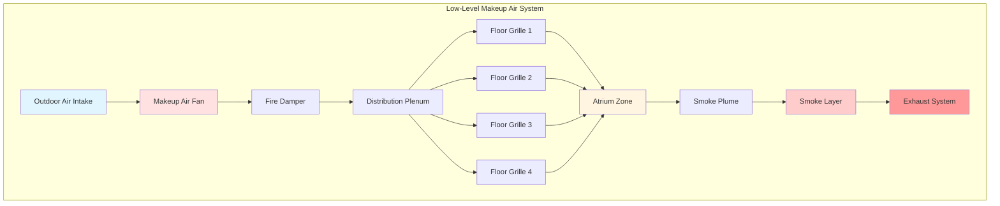

## Makeup Air Fundamentals

Makeup air systems compensate for mass removed by smoke exhaust in atriums, maintaining pressure balance and preventing uncontrolled infiltration. The design must prevent disruption of the smoke plume while delivering sufficient airflow to match exhaust rates. NFPA 92 establishes velocity limits and distribution requirements to ensure makeup air does not compromise smoke layer stratification.

The volumetric flow rate of makeup air must equal or slightly exceed the exhaust rate:

$$Q_{\text{makeup}} = Q_{\text{exhaust}} + Q_{\text{leakage}}$$

where $Q_{\text{leakage}}$ accounts for building envelope infiltration and typically ranges from 5-10% of exhaust flow.

## Velocity Limits and Inlet Location

Makeup air velocity at the inlet controls plume entrainment effects. Excessive velocity creates turbulent mixing that pulls smoke down into the occupied zone, defeating the smoke control objective. NFPA 92 specifies maximum velocities based on inlet height above the floor and distance from the fire plume.

### Maximum Makeup Air Velocities

| Inlet Location | Maximum Velocity | Application Notes |
|----------------|------------------|-------------------|
| Floor level (0-3 ft) | 200 fpm (1.0 m/s) | Direct floor discharge |
| Low wall (3-10 ft) | 400 fpm (2.0 m/s) | Wall grilles, louvers |
| Mid-height (10-20 ft) | 500 fpm (2.5 m/s) | Requires flow analysis |
| Upper level (>20 ft) | 800 fpm (4.0 m/s) | Above smoke layer interface |

The critical design parameter is the ratio of makeup air momentum to plume buoyancy. High-momentum jets can entrain smoke downward, calculated as:

$$\frac{\rho V^2}{g \Delta \rho h} < 0.5$$

where $\rho$ is air density, $V$ is inlet velocity, $g$ is gravitational acceleration, $\Delta \rho$ is density difference between smoke and ambient air, and $h$ is plume height.

## Low-Level Air Supply Systems

Low-level makeup air supply, positioned within 10 feet of the floor, provides optimal performance by minimizing plume interaction. This configuration supplies cool, dense air that naturally stratifies below the smoke layer.



### Distribution Requirements

Makeup air distribution must achieve uniform velocity across the atrium floor to prevent preferential flow paths. The number of inlets is determined by:

$$N_{\text{inlets}} = \frac{Q_{\text{makeup}}}{V_{\text{max}} \cdot A_{\text{inlet}}}$$

where $V_{\text{max}}$ is the maximum allowable velocity and $A_{\text{inlet}}$ is the free area per inlet.

Spacing between inlets should not exceed:

$$S_{\text{max}} = 2 \sqrt{\frac{Q_{\text{inlet}}}{V_{\text{avg}}}}$$

This ensures overlapping velocity profiles without dead zones.

## Plume Entrainment Effects

Makeup air entrainment into the fire plume increases mass flow as the plume rises. The entrainment rate follows:

$$\dot{m}_{\text{plume}} = \dot{m}_{\text{fire}} + C \cdot P \cdot z$$

where $\dot{m}_{\text{fire}}$ is the mass generation rate at the fire source, $C$ is the entrainment coefficient (typically 0.21 kg/m·s for axisymmetric plumes), $P$ is the plume perimeter, and $z$ is the height above the fire.

Makeup air supplied near the plume base increases entrainment, requiring higher exhaust capacity. The recommended minimum distance from makeup air inlet to fire location is:

$$d_{\text{min}} = 5 \sqrt{\frac{Q}{\pi V}}$$

where $Q$ is the inlet flow rate and $V$ is the discharge velocity.

```mermaid
graph TD
    subgraph "Plume Entrainment Zones"
        MA[Makeup Air Inlet<br/>V = 200 fpm] --> CZ[Clear Zone<br/>d > 5√(Q/πV)]
        CZ --> EZ1[Entrainment Zone 1<br/>0-10 ft height]
        EZ1 --> EZ2[Entrainment Zone 2<br/>10-20 ft height]
        EZ2 --> EZ3[Entrainment Zone 3<br/>20-30 ft height]
        EZ3 --> SLI[Smoke Layer Interface<br/>z_interface]

        F[Fire Source<br/>Q_fire] --> EZ1

        EZ1 --> |ṁ₁| EZ2
        EZ2 --> |ṁ₂| EZ3
        EZ3 --> |ṁ₃| SLI

        SLI --> EX[Exhaust Point<br/>Q_exhaust = ṁ₃]
    end

    style MA fill:#e1f5ff
    style F fill:#ff6666
    style CZ fill:#ccffcc
    style SLI fill:#ffcccc
    style EX fill:#ff9999
```

## Temperature Considerations

Makeup air temperature affects smoke layer buoyancy and plume dynamics. Cold outdoor air increases density difference, enhancing stratification but potentially creating discomfort. The temperature differential should satisfy:

$$\Delta T = T_{\text{smoke}} - T_{\text{makeup}} > 40°F$$

For winter conditions, tempering may be necessary to prevent excessive cooling. However, NFPA 92 prohibits heating makeup air above 60°F to maintain adequate buoyancy differential.

The makeup air supply temperature modifies the neutral pressure plane location:

$$z_{\text{NPP}} = \frac{T_{\text{avg}}}{T_{\text{outside}} - T_{\text{inside}}} \cdot H$$

where $H$ is the atrium height. Positioning the neutral pressure plane at mid-height minimizes infiltration and exfiltration effects.

## System Capacity and Fan Selection

Makeup air fan capacity must account for system pressure losses while maintaining flow stability. Total static pressure requirement:

$$\Delta P_{\text{total}} = \Delta P_{\text{duct}} + \Delta P_{\text{damper}} + \Delta P_{\text{grille}} + \Delta P_{\text{hood}}$$

Typical system pressure drops range from 0.5 to 2.0 inches w.g. Fan selection should provide flat pressure-flow characteristics to prevent flow oscillations during smoke control activation.

The fan power requirement is:

$$P_{\text{fan}} = \frac{Q \cdot \Delta P}{6356 \cdot \eta}$$

where $P$ is in horsepower, $Q$ in cfm, $\Delta P$ in inches w.g., and $\eta$ is fan efficiency.

## Design Integration

Makeup air systems integrate with exhaust, compartmentation, and detection systems. Control sequences must ensure makeup air activates simultaneously with or immediately after exhaust to prevent negative pressurization. The recommended activation sequence:

1. Smoke detection triggers system activation
2. Makeup air dampers open (0-5 seconds)
3. Makeup air fans start (5-10 seconds)
4. Exhaust dampers open (10-15 seconds)
5. Exhaust fans start (15-20 seconds)

This staged sequence prevents transient pressure spikes that could compromise smoke barriers or doors.
