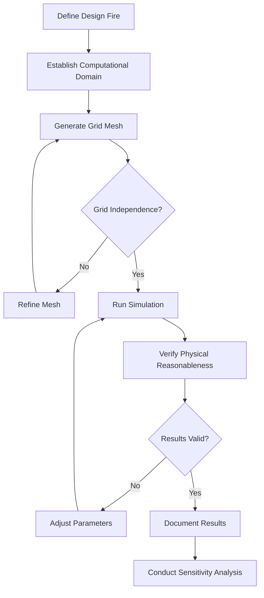
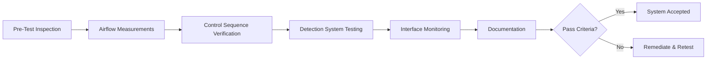
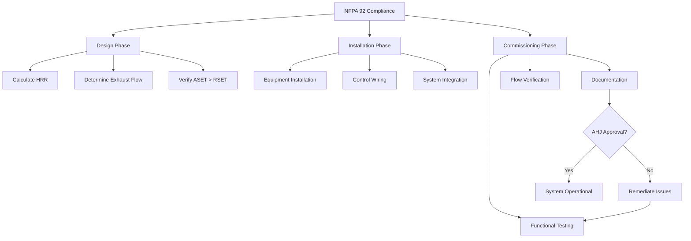

## Overview of NFPA 92 Standard

NFPA 92, Standard for Smoke Control Systems, provides comprehensive design and verification requirements for smoke management in large-volume spaces including atriums. The standard establishes algebraic calculation methods, computational fluid dynamics (CFD) modeling criteria, and acceptance testing protocols to ensure smoke control systems maintain tenable conditions during fire events.

## Design Fire Heat Release Rate

The design fire heat release rate (HRR) forms the foundation of all smoke control calculations. NFPA 92 requires consideration of fuel load, growth rate, and maximum steady-state HRR.

For t-squared fires, the heat release rate follows:

$$Q(t) = \alpha t^2$$

Where:
- $Q(t)$ = heat release rate at time t (kW)
- $\alpha$ = fire growth coefficient (kW/s²)
- $t$ = time from ignition (s)

| Fire Growth Rate | α (kW/s²) | Description |
|------------------|-----------|-------------|
| Slow | 0.00293 | Dense materials, slow ignition |
| Medium | 0.01172 | Wood products, upholstered furniture |
| Fast | 0.0469 | Light furnishings, retail displays |
| Ultra-fast | 0.1876 | Flammable liquids, foam plastics |

## Smoke Layer Interface Height

Maintaining the smoke layer interface above the minimum clear height ensures occupant egress. NFPA 92 requires the interface to remain above the highest walking surface plus 1.83 m (6 ft) minimum.

The smoke layer interface height for unsteady conditions:

$$z_i(t) = H - \left[\frac{3A_s}{\alpha_z}\int_0^t \dot{m}(t')dt'\right]^{1/3}$$

Where:
- $z_i(t)$ = smoke layer interface height at time t (m)
- $H$ = ceiling height (m)
- $A_s$ = atrium floor area (m²)
- $\alpha_z$ = entrainment coefficient (typically 0.10-0.12)
- $\dot{m}(t)$ = mass flow rate into smoke layer (kg/s)

## Exhaust Volumetric Flow Rate

The required exhaust volumetric flow rate must exceed the plume mass flow rate to maintain the design smoke layer position.

For axisymmetric plumes with $z_f < z_i$ (flame height below interface):

$$\dot{V} = 0.071Q_c^{1/3}(z_i)^{5/3} + 0.0018Q_c$$

For axisymmetric plumes with $z_f \geq z_i$ (flame impinging interface):

$$\dot{V} = 0.032Q_c^{3/5}(z_i)^{1/5}$$

Where:
- $\dot{V}$ = volumetric exhaust flow rate (m³/s)
- $Q_c$ = convective heat release rate (kW)
- $z_i$ = smoke layer interface height (m)

The convective heat release rate:

$$Q_c = \chi_c Q$$

Where $\chi_c$ = convective fraction (typically 0.60-0.70 for most fuels).

## ASET vs RSET Analysis

NFPA 92 requires demonstration that Available Safe Egress Time (ASET) exceeds Required Safe Egress Time (RSET) by an appropriate safety margin.

$$ASET > RSET + \text{Safety Factor}$$

ASET represents the time from ignition until untenable conditions develop at the egress level. RSET includes:

$$RSET = t_{det} + t_{alarm} + t_{pre} + t_{travel}$$

Where:
- $t_{det}$ = detection time
- $t_{alarm}$ = alarm notification time
- $t_{pre}$ = pre-movement time (occupant recognition and decision)
- $t_{travel}$ = travel time to exit

## Tenability Criteria

NFPA 92 establishes specific tenability thresholds that must be maintained below the smoke layer interface:

| Parameter | Threshold | Measurement Location |
|-----------|-----------|---------------------|
| Temperature | 60°C (140°F) | At 1.83 m above walking surface |
| Visibility | 10 m (30 ft) | Through smoke layer |
| CO concentration | 1,400 ppm | Time-averaged exposure |
| CO₂ concentration | 5% | Volume fraction |
| O₂ concentration | >12% | Volume fraction |

## Computational Fluid Dynamics Modeling

When algebraic methods prove insufficient for complex geometries, NFPA 92 permits CFD modeling subject to specific requirements.

### CFD Model Requirements

### Grid Resolution Requirements

NFPA 92 Section 5.4 requires characteristic cell dimension:

$$\delta x \leq \frac{D^*}{R^*}$$

Where:
- $\delta x$ = characteristic grid cell size (m)
- $D^* = \left(\frac{Q}{\rho_\infty c_p T_\infty \sqrt{g}}\right)^{2/5}$ = characteristic fire diameter (m)
- $R^* = 4$ to 16 (resolution factor)

For:
- $\rho_\infty$ = ambient air density (kg/m³)
- $c_p$ = specific heat of air (kJ/kg·K)
- $T_\infty$ = ambient temperature (K)
- $g$ = gravitational acceleration (m/s²)

## Acceptance Testing Requirements

NFPA 92 mandates comprehensive acceptance testing to verify installed system performance.

### Functional Testing Protocol

### Required Measurements

| Test Parameter | Acceptance Criteria | Test Method |
|----------------|---------------------|-------------|
| Exhaust flow rate | ±10% of design | Pitot traverse, flow hood |
| Supply flow rate | ±10% of design | Flow station, anemometer |
| Pressure differential | As specified in design | Manometer array |
| System response time | <60 seconds to full activation | Timed sequence |
| Smoke layer interface | Above design height | Smoke candles, visualization |

### Volumetric Flow Verification

Exhaust volumetric flow rate verification at each exhaust point:

$$\dot{V}_{measured} = v_i A_i$$

Where:
- $v_i$ = average velocity at measurement plane (m/s)
- $A_i$ = cross-sectional area (m²)

Total system verification:

$$\sum\dot{V}_{measured} \geq 1.0 \times \dot{V}_{design}$$

## Design Documentation Requirements

NFPA 92 Section 4.1.3 requires comprehensive documentation including:

- Complete algebraic calculations with assumptions clearly stated
- CFD modeling methodology, boundary conditions, and validation against analytical solutions
- Equipment specifications and locations
- Control sequences and failure mode analysis
- Acceptance test procedures and acceptance criteria
- Operations and maintenance manual

## Periodic Testing and Maintenance

Post-acceptance, NFPA 92 requires annual functional testing and quarterly inspection of critical components:

- Exhaust fans and dampers (quarterly visual, annual operational)
- Smoke detectors (annual sensitivity testing per NFPA 72)
- Control panel sequences (annual functional test)
- Supply air systems (annual flow verification)
- Emergency power systems (monthly exercising, annual load testing)

## Code Compliance Verification

## Summary

NFPA 92 establishes rigorous requirements for atrium smoke control design through algebraic methods and CFD modeling. The standard's emphasis on ASET/RSET analysis, precise exhaust flow calculations, and comprehensive acceptance testing ensures smoke control systems perform reliably during fire events. Designers must document all assumptions, verify calculations independently, and coordinate closely with the authority having jurisdiction throughout the design and commissioning process.
