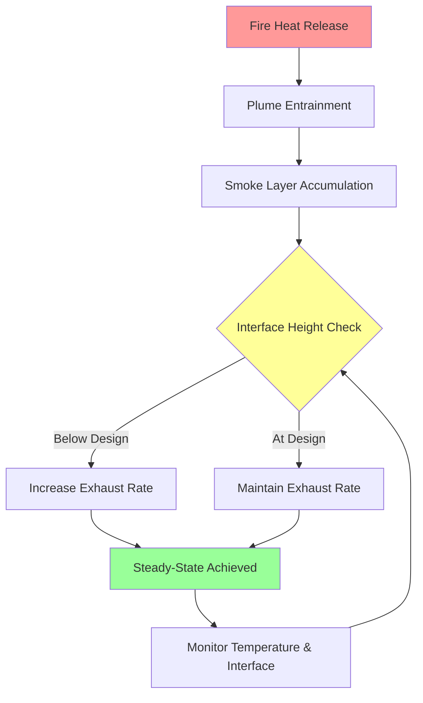
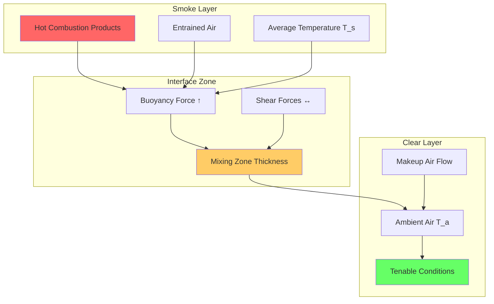

Smoke layer management constitutes the fundamental control strategy for atrium smoke control systems. The primary objective is establishing and maintaining a stable interface between the upper smoke layer and the lower clear layer, preserving tenable conditions for occupant egress and fire department operations.

## Smoke Layer Interface Physics

The smoke layer interface represents a thermal discontinuity where buoyant combustion products meet the cooler ambient air. Interface stability depends on the balance between buoyancy forces driving smoke upward and the shear forces created by exhaust airflow. NFPA 92 defines the design smoke layer interface as the elevation below which the smoke optical density remains below 0.5 per meter.

The interface height must account for:

- Minimum tenable height above the highest occupied level
- Walking surface elevation plus 6 ft minimum clear height
- Balcony projection effects on downward smoke migration
- Temperature-driven interface descent during fire growth

## Smoke Layer Depth Calculation

The design smoke layer depth determines exhaust volumetric flow requirements and system response characteristics. Calculate the smoke layer depth as:

$$z_s = H - z_i$$

where:
- $z_s$ = smoke layer depth (ft)
- $H$ = ceiling height above floor (ft)
- $z_i$ = interface height above floor (ft)

The mass flow rate of smoke into the layer determines the required exhaust rate to maintain steady-state conditions:

$$\dot{m}_{exhaust} = \dot{m}_{plume} + \dot{m}_{makeup}$$

For axisymmetric plumes in the far field, the plume mass flow rate entering the smoke layer is:

$$\dot{m}_{plume} = 0.071 Q_c^{1/3} (z_i - z_f)^{5/3} + 0.0018 Q_c$$

where:
- $\dot{m}_{plume}$ = plume mass flow rate (lb/s)
- $Q_c$ = convective heat release rate (Btu/s)
- $z_f$ = effective fuel elevation (ft)

## Steady-State Exhaust Balance

Achieving steady-state conditions requires precise balance between smoke production and exhaust removal. The system must extract smoke at a rate equal to or slightly exceeding plume entrainment to prevent interface descent.

The volumetric exhaust rate converts from mass flow using the average smoke layer temperature:

$$V_{exhaust} = \frac{\dot{m}_{exhaust}}{\rho_{smoke}}$$

$$\rho_{smoke} = \frac{P}{R T_{avg}}$$

where:
- $V_{exhaust}$ = volumetric exhaust rate (cfm)
- $\rho_{smoke}$ = smoke density (lb/ft³)
- $P$ = atmospheric pressure (lb/ft²)
- $R$ = gas constant for air (53.35 ft·lb/lb·°R)
- $T_{avg}$ = average smoke layer temperature (°R)

## Smoke Layer Depth Design Parameters

| Interface Height (ft) | Ceiling Height (ft) | Layer Depth (ft) | Relative Volume | Design Consideration |
|----------------------|---------------------|------------------|-----------------|---------------------|
| 20 | 40 | 20 | 50% | Minimum acceptable for 2-story atrium |
| 25 | 50 | 25 | 50% | Standard 3-story configuration |
| 30 | 60 | 30 | 50% | 4-story with balconies |
| 35 | 70 | 35 | 50% | 5-story deep smoke reservoir |
| 40 | 80 | 40 | 50% | Large-volume multi-story atrium |

## Tenability Maintenance

Maintaining tenability below the smoke layer interface requires continuous monitoring of three critical parameters:

**Temperature**: The clear layer temperature must remain below 140°F to prevent thermal injury and maintain structural integrity of non-fire-rated glazing systems.

**Visibility**: Optical density below the interface must allow visibility exceeding 30 ft to enable wayfinding and orderly egress.

**Toxicity**: Carbon monoxide concentrations below the interface should remain under 1,400 ppm for the required egress time.

## Smoke Layer Stability Analysis

The Richardson number quantifies interface stability:

$$Ri = \frac{g \Delta T z_s}{T_a u^2}$$

where:
- $Ri$ = Richardson number (dimensionless)
- $g$ = gravitational acceleration (32.2 ft/s²)
- $\Delta T$ = temperature difference across interface (°R)
- $u$ = characteristic velocity at interface (ft/s)
- $T_a$ = ambient temperature (°R)

Interface stability requires $Ri > 1.0$ to prevent catastrophic mixing and interface descent.

## Smoke Filling Time Analysis

The time required for smoke to descend from the ceiling to the design interface height determines available egress time:

$$t_{fill} = \frac{A \int_{z_i}^{H} \rho(z) dz}{\dot{m}_{plume}}$$

For preliminary analysis with uniform density approximation:

$$t_{fill} \approx \frac{A z_s \rho_a}{\dot{m}_{plume}}$$

where:
- $t_{fill}$ = filling time (s)
- $A$ = atrium floor area (ft²)
- $\rho_a$ = ambient air density (lb/ft³)

## Design Smoke Layer Depth Recommendations

| Fire Size (MW) | Design Interface Height (ft) | Minimum Layer Depth (ft) | Exhaust Rate (cfm) |
|----------------|----------------------------|--------------------------|-------------------|
| 2.5 | 20 | 15 | 20,000 - 30,000 |
| 5.0 | 25 | 20 | 40,000 - 60,000 |
| 7.5 | 30 | 25 | 70,000 - 90,000 |
| 10.0 | 35 | 30 | 100,000 - 130,000 |
| 12.5 | 40 | 35 | 140,000 - 170,000 |

These values represent typical ranges for design fires in retail atriums per NFPA 92 guidance. Actual exhaust rates depend on plume characteristics, ceiling geometry, and makeup air configuration.

## Makeup Air Integration

Properly designed makeup air prevents interface disruption while maintaining exhaust system performance. Supply makeup air at low velocity (<500 fpm) remote from the fire plume to avoid disrupting natural stratification. The makeup air volumetric flow rate must equal exhaust flow under steady-state conditions accounting for density differences.

The pressure differential across the smoke layer interface should remain minimal (<0.05 in. w.g.) to prevent forced mixing. Excessive exhaust without adequate makeup air creates negative pressure that draws smoke downward through openings and disrupts layer stability.