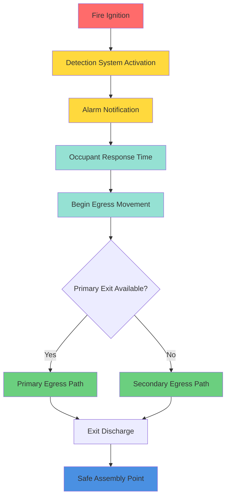
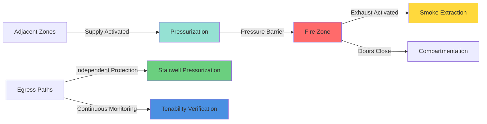

## Overview

Egress protection represents the primary life safety objective of smoke control systems in large volume spaces. The fundamental principle is maintaining tenable conditions within occupied zones and egress paths for sufficient time to allow complete building evacuation. This requires coordinated control of smoke layer descent, temperature limits, visibility requirements, and toxic gas concentrations.

NFPA 92 establishes egress protection as a critical design basis, requiring smoke control systems to maintain a clear layer height above the highest walking surface throughout the required safe egress time (RSET). The design must account for occupant characteristics, travel distances, queuing delays, and decision times.

## Design Objectives

### Tenability Criteria

Tenable conditions in egress paths must satisfy multiple simultaneous requirements:

**Temperature Limits:**
- Maximum air temperature: 60°C (140°F) at head height
- Radiant heat flux: <2.5 kW/m²
- Temperature differential from ambient: <40°C

**Visibility Requirements:**
- Minimum visibility distance: 10-13 m (33-43 ft) for unfamiliar occupants
- Minimum visibility distance: 5 m (16 ft) for familiar occupants
- Light-reflecting signage required at reduced visibility

**Gas Concentration Limits:**
- CO concentration: <1,400 ppm (30-minute exposure)
- CO₂ concentration: <5% by volume
- O₂ concentration: >15% by volume
- Irritant gases: maintain sub-incapacitating levels

### Clear Layer Height

The smoke layer interface must remain above the highest occupied level plus a safety margin:

$$h_{clear} = h_{occ} + h_{safety}$$

Where:
- $h_{clear}$ = required clear layer height (m)
- $h_{occ}$ = highest occupied walking surface elevation (m)
- $h_{safety}$ = safety margin, typically 1.8-2.4 m (6-8 ft)

## Egress Time Analysis

### Required Safe Egress Time (RSET)

The total evacuation time must be calculated comprehensively:

$$t_{RSET} = t_{detect} + t_{alarm} + t_{pre-movement} + t_{travel}$$

Where:
- $t_{detect}$ = detection system activation time (s)
- $t_{alarm}$ = alarm notification time (s)
- $t_{pre-movement}$ = occupant response and decision time (s)
- $t_{travel}$ = physical movement to safe location (s)

### Travel Time Calculation

Egress travel time depends on distance and effective walking speed:

$$t_{travel} = \frac{L_{exit}}{v_{eff}} + t_{queue}$$

Where:
- $L_{exit}$ = travel distance to nearest exit (m)
- $v_{eff}$ = effective walking speed, 0.5-1.2 m/s (s)
- $t_{queue}$ = queuing delay at exits and stairs (s)

### Design Safety Factor

Smoke control activation time must provide adequate safety margin:

$$t_{available} = t_{RSET} \times SF$$

Where:
- $t_{available}$ = time smoke control must maintain tenable conditions (s)
- $SF$ = safety factor, typically 1.5-2.0

## Protection Methods

### Pressurization Systems

Stairwell and corridor pressurization prevents smoke infiltration into egress paths:

| Protection Method | Pressure Differential | Application |
|-------------------|----------------------|-------------|
| Stairwell Pressurization | 12.5-25 Pa (0.05-0.10 in. w.g.) | High-rise buildings |
| Elevator Shaft Pressurization | 25-50 Pa (0.10-0.20 in. w.g.) | Firefighter access |
| Corridor Pressurization | 5-12.5 Pa (0.02-0.05 in. w.g.) | Horizontal exits |
| Vestibule Pressurization | 12.5-37.5 Pa (0.05-0.15 in. w.g.) | Airlock protection |

### Smoke Layer Management

Maintaining clear layer height above egress paths:

**Exhaust-Based Protection:**
- Calculate smoke production rate from design fire
- Size exhaust to maintain layer height
- Account for entrainment and plume mixing
- Provide makeup air to prevent excessive pressure

**Stratification Enhancement:**
- Minimize air velocities near smoke layer interface (<1 m/s)
- Control supply air temperature and location
- Avoid ceiling-mounted supply diffusers in smoke zone
- Use low-level makeup air introduction

### Zoned Protection Strategy

Coordinated smoke control across building zones:

## NFPA 92 Code Requirements

### Design Fire Specification

NFPA 92 Section 5.3 requires determination of design fire heat release rate based on:
- Fuel load characteristics and distribution
- Expected fire growth rate (slow, medium, fast, ultrafast)
- Compartment geometry and ventilation
- Sprinkler system activation and suppression effects

### System Activation and Control

**Automatic Activation Requirements:**
- Smoke detection in fire zone triggers exhaust
- Initiation within 30-60 seconds of detection
- Continuous operation until manual shutdown by fire department
- Manual override capability for fire service

**Monitoring and Supervision:**
- Continuous air velocity monitoring at exhaust inlets
- Pressure differential sensors across barriers
- Smoke detector status monitoring
- System fault annunciation

### Makeup Air Provisions

Makeup air must be provided to:
- Limit building depressurization to prevent backdraft conditions
- Maintain designed pressure differentials across barriers
- Prevent excessive door opening forces (<130 N / 30 lbf)
- Supply sufficient oxygen for combustion completion (reduces incomplete combustion products)

## Design Criteria Summary

| Criterion | Requirement | Basis |
|-----------|-------------|-------|
| Clear Layer Height | Minimum 1.8 m above walking surface | NFPA 92 visibility |
| Smoke Layer Temperature | <200°C at interface | Material integrity |
| Egress Path Temperature | <60°C at 2 m height | Tenability limit |
| Minimum Visibility | 10 m in smoke layer approach | Recognition distance |
| Pressure Differential | 12.5-50 Pa depending on application | NFPA 92 Tables |
| Activation Time | <60 seconds from detection | Life safety margin |
| System Reliability | Supervised and monitored continuously | Fail-safe operation |

## Conclusion

Effective egress protection through smoke control requires rigorous analysis of occupant evacuation characteristics, comprehensive tenability criteria application, and properly sized mechanical systems. Design must account for actual fire dynamics, building geometry, and occupant behavior patterns. The integration of pressurization, exhaust, and compartmentation strategies provides redundant protection layers ensuring occupant safety throughout the evacuation process.
