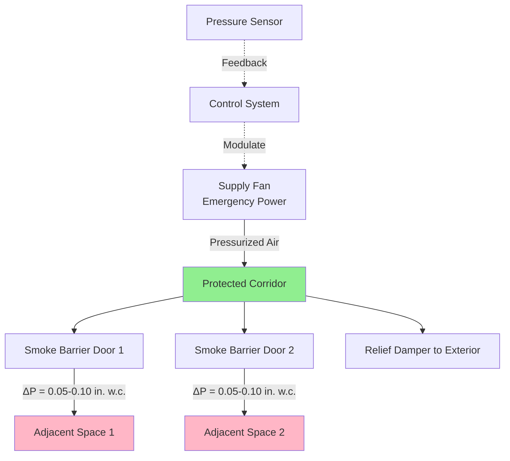
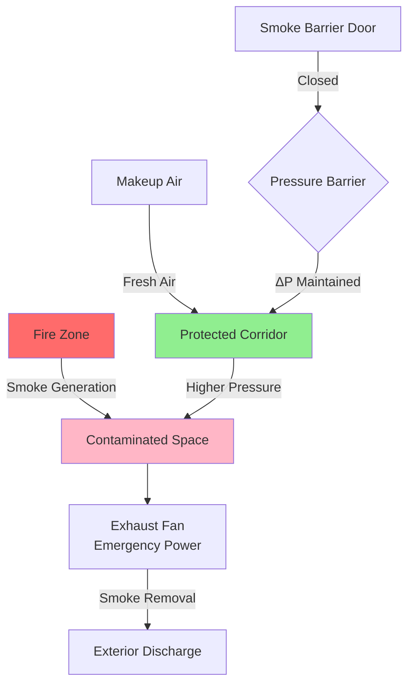

Exit corridors serve as protected pathways for building occupants during fire emergencies. Smoke control systems maintain tenable conditions in these critical egress routes through pressurization, exhaust, or combined strategies that prevent smoke infiltration from adjacent spaces.

## Pressurization Fundamentals

Corridor pressurization creates a positive pressure differential that prevents smoke migration from fire zones into egress paths. The pressure relationship governs smoke movement according to the orifice flow equation.

The volumetric airflow required to maintain pressure differential across smoke barriers:

$$Q = C \cdot A \cdot \sqrt{\frac{2\Delta P}{\rho}}$$

Where:
- $Q$ = volumetric airflow rate (cfm)
- $C$ = flow coefficient (0.65 for doors)
- $A$ = leakage area (ft²)
- $\Delta P$ = pressure differential (lbf/ft²)
- $\rho$ = air density (lbm/ft³)

For temperature-dependent density effects during fire conditions:

$$\rho = \frac{P_b}{R \cdot T}$$

Where $P_b$ is barometric pressure (lbf/ft²), $R$ is the gas constant (53.35 ft·lbf/(lbm·°R)), and $T$ is absolute temperature (°R).

## Design Approaches

### Pressurization Systems

Supply air fans inject conditioned air into the corridor to establish positive pressure. This method requires:

- Dedicated air handling equipment with emergency power
- Relief air paths to adjacent spaces or outdoors
- Pressure monitoring and control systems
- Minimum 0.05 in. w.c. pressure differential (NFPA 92)
- Maximum 0.35 in. w.c. to prevent door opening force issues (IBC)

### Exhaust Systems

Mechanical exhaust removes smoke-contaminated air from adjacent spaces, creating relative positive pressure in the corridor. This approach:

- Extracts smoke at the source
- Requires coordination with building pressurization
- Needs makeup air paths to sustain exhaust rates
- Typically provides 1-2 air changes per hour in protected corridor

## Pressure Requirements

NFPA 92 and IBC establish minimum pressure differentials across smoke barriers:

| Condition | Minimum ΔP | Maximum ΔP | Door Opening Force |
|-----------|------------|------------|-------------------|
| All doors closed | 0.05 in. w.c. | 0.10 in. w.c. | < 30 lbf |
| Single door open | 0.05 in. w.c. | N/A | N/A |
| Design wind load | 0.05 in. w.c. | 0.10 in. w.c. | < 30 lbf |
| Stack effect (winter) | 0.05 in. w.c. | 0.10 in. w.c. | < 30 lbf |

Maximum door opening force per IBC Section 1010.1.3:

$$F_{door} = F_c + K \cdot \left(W \cdot A \cdot \Delta P\right)$$

Where:
- $F_{door}$ = total opening force (lbf)
- $F_c$ = force to overcome closer (5 lbf typical)
- $K$ = geometry factor (1.0 for center-pivoting)
- $W$ = door width (ft)
- $A$ = door height (ft)
- $\Delta P$ = pressure differential (lbf/ft²)

For a standard 3 ft × 7 ft door with 0.10 in. w.c. (5.2 lbf/ft²):

$$F_{door} = 5 + 1.0 \times (3 \times 7 \times 5.2) = 5 + 109.2 = 114.2 \text{ lbf}$$

This exceeds the 30 lbf limit, necessitating pressure relief or lower design pressures.

## Smoke Barrier Components

Corridor protection requires coordinated architectural and mechanical systems:

- **Self-closing doors** with positive latching at all smoke barrier penetrations
- **Fire/smoke dampers** in HVAC ductwork penetrating barriers
- **Sealed construction** to limit uncontrolled leakage paths
- **Pressure relief dampers** to prevent excessive pressure buildup
- **Differential pressure sensors** for continuous monitoring

Door leakage area typically ranges from 0.25 to 0.50 ft² per door at rated pressure differentials. Total corridor leakage includes:

$$A_{total} = A_{doors} + A_{construction} + A_{dampers}$$

## Airflow Calculations

Required supply airflow for pressurization with $n$ doors:

$$Q_{supply} = n \cdot C \cdot A_{door} \cdot \sqrt{\frac{2\Delta P}{\rho}} + Q_{construction}$$

For a corridor with 4 smoke barrier doors, each with 0.35 ft² leakage, target 0.08 in. w.c. (16.64 lbf/ft²), and construction leakage of 200 cfm:

$$Q_{supply} = 4 \times 0.65 \times 0.35 \times \sqrt{\frac{2 \times 16.64}{0.075}} + 200$$

$$Q_{supply} = 0.91 \times \sqrt{444} + 200 = 0.91 \times 21.1 + 200 = 219 \text{ cfm}$$

## Testing Requirements

NFPA 92 mandates performance testing to verify:

- Pressure differential across all smoke barriers with doors closed
- Pressure differential maintained with one door open
- Door opening forces at maximum design pressure
- System activation sequence and timing
- Airflow measurements at supply and relief points
- Alarm and monitoring system functionality

Test frequency per NFPA 92:
- Initial acceptance testing upon installation
- Annual functional testing of all components
- Five-year performance verification with pressure measurements

## System Integration

Exit corridor smoke control interfaces with:

- Fire alarm systems for activation signals
- Stairwell pressurization systems to avoid competing pressures
- HVAC systems for shutdown or coordination modes
- Building automation systems for status monitoring
- Emergency power distribution for continuous operation

Proper coordination prevents pressure conflicts that compromise protection effectiveness. Pressure cascade design ensures higher pressure in corridors than adjacent spaces, and highest pressure in stairwells.

