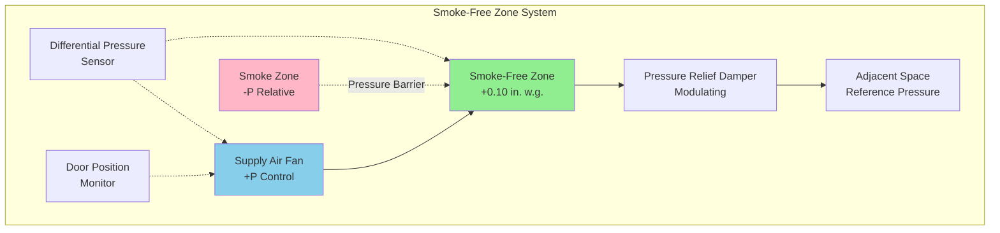
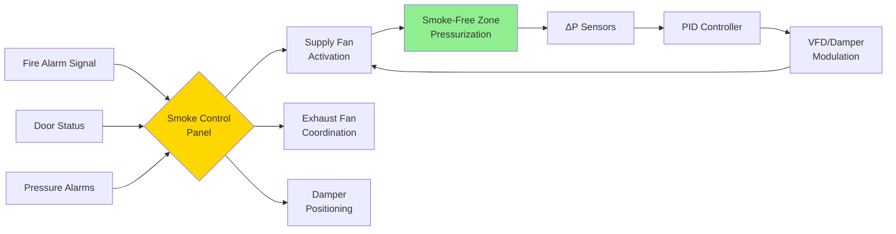

## Overview

Smoke-free areas provide protected spaces within buildings where occupants can safely remain during fire events or complete egress without smoke exposure. These zones rely on positive pressurization to prevent smoke infiltration, stringent compartmentation, and continuous monitoring to maintain tenable conditions throughout emergency operations.

## Fundamental Pressurization Principles

The creation of smoke-free zones depends on maintaining sufficient pressure differential across boundaries to prevent smoke migration from adjacent spaces. The pressure relationship follows basic fluid mechanics principles where airflow through openings is governed by:

$$Q = C \cdot A \cdot \sqrt{2 \cdot \Delta P / \rho}$$

Where:
- $Q$ = airflow rate (m³/s or cfm)
- $C$ = flow coefficient (typically 0.6-0.7 for doors)
- $A$ = leakage area (m² or ft²)
- $\Delta P$ = pressure differential (Pa or in. w.g.)
- $\rho$ = air density (kg/m³ or lb/ft³)

The minimum pressure differential required to prevent smoke infiltration is:

$$\Delta P_{min} = P_{stack} + P_{wind} + P_{HVAC} + P_{safety}$$

Where individual components account for stack effect, wind forces, mechanical system impacts, and safety margins.

## NFPA 92 Pressure Requirements

NFPA 92 establishes minimum pressure differentials for smoke-free zones based on occupancy classification and boundary construction:

| Zone Type | Minimum Pressure | Maximum Pressure | Application |
|-----------|-----------------|------------------|-------------|
| Stairwells | 0.10 in. w.g. (25 Pa) | 0.35 in. w.g. (87 Pa) | Door opening forces |
| Elevator shafts | 0.15 in. w.g. (37 Pa) | 0.50 in. w.g. (125 Pa) | Vertical smoke migration |
| Refuge areas | 0.05 in. w.g. (12.5 Pa) | 0.25 in. w.g. (62 Pa) | Accessible egress |
| Areas of rescue | 0.08 in. w.g. (20 Pa) | 0.30 in. w.g. (75 Pa) | Extended occupancy |

Maximum pressure limits prevent excessive door opening forces that impede egress. The maximum allowable door opening force is 30 lbf (133 N) under NFPA 101.

## Zone Configuration and Airflow Paths

The diagram illustrates the pressure relationship between protected and unprotected spaces. Supply air maintains positive pressure while relief dampers prevent over-pressurization during door closure.

## Airflow Requirements and Calculations

The supply airflow required to maintain pressurization depends on construction leakage and door opening scenarios:

### Leakage Flow Method

For sealed construction with closed doors:

$$Q_{leak} = \sum (A_{leak,i} \cdot C_i \cdot \sqrt{2 \cdot \Delta P / \rho})$$

Typical leakage areas per NFPA 92:
- Tight construction: 0.0003 ft²/ft² of surface area
- Average construction: 0.0006 ft²/ft² of surface area
- Loose construction: 0.0012 ft²/ft² of surface area

### Door Open Compensation

When doors open to smoke zones, additional airflow prevents smoke infiltration:

$$Q_{door} = A_{door} \cdot V_{min}$$

Where $V_{min}$ is the minimum velocity through the door opening (typically 200-300 fpm or 1-1.5 m/s per NFPA 92).

For a standard 3 ft × 7 ft (0.91 m × 2.13 m) door:

$$Q_{door} = 21 \text{ ft}^2 \times 250 \text{ fpm} = 5,250 \text{ cfm (2,475 L/s)}$$

## Envelope Sealing Requirements

Smoke-free zone integrity depends on comprehensive compartmentation:

### Construction Elements

- **Fire-rated assemblies**: Minimum 1-hour rating for smoke barriers, 2-hour rating for refuge areas
- **Penetration sealing**: All through-penetrations sealed with fire-rated materials
- **Door assemblies**: Self-closing devices, gasketing, and maximum 0.125-inch (3 mm) undercut
- **Ductwork provisions**: Fire/smoke dampers at all barrier penetrations

### Leakage Testing

Pre-functional testing verifies envelope tightness using:

1. **Blower door testing**: Measures total compartment leakage at 0.10 in. w.g. (25 Pa)
2. **Tracer gas testing**: Identifies specific leakage paths
3. **Visual smoke testing**: Confirms gasket and seal effectiveness

Target leakage rates should not exceed 0.30 cfm/ft² (1.5 L/s·m²) of envelope area at test pressure.

## Pressurization System Components

### Control Sequences

The pressurization system operates through the following sequence:

1. **Activation**: Fire alarm system initiates smoke control mode
2. **Positioning**: Dampers move to smoke control positions within 60 seconds
3. **Fan startup**: Supply fans energize and ramp to design speed
4. **Pressure establishment**: System reaches target pressure within 30 seconds of fan activation
5. **Modulation**: PID control maintains pressure within ±0.02 in. w.g. (±5 Pa) setpoint

## Testing and Commissioning Requirements

NFPA 92 mandates comprehensive verification of smoke-free zone performance:

### Functional Testing Protocol

| Test Phase | Parameter | Acceptance Criteria |
|------------|-----------|---------------------|
| Static pressure | Differential pressure | Within ±0.02 in. w.g. of setpoint |
| Door opening force | Maximum force | ≤30 lbf (133 N) |
| Pressure recovery | Time to re-establish | ≤10 seconds after door closure |
| System response | Activation time | ≤60 seconds from alarm signal |
| Pressure stability | Drift over 1 hour | ≤±0.01 in. w.g. (±2.5 Pa) |
| Standby power | Transfer time | ≤10 seconds, maintain full operation |

### Multi-Door Opening Scenarios

Testing must verify pressure maintenance during simultaneous door operations representing maximum expected egress flow. For stairwells, this typically requires testing with every third floor door open simultaneously.

## Areas of Rescue Assistance Design

Areas of rescue assistance serve occupants unable to use stairs during evacuation. Design requirements include:

- **Location**: Direct access to exit stairway
- **Size**: Minimum 30 inches × 48 inches (760 mm × 1220 mm) clear floor space per occupant
- **Communication**: Two-way communication system to fire command center
- **Identification**: Illuminated signage meeting NFPA 170 requirements
- **Pressurization**: Maintained at +0.08 in. w.g. (20 Pa) minimum
- **Accessibility**: Compliant with ICC A117.1 standards

## Standby Power Integration

Smoke-free area pressurization systems require standby power with:

- **Transfer time**: Maximum 10 seconds to full system operation
- **Capacity**: Minimum 2-hour operation at design conditions
- **Priority loading**: Smoke control systems prioritized in load shed scenarios
- **Monthly testing**: Automatic transfer and load verification

System performance under standby power must meet identical pressure maintenance criteria as normal operation.

## Monitoring and Alarm Provisions

Continuous system monitoring reports status to the fire command center:

- **Pressure differential**: Real-time display with high/low alarms
- **Fan status**: Run indication and failure alarms
- **Door position**: Status of doors in smoke barriers
- **Damper position**: Confirmation of smoke control positions
- **Power status**: Normal/emergency power indication

All alarm conditions must annunciate both locally and at the fire command center with distinct visual and audible indicators.

