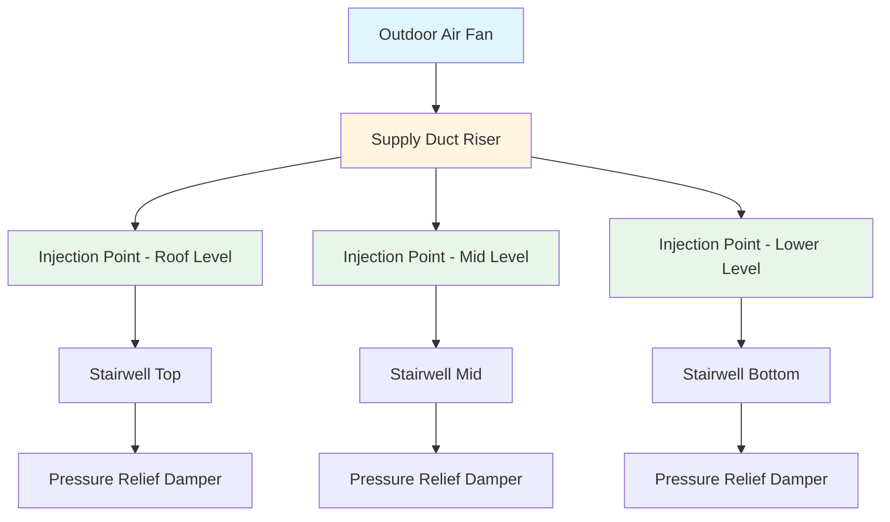
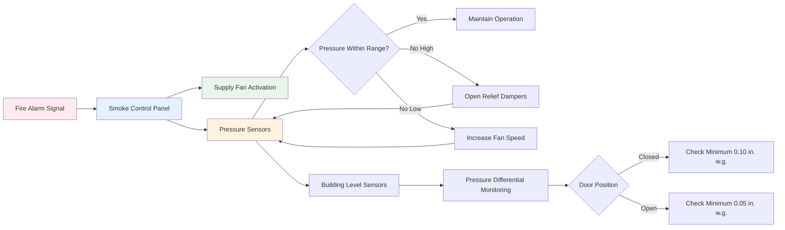

## System Overview

Stairwell pressurization creates a positive pressure differential between the protected stairwell and adjacent building spaces, preventing smoke infiltration during fire events. This mechanical smoke control method maintains tenable egress conditions by supplying outdoor air to the stairwell shaft, creating an outward airflow barrier at doorways.

The system must balance competing requirements: sufficient pressure to prevent smoke migration while maintaining door opening forces within code limits. Design complexity increases with building height, multiple simultaneous door openings, and stack effect considerations.

## Pressure Differential Requirements

NFPA 92 and IBC establish minimum and maximum pressure differentials to ensure effective smoke control without compromising egress:

| Condition | Minimum Pressure | Maximum Pressure | Notes |
|-----------|------------------|------------------|-------|
| All doors closed | 0.10 in. w.g. (25 Pa) | 0.35 in. w.g. (87 Pa) | Design pressure differential |
| Single door open | 0.05 in. w.g. (12.5 Pa) | N/A | Minimum at building level farthest from open door |
| Door opening force | N/A | 30 lbf (133 N) | Maximum force to initiate opening per IBC |

The pressure differential across a closed stairwell door is calculated using the flow equation:

$$Q = C \cdot A \cdot \sqrt{2 \cdot \Delta P / \rho}$$

Where:
- $Q$ = airflow through door gaps (cfm)
- $C$ = flow coefficient (typically 0.65 for door assemblies)
- $A$ = leakage area (ft²)
- $\Delta P$ = pressure differential (lbf/ft²)
- $\rho$ = air density (lbm/ft³)

## Door Opening Force Analysis

The force required to open a stairwell door against pressurization is critical for occupant egress. The relationship between pressure differential and door opening force is:

$$F = \Delta P \cdot A_{door} \cdot d_c / W$$

Where:
- $F$ = door opening force (lbf)
- $\Delta P$ = pressure differential (lbf/ft²)
- $A_{door}$ = door area (ft²)
- $d_c$ = distance from door hinge to center of pressure (ft)
- $W$ = door width (ft)

For a standard 3 ft × 7 ft door with pressure center at 1.5 ft from hinge:

$$F = \Delta P \cdot 21 \text{ ft}^2 \cdot 1.5 \text{ ft} / 3 \text{ ft} = 10.5 \cdot \Delta P$$

At maximum design pressure of 0.35 in. w.g. (3.65 lbf/ft²), the opening force reaches approximately 38 lbf, exceeding the 30 lbf code limit. This necessitates pressure relief mechanisms or barometric dampers.

## Supply Air Requirements

The supply fan must deliver sufficient airflow to maintain pressure differential under all door opening scenarios. The required airflow consists of leakage flow through closed doors plus volumetric flow through open doors.

For closed door leakage:

$$Q_{leak} = \sum_{i=1}^{n} C_i \cdot A_i \cdot \sqrt{2 \cdot \Delta P_i / \rho}$$

Where $n$ = number of floors with closed doors.

For open door flow at the neutral pressure plane:

$$Q_{open} = A_{door} \cdot v_{avg}$$

Where $v_{avg}$ = average velocity through doorway, typically 200-400 fpm to maintain smoke barrier.

Total supply airflow:

$$Q_{total} = Q_{leak} + Q_{open} + Q_{stack}$$

The stack effect term $Q_{stack}$ accounts for temperature-induced pressure differences in tall buildings.

## Multiple Injection Strategy

In high-rise buildings, single-point injection at the stairwell top creates excessive pressures at lower levels due to cumulative air column weight. Multiple injection points distribute supply air vertically, maintaining uniform pressure differentials.

Injection point spacing typically ranges from 10 to 20 floors, with pressure monitoring at each level to modulate dampers or variable speed drives. The airflow distribution is calculated by:

$$Q_i = A_{leak,i} \cdot K \cdot \sqrt{\Delta P_{target}}$$

Where $Q_i$ = injection airflow at level $i$ and $K$ = empirical leakage coefficient.

## System Control Architecture

The control sequence activates upon fire alarm system detection, starting the supply fan and monitoring pressure differentials at representative building levels. Pressure relief dampers or variable frequency drives modulate to maintain design pressures as doors open and close during evacuation.

## Design Considerations

**Leakage Area Calculation**: Door assembly leakage varies significantly with construction quality. Conservative design assumes 0.01 to 0.02 ft² per door based on gap perimeter and clearance dimensions.

**Stack Effect Impact**: Temperature differential between stairwell and building creates additional pressure forces. In winter, cold stairwells experience stack effect pressures up to 0.10 in. w.g. per 100 ft of height, requiring compensation in fan sizing.

**Vestibule Configuration**: Double-door vestibules at stairwell entrances reduce airflow losses during door operation, improving pressure maintenance with fewer relief mechanisms.

**Testing and Commissioning**: Field verification must confirm pressure differentials under all door opening combinations specified by NFPA 92, typically single door open and two doors open simultaneously at worst-case locations.

## Pressure Relief Methods

When stairwell pressure exceeds maximum thresholds, relief mechanisms prevent excessive door forces:

- **Barometric dampers**: Passive devices that open at preset pressure, releasing excess air to building or outdoors
- **Motorized relief dampers**: Actively controlled based on pressure sensor feedback
- **Variable frequency drives**: Modulate supply fan speed to match airflow demand
- **Pressure independent control**: Combination of VFD and relief dampers for optimal response

The selection depends on building height, door opening scenarios, and control system sophistication. VFD-based systems provide superior performance but require complex programming and commissioning.

## Performance Validation

Acceptance testing per NFPA 92 Annex E verifies:

1. Minimum pressure differential with all doors closed at each floor
2. Maximum door opening force at highest pressure location
3. Minimum pressure differential with single door open at worst-case floor
4. Pressure differential with multiple doors open per design scenario
5. System response time from fire signal to achieving design pressure

Testing typically reveals 10-20% deviation from design calculations, necessitating fan speed adjustment or relief damper calibration to achieve code compliance.
