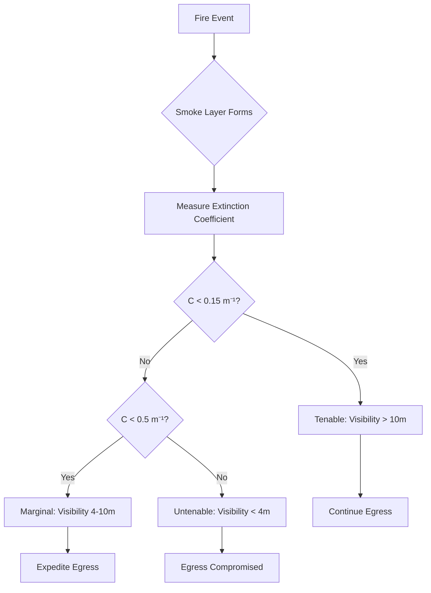
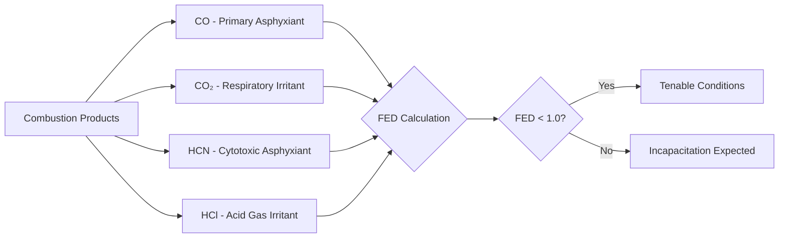

## Overview

Tenable conditions represent the environmental parameters within which building occupants can safely egress during a fire event. Smoke control systems must maintain these conditions throughout the Available Safe Egress Time (ASET) to ensure occupant survival. NFPA 92 establishes the engineering framework for quantifying tenability limits based on visibility, temperature, and toxic gas concentrations.

## Visibility Requirements

Visibility through smoke is the most critical factor for successful egress. Occupants require sufficient visual range to identify exit paths, navigate obstacles, and maintain orientation during evacuation.

### Optical Density and Extinction Coefficient

The relationship between smoke concentration and visibility is governed by the extinction coefficient:

$$S = \frac{C \cdot L}{log_{10}(10)} = 2.303 \cdot C \cdot L$$

Where:
- $S$ = Visibility distance (m)
- $C$ = Extinction coefficient (m⁻¹)
- $L$ = Path length through smoke (m)

### NFPA 92 Visibility Criteria

| Visibility Distance | Extinction Coefficient | Tenability Status | Application |
|---------------------|------------------------|-------------------|-------------|
| > 13 m (42 ft) | < 0.1 m⁻¹ | Highly Tenable | Large spaces, unfamiliar occupants |
| 10 m (33 ft) | 0.15 m⁻¹ | Tenable | General egress requirement |
| 5 m (16 ft) | 0.3 m⁻¹ | Marginal | Familiar occupants, simple paths |
| < 4 m (13 ft) | > 0.5 m⁻¹ | Untenable | Egress failure threshold |

## Temperature Limits

Thermal exposure affects tenability through direct tissue damage, respiratory system burns, and hyperthermia. Temperature limits vary with exposure duration and relative humidity.

### Radiant Heat Flux

$$q_{rad} = \varepsilon \cdot \sigma \cdot (T_g^4 - T_s^4)$$

Where:
- $q_{rad}$ = Radiant heat flux (kW/m²)
- $\varepsilon$ = Emissivity of gas layer
- $\sigma$ = Stefan-Boltzmann constant (5.67 × 10⁻¹¹ kW/m²·K⁴)
- $T_g$ = Gas temperature (K)
- $T_s$ = Surface temperature (K)

### Convective Heat Exposure

The Fractional Effective Dose (FED) for heat exposure:

$$FED_{heat} = \sum_{t=0}^{t_{final}} \frac{\Delta t}{t_{limit}(T)}$$

| Temperature | Exposure Time to Incapacitation | Tenability Criteria |
|-------------|--------------------------------|---------------------|
| 60°C (140°F) | > 30 minutes | Tenable for extended egress |
| 80°C (176°F) | 6-8 minutes | Marginal, rapid egress required |
| 100°C (212°F) | 2-3 minutes | Near untenable threshold |
| 120°C (248°F) | < 1 minute | Untenable, respiratory damage |

## Toxic Gas Concentration Limits

Combustion products produce incapacitating and lethal gases. Carbon monoxide (CO) and carbon dioxide (CO₂) are the primary asphyxiants, while hydrogen cyanide (HCN) and hydrogen chloride (HCl) are rapidly toxic at lower concentrations.

### Fractional Effective Dose for Toxicity

$$FED_{gas} = \sum_{t=0}^{t_{final}} \frac{C_{gas} \cdot \Delta t}{C_{gas,limit} \cdot t_{limit}}$$

### Carbon Monoxide Tenability

Carbon monoxide impairs oxygen delivery by forming carboxyhemoglobin (COHb):

$$COHb(\%) = 3.317 \times 10^{-5} \cdot [CO]^{1.036} \cdot t^{0.8}$$

Where:
- $COHb$ = Carboxyhemoglobin percentage
- $[CO]$ = CO concentration (ppm)
- $t$ = Exposure time (minutes)

| CO Concentration | Exposure Duration | Physiological Effect | Tenability |
|------------------|-------------------|----------------------|------------|
| < 100 ppm | 60 minutes | Minimal effect | Tenable |
| 400 ppm | 30 minutes | Headache, reduced cognitive function | Marginal |
| 1,000 ppm | 10 minutes | Confusion, impaired motor control | Near untenable |
| 1,400 ppm | 5 minutes | Collapse, incapacitation | Untenable |
| > 3,000 ppm | < 3 minutes | Rapid incapacitation | Lethal threshold |

### Additional Toxic Gases

| Gas | Incapacitating Concentration | Exposure Time | NFPA 92 Limit |
|-----|------------------------------|---------------|---------------|
| CO₂ | 5% (50,000 ppm) | 5-10 minutes | Monitor, synergistic with CO |
| HCN | 150 ppm | 10 minutes | Use combined FED approach |
| HCl | 1,000 ppm | 5 minutes | Irritant, not primary concern |
| O₂ depletion | < 15% O₂ | 5 minutes | Hypoxia risk in sealed spaces |

## Available Safe Egress Time (ASET)

ASET represents the time interval between fire ignition and the onset of untenable conditions at critical egress locations.

$$ASET = min(t_{visibility}, t_{temperature}, t_{toxicity})$$

### Required Safe Egress Time (RSET)

For safe egress, ASET must exceed RSET with an appropriate safety margin:

$$ASET \geq SF \cdot RSET$$

Where:
- $SF$ = Safety factor (typically 1.5 to 2.0)
- $RSET$ = Detection time + Pre-movement time + Travel time

```mermaid
gantt
    title Egress Timeline Analysis
    dateFormat X
    axisFormat %s

    section Fire Development
    Ignition           :0, 1
    Detection          :1, 60
    Alarm Activation   :60, 90

    section Occupant Response
    Pre-movement       :90, 210
    Travel to Exit     :210, 450

    section Tenability
    ASET Window        :0, 600
    Visibility Limit   :milestone, 520
    Temperature Limit  :milestone, 580
    CO Limit           :milestone, 600
    RSET Complete      :milestone, 450
```

## Design Considerations

Smoke control systems must maintain tenable conditions above the occupied zone:

1. **Smoke Layer Interface Height**: Maintain clear height of 1.8 m (6 ft) minimum above highest egress path
2. **Mass Flow Rate Control**: Limit smoke layer descent velocity to < 0.1 m/s
3. **Makeup Air Temperature**: Prevent thermal destratification by limiting supply air velocity
4. **Purge Capability**: Design for post-egress firefighting operations (not tenability-driven)

## Engineering Approach

Calculate tenability at critical design locations using Computational Fluid Dynamics (CFD) or zone modeling:

$$\frac{dT}{dt} = \frac{\dot{Q} - \dot{m}_{out} \cdot c_p \cdot (T - T_\infty)}{m \cdot c_p}$$

Verify that all tenability criteria remain satisfied throughout the ASET period at the most vulnerable egress locations, typically at maximum travel distance from exits and at occupant breathing height (1.5 m).
