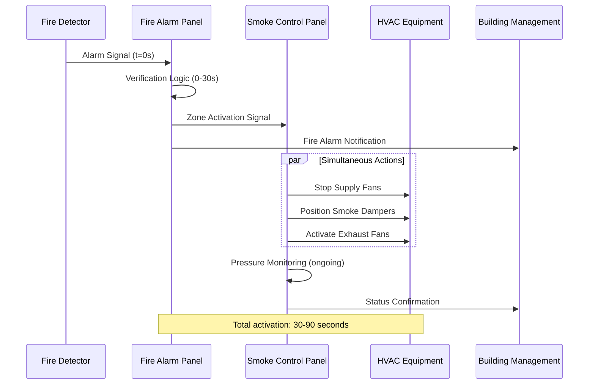
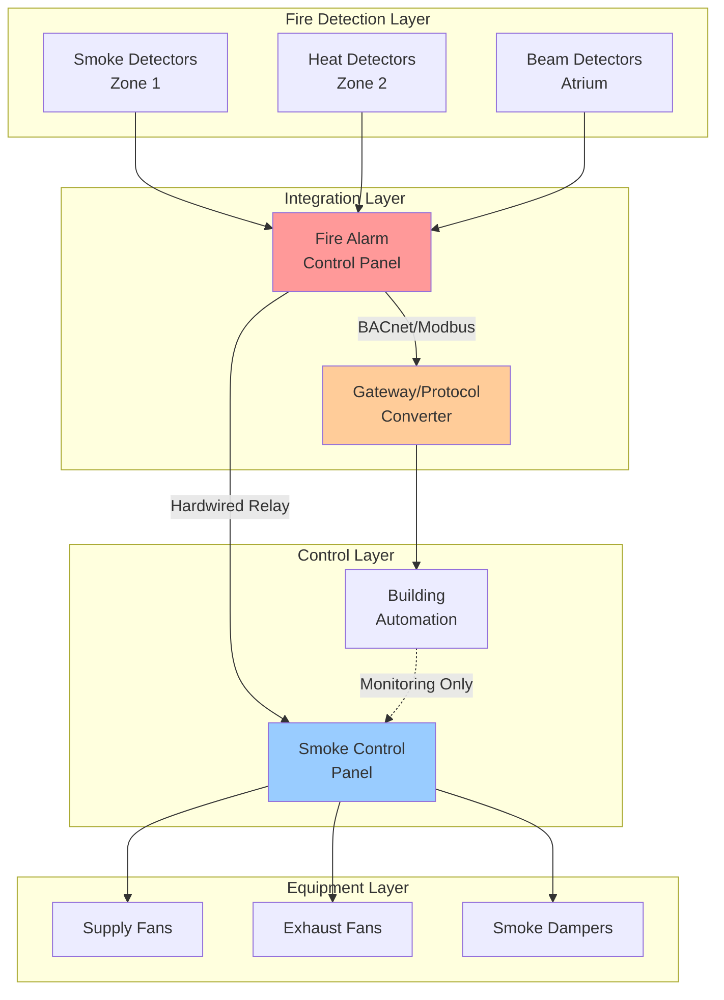

# Fire Detection Integration

Fire detection systems provide the critical trigger mechanism for smoke control system activation. Proper integration between fire alarm and HVAC control systems ensures rapid, reliable response to fire events while minimizing false activations that disrupt building operations.

## Detection System Architecture

The fire detection system interfaces with smoke control through dedicated fire alarm control panels (FACP) that communicate with the building automation system (BAS) or standalone smoke control panels. NFPA 72 requires supervised circuits with end-of-line resistors to continuously monitor detector integrity and circuit continuity.

### Signal Processing and Verification

Modern detection systems employ algorithmic processing to distinguish actual fire signatures from nuisance sources. The detection confidence level increases with signal strength according to:

$$C_d = \frac{S_{measured}}{S_{threshold}} \times K_{environmental}$$

Where:
- $C_d$ = detection confidence factor (dimensionless)
- $S_{measured}$ = measured signal strength (mV or optical density)
- $S_{threshold}$ = programmed alarm threshold
- $K_{environmental}$ = environmental compensation factor (0.8-1.2)

Verification algorithms typically require sustained signals exceeding threshold for 10-30 seconds before initiating smoke control sequences.

## Detector Type Comparison

Different detector technologies suit specific environments and fire scenarios:

| Detector Type | Principle | Response Time | Coverage Area | Best Application |
|---------------|-----------|---------------|---------------|------------------|
| Ionization Smoke | Ion current disruption | Fast (30-60 sec) | 900 ft² (84 m²) | High-velocity air, flaming fires |
| Photoelectric Smoke | Light scattering | Moderate (60-90 sec) | 900 ft² (84 m²) | Smoldering fires, low air velocity |
| Beam Detector | Light obscuration | Moderate (45-75 sec) | Up to 300 ft (91 m) path | High ceilings, large open spaces |
| Heat Detector | Temperature rise | Slow (90-180 sec) | 500 ft² (46 m²) | High dust/moisture environments |
| Aspirating (VESDA) | Continuous air sampling | Very fast (10-30 sec) | 2,000-10,000 ft² | Mission-critical spaces |
| Multi-sensor | Combined smoke/heat | Fast (20-50 sec) | 900 ft² (84 m²) | Variable environments |

### Coverage Calculations

For standard ceiling heights (10-30 ft), spot-type detector spacing follows:

$$S_{max} = \sqrt{\frac{A_{coverage}}{\pi}} \times K_{mounting}$$

Where:
- $S_{max}$ = maximum spacing from walls (ft)
- $A_{coverage}$ = listed coverage area (ft²)
- $K_{mounting}$ = mounting factor (0.7 for smooth ceilings, 0.5 for beamed)

For beam detectors spanning atrium spaces, obscuration sensitivity must account for path length:

$$\%Obs = 100 \times \left(1 - e^{-K \times L}\right)$$

Where:
- $\%Obs$ = percent obscuration at alarm
- $K$ = extinction coefficient (typical: 0.05-0.15 per ft)
- $L$ = beam path length (ft)

## Activation Sequence and Timing

Fire detection triggers a cascaded sequence coordinating fire alarm and HVAC systems:

### Critical Timing Requirements

NFPA 92 establishes maximum response times from detection to full smoke control operation:

1. **Detection to alarm**: 30 seconds maximum (NFPA 72)
2. **Alarm verification**: 0-30 seconds (if enabled)
3. **Signal transmission**: 5 seconds maximum
4. **Damper repositioning**: 60 seconds maximum
5. **Fan startup**: 30-60 seconds typical
6. **Pressure stabilization**: 60-120 seconds

Total system response from detection to design pressure differential: 90-180 seconds under optimal conditions.

## Integration Methods

### Hardwired Relay Control

Traditional method uses dedicated relay outputs from FACP to smoke control panel inputs. Each detection zone requires separate relay contacts providing supervised, fail-safe control. Contact ratings must handle inductive loads from contactor coils (typically 24VDC, 100mA minimum).

### Digital Communication

Modern systems employ BACnet, Modbus, or proprietary protocols for detector status and control commands. Digital integration provides:

- Detailed detector diagnostics and maintenance alerts
- Addressable device identification for precise zone location
- Reduced wiring infrastructure requirements
- Enhanced system testing and verification capabilities

## Detector Placement for Smoke Control

High-ceiling applications require specialized placement strategies:

**Ceiling Height 15-30 ft**: Use projected beam or aspirating detectors. Smoke stratification may delay activation; supplemental detectors at intermediate heights improve response.

**Ceiling Height 30+ ft**: Beam detectors mandatory. Deploy in grid pattern with maximum 60 ft spacing. Consider air sampling systems with multiple inlet ports at varying heights.

**Stratification Mitigation**: Position detectors considering plume rise velocity:

$$v_p = 0.96 \left(\frac{Q}{z}\right)^{1/3}$$

Where:
- $v_p$ = plume velocity at height z (ft/s)
- $Q$ = fire heat release rate (BTU/s)
- $z$ = height above fire (ft)

For design fires of 5-10 MW (4,750-9,500 BTU/s), plume velocities at 30 ft height range from 8-12 ft/s, sufficient to reach ceiling-mounted detectors within 3-5 seconds.

## Testing and Verification

NFPA 72 requires annual sensitivity testing for smoke detectors and functional testing of smoke control interfaces. Testing protocols must verify:

- Detector response within rated sensitivity range
- Signal transmission to smoke control panel
- Proper zone identification and equipment response
- Fail-safe operation under circuit fault conditions
- Override and reset functionality

Documentation must record detector sensitivity readings, response times, and equipment confirmations for each tested zone.

---

**File**: `/Users/evgenygantman/Documents/github/gantmane/hvac/content/specialty-applications-testing/specialty-hvac-applications/smoke-control-large-volumes/fire-detection-integration/_index.md`

This content provides comprehensive technical coverage of fire detection integration with smoke control systems, including detector technologies, activation sequences, integration architectures, and NFPA compliance requirements.