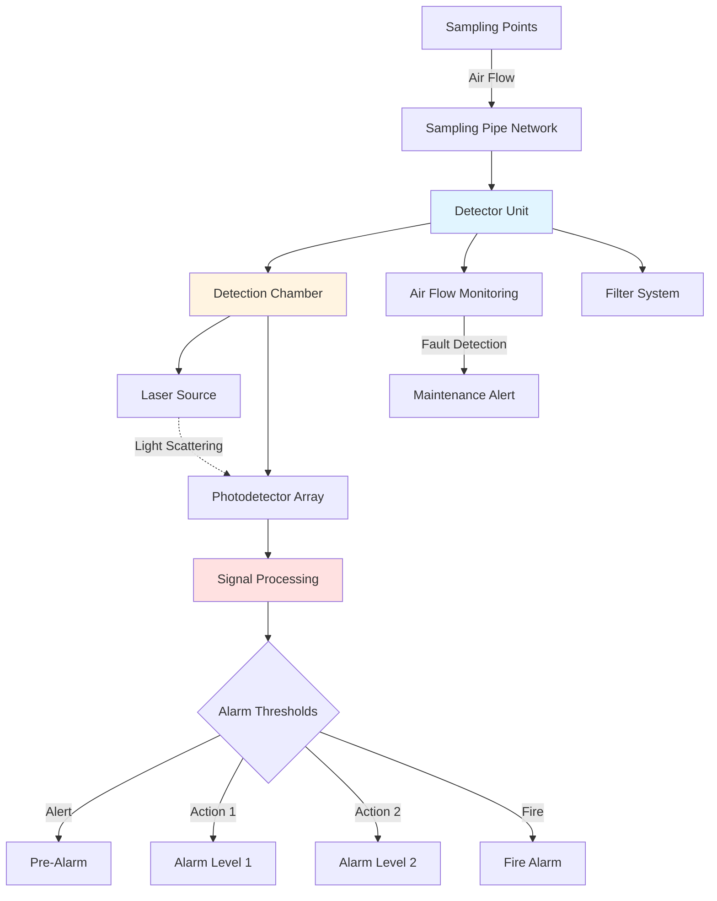
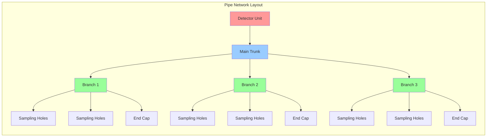

## Aspirating Smoke Detection Technology

Aspirating smoke detection (ASD) systems actively draw air samples through a network of sampling pipes to a central detection chamber. These systems provide the earliest possible warning of fire conditions by detecting smoke particles at concentrations far below conventional point detectors. VESDA (Very Early Smoke Detection Apparatus) represents the most recognized technology in this category.

### Detection Principle

Air sampling systems operate on nephelometry or light scattering principles. Air drawn through the sampling network passes through a laser detection chamber where smoke particles scatter light onto photodetectors. The measured obscuration correlates to particle concentration.

The relationship between obscuration and smoke concentration follows:

$$I = I_0 e^{-\alpha L}$$

Where:
- $I$ = transmitted light intensity
- $I_0$ = incident light intensity
- $\alpha$ = extinction coefficient (function of particle size and concentration)
- $L$ = optical path length

Detection sensitivity is quantified in percent obscuration per meter or per foot:

$$\text{Sensitivity (%/ft)} = \frac{\Delta I}{I_0 L} \times 100$$

## System Architecture

## Sensitivity Classifications

NFPA 72 does not specifically classify ASD sensitivity, but manufacturers define levels based on obscuration thresholds:

| Sensitivity Level | Obscuration Range | Application |
|------------------|-------------------|-------------|
| Very High | 0.0005-0.005 %/ft | Clean rooms, semiconductor facilities |
| High | 0.005-0.02 %/ft | Data centers, telecommunications |
| Enhanced | 0.02-0.05 %/ft | Museums, archives, heritage sites |
| Normal | 0.05-0.2 %/ft | General commercial, warehouses |

Conventional spot smoke detectors typically alarm at 0.5-4.0 %/ft obscuration, demonstrating the superior sensitivity of aspirating systems.

## Sampling Network Design

### Pipe Length Calculations

Maximum pipe length depends on detector airflow capacity and required transport time. The volumetric flow through the sampling network:

$$Q = n \cdot q$$

Where:
- $Q$ = total detector airflow (CFM or L/s)
- $n$ = number of sampling holes
- $q$ = flow per hole

Transport time from the farthest sampling point must satisfy:

$$t_{transport} = \frac{V_{pipe}}{Q} \leq t_{max}$$

Where:
- $V_{pipe}$ = pipe network volume
- $t_{max}$ = maximum allowable transport time (typically 60-120 seconds)

### Sampling Hole Spacing

Hole spacing follows the principle:

$$S = \sqrt{A_{coverage}}$$

For ceiling height $H$:
- $H < 10$ ft: $S \leq 25$ ft
- $10 \leq H < 15$ ft: $S \leq 20$ ft
- $15 \leq H < 30$ ft: $S \leq 15$ ft
- $H \geq 30$ ft: Requires engineering analysis

## HVAC System Integration

### Airflow Interactions

HVAC airflow patterns significantly impact smoke particle transport to sampling points. High air velocities can dilute smoke concentration or carry particles past sampling points before capture.

The dilution factor:

$$DF = 1 + \frac{Q_{HVAC}}{Q_{plume}}$$

Where:
- $Q_{HVAC}$ = HVAC airflow rate
- $Q_{plume}$ = smoke plume flow rate

For effective detection in high airflow environments, increase sampling point density or position holes in return air paths where smoke naturally accumulates.

### Duct Sampling

When sampling within HVAC ductwork, maintain minimum transport velocity:

$$v_{min} = \sqrt{\frac{2 \Delta P}{\rho}}$$

Typical duct velocities of 1500-2500 FPM ensure adequate mixing and sample representativeness.

## Multi-Level Alarm Strategy

Aspirating systems provide graduated response through multiple threshold levels:

| Alarm Level | Typical Threshold | Response Action |
|-------------|------------------|-----------------|
| Alert | 0.0005-0.005 %/ft | Investigation, maintenance notification |
| Action 1 | 0.005-0.02 %/ft | HVAC shutdown preparation, security alert |
| Action 2 | 0.02-0.10 %/ft | HVAC shutdown, pre-discharge for suppression |
| Fire | 0.10-0.20 %/ft | Fire alarm transmission, full evacuation |

This staged approach prevents false alarms while enabling early intervention before fire development.

## Maintenance Requirements

Filter replacement intervals directly affect sensitivity. Accumulated dust increases baseline obscuration, reducing effective sensitivity range.

$$S_{effective} = S_{rated} - O_{baseline}$$

Where $O_{baseline}$ represents filter-induced obscuration.

NFPA 72 requires annual functional testing including airflow verification at each sampling point, alarm threshold testing, and fault condition simulation. Transport time testing confirms that design parameters remain valid as building configurations change.

## Application Considerations

Aspirating systems excel in environments where:
- Extremely early warning prevents catastrophic loss (data centers, museums)
- Conventional detectors face installation challenges (high ceilings, aesthetics)
- Harsh conditions compromise traditional detectors (dust, temperature extremes)
- HVAC dilution reduces point detector effectiveness

The high initial cost and specialized maintenance requirements necessitate careful cost-benefit analysis against conventional detection approaches.

---

**NFPA 72 References**: Chapter 17 (Initiating Devices), Annex B (Engineering Guide for Automatic Fire Detector Spacing)