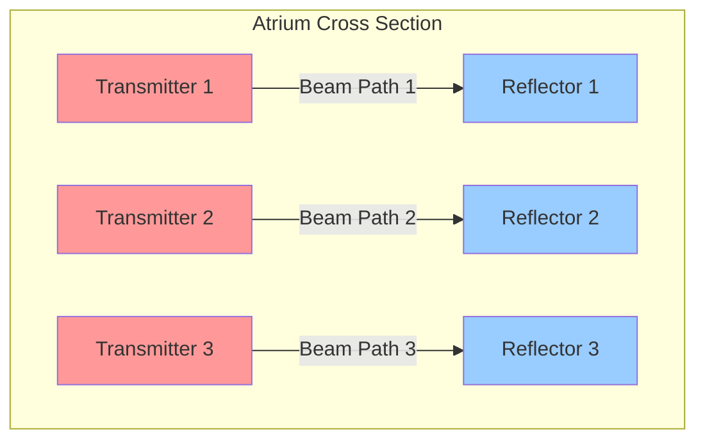
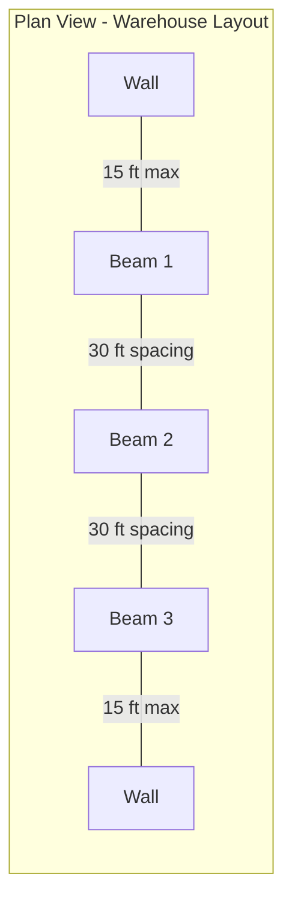
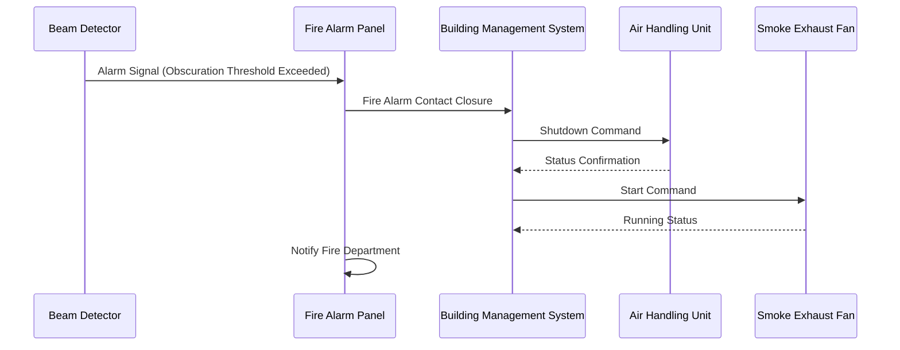

## Projected Beam Smoke Detector Technology

Projected beam smoke detectors measure smoke obscuration along a defined optical path, making them ideal for large open volumes where conventional spot-type detectors prove impractical. The transmitter projects an infrared or visible light beam to a receiver or reflector, and smoke particles interrupt the beam, causing signal attenuation measured as percent obscuration per foot.

These detectors excel in spaces with ceiling heights exceeding 30 feet, including atriums, warehouses, manufacturing facilities, aircraft hangars, and convention centers where smoke stratification and detector accessibility present significant challenges.

## Detection Principle and Obscuration

The fundamental detection mechanism relies on Beer-Lambert Law, which describes light transmission through a medium containing absorbing particles:

$$I = I_0 e^{-\alpha L}$$

Where:
- $I$ = received light intensity
- $I_0$ = transmitted light intensity
- $\alpha$ = extinction coefficient (obscuration per unit length)
- $L$ = beam path length

The percent obscuration per foot is calculated as:

$$\text{Obscuration} = \left(1 - \frac{I}{I_0}\right) \times \frac{100}{L}$$

NFPA 72 requires alarm activation between 0.5% and 4.0% obscuration per foot, with typical settings at 1.5% to 2.5% obscuration per foot for most applications.

## Coverage Area Calculation

Beam detector spacing follows NFPA 72 requirements based on ceiling height and beam location. The nominal coverage area per beam is:

$$A_{coverage} = L_{beam} \times S_{spacing}$$

Where:
- $L_{beam}$ = beam length (typically 16-300 ft)
- $S_{spacing}$ = perpendicular spacing between parallel beams

### NFPA 72 Spacing Requirements

| Ceiling Height | Maximum Spacing Between Beams | Maximum Distance from Wall |
|----------------|-------------------------------|----------------------------|
| 10-15 ft | 30 ft | 15 ft |
| 15-20 ft | 30 ft | 15 ft |
| 20-25 ft | 30 ft | 15 ft |
| 25-30 ft | 30 ft | 15 ft |
| 30-35 ft | 30 ft | 21 ft |
| 35-40 ft | 45 ft | 22.5 ft |

For smooth ceilings, the listed spacing applies. Beam and solid joists require 50% spacing reduction perpendicular to joists.

## Beam Detector Layout Pattern

## Alignment Requirements

Precise optical alignment is critical for reliable operation. The receiver must maintain the transmitted beam within its optical aperture despite building movement, thermal expansion, and vibration.

### Alignment Tolerance

The angular misalignment tolerance is:

$$\theta_{max} = \arctan\left(\frac{D_{aperture}}{2L_{beam}}\right)$$

For a typical receiver aperture diameter of 4 inches and 200-foot beam:

$$\theta_{max} = \arctan\left(\frac{2 \text{ in}}{200 \text{ ft} \times 12 \text{ in/ft}}\right) = 0.048° = 2.9 \text{ mrad}$$

This narrow tolerance requires rigid mounting on structural elements, not ceiling grid systems or flexible supports.

## HVAC System Integration Considerations

### Smoke Stratification Prevention

High-volume spaces experience thermal stratification where hot smoke rises rapidly and forms a stable layer below the ceiling. HVAC systems must not:

- Create strong horizontal airflows exceeding 300 ft/min at beam height
- Establish stable thermal layers preventing smoke detection
- Dilute smoke below detection thresholds before alarm activation

### Supply Air Design

Position supply air diffusers to avoid direct impingement on beam paths. Air velocities across the beam should remain below 200 ft/min under normal operation to prevent false alarms from dust or airborne particles.

### Smoke Control Activation

Upon beam detector alarm, the HVAC control sequence should:

1. Shut down air handling units serving the fire zone
2. Activate smoke exhaust fans if designed
3. Pressurize adjacent zones or stairwells
4. Close fire/smoke dampers per code requirements

## Installation Best Practices

### Mounting Locations

Select mounting surfaces that:
- Attach directly to structural steel or concrete
- Avoid areas with excessive vibration or building movement
- Provide clear line-of-sight without obstructions
- Allow access for maintenance and testing

### Environmental Factors

Account for:
- **Temperature**: Operate within -4°F to 131°F typical range
- **Humidity**: Consider condensation on optical surfaces
- **Dust**: Use higher obscuration thresholds in dusty environments
- **Lighting**: Sunlight can interfere with optical detection

### Commissioning Procedures

1. Verify beam path is unobstructed throughout entire length
2. Align transmitter and receiver to achieve maximum signal strength
3. Document baseline signal strength and obscuration level
4. Test alarm response using calibrated obscuration filters
5. Verify HVAC shutdown sequence timing and confirmation
6. Record alignment angles and mounting details for future maintenance

## Maintenance and Testing

NFPA 72 requires annual functional testing with documented obscuration measurement. Monthly visual inspection should confirm:

- LED indicators show normal operation
- No physical damage or misalignment
- Optical surfaces remain clean
- Mounting hardware remains secure

The sensitivity test uses neutral density filters providing 0.5%, 1.5%, and 4.0% obscuration per foot to verify alarm and trouble thresholds.

## Advantages in Large Volumes

Beam detectors provide superior performance in high-ceiling applications compared to spot-type detectors because:

- Single device covers up to 9,000 square feet
- Detects smoke at ceiling level before stratification
- Reduces installation and maintenance access requirements
- Provides reliable operation in challenging environments
- Integrates directly with HVAC and smoke control systems

For spaces with complex geometry or extreme heights above 60 feet, air sampling smoke detection (ASSD) systems may complement or replace beam detectors to ensure smoke reaches detection devices before excessive dilution occurs.
