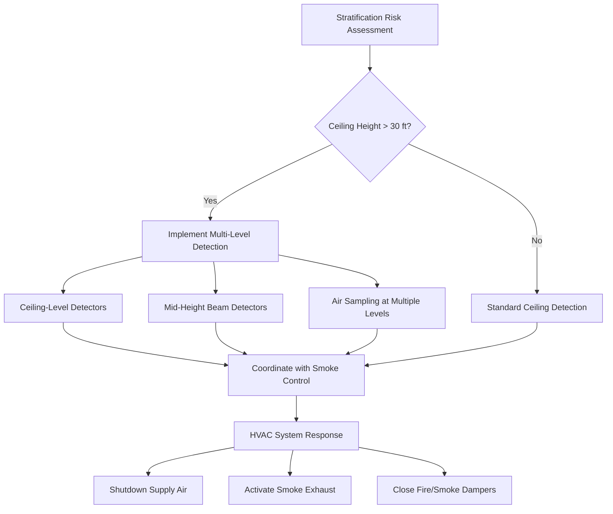
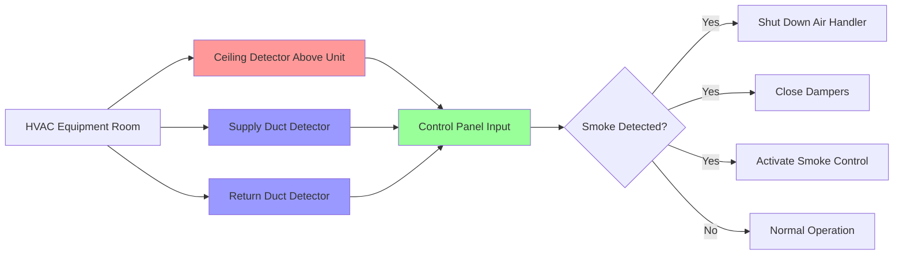

## Smoke Detection Fundamentals in HVAC Systems

Smoke detectors serve as the primary sensors that initiate HVAC fire safety responses, including smoke control system activation, air handler shutdown, and damper operation. Proper detector selection, placement, and integration determine system reliability and response time. NFPA 72 establishes requirements for detector application, spacing, and sensitivity while considering HVAC system interactions that affect smoke transport and detection.

The integration of smoke detectors with HVAC systems requires understanding both fire detection physics and airflow dynamics. Detectors must detect smoke rapidly while avoiding nuisance alarms from normal HVAC operation, dust, humidity, and temperature fluctuations.

## Detector Types and Operating Principles

### Ionization vs Photoelectric Technology

| Detector Type | Detection Method | Best Application | Response Characteristic | HVAC Considerations |
|---------------|------------------|------------------|------------------------|---------------------|
| Ionization | Radioactive source measures ion current disruption | Fast-flaming fires with small particles | Faster response to invisible combustion products | More susceptible to nuisance alarms from HVAC dust |
| Photoelectric | Light scattering from smoke particles | Smoldering fires with larger particles | Better for visible smoke detection | Less affected by air velocity variations |
| Dual Sensor | Both ionization and photoelectric | General purpose, high reliability | Balanced response profile | Recommended for critical HVAC applications |
| Air Sampling | Aspirating detection with piped sample points | High-value spaces, pre-alarm warning | Extremely early detection | Requires separate piping network |

### Duct Detectors

Duct smoke detectors monitor airstreams within HVAC ducts to detect smoke before distribution throughout the building. NFPA 72 and mechanical codes require duct detectors in specific applications:

**Required Applications:**
- Supply air systems exceeding 2,000 cfm (944 L/s)
- Return air systems exceeding 15,000 cfm (7,080 L/s) when serving multiple floors
- Return air systems when required to prevent smoke recirculation

**Installation Requirements:**
- Installed per manufacturer's velocity range specifications (typically 300-4,000 fpm)
- Located to ensure representative sampling of airstream
- Minimum 6 duct diameters downstream of bends or obstructions
- Accessible for maintenance and testing

The sampling efficiency of a duct detector depends on the relationship between duct velocity and detector design:

$$\eta = \frac{Q_{detector}}{Q_{duct}} \times 100\%$$

Where:
- $\eta$ = sampling efficiency (%)
- $Q_{detector}$ = airflow through detector sensing chamber (cfm)
- $Q_{duct}$ = total duct airflow (cfm)

## Detector Spacing and Placement

### Area Coverage Calculations

NFPA 72 specifies maximum spacing for smooth ceiling applications based on detector listing and ceiling height. The basic spacing relationship accounts for smoke plume spread:

$$S_{max} = \sqrt{\frac{A_{coverage}}{\pi}} \times 2$$

Where:
- $S_{max}$ = maximum linear spacing between detectors (ft)
- $A_{coverage}$ = rated coverage area per detector (ft²)
- Standard spacing: 30 ft for most detectors (900 ft² coverage)

### Ceiling Height Impact

As ceiling height increases, smoke plumes spread more before reaching detectors, requiring adjusted spacing:

| Ceiling Height | Spacing Reduction | Effective Coverage |
|----------------|-------------------|-------------------|
| 10-15 ft | Baseline | 900 ft² (30 ft spacing) |
| 15-20 ft | No reduction (if listed) | 900 ft² |
| 20-30 ft | Evaluate plume characteristics | May require 50% reduction |
| >30 ft | Engineering analysis required | Project-specific |

For sloped ceilings with pitch exceeding 1:8, detectors must be located within 36 inches of the peak measured horizontally.

### Spacing Adjustment for HVAC Effects

Heating and air conditioning airflow affects smoke transport and requires spacing adjustments:

$$S_{adjusted} = S_{max} \times \sqrt{\frac{1}{1 + \frac{V_{air}}{V_{critical}}}}$$

Where:
- $S_{adjusted}$ = adjusted detector spacing (ft)
- $S_{max}$ = maximum spacing per NFPA 72 (ft)
- $V_{air}$ = air velocity at detector location (fpm)
- $V_{critical}$ = critical velocity for smoke disruption (typically 300 fpm)

High-velocity air supply can prevent smoke from reaching ceiling-mounted detectors or blow smoke away from detector sensing chambers. Air velocities exceeding 300 fpm at the detector location may require supplemental detection or beam-type detectors.

## Smoke Stratification Considerations

Smoke stratification occurs when buoyancy-driven smoke reaches equilibrium with ambient air temperature before reaching the ceiling, creating a smoke layer below detector level. This phenomenon is critical in large-volume spaces with high ceilings.

### Stratification Risk Factors

**High-Risk Conditions:**
- Ceiling heights exceeding 30 feet
- High ambient temperatures near ceiling (>100°F)
- Weak fire sources with limited heat release
- Large open volumes with minimal air mixing

**Physical Mechanism:**

The stratification height depends on the temperature difference between smoke and ambient air:

$$\Delta z = \frac{T_{smoke} - T_{ambient}}{T_{ambient}} \times H_{ceiling} \times 0.5$$

Where:
- $\Delta z$ = distance below ceiling where stratification occurs (ft)
- $T_{smoke}$ = smoke layer temperature (°R)
- $T_{ambient}$ = ambient air temperature (°R)
- $H_{ceiling}$ = ceiling height (ft)

### Mitigation Strategies

**Recommended Approaches:**
- Install beam-type smoke detectors at intermediate heights (50-70% of ceiling height)
- Use air sampling systems with sample points at multiple elevations
- Coordinate detector placement with HVAC supply air patterns
- Consider projected beam detectors for very high ceilings (>40 ft)

## Detector Placement Optimization

### Recommended Placement Strategy

### Integration with HVAC Controls

Smoke detector outputs must interface reliably with HVAC control systems:

**Control Actions:**
- Air handling unit shutdown on duct smoke detector activation
- Smoke damper closure coordinated with detector zones
- Pressurization fan activation for stairwell protection
- Exhaust fan activation in designated smoke zones

**Response Time Requirements:**

The total system response time from smoke detection to HVAC action:

$$t_{total} = t_{detection} + t_{transmission} + t_{processing} + t_{actuation}$$

Where:
- $t_{detection}$ = smoke entry to detector alarm (5-30 seconds)
- $t_{transmission}$ = signal transmission to control panel (<1 second)
- $t_{processing}$ = control logic execution (1-3 seconds)
- $t_{actuation}$ = damper closure or fan shutdown (5-60 seconds)

Target total response time: <90 seconds for critical smoke control functions.

## Detector Sensitivity and Nuisance Alarm Prevention

### Sensitivity Settings

Modern addressable detectors allow adjustable sensitivity to balance early warning with nuisance alarm reduction:

| Sensitivity Level | Obscuration Range | Application |
|-------------------|-------------------|-------------|
| High | 0.5-1.5% per foot | Clean environments, early warning |
| Medium | 1.5-2.5% per foot | Standard commercial spaces |
| Low | 2.5-4.0% per foot | Dusty environments, industrial |
| Variable | Auto-adjusting | Spaces with changing conditions |

### HVAC-Related Nuisance Alarm Sources

**Common Causes:**
- Dust accumulation in ducts released during fan startup
- High humidity from humidification systems
- Transient temperature changes causing condensation
- Construction dust during renovations
- Cooking aerosols in return air paths

**Prevention Strategies:**
- Routine HVAC filter maintenance and duct cleaning
- Proper detector selection for environment
- Detector shields in high-airflow areas
- Verification testing after HVAC system changes
- Time delays for non-critical applications

## Maintenance and Testing Requirements

NFPA 72 mandates regular testing and sensitivity verification:

**Inspection Frequency:**
- Visual inspection: Semi-annually
- Functional testing: Annually
- Sensitivity testing: Per manufacturer (typically 2-5 years)
- Duct detector cleaning: Annually or per AHJ

**Integration Testing:**
- Verify HVAC system response to detector activation
- Confirm proper damper operation
- Test smoke control mode activation
- Document response times and equipment operation

Detectors in HVAC systems experience accelerated contamination and require more frequent maintenance than area detectors in occupied spaces.

---

*This content addresses smoke detector fundamentals as they relate to HVAC fire safety systems. Proper detector selection and integration ensure reliable fire detection while maintaining coordination with HVAC equipment operation and smoke control strategies.*
