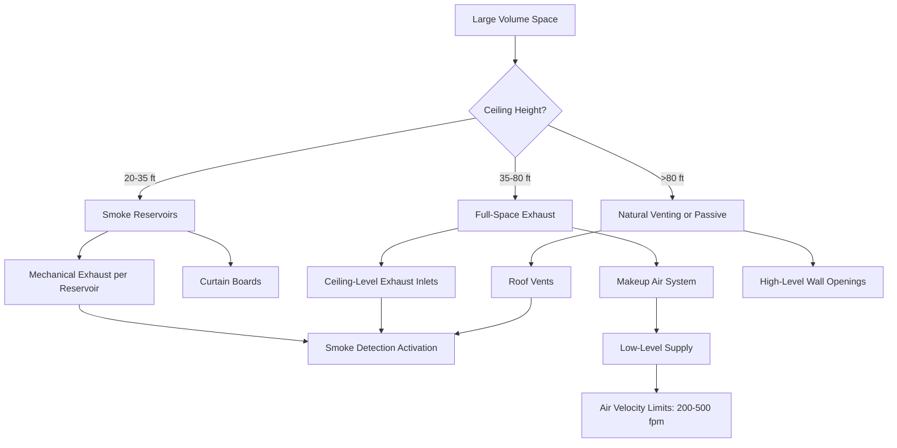

## Overview

Large volume spaces present unique smoke control challenges due to their vertical height, open floor areas, and occupant evacuation requirements. NFPA 92 defines a large volume space as having a ceiling height exceeding 20 feet with significant open floor area. These environments—including atriums, warehouses, shopping malls, arenas, and airport terminals—require specialized engineering approaches that account for smoke plume behavior, buoyancy-driven flows, and temperature stratification.

The fundamental objective is to maintain a smoke-free layer above the occupied zone during evacuation periods. This requires calculating smoke production rates, predicting smoke layer descent, and designing exhaust systems that remove smoke at rates sufficient to maintain the interface height above critical elevations.

## Smoke Plume Physics

Smoke behavior in large volumes is governed by buoyancy-driven convection. A fire generates a vertical plume that entrains surrounding air as it rises, increasing in mass flow rate with height. The plume mass flow rate at height $z$ above the fire source is:

$$\dot{m}_p = 0.071 Q_c^{1/3} z^{5/3} + 0.0018 Q_c$$

where $\dot{m}_p$ is plume mass flow (kg/s), $Q_c$ is convective heat release rate (kW), and $z$ is height above fire (m).

When the plume reaches the ceiling, it spreads radially, forming a ceiling jet that eventually creates a descending smoke layer. The smoke layer interface height decreases as smoke accumulates beneath the ceiling.

## Smoke Filling Time

The time required for smoke to descend to a critical height is calculated using the smoke filling equation from NFPA 92:

$$t = \frac{A_f (H - z_s)}{V_s}$$

For axisymmetric plumes in spaces with uniform cross-section:

$$t = \frac{2.38 A_f (H - z_s)^{5/3}}{Q_c^{1/3} H^{5/3}}$$

where:
- $t$ = filling time (s)
- $A_f$ = floor area (m²)
- $H$ = ceiling height (m)
- $z_s$ = smoke layer interface height (m)
- $V_s$ = volumetric smoke production rate (m³/s)
- $Q_c$ = convective heat release rate (kW)

This relationship allows engineers to determine whether natural smoke accumulation permits sufficient egress time or if mechanical exhaust is required.

## Design Approaches

### Steady-State Exhaust

Mechanical exhaust systems are designed to remove smoke at rates equal to or exceeding plume production, maintaining a constant interface height. The required exhaust rate equals the plume mass flow at the desired interface height:

$$\dot{V}_{exhaust} = \frac{\dot{m}_p}{\rho_s}$$

where $\rho_s$ is smoke density at the layer temperature (kg/m³).

Exhaust inlets are positioned in the smoke layer, typically at 80-90% of ceiling height. Multiple inlets ensure uniform smoke removal across the ceiling area.

### Natural Venting

Natural venting uses buoyancy forces to drive smoke through roof vents or wall openings. The volumetric flow through a vent is:

$$\dot{V}_{vent} = C_d A_v \sqrt{2g \Delta h \frac{\Delta T}{T_a}}$$

where:
- $C_d$ = discharge coefficient (typically 0.6-0.7)
- $A_v$ = vent area (m²)
- $g$ = gravitational acceleration (9.81 m/s²)
- $\Delta h$ = height from neutral plane to vent (m)
- $\Delta T$ = temperature difference (K)
- $T_a$ = ambient temperature (K)

### Smoke Reservoir Method

Large ceiling areas are divided into smoke reservoirs using curtain boards or structural beams projecting below the ceiling. Each reservoir contains smoke from a single plume, limiting lateral spread. Reservoir design per NFPA 92 requires:

- Minimum depth: 20% of ceiling height or 8 feet, whichever is less
- Maximum floor area per reservoir: based on design fire size and exhaust capacity
- Exhaust inlets within each reservoir

## Space Type Considerations

| Space Type | Ceiling Height | Primary Concern | Typical Approach |
|------------|----------------|-----------------|------------------|
| Atrium | 40-150 ft | Interface maintenance during evacuation | Mechanical exhaust with makeup air |
| Warehouse | 25-50 ft | Smoke obscuration in rack aisles | Natural venting or ESFR sprinklers |
| Arena/Stadium | 50-120 ft | Large occupant loads, limited exits | Natural ventilation with supplemental mechanical |
| Shopping Mall | 20-35 ft | Multiple tenancy, interconnected spaces | Smoke reservoirs with exhaust |
| Airport Terminal | 30-80 ft | 24/7 operations, security concerns | Dedicated mechanical systems with controls integration |
| Convention Center | 25-60 ft | Variable configurations, high fuel loads | Flexible exhaust with adjustable reservoirs |

## System Configuration

## Makeup Air Requirements

Mechanical exhaust systems require makeup air to replace removed smoke and prevent excessive building depressurization. Makeup air supply rates typically equal 100-110% of exhaust rates to maintain slight positive pressure. Supply locations must not disrupt smoke stratification:

- Position at floor level or low walls
- Maximum velocity: 500 fpm at supply outlets
- Temperature control prevents destratification

## Design Fire Selection

NFPA 92 design fires range from 5 MW for small fuel loads to 20+ MW for high-challenge scenarios. Selection factors include:

- Occupancy type and fuel characteristics
- Combustible contents and arrangement
- Sprinkler system interaction
- Required performance objectives

Common design fires:
- Retail/office atriums: 5-10 MW
- Warehouse (no sprinklers): 10-20 MW
- Transportation terminals: 3-8 MW
- Sports arenas: 5-12 MW

## Computational Modeling

CFD analysis validates design assumptions for complex geometries where hand calculations prove inadequate. Fire Dynamics Simulator (FDS) and similar tools model:

- Three-dimensional plume development
- Ceiling jet spreading patterns
- Smoke layer descent rates
- Exhaust system effectiveness
- Makeup air interaction effects

Modeling requires verification against experimental data and sensitivity analysis of input parameters.

## System Verification

Acceptance testing per NFPA 92 demonstrates system performance:

- Airflow measurements at all exhaust and supply points
- Smoke detection system functionality
- Control sequence verification
- Temperature and velocity measurements
- Documentation of design assumptions and acceptance criteria

Large volume smoke control demands rigorous engineering analysis combining fundamental fluid mechanics, fire dynamics, and building systems integration to ensure occupant safety during fire events.
