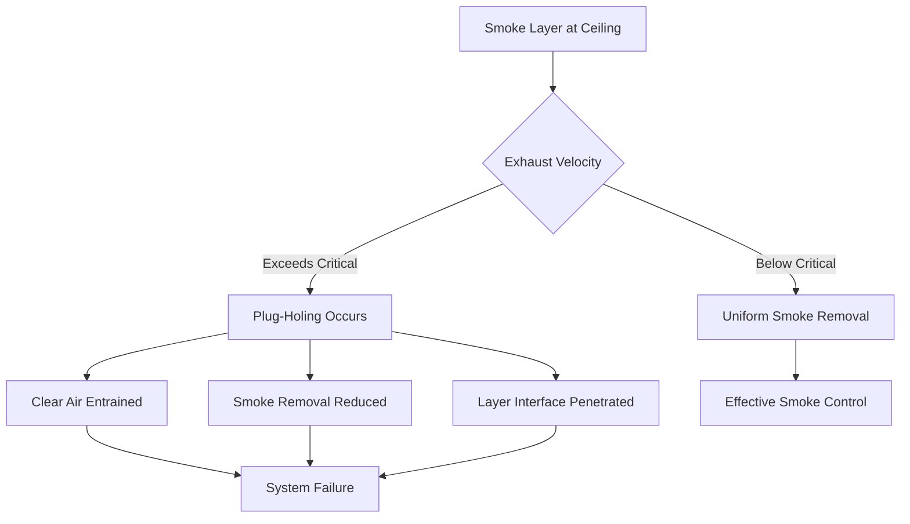
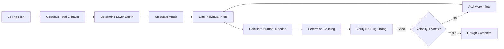

## Plug-Holing Phenomenon

Plug-holing occurs when excessive exhaust velocity at a smoke exhaust inlet creates a localized vortex that pulls clear air from below the smoke layer directly into the exhaust system, bypassing the smoke-laden air above. This phenomenon drastically reduces smoke removal efficiency and undermines the smoke control system's performance.

The physical mechanism involves Bernoulli effects and entrainment. When exhaust velocity exceeds critical thresholds, the pressure differential creates a penetrating flow path through the smoke layer interface, pulling cool, oxygen-rich air into the exhaust stream while leaving hot smoke gases stagnant.

## Critical Velocity Limits

NFPA 92 establishes maximum exhaust velocities to prevent plug-holing based on smoke layer depth. The critical relationship is:

$$V_{max} = K \sqrt{g \cdot d}$$

Where:
- $V_{max}$ = Maximum allowable exhaust velocity (m/s)
- $K$ = Dimensionless coefficient (typically 1.0 for conservative design)
- $g$ = Gravitational acceleration (9.81 m/s²)
- $d$ = Smoke layer depth below ceiling (m)

For engineering applications with safety factors:

$$V_{max} = 1.0 \sqrt{9.81 \cdot d} = 3.13\sqrt{d}$$

This equation demonstrates that deeper smoke layers permit higher exhaust velocities before plug-holing initiates.

## Minimum Smoke Layer Depth

The smoke layer must maintain sufficient depth to provide adequate residence volume and prevent interface disruption. NFPA 92 requires minimum layer depth based on exhaust configuration:

$$d_{min} = \frac{V^2}{g \cdot K^2}$$

For a desired exhaust velocity $V$, rearranging the critical velocity equation yields the minimum required smoke layer depth.

| Exhaust Velocity (m/s) | Minimum Layer Depth (m) | Minimum Layer Depth (ft) |
|------------------------|-------------------------|--------------------------|
| 2.5 | 0.64 | 2.1 |
| 3.0 | 0.92 | 3.0 |
| 3.5 | 1.25 | 4.1 |
| 4.0 | 1.63 | 5.3 |
| 4.5 | 2.06 | 6.8 |
| 5.0 | 2.55 | 8.4 |

## Maximum Exhaust Rate Per Inlet

The volumetric exhaust rate per inlet must respect both velocity limits and inlet geometry:

$$Q_{max} = A_{inlet} \cdot V_{max} = A_{inlet} \cdot 3.13\sqrt{d}$$

Where:
- $Q_{max}$ = Maximum exhaust flow rate (m³/s)
- $A_{inlet}$ = Exhaust inlet effective area (m²)

For circular exhaust inlets:

$$Q_{max} = \frac{\pi D^2}{4} \cdot 3.13\sqrt{d}$$

Where $D$ = inlet diameter (m)

### Practical Exhaust Rate Table

| Inlet Diameter (m) | Layer Depth 1.0m (m³/s) | Layer Depth 1.5m (m³/s) | Layer Depth 2.0m (m³/s) |
|-------------------|-------------------------|-------------------------|-------------------------|
| 0.50 | 0.61 | 0.75 | 0.87 |
| 0.75 | 1.38 | 1.69 | 1.95 |
| 1.00 | 2.46 | 3.01 | 3.48 |
| 1.25 | 3.84 | 4.70 | 5.43 |
| 1.50 | 5.53 | 6.77 | 7.82 |

## Exhaust Inlet Design Requirements

### Geometric Considerations

Inlet design directly affects plug-holing susceptibility:

1. **Inlet Area**: Larger inlets distribute flow, reducing local velocity
2. **Depth Below Ceiling**: Inlets must remain within smoke layer under all conditions
3. **Spacing**: Multiple inlets prevent localized high-velocity zones
4. **Edge Configuration**: Sharp edges increase turbulence and reduce effective area

### Inlet Spacing Calculation

To maintain uniform exhaust without localized velocity peaks:

$$S_{inlet} = \sqrt{\frac{4Q_{total}}{\pi n V_{max}}}$$

Where:
- $S_{inlet}$ = Spacing between inlets (m)
- $Q_{total}$ = Total required exhaust rate (m³/s)
- $n$ = Number of exhaust inlets
- $V_{max}$ = Maximum allowable velocity (m/s)

## Fan Sizing Methodology

Exhaust fans must provide adequate flow while accounting for system pressure losses and plug-holing velocity constraints.

### Total Fan Capacity

$$Q_{fan} = \frac{Q_{total}}{SF \cdot \eta_{sys}}$$

Where:
- $Q_{fan}$ = Required fan capacity (m³/s)
- $SF$ = Safety factor (typically 1.1-1.2)
- $\eta_{sys}$ = System efficiency (0.85-0.95)

### Static Pressure Requirements

Total system pressure includes:

$$\Delta P_{total} = \Delta P_{inlet} + \Delta P_{duct} + \Delta P_{hood} + \Delta P_{discharge}$$

Inlet pressure loss with velocity limitation:

$$\Delta P_{inlet} = \frac{\rho V_{max}^2}{2C_d^2}$$

Where $C_d$ = discharge coefficient (typically 0.6-0.8 for smoke exhaust inlets)

## CFD Analysis Verification

Computational fluid dynamics provides validation of plug-holing prevention design:

1. **Model smoke layer stratification** with appropriate buoyancy models
2. **Apply actual exhaust velocities** at inlet boundaries
3. **Verify interface stability** through transient analysis
4. **Check velocity vectors** for downward penetration through layer
5. **Validate smoke removal efficiency** by tracking particle residence time

CFD acceptance criteria:
- Smoke layer interface remains above design depth
- No velocity vectors penetrate more than 10% through layer interface
- Exhaust composition contains >90% smoke-laden air by volume
- Temperature stratification maintains >50°C differential across interface

## Design Implementation Checklist

**Plug-holing prevention requires:**

- Calculate minimum smoke layer depth for space geometry
- Determine maximum exhaust velocity using $V_{max} = 3.13\sqrt{d}$
- Size exhaust inlets to maintain velocity below maximum
- Space multiple inlets uniformly across ceiling area
- Select fans with adequate capacity and pressure capability
- Verify design through CFD analysis when layer depth <1.5m
- Install smoke layer depth monitoring for system verification
- Commission system with smoke generator testing

**Critical design errors to avoid:**

- Oversizing single exhaust inlets instead of distributing flow
- Placing inlets below minimum smoke layer depth
- Ignoring temperature effects on smoke layer buoyancy
- Neglecting duct pressure losses in fan selection
- Failing to account for worst-case fire growth rates

Proper plug-holing prevention ensures smoke exhaust systems perform as intended, maintaining tenable conditions during fire incidents in large volume spaces.
