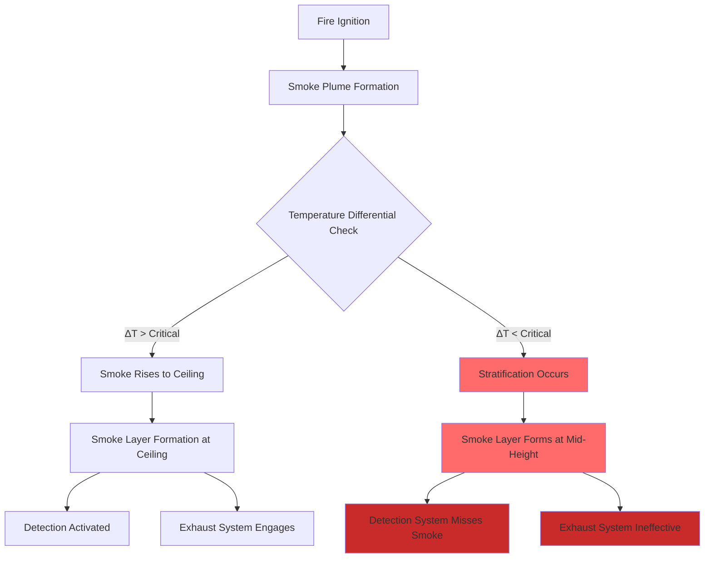
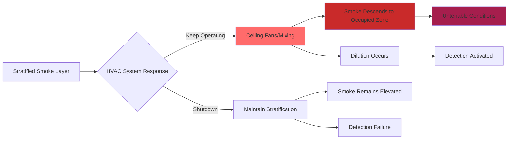

## Physical Basis of Smoke Stratification

Smoke stratification occurs when combustion products lose sufficient buoyancy to rise further, forming a stable layer below the ceiling. This phenomenon presents critical challenges in large-volume spaces where ceiling heights exceed 20 feet. The stability of stratified smoke layers depends on the temperature differential between the smoke layer and ambient air.

The buoyancy force driving smoke rise is expressed as:

$$F_b = \rho_a V g \left(1 - \frac{T_a}{T_s}\right)$$

where:
- $F_b$ = buoyancy force (N)
- $\rho_a$ = ambient air density (kg/m³)
- $V$ = smoke volume (m³)
- $g$ = gravitational acceleration (9.81 m/s²)
- $T_a$ = ambient temperature (K)
- $T_s$ = smoke temperature (K)

As smoke rises and entrains cooler ambient air, its temperature decreases. The critical stratification height occurs when buoyancy force equals drag forces and mixing resistance.

## Temperature Gradient Analysis

The vertical temperature gradient in large-volume spaces dictates stratification behavior. NFPA 92 recognizes that temperature differentials below 10°F (5.6°C) may result in inadequate buoyancy for smoke to reach exhaust points.

**Temperature Differential Requirements:**

| Ceiling Height (ft) | Minimum ΔT for Rise (°F) | Stratification Risk | Detection Challenge |
|---------------------|--------------------------|---------------------|---------------------|
| 20-30 | 8-12 | Moderate | Low |
| 30-50 | 12-18 | High | Moderate |
| 50-75 | 18-25 | Very High | High |
| >75 | >25 | Critical | Severe |

The temperature decay with height follows:

$$T(z) = T_0 \exp\left(-\frac{z}{\lambda}\right) + T_\infty$$

where:
- $T(z)$ = temperature at height $z$ (K)
- $T_0$ = initial excess temperature (K)
- $\lambda$ = characteristic decay length (m)
- $T_\infty$ = ambient temperature (K)

## Smoke Behavior in Stratified Conditions

## Stratification Height Prediction

The equilibrium stratification height can be estimated using:

$$z_{strat} = \frac{Q^{2/3}}{C \cdot (g \cdot \Delta T / T_a)^{1/3}}$$

where:
- $z_{strat}$ = stratification height (m)
- $Q$ = heat release rate (kW)
- $C$ = empirical constant (0.9-1.2)
- $\Delta T$ = temperature difference (K)

This relationship demonstrates that low heat release rate fires in tall spaces face the highest stratification risk.

## Detection System Challenges

Smoke stratification creates three critical detection problems:

1. **Ceiling-mounted detectors remain unactivated** when smoke layers form 10-40 feet below the ceiling
2. **Beam detectors may operate below the stratified layer**, missing smoke entirely
3. **Aspirating systems with improper sampling point heights** fail to detect stratification events

The smoke concentration at the ceiling when stratification occurs at height $h$ below:

$$C_{ceiling} = C_{strat} \cdot \exp\left(-\frac{h}{\delta}\right)$$

where $\delta$ is the diffusion characteristic length, typically 2-5 meters in still air.

## Destratification Considerations

NFPA 92 emphasizes that normal HVAC operation during incipient fire stages can destratify smoke, bringing it into the occupied zone. However, complete HVAC shutdown may prevent smoke from reaching ceiling-mounted exhaust points.

**Destratification Mechanisms:**

- Supply air momentum breaking through smoke layer interface
- Return air entrainment drawing smoke downward
- Ceiling fan operation disrupting thermal stratification
- Air curtain systems creating vertical mixing

The critical Richardson number determines whether airflow will destratify a smoke layer:

$$Ri = \frac{g \cdot \Delta \rho \cdot H}{\rho \cdot U^2}$$

where:
- $Ri$ = Richardson number (dimensionless)
- $\Delta \rho$ = density difference (kg/m³)
- $H$ = layer thickness (m)
- $U$ = characteristic velocity (m/s)

When $Ri < 0.25$, mechanical mixing dominates and destratification occurs. When $Ri > 1.0$, buoyancy maintains stratification despite airflow.

## Engineering Strategies

**HVAC Shutdown Strategy:**
- Immediate shutdown of all air handling units upon detection
- Closure of outside air dampers to prevent wind-induced mixing
- Deactivation of destratification fans
- Maintenance of smoke exhaust fan operation only

**Temperature Gradient Maintenance:**
- Minimize pre-fire thermal stratification through proper space conditioning
- Avoid excessive cooling that creates temperature inversions
- Design for uniform temperature distribution in tall spaces

**Detection System Design:**
- Multi-level smoke detection arrays at 15-20 foot vertical intervals
- Video smoke detection for visual confirmation of layer height
- Temperature-compensated detection algorithms
- Aspirating systems with sampling points at multiple elevations

The mass flow rate through a stratified smoke layer interface determines detection probability:

$$\dot{m} = \rho \cdot A \cdot U_{ent}$$

where $U_{ent} = 0.1 \sqrt{g \cdot \Delta T / T \cdot H}$ is the entrainment velocity across the interface.

## NFPA 92 Compliance Requirements

NFPA 92 Section 4.6.4 addresses stratification explicitly, requiring:

- Analysis of stratification potential for all spaces exceeding 30 feet in height
- Calculation of expected smoke layer temperatures at various fire sizes
- Evaluation of detection system placement relative to predicted stratification heights
- Documentation of HVAC system response modes during fire events

The standard recognizes that engineered smoke control must account for the competing objectives of maintaining stratification for occupant safety while ensuring detection system activation and smoke removal system effectiveness.
