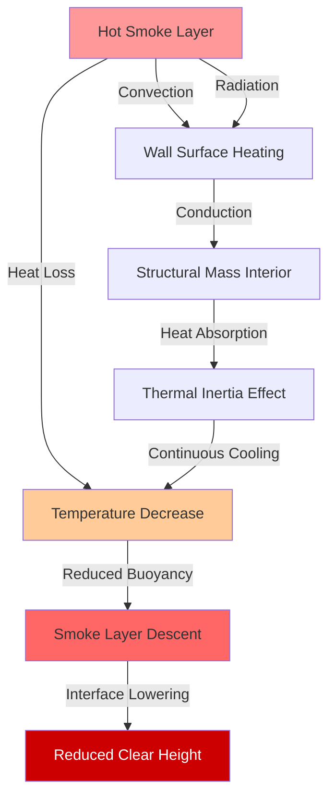
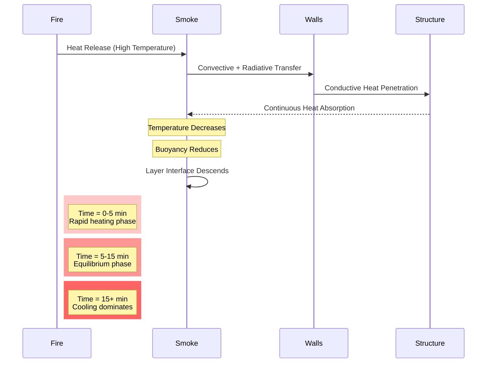

## Thermal Inertia Effects on Smoke Control

Thermal inertia in large-volume spaces significantly impacts smoke management by absorbing heat from the smoke layer, reducing buoyancy, and causing the smoke layer interface to descend over time. The thermal mass of walls, ceilings, and structural elements acts as a heat sink, fundamentally altering smoke behavior compared to idealized steady-state models.

## Heat Transfer Mechanisms

The smoke layer loses heat to building surfaces through three mechanisms operating simultaneously:

**Convective Heat Transfer** occurs at the smoke layer-wall interface:

$$q_{conv} = h_c A_s (T_s - T_w)$$

where:
- $q_{conv}$ = convective heat transfer rate (W)
- $h_c$ = convective heat transfer coefficient (5-25 W/m²·K for natural convection)
- $A_s$ = surface area in contact with smoke (m²)
- $T_s$ = smoke layer temperature (K)
- $T_w$ = wall surface temperature (K)

**Radiative Heat Transfer** dominates at elevated smoke temperatures:

$$q_{rad} = \epsilon \sigma A_s (T_s^4 - T_w^4)$$

where:
- $\epsilon$ = effective emissivity (0.7-0.9 for smoke and building materials)
- $\sigma$ = Stefan-Boltzmann constant (5.67 × 10⁻⁸ W/m²·K⁴)

**Conductive Heat Transfer** through structural elements:

$$q_{cond} = \frac{kA(T_{w,hot} - T_{w,cold})}{\delta}$$

where:
- $k$ = thermal conductivity (W/m·K)
- $\delta$ = wall thickness (m)

## Thermal Mass Heat Storage

The heat absorbed by building structure is governed by thermal capacitance:

$$Q_{stored} = mc_p\Delta T = \rho V c_p (T_f - T_i)$$

where:
- $Q_{stored}$ = total heat stored (J)
- $m$ = mass of structural element (kg)
- $\rho$ = material density (kg/m³)
- $V$ = volume of material (m³)
- $c_p$ = specific heat capacity (J/kg·K)
- $T_f$ = final temperature (K)
- $T_i$ = initial temperature (K)

The thermal diffusivity determines heat penetration depth:

$$\alpha = \frac{k}{\rho c_p}$$

Penetration depth over time $t$ approximates:

$$\delta_{penetration} \approx \sqrt{\alpha t}$$

## Material Thermal Properties

| Material | Density (kg/m³) | Specific Heat (J/kg·K) | Conductivity (W/m·K) | Thermal Diffusivity (m²/s × 10⁻⁶) |
|----------|----------------|----------------------|---------------------|----------------------------------|
| Concrete | 2400 | 880 | 1.4 | 0.66 |
| Brick | 1920 | 840 | 0.72 | 0.45 |
| Steel | 7850 | 450 | 45 | 12.7 |
| Gypsum Board | 800 | 1090 | 0.17 | 0.19 |
| Glass | 2500 | 750 | 1.0 | 0.53 |

## Smoke Layer Temperature Decay

The smoke layer temperature decreases according to energy balance:

$$\frac{dT_s}{dt} = \frac{\dot{Q}_{fire} - \dot{Q}_{loss} - \dot{m}_{exhaust}c_p(T_s - T_{amb})}{m_{smoke}c_p}$$

where:
- $\dot{Q}_{fire}$ = heat release rate from fire (W)
- $\dot{Q}_{loss}$ = heat loss to surfaces (W)
- $\dot{m}_{exhaust}$ = exhaust mass flow rate (kg/s)
- $m_{smoke}$ = mass of smoke layer (kg)

For a cooling smoke layer without active fire, NFPA 92 recognizes that buoyancy-driven flow decreases as:

$$\Delta T(t) = \Delta T_0 \exp\left(-\frac{hA_s}{m_{smoke}c_p}t\right)$$

where $\Delta T_0$ is the initial temperature difference above ambient.

## Smoke Layer Descent Rate

As the smoke cools, reduced buoyancy allows the interface to descend. The descent rate depends on:

$$\frac{dz}{dt} = -\frac{\dot{Q}_{loss}}{A_{floor}\rho_{amb}c_p\Delta T g z}$$

where:
- $z$ = smoke layer height above floor (m)
- $A_{floor}$ = floor area (m²)
- $g$ = gravitational acceleration (9.81 m/s²)

## Time-Dependent Behavior

## Design Implications per NFPA 92

**Available Safe Egress Time (ASET)** must account for thermal inertia effects:

1. **Initial Phase (0-5 minutes)**: Smoke layer establishes, walls begin absorbing heat
2. **Quasi-Steady Phase (5-15 minutes)**: Temperature relatively stable if fire is steady
3. **Decay Phase (>15 minutes)**: Significant cooling and descent without continued heat input

**Critical Design Factors:**

- **Exhaust Rate Sizing**: Must compensate for buoyancy loss over time
- **Make-up Air Temperature**: Cold make-up air accelerates smoke cooling
- **Surface Area to Volume Ratio**: Higher ratios increase cooling rates
- **Material Selection**: High thermal mass materials increase heat absorption

**Recommended Approach:**

NFPA 92 Section 4.6.8 requires consideration of heat losses to boundaries. For design calculations:

$$\dot{m}_{exhaust} = \frac{\dot{m}_{plume}}{1 - \frac{\dot{Q}_{loss}}{\dot{Q}_{convective}}}$$

where the loss fraction typically ranges from 0.2 to 0.5 for large spaces with significant thermal mass.

## Maintenance of Smoke Layer Stability

The critical parameter is maintaining sufficient temperature difference:

$$\Delta T_{critical} \geq 15-20°C$$

Below this threshold, the smoke layer becomes unstable and may mix with lower air. The time to reach critical conditions:

$$t_{critical} = \frac{m_{smoke}c_p \Delta T_0}{\dot{Q}_{loss}}$$

For concrete-enclosed atriums, expect heat loss rates of 50-150 kW per 1000 m² of exposed surface at typical smoke layer temperatures (100-200°C above ambient).

## Practical Considerations

**High Thermal Mass Spaces** (concrete, masonry):
- Smoke cools rapidly
- Interface descent accelerates after 10-15 minutes
- Require higher exhaust rates or demand-controlled ventilation

**Low Thermal Mass Spaces** (steel deck, limited enclosure):
- Maintain higher smoke temperatures longer
- More predictable steady-state behavior
- Lower exhaust rate requirements

**Verification**: Time-dependent computational fluid dynamics (CFD) modeling should simulate thermal inertia effects for critical applications where egress times exceed 10 minutes or where unique geometries create large surface areas in contact with the smoke layer.
