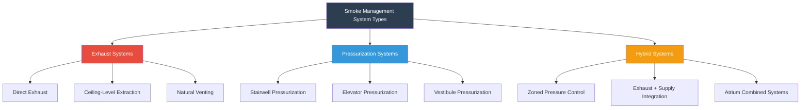
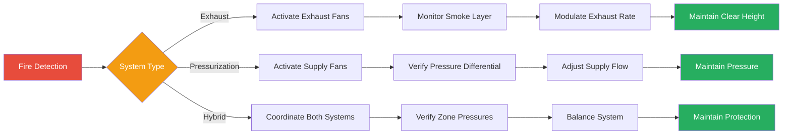

# Smoke Management Systems Overview

Smoke management systems represent critical life safety infrastructure designed to control smoke movement during fire events. These engineered systems create tenable conditions for occupant egress and firefighting operations through strategic manipulation of pressure differentials, airflow patterns, and smoke extraction. The fundamental objective is to maintain smoke-free evacuation paths and limit smoke spread to defined areas.

## System Classification

Smoke management systems are categorized into three primary configurations based on their operational strategy:

### 1. Smoke Exhaust Systems

Exhaust systems remove smoke directly from the fire zone through mechanical extraction. The volumetric exhaust rate must exceed the smoke production rate to prevent smoke layer descent below the critical elevation.

**Design Principle:**

$$Q_{exhaust} = \frac{\dot{m}_{smoke}}{\rho_{smoke}}$$

Where:
- $Q_{exhaust}$ = volumetric exhaust rate (m³/s)
- $\dot{m}_{smoke}$ = mass smoke production rate (kg/s)
- $\rho_{smoke}$ = smoke density (kg/m³)

For large volume spaces, the required exhaust capacity depends on fire heat release rate:

$$\dot{m}_{smoke} = 0.071 Q_c^{1/3} z^{5/3}$$

Where:
- $Q_c$ = convective heat release rate (kW)
- $z$ = height above fire source to smoke layer interface (m)

### 2. Pressurization Systems

Pressurization systems create positive pressure differentials across barriers to prevent smoke infiltration into protected spaces. Stairwells, elevator shafts, and refuge areas are maintained at higher pressure than adjacent fire zones.

**Pressure Differential Requirement:**

$$\Delta P = \frac{1}{2} \rho V^2 + \rho g h \Delta T / T$$

For minimum pressure difference across a barrier:

$$\Delta P_{min} = 12.5 \text{ Pa (0.05 in. w.g.)}$$

NFPA 92 specifies minimum pressure differentials of 12.5 Pa for stairwells and 25 Pa for elevator shafts to overcome stack effect and door-opening forces.

### 3. Hybrid Systems

Hybrid systems combine exhaust and pressurization to create coordinated smoke control zones. Fire zones operate under negative pressure (exhaust), while egress routes maintain positive pressure (supply).

## System Comparison

| Parameter | Exhaust Systems | Pressurization Systems | Hybrid Systems |
|-----------|----------------|----------------------|----------------|
| **Primary Mechanism** | Smoke extraction | Pressure barrier | Combined approach |
| **Application** | Large volumes, atriums | Egress paths, shafts | Multi-zone buildings |
| **Airflow Direction** | Out of fire zone | Into protected space | Coordinated flow |
| **Pressure Differential** | Negative in fire zone | Positive in safe zone | Both positive/negative |
| **Capacity Required** | 4-12 air changes/hour | 0.05-0.10 in. w.g. | Variable by zone |
| **Control Complexity** | Moderate | Low | High |
| **NFPA 92 Section** | Chapter 4 | Chapter 5 | Chapter 6 |
| **Typical Cost** | $$$ | $$ | $$$$ |

## Design Considerations

### Stack Effect Compensation

Tall buildings experience significant stack effect that impacts smoke control performance. The neutral pressure plane shifts with temperature differentials:

$$\Delta P_{stack} = 3460 \frac{h}{T_o} (T_o - T_i)$$

Where:
- $\Delta P_{stack}$ = stack pressure differential (Pa)
- $h$ = height above neutral plane (m)
- $T_o$ = outdoor absolute temperature (K)
- $T_i$ = indoor absolute temperature (K)

### Leakage Area Assessment

Effective pressurization requires accurate leakage characterization. Flow through building envelope openings follows:

$$Q = C_d A \sqrt{\frac{2\Delta P}{\rho}}$$

Where:
- $Q$ = volumetric flow rate (m³/s)
- $C_d$ = discharge coefficient (0.6-0.7 typical)
- $A$ = leakage area (m²)
- $\Delta P$ = pressure differential (Pa)

## System Selection Criteria

**Exhaust Systems are optimal for:**
- Large undivided spaces (atriums, warehouses)
- Single-zone smoke control
- High ceiling applications
- Natural venting compatibility

**Pressurization Systems are optimal for:**
- Vertical shafts and stairwells
- Defined egress routes
- Compartmentalized buildings
- Simple control requirements

**Hybrid Systems are optimal for:**
- Complex multi-story buildings
- Multiple smoke control zones
- Coordinated fire/smoke control
- Maximum life safety performance

## Control and Integration

Smoke management systems interface with building fire alarm systems through dedicated smoke control panels. NFPA 92 requires automatic activation upon smoke detection in the protected zone, with manual override capability from the fire command center.

Critical integration points include:
- HVAC system shutdown or reconfiguration
- Damper positioning (smoke, fire-smoke combination)
- Door hold-open device release
- Elevator recall and pressurization
- Status monitoring and alarm annunciation

## Performance Verification

Systems require commissioning testing per NFPA 92 Section 9 to verify design performance. Key verification parameters include pressure differential measurements at all barriers, airflow measurements at all supply/exhaust points, door-opening force testing, and smoke visualization testing to confirm airflow patterns.

The design must maintain tenable conditions defined as smoke layer interface height above 1.8 m (6 ft) in egress paths and temperature below 200°C at head level throughout the required egress time.
