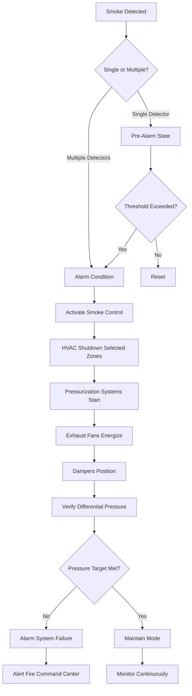
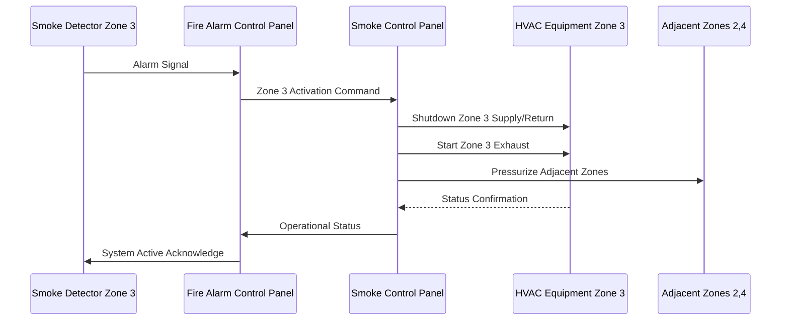

## Detection System Integration

Smoke control activation depends on rapid, reliable detection integrated with fire alarm and building management systems. Detection devices must meet NFPA 72 requirements while providing zone-specific information to enable appropriate smoke control responses per NFPA 92.

### Detection Technologies

**Spot-Type Smoke Detectors:**
- Photoelectric or ionization sensors
- Spacing: 30 ft (9 m) typical per NFPA 72
- Response time: 20-60 seconds for 4% obscuration/ft
- Application: Standard ceiling heights up to 30 ft (9 m)

**Projected Beam Detectors:**
- Infrared beam interruption detection
- Spacing: Up to 100 ft (30 m) beam length
- Response time: 10-30 seconds for 1.5-3% obscuration/ft
- Application: High ceilings, atriums, warehouses
- Mounting: Walls or columns with clear line-of-sight

**Aspirating Smoke Detection (ASD):**
- Continuous air sampling through pipe network
- Sensitivity: 0.005-2% obscuration/ft
- Response time: 15-120 seconds depending on transport time
- Application: Critical areas requiring earliest warning
- Coverage: 2,000-4,000 sq ft per sampling point

The air transport time in aspirating systems affects total response:

$$
t_{total} = t_{detect} + t_{transport} = t_{detect} + \frac{L \cdot A}{Q}
$$

Where:
- $t_{total}$ = total response time (s)
- $t_{detect}$ = detector element response time (s)
- $t_{transport}$ = air transport time through sampling pipe (s)
- $L$ = pipe length from sampling point to detector (ft)
- $A$ = pipe cross-sectional area (sq ft)
- $Q$ = sampling airflow rate (cfm)

## Activation Sequence Design

### Multi-Stage Activation Logic

Smoke control systems employ staged activation to prevent false alarms while ensuring rapid response:

| Stage | Trigger | Action | Timing |
|-------|---------|--------|--------|
| Pre-Alarm | Single detector 50% threshold | Alert monitoring | Immediate |
| Alarm | Single detector 100% or two detectors 50% | Initiate smoke control sequence | <10 seconds |
| Full Activation | Confirmed fire or manual activation | All smoke control modes active | <30 seconds |
| Post-Suppression | After sprinkler flow or manual | Enhanced exhaust mode | Sustained |

### Sequence Flow Diagram

### Activation Timing Requirements

The total system activation time from detection to full operational mode must meet NFPA 92 performance objectives:

$$
t_{activation} = t_{detect} + t_{processing} + t_{equipment}
$$

Where:
- $t_{detect}$ = smoke detection response time (typically 20-60 s)
- $t_{processing}$ = control logic processing and signal transmission (typically 3-10 s)
- $t_{equipment}$ = mechanical equipment startup and positioning (typically 15-45 s)

Target total activation time: 60-90 seconds maximum for full operational capacity.

### Zoned Activation Strategy

## Fire Alarm System Integration

### Interface Requirements

The smoke control system must receive discrete signals from the fire alarm control panel (FACP) per NFPA 72:

- **Zone Identification:** Unique signal for each smoke zone
- **Detector Type:** Differentiation between smoke, heat, and manual stations
- **Signal Reliability:** Supervised circuits with end-of-line resistors
- **Power Supply:** Secondary power source for 24-hour operation minimum
- **Two-Way Communication:** Status feedback from smoke control to FACP

### Control Panel Architecture

| Component | Function | Redundancy |
|-----------|----------|------------|
| Primary Controller | Execute smoke control logic | Hot standby backup |
| Zone Input Modules | Receive FACP signals | Dual input circuits |
| Equipment Output Modules | Control fans, dampers | Fail-safe positioning |
| Differential Pressure Sensors | Monitor performance | Multiple per zone |
| Annunciation Panel | Display system status | Redundant displays |

## Fail-Safe Design Principles

### Failure Mode Analysis

All components must default to safe positions upon power loss or control failure:

**Dampers:**
- Smoke exhaust dampers: Fail OPEN
- Supply air dampers to fire zone: Fail CLOSED
- Pressurization supply dampers: Fail OPEN (if serving refuge areas)
- Return air dampers from fire zone: Fail CLOSED

**Fans:**
- Exhaust fans: Fail ON (with emergency power)
- Supply fans to fire zone: Fail OFF
- Pressurization fans: Fail ON (with emergency power)

**Control Power:**
- UPS backup: Minimum 4 hours for control circuits
- Emergency generator: Power to life safety equipment within 10 seconds
- Battery backup: Individual damper actuators maintain position for 4 hours

### System Supervision and Monitoring

Continuous monitoring per NFPA 72 Chapter 10:

- Circuit integrity supervision (opens, shorts, ground faults)
- Equipment status verification (on/off, position feedback)
- Airflow and pressure monitoring (differential pressure across barriers)
- Power supply monitoring (primary, secondary, battery voltage)
- Communication path supervision (network integrity)

Trouble conditions must annunciate at the fire command center and transmit to the monitoring station within 200 seconds per NFPA 72.

### Manual Activation and Override

**Manual Activation:**
- Manual pull stations trigger full smoke control activation
- Firefighter smoke control stations at fire command center
- Individual zone activation capability for testing and override

**Manual Override Limitations:**
- Only authorized personnel can override automatic operation
- Override actions logged with timestamp and user identification
- Automatic reversion to fire alarm control if new alarm received

## Testing and Commissioning

Activation sequence verification requires:

1. **Detector Response Testing:** Verify each detector initiates correct zone activation
2. **Sequence Timing:** Measure total activation time from detection to full operation
3. **Equipment Response:** Confirm all fans, dampers respond within specified times
4. **Pressure Verification:** Measure differential pressures meet design targets
5. **Fail-Safe Testing:** Simulate power loss and verify safe positioning
6. **Interface Testing:** Confirm proper communication between fire alarm and smoke control

Documentation requirements per NFPA 92:
- Activation sequence diagrams
- Equipment response times
- Measured differential pressures
- Detector locations and coverage
- Training records for facility personnel

## Performance Verification

The installed detection and activation system must demonstrate:

- Smoke detection within 60 seconds in test smoke conditions
- Full system activation within 90 seconds of detection
- Target differential pressures achieved within 30 seconds of fan startup
- Maintained pressurization for minimum 20-minute duration
- Proper fail-safe operation under all simulated failure modes

Regular annual testing maintains system reliability and occupant safety in compliance with NFPA 92 Section 8.5.
