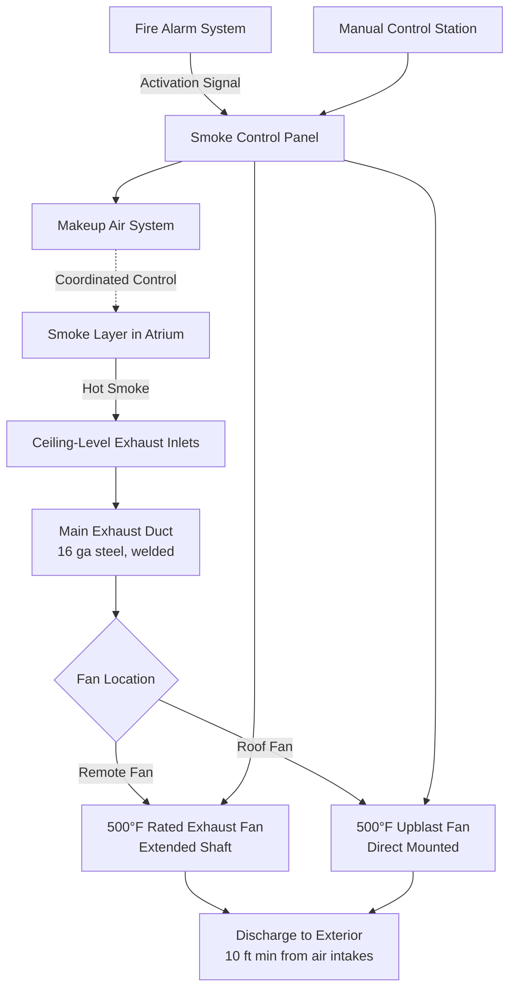

Smoke exhaust systems provide active smoke removal from large volume spaces during fire events, maintaining tenable conditions for occupant egress and firefighting operations. These systems must operate reliably under elevated temperature conditions while removing sufficient smoke mass to prevent layer descent below the critical height.

## Dedicated vs Shared Exhaust Configurations

### Dedicated Smoke Exhaust Systems

Dedicated smoke exhaust systems operate exclusively for smoke control purposes. These configurations provide the highest reliability because no conflicts exist with normal HVAC operations.

**Advantages:**
- No interference from HVAC control sequences
- Simplified control logic and testing procedures
- Equipment sized specifically for smoke control loads
- No contamination of building HVAC during testing
- Clear delineation of maintenance responsibilities

**Design considerations:**
- Higher first cost due to separate equipment
- Additional space requirements for dedicated fans and ductwork
- Periodic testing required to verify operational readiness
- Potential for equipment deterioration during long standby periods

### Shared HVAC/Smoke Exhaust Systems

Shared systems utilize existing HVAC equipment for smoke exhaust by switching operational modes during fire events. This approach reduces capital costs but introduces control complexity.

**Requirements for shared systems:**
- All components in smoke path rated for elevated temperatures
- Override controls to disable economizer and normal sequences
- Interlock verification to prevent conflicting damper positions
- Separate power supply or emergency power for smoke mode
- Quarterly functional testing to verify mode switching

The shared approach applies primarily to air handling units serving atriums where the normal return air path can extract smoke. Supply fans must shut down to prevent pressurization that opposes exhaust flow.

## Exhaust Capacity Calculations

NFPA 92 provides the fundamental relationship between heat release rate, exhaust flow, and smoke layer position. The required volumetric exhaust flow depends on the convective heat release rate and the desired smoke layer height.

The mass flow rate of smoke generated by the fire plume is:

$$\dot{m}_p = 0.071 Q_c^{1/3} (z - z_0)^{5/3} + 0.0018 Q_c$$

Where:
- $\dot{m}_p$ = plume mass flow rate (kg/s)
- $Q_c$ = convective heat release rate (kW)
- $z$ = height above fire source to smoke layer interface (m)
- $z_0$ = virtual origin height (m)

For steady-state conditions, exhaust mass flow must equal plume mass flow. The volumetric exhaust flow at the exhaust inlet becomes:

$$\dot{V} = \frac{\dot{m}_p}{\rho_s}$$

Where $\rho_s$ is smoke density at the layer temperature, calculated from:

$$\rho_s = \frac{353}{T_s}$$

With $T_s$ in Kelvin. For practical design, NFPA 92 provides tabulated exhaust flow rates for various fire sizes and clear heights.

### Air Change Method

An alternative simplified approach uses air change rates. For spaces with ceiling heights above 6 m (20 ft), minimum exhaust rates are:

| Clear Height | Minimum Air Changes per Hour |
|--------------|------------------------------|
| 6-9 m (20-30 ft) | 4-6 ACH |
| 9-15 m (30-50 ft) | 6-10 ACH |
| Above 15 m (50 ft) | 8-12 ACH |

Calculate volumetric flow:

$$Q = \frac{V \times ACH}{60}$$

Where:
- $Q$ = exhaust flow rate (CFM or m³/min)
- $V$ = space volume (ft³ or m³)
- $ACH$ = air changes per hour

This method provides conservative results but may oversize systems for very large volumes.

## High-Temperature Fan Specifications

Smoke exhaust fans must operate under elevated temperature conditions created by the hot smoke layer. NFPA 92 and building codes mandate temperature ratings based on fan location relative to the smoke zone.

### Temperature Rating Classifications

**250°F (121°C) Rated Fans:**
- Minimum rating for fans outside the smoke zone
- Suitable for ducted exhaust with heat dissipation through ductwork
- Acceptable for remote fans drawing from ceiling-level exhaust points
- Construction includes high-temperature motor insulation and bearings
- Test certification per AMCA 210 at elevated temperature

**500°F (260°C) Rated Fans:**
- Required for fans within the smoke zone or direct-mounted applications
- Necessary for exhaust points directly above the fire plume region
- Construction features include:
  - Cast iron or steel housing construction
  - High-temperature motor cooling provisions
  - Ceramic fiber insulation for motor compartments
  - Extended shaft configurations to isolate motor from hot gas stream
  - Special high-temperature bearings and lubricants

### Fan Selection Table

| Application | Temperature Rating | Motor Configuration | Typical Construction |
|-------------|-------------------|---------------------|---------------------|
| Ducted exhaust, fan remote from smoke zone | 250°F, 1 hour | Direct drive or belt drive | Heavy gauge steel, high-temp motor |
| Ducted exhaust, fan in smoke zone | 500°F, 1 hour | Belt drive with motor isolation | Cast construction, extended shaft |
| Ceiling exhaust fan, direct-mounted | 500°F, 1-2 hours | Extended shaft, external motor | Cast housing, ceramic insulation |
| Roof-mounted upblast | 300-500°F | Direct drive or belt drive | Aluminum or steel, weatherproof |

The temperature rating duration (typically 1 or 2 hours) must align with the building's fire resistance rating and duration of required smoke control operation.

## Ductwork and Component Ratings

All components in the smoke exhaust airstream require temperature ratings consistent with expected smoke temperatures.

### Ductwork Construction

Exhaust ductwork from smoke zones to exhaust fans must be:
- Constructed of 16-gauge steel minimum for ducts up to 24" diameter
- Continuously welded or sealed with high-temperature sealant
- Supported by non-combustible hangers rated for thermal expansion
- Insulated on exterior where passing through non-fire-rated spaces
- Sloped to drain condensate if system operates in standby mode

### Dampers and Control Devices

Motorized dampers in smoke exhaust paths require:
- UL 555S listing for smoke dampers with elevated temperature rating
- Fail-safe actuators with battery backup or spring return
- Position indication switches for BAS monitoring
- Annual inspection and testing per NFPA 105

Fire/smoke dampers are **not** installed in dedicated smoke exhaust ductwork, as their closure would defeat smoke removal. Only isolation dampers at system boundaries require fire ratings.

## Exhaust System Configuration

## Makeup Air Coordination

Effective exhaust operation requires coordinated makeup air to replace the exhausted smoke volume. Without adequate makeup air, the building envelope creates resistance that reduces exhaust flow and may cause pressure differentials that draw smoke into unintended areas.

**Makeup air requirements:**
- Volumetric flow rate 75-100% of exhaust rate
- Low-level introduction to avoid disturbing smoke layer
- Mechanically supplied for spaces without adequate natural openings
- Temperature considerations for winter conditions (heating may be required)
- Control interlocked with exhaust fan operation

The pressure differential between the smoke zone and adjacent spaces should remain slightly negative (5-15 Pa) to prevent smoke migration, while avoiding excessive negative pressure that impedes exhaust flow.

## Testing and Commissioning

Functional testing verifies system capacity and control sequence operation:

1. **Airflow verification:** Measure actual exhaust flow and compare to design requirements
2. **Temperature rating confirmation:** Verify nameplate ratings of all components in smoke path
3. **Control sequence testing:** Activate system and verify all dampers, fans, and interlocks operate correctly
4. **Makeup air coordination:** Confirm makeup air system activates with proper timing and flow rate
5. **Emergency power transfer:** Test automatic transfer to emergency power source
6. **Manual override testing:** Verify firefighter control station can override automatic sequences

Annual testing per NFPA 92 ensures continued operational readiness. Documentation of all test results provides the basis for acceptance by the Authority Having Jurisdiction.
