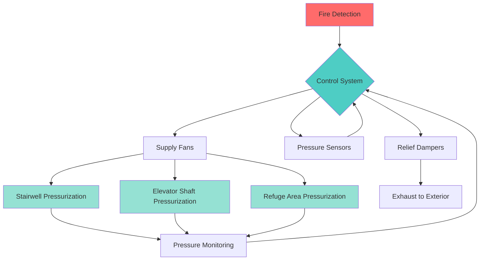
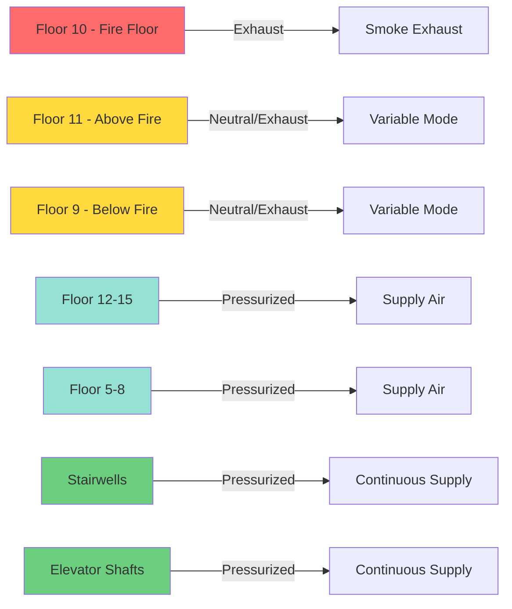

## Fundamental Principles

Pressurization systems create positive pressure differentials to prevent smoke migration into protected egress paths and refuge areas. The system maintains higher pressure in protected zones relative to adjacent fire zones, establishing airflow barriers that prevent smoke infiltration during fire events.

**Primary objectives:**
- Maintain minimum pressure differentials across smoke barriers
- Limit door opening forces to code-compliant levels
- Provide reliable protection under varying building conditions
- Operate effectively with multiple doors open simultaneously

## Pressure Differential Requirements

NFPA 92 establishes minimum pressure differentials based on application and door status.

| Application | Minimum Pressure (in. w.c.) | Maximum Pressure (in. w.c.) | Door Force Limit (lbf) |
|-------------|----------------------------|----------------------------|----------------------|
| Stairwells (all doors closed) | 0.05 | 0.10 | 30 |
| Stairwells (single door open) | 0.05 across closed doors | — | 30 |
| Elevator shafts | 0.05 | 0.12 | — |
| Refuge areas | 0.05 | 0.10 | 30 |
| Elevator lobbies (pressurized) | 0.05 | 0.08 | 30 |

The door opening force relationship derives from pressure differential:

$$F = \frac{\Delta P \cdot A \cdot W}{2(W - d)}$$

Where:
- $F$ = door opening force (lbf)
- $\Delta P$ = pressure differential (psf)
- $A$ = door area (ft²)
- $W$ = door width (ft)
- $d$ = distance from doorknob to hinge (ft)

Converting pressure units:

$$\Delta P_{psf} = \Delta P_{iwc} \times 5.2$$

For a 3 ft × 7 ft door with 0.10 in. w.c. differential and typical hardware geometry, opening force approaches the 30 lbf limit, necessitating pressure modulation or relief mechanisms.

## System Configurations

### Stairwell Pressurization

Single-injection systems supply air at the top of the stairwell, relying on stack effect and leakage distribution. Multi-injection systems provide supply air at multiple levels to achieve uniform pressure distribution in tall buildings.

Airflow requirements based on leakage area and door openings:

$$Q = Q_{leak} + Q_{door}$$

Where:

$$Q_{leak} = 2610 \cdot A_L \cdot \sqrt{\Delta P}$$

- $Q_{leak}$ = leakage airflow (cfm)
- $A_L$ = total leakage area (ft²)
- $\Delta P$ = pressure differential (in. w.c.)

Door opening airflow:

$$Q_{door} = 1.8 \cdot A_{door} \cdot \sqrt{\Delta P}$$

- $A_{door}$ = open door area (ft²)

### Elevator Shaft Pressurization

Elevator shafts require higher maximum pressures (0.12 in. w.c.) due to less stringent force limitations. Supply fans activate on fire alarm, pressurizing the shaft to prevent smoke infiltration through elevator doors and hoistway penetrations.

**Critical considerations:**
- Elevator recall to designated floors before pressurization
- Pressure relief dampers prevent overpressurization
- Lobby pressurization coordination for sandwich systems
- Mechanical ventilation of elevator machine rooms

### Zoned Pressurization Systems

Zoned systems divide buildings into pressure zones, pressurizing non-fire zones while exhausting or maintaining neutral pressure on fire floors. This approach provides superior smoke containment in high-rise buildings.

## Sandwich Pressurization

Sandwich pressurization simultaneously pressurizes floors above and below the fire floor while exhausting or maintaining neutral pressure on the fire floor and immediately adjacent floors. This creates vertical pressure barriers preventing vertical smoke migration.

**Typical sandwich configuration:**
- Fire floor: exhaust mode
- Fire floor ± 1: neutral or slight exhaust
- Fire floor ± 2 and beyond: pressurized to 0.05-0.08 in. w.c.
- Stairwells and elevator shafts: continuously pressurized to 0.05-0.10 in. w.c.

Pressure profile equation across sandwich zone:

$$\Delta P_i = \Delta P_{target} - \frac{Q_{leak,i}^2}{(2610 \cdot A_{L,i})^2}$$

Where $i$ represents each floor level in the sandwich zone.

## Pressure Modulation and Control

Barometric pressure relief dampers open automatically at preset pressure thresholds, preventing excessive pressure buildup. Modern systems employ electronic pressure modulation using:

**Variable speed drive (VSD) control:**

$$N_{fan} = N_{design} \cdot \sqrt{\frac{\Delta P_{target}}{\Delta P_{measured}}}$$

Where:
- $N_{fan}$ = fan speed adjustment (%)
- $N_{design}$ = design fan speed (%)
- Pressure values in consistent units

**Modulating relief dampers:**
- Continuously adjust opening position based on pressure feedback
- Provide faster response than barometric dampers
- Enable tighter pressure control tolerance

**Multi-stage supply control:**
- Activate multiple supply fans in sequence
- Accommodate varying door opening scenarios
- Reduce energy consumption in partial-load conditions

## Airflow Calculation Summary

| Parameter | Typical Value | Design Range |
|-----------|--------------|--------------|
| Stairwell leakage area | 0.10 ft²/floor | 0.05-0.20 ft²/floor |
| Elevator shaft leakage | 0.15 ft²/floor | 0.10-0.25 ft²/floor |
| Door leakage (closed) | 0.35 ft²/door | 0.25-0.50 ft²/door |
| Single door open airflow | 800-1200 cfm | Varies with ΔP |
| Supply fan capacity safety factor | 1.25-1.5 | Per NFPA 92 |

Total system capacity must accommodate simultaneous door openings per NFPA 92 requirements, typically one door per five floors or minimum two doors.

## Testing and Commissioning

**Pre-functional verification:**
1. Verify supply fan capacity and pressure delivery at design conditions
2. Confirm pressure sensor calibration and location accuracy
3. Test relief damper operation and setpoints
4. Verify control sequence programming matches design intent

**Functional performance testing:**
1. Measure pressure differentials with all doors closed
2. Test pressure maintenance with design number of doors open
3. Verify door opening forces meet 30 lbf maximum
4. Confirm response time from fire alarm signal to target pressure

**Acceptance criteria:**
- Minimum pressure differential maintained: ≥0.05 in. w.c.
- Maximum pressure differential: ≤ specified limit
- Door opening force: ≤30 lbf
- Time to pressurization: ≤60 seconds from alarm

## System Reliability Considerations

**Redundancy provisions:**
- Dual supply fans with automatic failover capability
- Emergency power connections for all pressurization equipment
- Backup barometric dampers if primary control fails
- Manual override controls accessible to fire department

**Maintenance requirements:**
- Quarterly pressure differential verification
- Semi-annual supply fan performance testing
- Annual full system functional test with simulated fire conditions
- Relief damper operation verification quarterly

Properly designed pressurization systems provide effective smoke control when integrated with overall building fire protection strategies, maintaining tenable egress conditions throughout fire events.
