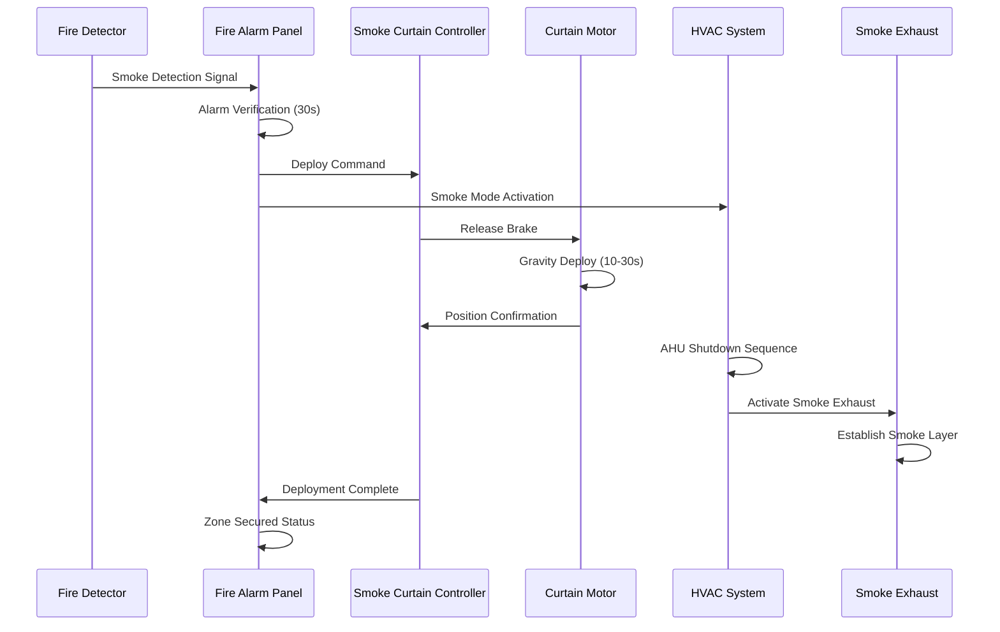
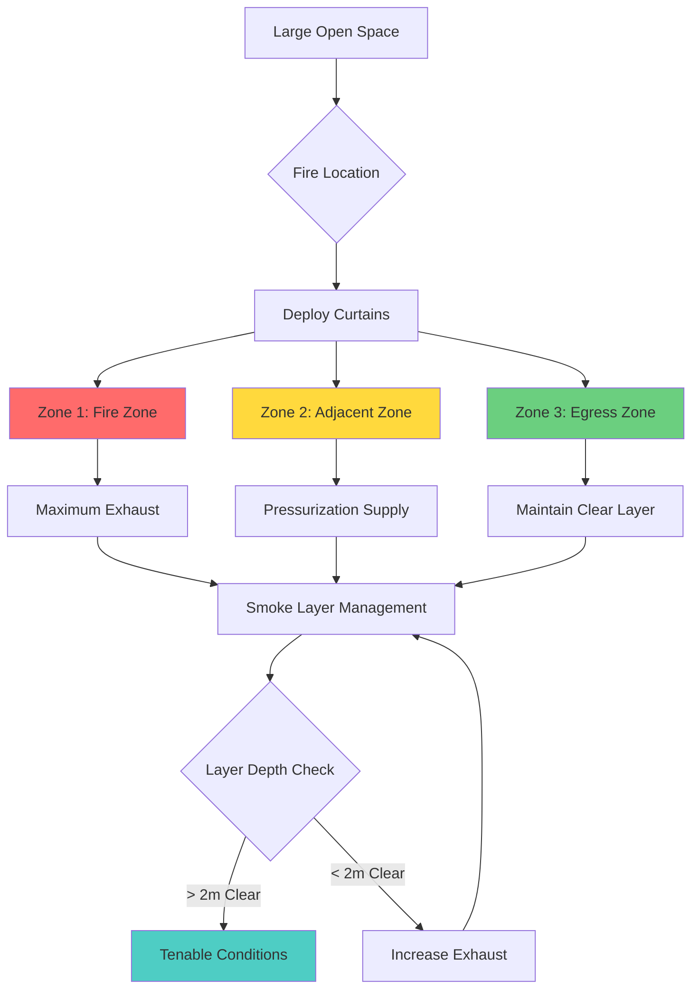

## Introduction

Smoke curtains are fire-rated, flexible barriers that deploy automatically to compartmentalize large open spaces during fire events. These systems create smoke containment zones that work in coordination with mechanical smoke control to maintain tenable conditions in egress paths and areas of refuge. Smoke curtains are critical in spaces where traditional fixed walls are impractical—such as atriums, shopping malls, airports, and convention centers.

The effectiveness of smoke curtain systems depends on proper integration with fire alarm systems, smoke detection networks, and HVAC smoke control sequences. NFPA 92 provides the engineering basis for smoke curtain application in large-volume spaces.

## Physical Principles of Smoke Containment

### Smoke Layer Stratification

Smoke curtains function by creating physical boundaries that prevent lateral smoke migration while allowing stratified smoke layers to develop. The depth of the smoke layer beneath the curtain is governed by the mass flow rate of smoke and the extraction rate:

$$
z_s = h - \left(\frac{\dot{m}_s}{\rho_\infty \cdot A \cdot \sqrt{2g(h-z_s)}}\right)
$$

Where:
- $z_s$ = height of smoke layer interface above floor (m)
- $h$ = total ceiling height or curtain depth (m)
- $\dot{m}_s$ = smoke mass flow rate (kg/s)
- $\rho_\infty$ = ambient air density (kg/m³)
- $A$ = area of smoke zone (m²)
- $g$ = gravitational acceleration (9.81 m/s²)

### Smoke Plume Containment Volume

The required containment volume beneath the smoke layer must accommodate the smoke production rate. For a steady-state t-squared fire:

$$
V_{smoke} = \frac{\dot{Q}_c}{\rho_\infty \cdot c_p \cdot \Delta T} \cdot t_{RSET}
$$

Where:
- $V_{smoke}$ = smoke containment volume (m³)
- $\dot{Q}_c$ = convective heat release rate (kW)
- $c_p$ = specific heat of air (1.005 kJ/kg·K)
- $\Delta T$ = temperature rise of smoke layer (K)
- $t_{RSET}$ = required safe egress time (s)

### Curtain Leakage and Smoke Migration

Real smoke curtains exhibit leakage at perimeter edges and through the fabric. The leakage flow rate depends on the pressure differential:

$$
\dot{V}_{leak} = C_d \cdot A_{gap} \cdot \sqrt{\frac{2\Delta p}{\rho_\infty}}
$$

Where:
- $\dot{V}_{leak}$ = volumetric leakage rate (m³/s)
- $C_d$ = discharge coefficient (typically 0.6-0.7)
- $A_{gap}$ = total leakage area (m²)
- $\Delta p$ = pressure difference across curtain (Pa)

## Smoke Curtain Deployment Sequence

## Smoke Curtain Zone Configuration

## Design Specifications

### Curtain Performance Requirements

| Parameter | Specification | Standard Reference |
|-----------|--------------|-------------------|
| Fire Resistance Rating | 30-120 minutes | ASTM E163, UL 2021 |
| Deployment Time | ≤ 30 seconds | NFPA 92, Section 4.5.3 |
| Descent Velocity | 0.1 - 0.3 m/s | Manufacturer specification |
| Fabric Temperature Rating | ≥ 600°C (1112°F) | NFPA 92, Section 4.5.2 |
| Leakage Rate | ≤ 5 m³/s per 100m perimeter at 25 Pa | NFPA 92, Annex D |
| Minimum Clear Height | 2.0 m (6.6 ft) | Building code requirement |
| Wind Load Resistance | Per building exposure category | ASCE 7 |
| Seismic Restraint | Per local seismic zone | ASCE 7, IBC |

### Curtain Material Properties

| Property | Glass Fiber | Silicone-Coated Fiber | Stainless Steel Mesh |
|----------|-------------|----------------------|---------------------|
| Weight | 500-800 g/m² | 600-900 g/m² | 1200-1800 g/m² |
| Thickness | 0.5-0.8 mm | 0.6-1.0 mm | 1.5-2.5 mm |
| Tensile Strength | 2000-3000 N/50mm | 2500-4000 N/50mm | 5000-8000 N/50mm |
| Max Width | 6 m | 6 m | 4 m |
| Service Life | 15-20 years | 20-25 years | 25-30 years |
| Cost Factor | 1.0× | 1.3× | 2.5× |

## HVAC Coordination Requirements

### Exhaust Capacity per Zone

The smoke exhaust rate must exceed the smoke production rate adjusted for leakage:

$$
\dot{V}_{exh} = \dot{V}_{plume} + \dot{V}_{leak} + \dot{V}_{makeup}
$$

Where:
- $\dot{V}_{exh}$ = total exhaust capacity (m³/s)
- $\dot{V}_{plume}$ = smoke plume volume flow (m³/s)
- $\dot{V}_{leak}$ = curtain leakage (m³/s)
- $\dot{V}_{makeup}$ = makeup air requirement (m³/s)

### Pressure Differential Management

Smoke curtains create pressure zones that must be managed to prevent smoke backdraft:

$$
\Delta p_{zone} = \frac{\rho_\infty}{2} \left(\frac{\dot{V}_{exh}}{A_{effective}}\right)^2 - \rho_s g h_s
$$

Where:
- $\Delta p_{zone}$ = pressure differential across zone (Pa)
- $A_{effective}$ = effective flow area (m²)
- $\rho_s$ = smoke density (kg/m³)
- $h_s$ = smoke layer depth (m)

### Control Sequence Integration

**Pre-Alarm State:**
- Normal HVAC operation
- Curtains retracted in housing
- Smoke detection active

**Alarm Verification (0-30s):**
- Fire alarm panel verifies detection
- HVAC enters standby mode
- Curtain controllers armed

**Deployment Phase (30-60s):**
- Curtains deploy to design height
- Supply air systems shutdown
- Exhaust fans activate with time delay
- Adjacent zones enter pressurization mode

**Smoke Management Phase (60s+):**
- Maintain smoke layer at ≥ 2m clear height
- Modulate exhaust rates per zone conditions
- Monitor curtain position and integrity
- Provide makeup air to prevent excessive negative pressure

## Installation and Testing Considerations

### Critical Installation Parameters

1. **Header Beam Attachment:** Curtain housing must attach to structural members capable of supporting 1.5× the dead load plus wind loads.

2. **Edge Seals:** Perimeter gaps must not exceed 25 mm (1 inch) to maintain leakage specifications.

3. **Guide Rail Alignment:** Vertical guides must be plumb within ±5 mm over the full deployment height.

4. **Retention Systems:** Bottom bar retention force must be sufficient to prevent blow-through at design pressure differentials.

### Commissioning Tests

| Test Type | Acceptance Criteria | Frequency |
|-----------|-------------------|-----------|
| Deployment Speed | 10-30 seconds full travel | Initial + Annual |
| Position Verification | ±50 mm of design height | Initial + Annual |
| Edge Seal Integrity | Visual inspection, no gaps > 25mm | Initial + Annual |
| Fire Alarm Integration | Deploy within 5s of signal | Initial + Annual |
| Smoke Exhaust Coordination | Exhaust activates within 15s of deployment | Initial |
| Emergency Manual Release | Functional operation | Initial + Semi-annual |
| Retraction Function | Complete retraction without binding | Initial + Annual |

## Design Limitations and Special Considerations

**Ceiling Height Limitations:** Curtains are effective up to approximately 15-20m ceiling height. Above this, smoke buoyancy may overcome containment effectiveness.

**Air Velocity Constraints:** Excessive air velocities (> 1 m/s) near deployed curtains can disrupt smoke layer stratification and cause mixing.

**Makeup Air Location:** Makeup air inlets must be positioned low in the space to avoid disrupting the smoke layer interface.

**Multiple Curtain Coordination:** In multi-zone configurations, curtain deployment must be sequenced to prevent pressure transients that could blow smoke into protected areas.

**Maintenance Access:** Curtain housings require access for inspection, testing, and fabric replacement without disrupting building operations.

## Conclusion

Smoke curtains are engineered fire protection systems that require careful integration with mechanical smoke control, fire alarm systems, and building HVAC. The design must account for smoke production rates, curtain leakage, pressure management, and coordination with exhaust systems. Proper specification, installation, and testing per NFPA 92 ensures these systems perform as intended during fire events, maintaining tenable conditions in egress paths and protecting building occupants.
