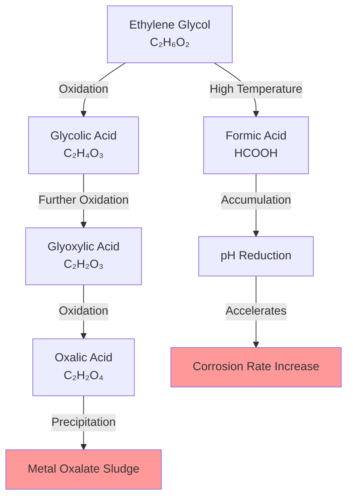
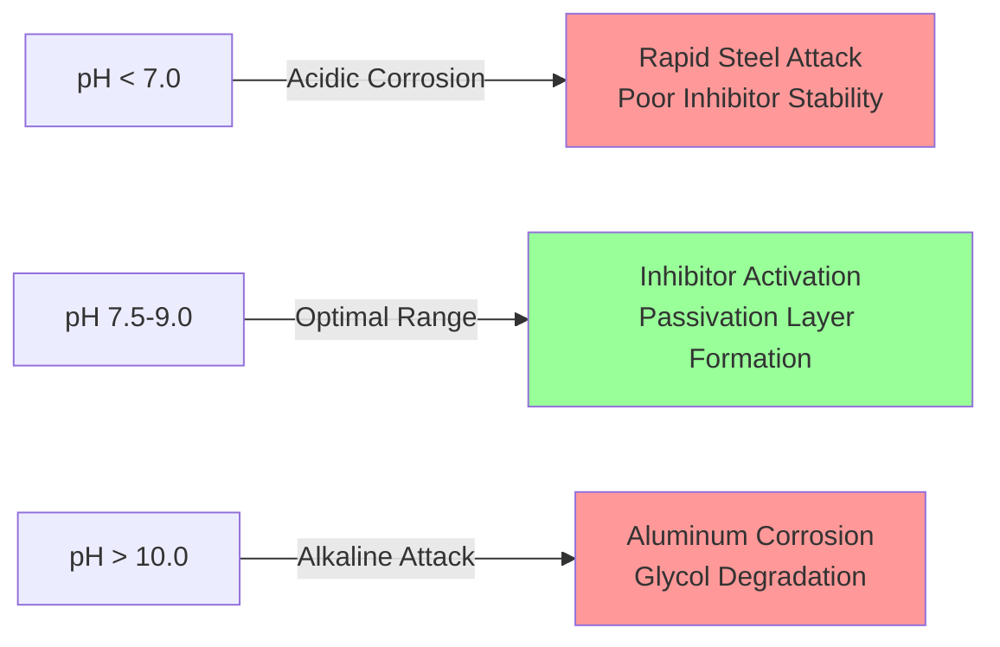
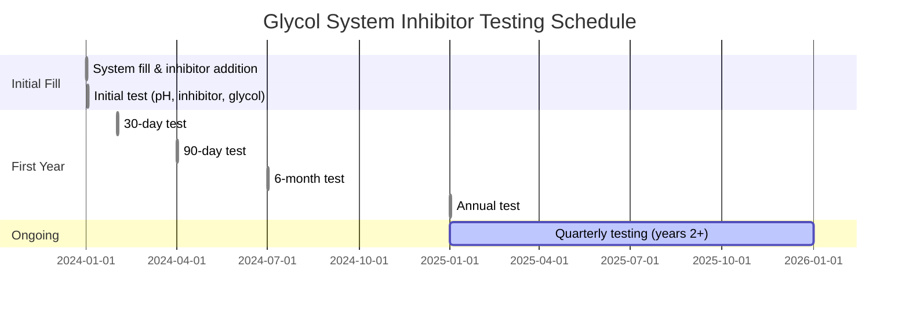

Corrosion inhibitors constitute critical chemical additives in glycol-based snow melting and freeze protection systems. Without proper inhibition, glycol degradation and electrochemical corrosion processes destroy system components, leading to fluid contamination, heat transfer losses, and catastrophic equipment failure. Understanding inhibitor chemistry, degradation mechanisms, and maintenance requirements ensures long-term system integrity.

## Corrosion Mechanisms in Glycol Systems

### Electrochemical Corrosion Fundamentals

Galvanic corrosion occurs when dissimilar metals exist in an electrolytic solution. The corrosion current density follows the Stern-Geary equation:

$$i_{corr} = \frac{B}{R_p}$$

where $i_{corr}$ represents corrosion current density (µA/cm²), $B$ is the Stern-Geary constant (typically 26 mV for active corrosion), and $R_p$ is polarization resistance (Ω·cm²).

The mass loss rate from corrosion follows Faraday's law:

$$m = \frac{i_{corr} \cdot t \cdot M}{n \cdot F}$$

where $m$ is mass loss (g), $t$ is time (s), $M$ is atomic mass (g/mol), $n$ is valence electrons transferred, and $F$ is Faraday's constant (96,485 C/mol).

### Glycol Oxidation Chemistry

Glycol oxidation produces acidic byproducts that accelerate corrosion. The primary degradation pathway for ethylene glycol:

The oxidation rate increases exponentially with temperature following the Arrhenius relationship:

$$k = A \cdot e^{-E_a/(R \cdot T)}$$

where $k$ is the reaction rate constant, $A$ is the pre-exponential factor, $E_a$ is activation energy (typically 50-70 kJ/mol for glycol oxidation), $R$ is the gas constant (8.314 J/mol·K), and $T$ is absolute temperature (K).

This temperature dependence explains why glycol degradation accelerates at elevated system temperatures above 180°F (82°C).

## Inhibitor Package Components

### Primary Inhibitor Chemistries

Commercial inhibitor packages contain multiple active ingredients providing complementary protection mechanisms:

| Inhibitor Type | Chemical Examples | Protection Mechanism | Metals Protected |
|---------------|-------------------|---------------------|------------------|
| Azoles | Benzotriazole (BTA), Tolyltriazole (TTA) | Chemisorbed barrier film formation | Copper, brass, bronze |
| Phosphates | Sodium phosphate, Sodium molybdate | Passivation layer development | Ferrous metals, aluminum |
| Benzoates | Sodium benzoate | Anodic inhibition | Steel, cast iron |
| Borates | Sodium tetraborate | pH buffering, aluminum protection | Aluminum alloys |
| Silicates | Sodium silicate | Protective silicate film | All metals |
| Nitrites | Sodium nitrite | Anodic passivation | Steel, cast iron |

### Inhibitor Synergy Effects

Properly formulated packages exploit synergistic interactions. For example, combining azoles with phosphates provides superior copper protection compared to either component alone. The synergy factor can be quantified:

$$S = \frac{CR_{individual}}{CR_{combined}}$$

where $S$ is the synergy factor (>1 indicates synergy), $CR_{individual}$ is the sum of corrosion rates with individual inhibitors, and $CR_{combined}$ is the corrosion rate with the combined package. Well-designed packages achieve synergy factors of 2-4.

## pH Control Requirements

### pH Range Specification

The pH range 7.5-9.0 provides optimal inhibitor effectiveness and minimal corrosion for mixed-metal systems:

The pourbaix diagram for iron shows that passivation occurs between pH 9-13 at typical system potentials, but aluminum passivation requires pH 4-9, creating the constraint that limits acceptable pH to 7.5-9.0 for mixed-metal systems.

### pH Drift Mechanisms

pH naturally decreases during system operation due to:

1. **Glycol oxidation**: Organic acid formation (glycolic, formic, oxalic acids)
2. **CO₂ absorption**: Formation of carbonic acid from atmospheric contact
3. **Inhibitor depletion**: Consumption through protective film formation
4. **Hydrolysis**: Some inhibitor components undergo hydrolytic degradation

The pH drift rate can be approximated:

$$\frac{d(pH)}{dt} = -k_{ox} \cdot [O_2] \cdot e^{-E_a/(R \cdot T)} - k_{CO_2} \cdot A_{surface} - k_{dep}$$

where the terms represent contributions from oxidation, CO₂ absorption, and inhibitor depletion respectively.

## Material Compatibility

### Metals Compatibility Matrix

| Material | Uninhibited Glycol | Properly Inhibited | Corrosion Rate Reduction |
|----------|-------------------|-------------------|-------------------------|
| Carbon steel | 15-30 mpy | <1 mpy | 95-98% |
| Copper | 5-10 mpy | <0.2 mpy | 95-98% |
| Cast iron | 10-25 mpy | <1 mpy | 95-96% |
| Aluminum | 2-8 mpy | <0.5 mpy | 85-94% |
| Brass (70/30) | 3-7 mpy | <0.2 mpy | 95-97% |
| Stainless steel | <1 mpy | <0.1 mpy | Minimal improvement |

*mpy = mils per year (0.001 inch/year)*

### Non-Metallic Material Considerations

Inhibitor packages must remain compatible with elastomers, gaskets, and seals:

**Compatible Materials:**
- EPDM (ethylene propylene diene monomer)
- Fluorocarbon elastomers (Viton)
- PTFE (Teflon)
- Chloroprene (Neoprene)

**Incompatible Materials:**
- Natural rubber (degradation and swelling)
- Nitrile (NBR) with high glycol concentrations
- Most PVC compounds (plasticizer extraction)
- Zinc-galvanized surfaces (zinc corrosion above pH 8.5)

## Testing Requirements and Protocols

### ASTM D1384 Glassware Corrosion Test

The industry-standard ASTM D1384 test evaluates inhibitor effectiveness under controlled conditions:

**Test Parameters:**
- Temperature: 190°F (88°C)
- Duration: 336 hours (2 weeks)
- Metal coupons: Copper, solder, brass, steel, cast iron, aluminum
- Pass criteria: All metals <1 mg/cm²/week weight loss

The test severity factor relative to field conditions:

$$SF = \frac{t_{field}}{t_{test}} \cdot e^{E_a/R \cdot (1/T_{test} - 1/T_{field})}$$

For typical conditions (160°F field, 190°F test), the severity factor is approximately 15-20, meaning 336 test hours represents 5,000-7,000 hours of field exposure.

### Field Testing Schedule

### Required Test Parameters

| Parameter | Test Method | Acceptable Range | Action Limit |
|-----------|------------|------------------|--------------|
| pH | ASTM E70 (pH meter) | 7.5-9.0 | <7.0 or >10.0 |
| Reserve alkalinity | ASTM D1121 | >2.0 mL 0.1N HCl/10mL | <1.5 mL |
| Inhibitor concentration | Ion chromatography | 95-105% initial | <80% initial |
| Glycol concentration | Refractometer/Hydrometer | ±2% design | >5% deviation |
| Chloride content | ASTM D512 | <25 ppm | >50 ppm |
| Iron content | ASTM D1068 | <10 ppm | >50 ppm |
| Copper content | ASTM D1688 | <0.1 ppm | >1.0 ppm |

### Interpretation of Test Results

**pH Below 7.0:** Indicates glycol degradation and acid formation. Immediate fluid replacement required, investigate oxygen ingress sources.

**High Iron Content (>50 ppm):** Active steel corrosion occurring. Check inhibitor concentration, pH, and system for dissolved oxygen entry points.

**High Copper Content (>1 ppm):** Copper corrosion, often indicating low azole inhibitor concentration or excessive pH (>10.5).

**Low Reserve Alkalinity:** Buffering capacity exhausted. Inhibitor package cannot maintain pH; replacement imminent.

## Inhibitor Replenishment and Maintenance

### Depletion Mechanisms

Inhibitor concentration decreases through:

1. **Adsorption**: Permanent attachment to metal surfaces forming protective films
2. **Oxidation**: Chemical degradation of organic inhibitor components
3. **Precipitation**: Formation of insoluble metal-inhibitor complexes
4. **Thermal decomposition**: Breakdown at elevated temperatures
5. **Physical loss**: Removal during system draining or leakage

### Supplemental Inhibitor Addition

When testing reveals inhibitor depletion below 80% initial concentration:

$$V_{add} = \frac{V_{system} \cdot (C_{target} - C_{current})}{C_{supplement}}$$

where $V_{add}$ is volume of supplemental inhibitor required, $V_{system}$ is total system volume, $C_{target}$ is desired final concentration, $C_{current}$ is measured concentration, and $C_{supplement}$ is concentration of supplemental inhibitor solution.

**Critical Considerations:**
- Use only manufacturer-compatible supplements
- Never mix different inhibitor package chemistries
- Test 48 hours after addition to verify proper mixing
- Document all additions for maintenance records

## System Contamination and Failure Modes

### Common Contaminants

**Chlorides:** Enter through makeup water, cleaning chemicals, or deicing salt infiltration. Accelerate pitting corrosion of stainless steel and aluminum. Maximum allowable: 25 ppm.

**Sulfates:** Indicate biological activity or water contamination. Can precipitate with calcium forming scale. Maximum: 50 ppm.

**Calcium/Magnesium:** Hard water contamination. Forms precipitates with inhibitors, reducing effectiveness. Calcium maximum: 50 ppm.

### Sludge Formation

Glycol degradation products combine with metal ions forming characteristic sludge:

**Brown/Black Sludge:** Iron oxide and organic acid complexes. Indicates steel corrosion and glycol oxidation.

**Green/Blue Sludge:** Copper salts and organic acids. Indicates copper corrosion and acidic conditions.

**White Precipitate:** Calcium or aluminum salts. Indicates hard water contamination or excessive pH with aluminum components.

The sludge accumulation rate:

$$\frac{dm_{sludge}}{dt} = k_{corr} \cdot A_{surface} \cdot \rho_{metal} + k_{precip} \cdot V_{fluid}$$

representing contributions from corrosion products and chemical precipitation.

## Best Practices for System Longevity

1. **Proper initial fill**: Use deionized or demineralized water to minimize contaminant introduction
2. **Glycol quality**: Purchase pre-inhibited glycol from reputable manufacturers meeting ASTM D1384 and D3306 standards
3. **Air elimination**: Install automatic air vents and maintain positive system pressure to exclude oxygen
4. **Temperature control**: Limit fluid temperature to <180°F (82°C) to minimize glycol degradation
5. **Filtration**: Install 100-200 mesh strainers to capture particulates and sludge
6. **Testing frequency**: Quarterly minimum, monthly during first year or after system modifications
7. **Record keeping**: Document all test results, inhibitor additions, and fluid changes
8. **Replacement criteria**: Replace fluid when pH cannot be maintained above 7.0, reserve alkalinity <1.5 mL, or inhibitor concentration <80% despite supplemental additions

## References

- ASTM D1384: Standard Test Method for Corrosion Test for Engine Coolants in Glassware
- ASTM D3306: Standard Specification for Glycol Base Engine Coolant for Automobile and Light Duty Service
- ASTM D1121: Standard Test Method for Reserve Alkalinity of Engine Coolants and Antirusts
- ASHRAE Handbook—HVAC Systems and Equipment, Chapter 13: Hydronic Heating and Cooling
- SAE J1034: Automotive and Commercial Refrigerant Recovery/Recycling Equipment

---

**Critical Takeaway:** Corrosion inhibitors transform glycol from a corrosive fluid into a system-protective solution. However, inhibitors deplete through adsorption, oxidation, and thermal degradation. Regular testing and proper maintenance ensure the chemical environment remains within protective parameters, preventing the exponential increase in corrosion rates that occurs when inhibitor concentration falls below critical thresholds.
