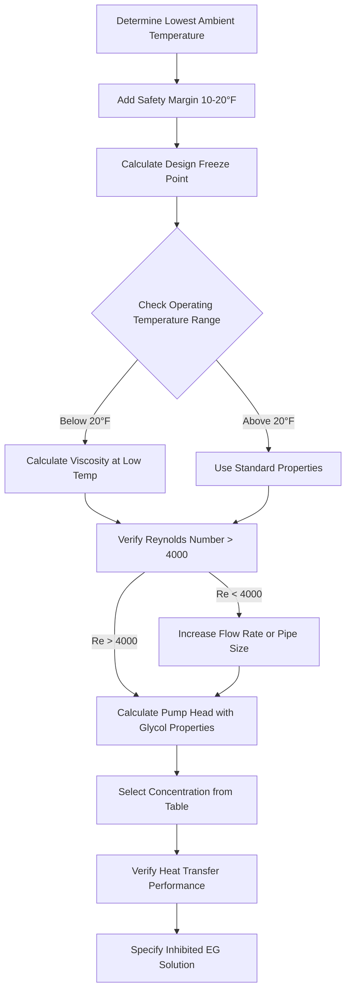
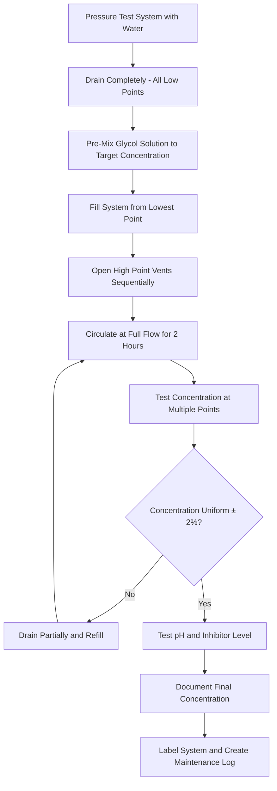

Ethylene glycol (EG) represents the highest-performance antifreeze solution for closed-loop HVAC systems, offering superior heat transfer characteristics and lower viscosity compared to propylene glycol. Despite these thermal advantages, toxicity concerns restrict ethylene glycol applications to industrial systems, district heating networks, and installations with absolute isolation from potable water sources.

## Molecular Properties and Thermal Performance

Ethylene glycol's molecular structure directly determines its superior performance in heat transfer applications.

### Chemical and Physical Properties

**Molecular Formula:** C₂H₆O₂ (1,2-ethanediol)

**Molecular Weight:** 62.07 g/mol

The smaller molecular weight compared to propylene glycol (76.09 g/mol) results in lower viscosity at equivalent concentrations, reducing pumping energy and enhancing heat transfer coefficient.

**Pure Ethylene Glycol Properties at 77°F (25°C):**

| Property | Value | Units |
|----------|-------|-------|
| Density | 1.113 | g/cm³ |
| Specific heat | 0.58 | Btu/(lb·°F) |
| Thermal conductivity | 0.153 | Btu/(hr·ft·°F) |
| Absolute viscosity | 16.1 | cP |
| Kinematic viscosity | 14.5 | cSt |
| Boiling point | 387.1 | °F (197.3°C) |
| Flash point | 232 | °F (111°C) |
| Autoignition temperature | 752 | °F (400°C) |

### Heat Transfer Advantages

Ethylene glycol solutions demonstrate measurably superior heat transfer performance compared to propylene glycol at equivalent freeze protection levels.

#### Thermal Conductivity Comparison

The thermal conductivity of antifreeze solutions affects the convective heat transfer coefficient in tube-side flows. For 40% by volume solutions at 50°F:

- **Ethylene glycol**: 0.245 Btu/(hr·ft·°F)
- **Propylene glycol**: 0.221 Btu/(hr·ft·°F)
- **Performance advantage**: 10.9% higher thermal conductivity

This conductivity advantage translates to higher Nusselt numbers in forced convection applications.

#### Viscosity Performance

Lower viscosity reduces pumping energy and enhances turbulent heat transfer. At 40°F with 40% concentration:

| Fluid | Viscosity (cP) | Pumping Energy Ratio |
|-------|----------------|---------------------|
| Water | 1.55 | 1.00 |
| Ethylene glycol (40%) | 5.2 | 3.35 |
| Propylene glycol (40%) | 8.9 | 5.74 |

**Result:** Ethylene glycol requires 42% less pumping energy than propylene glycol at equivalent freeze protection.

#### Heat Transfer Coefficient Impact

The film coefficient for turbulent flow in tubes follows the Dittus-Boelter correlation:

$$Nu = 0.023 \cdot Re^{0.8} \cdot Pr^{0.4}$$

Where Reynolds number depends inversely on viscosity:

$$Re = \frac{\rho V D}{\mu}$$

For constant flow velocity, the lower viscosity of ethylene glycol produces:
- Higher Reynolds number (improved turbulence)
- Higher heat transfer coefficient
- Reduced heat exchanger surface area requirement (10-15% smaller than propylene glycol systems)

## Freezing Point Depression Performance

Ethylene glycol provides freeze protection through colligative property effects—the dissolved glycol molecules disrupt the crystal lattice formation of ice.

### Concentration-Freeze Point Relationship

The relationship between glycol concentration and freeze point is non-linear, with optimal performance occurring between 50-60% by volume.

**Ethylene Glycol Freeze Points by Concentration:**

| Concentration (% by volume) | Concentration (% by weight) | Freeze Point (°F) | Freeze Point (°C) | Burst Protection Point (°F) |
|----------------------------|----------------------------|-------------------|-------------------|---------------------------|
| 10 | 11.0 | 26 | -3.3 | 18 |
| 20 | 21.5 | 19 | -7.2 | 5 |
| 30 | 31.5 | 7 | -13.9 | -10 |
| 40 | 41.0 | -10 | -23.3 | -30 |
| 50 | 50.0 | -34 | -36.7 | -55 |
| 60 | 58.5 | -55 | -48.3 | -75 |
| 70 | 66.5 | -35 | -37.2 | -60 |

**Critical Design Note:** Exceeding 60% concentration actually degrades freeze protection performance due to reduced water content available for ice crystal disruption. The eutectic point (maximum freeze protection) occurs near 60% by volume.

### Burst Protection vs. Freeze Point

The solution maintains protective properties below the stated freeze point. Between the freeze point and burst protection point, the fluid transitions to a slush consistency rather than solid ice. This slush formation prevents pipe rupture through three mechanisms:

1. **Volume accommodation**: Slush compresses rather than generating expansion stress
2. **Crystal morphology**: Dendritic ice structures do not form continuous solid masses
3. **Residual liquid phase**: Concentrated glycol remains liquid between ice crystals

Design concentration should target 10-15°F below the minimum expected ambient temperature to ensure complete freeze protection.

## Concentration Selection Methodology

Proper concentration selection balances freeze protection requirements against thermal performance penalties and cost considerations.

### Design Calculation Procedure

**Step 1: Determine minimum design temperature**

$$T_{design} = T_{ambient,min} - T_{safety}$$

Where $T_{safety}$ typically ranges from 10-20°F depending on system criticality:
- Non-critical systems: 10°F safety margin
- Commercial systems: 15°F safety margin
- Critical infrastructure: 20°F safety margin

**Step 2: Select concentration from freeze point tables**

Reference ASHRAE Handbook - HVAC Systems and Equipment Chapter 21 for precise concentration values.

**Step 3: Verify thermal performance**

Calculate the thermal performance penalty:

$$Q_{glycol} = Q_{water} \cdot \frac{(c_p)_{glycol}}{(c_p)_{water}} \cdot \frac{(\rho)_{glycol}}{(\rho)_{water}}$$

**Step 4: Adjust flow rate or temperature differential**

For a 40% ethylene glycol solution:
- Specific heat: 0.88 Btu/(lb·°F) vs. 1.0 Btu/(lb·°F) for water
- Density: 1.05 vs. 1.0 for water
- **Heat capacity ratio**: 0.924 (7.6% reduction)

Compensate by increasing flow rate by 8-10% or increasing temperature differential.

### Practical Concentration Limits

**Maximum recommended concentration: 60% by volume**

Beyond 60% concentration:
- Freeze protection degrades (moving past eutectic point)
- Viscosity increases exponentially
- Specific heat decreases substantially
- Cost increases with minimal benefit
- Pump energy requirements escalate

**Minimum practical concentration: 20% by volume**

Below 20% concentration:
- Insufficient freeze protection for most climates
- Inadequate inhibitor concentration
- Minimal corrosion protection

### Temperature-Dependent Properties

Glycol solution properties vary significantly with operating temperature. Design must account for the coldest operating condition, not just freeze protection.

## Toxicity and Safety Considerations

Ethylene glycol's acute toxicity restricts its application in building systems and requires strict safety protocols in industrial installations.

### Toxicological Properties

**LD₅₀ (oral, rat):** 4,700 mg/kg

**Fatal human dose:** Approximately 100 mL (3.4 oz) for a 70 kg adult

Ethylene glycol is metabolized by alcohol dehydrogenase into toxic metabolites:
1. **Glycolic acid**: Causes metabolic acidosis
2. **Oxalic acid**: Forms calcium oxalate crystals causing renal failure
3. **Glyoxylic acid**: Contributes to acidosis

**Exposure routes:**
- Ingestion (primary concern)
- Dermal absorption (minimal)
- Inhalation (limited at ambient temperatures)

### Regulatory Restrictions

Many jurisdictions impose strict limitations on ethylene glycol use:

**International Mechanical Code (IMC):**
- Prohibits ethylene glycol in systems with potential potable water cross-connection
- Requires backflow prevention in dual-use systems
- Mandates visible identification of ethylene glycol systems

**State and Local Codes:**
- California: Restricted to industrial closed-loop systems only
- New York: Requires annual inspection documentation
- Canada: National Plumbing Code prohibits EG in potable water systems

**OSHA Requirements:**
- Material Safety Data Sheet (MSDS) readily available
- Hazard communication training for personnel
- Spill containment and cleanup procedures
- Personal protective equipment specifications

### Permitted Applications

Ethylene glycol remains acceptable and preferable in specific applications where toxicity risks are manageable:

**Industrial Closed-Loop Systems:**
- Manufacturing process cooling
- Data center heat rejection loops
- Industrial refrigeration systems
- District heating/cooling networks
- Solar thermal systems (no potable water interface)

**Critical Infrastructure:**
- Airport runway heating (no potable water proximity)
- Bridge deck heating systems
- Loading dock freeze protection
- Outdoor process piping protection

**Requirements for Ethylene Glycol Use:**

1. **Complete isolation** from potable water systems (double-wall heat exchangers, no common piping)
2. **Visible identification**: Purple/violet pipe markers, warning labels at all access points
3. **Leak detection systems** for indoor installations
4. **Secondary containment** for storage tanks and fill stations
5. **Spill response plan** with neutralization materials available
6. **Annual inspection** and documentation
7. **Trained personnel** for handling and maintenance

## System Design Considerations

Designing for ethylene glycol solutions requires specific adjustments to accommodate changed fluid properties.

### Pump Selection and Sizing

**Head Calculation Modification:**

The friction factor in the Darcy-Weisbach equation changes with Reynolds number:

$$h_f = f \cdot \frac{L}{D} \cdot \frac{V^2}{2g}$$

For ethylene glycol solutions:

1. Calculate Reynolds number: $Re = \frac{\rho V D}{\mu}$
2. Determine friction factor from Moody diagram using glycol viscosity
3. Calculate head loss with modified friction factor
4. Add 10-15% safety margin for concentration uncertainty

**Pump Curve Adjustment:**

Centrifugal pump performance changes with fluid properties:

$$H_{glycol} = H_{water} \cdot \left(\frac{\rho_{glycol}}{\rho_{water}}\right)$$

Brake horsepower increases with viscosity according to hydraulic institute standards.

### Heat Exchanger Design

**Required surface area adjustment:**

$$A_{EG} = A_{water} \cdot \frac{U_{water}}{U_{EG}}$$

For 40% ethylene glycol, the overall heat transfer coefficient typically decreases by 12-15%, requiring equivalent surface area increase.

**Tube-side design velocity:**

Maintain minimum 3 ft/s (0.9 m/s) velocity to ensure:
- Turbulent flow (Re > 4000)
- Adequate heat transfer coefficient
- Prevention of air accumulation
- Particle suspension

### Expansion Tank Sizing

Glycol solutions exhibit higher volumetric expansion than water:

**Coefficient of volumetric expansion** (40% EG): 0.00038 per °F vs. 0.00012 per °F for water

Expansion tank volume calculation:

$$V_{tank} = \frac{V_{system} \cdot \beta \cdot \Delta T}{1 - \frac{P_1}{P_2}}$$

For ethylene glycol systems, use expansion tank 15-20% larger than water-equivalent sizing.

### Fill and Purge Procedures

Proper initial fill prevents air entrapment and ensures complete concentration throughout the system.

**Critical fill considerations:**

- Never add concentrated glycol to operating system—always pre-mix to target concentration
- Use dedicated mixing equipment to ensure homogeneity
- Test concentration at supply, return, and remote points
- Document actual concentration and freeze point after final fill
- Verify all air removal before pressurizing system

## Corrosion Inhibitor Requirements

Pure ethylene glycol is mildly corrosive and degrades through oxidation, producing acidic compounds that attack system metals. Inhibitor packages protect both the fluid and the system components.

### Inhibitor Chemistry

Modern ethylene glycol HVAC formulations contain multi-component inhibitor packages:

**Ferrous Metal Protection:**
- Sodium molybdate (Na₂MoO₄): Forms protective oxide layer on steel
- Sodium nitrite (NaNO₂): Passivates iron surfaces, oxidizes to nitrate
- Typical concentration: 1500-3000 ppm

**Copper Alloy Protection:**
- Benzotriazole (BTA): Forms organometallic protective film on copper
- Tolyltriazole (TTA): Enhanced thermal stability compared to BTA
- Typical concentration: 100-500 ppm

**pH Maintenance:**
- Sodium hydroxide or potassium hydroxide
- Maintains pH between 9.0-10.5 for optimal passivation
- Buffers against acidic degradation products

**Supplementary Additives:**
- Anti-foam agents (silicone-based): Reduces surface tension, prevents air entrainment
- Dye (fluorescent yellow-green): Enables leak detection with UV light
- Bittering agent (denatonium benzoate): Discourages accidental ingestion

### Degradation Mechanisms

Ethylene glycol degrades through oxidation pathways when exposed to air, high temperatures, or catalytic metals:

**Primary Oxidation Path:**

$$\text{C}_2\text{H}_6\text{O}_2 + \text{O}_2 \xrightarrow{\text{heat, catalyst}} \text{Glycolic acid} + \text{Formic acid}$$

**Secondary Oxidation:**

$$\text{Glycolic acid} \xrightarrow{\text{continued oxidation}} \text{Oxalic acid} + \text{CO}_2$$

These organic acids reduce pH, consume alkaline inhibitor reserves, and promote corrosion.

**Thermal Decomposition:**

Above 250°F (121°C), ethylene glycol undergoes thermal cracking:
- Acetaldehyde formation
- Formaldehyde generation
- Increased acidity
- Reduced freeze protection

**Design limit:** Maintain bulk fluid temperature below 250°F; film temperatures at heat exchanger surfaces should not exceed 300°F.

### Monitoring and Maintenance

ASHRAE Standard 147-2013 establishes testing protocols for glycol-based heat transfer fluids.

**Annual Testing Requirements:**

| Parameter | Acceptable Range | Action Required if Outside Range |
|-----------|------------------|----------------------------------|
| pH | 8.5 - 10.5 | If < 8.0, replace fluid; if 8.0-8.5, test reserve alkalinity |
| Reserve alkalinity | > 50% of new fluid | Replace if < 50% of original |
| Freeze point | Design value ± 3°F | Adjust concentration |
| Specific gravity | ± 0.005 of target | Indicates dilution or concentration change |
| Chloride content | < 25 ppm | High levels indicate contamination |
| Iron content | < 100 ppm | Elevated iron indicates corrosion |
| Copper content | < 100 ppm | Elevated copper indicates corrosion |
| Color | Slight darkening acceptable | Black indicates severe oxidation |

**Testing Methods:**

- **pH**: Calibrated meter with temperature compensation
- **Freeze point**: Refractometer (most accurate), hydrometer (field method)
- **Reserve alkalinity**: Acid titration to pH 4.5 endpoint
- **Metals content**: ICP-MS spectroscopy (lab analysis)

**Fluid Replacement Criteria:**

Replace ethylene glycol when any condition exists:
1. pH drops below 8.0
2. Reserve alkalinity falls below 50% of original
3. Freeze point deviation exceeds 5°F from design
4. Iron or copper exceeds 200 ppm
5. Fluid appears black or contains visible sediment
6. Age exceeds 5 years in clean closed systems, 3 years in systems with air exposure

## Industrial Applications

Ethylene glycol's superior thermal performance and lower cost justify its use in large-scale industrial installations where toxicity management is feasible.

### District Heating Systems

Large-scale district heating networks serving campus or municipal infrastructure benefit from ethylene glycol's reduced pumping energy and enhanced heat transfer.

**Typical District Heating Parameters:**

- Loop temperatures: 180-200°F supply, 140-160°F return
- Glycol concentration: 30-40% (freeze protection to -10°F to -25°F)
- System volume: 10,000-100,000 gallons
- Pumping energy savings vs. propylene glycol: 25-35%
- Heat exchanger size reduction: 12-18%

**Economic Justification:**

For a 50,000-gallon district heating system:
- Ethylene glycol cost: $2.50/gallon × 20,000 gallons (40%) = $50,000
- Propylene glycol cost: $4.50/gallon × 20,000 gallons (40%) = $90,000
- **Initial savings: $40,000**

Annual pumping energy savings (3,000 operating hours, 200 HP):
- EG pumping penalty: 35% vs. water
- PG pumping penalty: 60% vs. water
- Energy difference: 25% × 200 HP × 0.746 kW/HP × 3,000 hrs = 112,000 kWh
- **Annual operating savings: $11,200 at $0.10/kWh**

### Solar Thermal Collector Systems

Solar thermal installations require antifreeze protection with maximum heat transfer efficiency and high-temperature stability.

**Solar System Requirements:**

- Temperature range: 20°F to 350°F (stagnation conditions)
- Glycol concentration: 40-50% for temperate climates
- Fluid stability under thermal cycling
- Non-toxic alternatives (propylene glycol) degrade faster at high temperatures

Ethylene glycol formulated with high-temperature inhibitors provides:
- Better thermal conductivity for efficient heat collection
- Higher boiling point (less vapor pressure at stagnation)
- Lower viscosity for improved natural circulation
- Extended service life (7-10 years vs. 3-5 years for propylene glycol)

### Process Cooling Systems

Manufacturing facilities use ethylene glycol for precision temperature control in process cooling applications.

**Applications:**
- Injection molding machine cooling (40-60°F)
- Chemical reactor temperature control (0-100°F)
- Laser cooling systems (55-65°F)
- Food processing equipment cooling (35-45°F with isolation from product)

The narrow temperature tolerance in these applications benefits from ethylene glycol's superior thermal response and lower viscosity-induced temperature lag.

## Environmental and Disposal Considerations

Proper disposal of ethylene glycol solutions is required to prevent environmental contamination and comply with regulations.

### Environmental Impact

**Biochemical Oxygen Demand (BOD):** 0.5-1.0 kg O₂/kg glycol

Ethylene glycol is readily biodegradable but consumes dissolved oxygen during decomposition, posing aquatic toxicity risks. Untreated discharge depletes oxygen in receiving waters.

**Aquatic Toxicity:**
- LC₅₀ (96-hr, fathead minnow): 8,000-13,000 mg/L
- More toxic than propylene glycol to aquatic organisms
- Biodegrades in 7-14 days under aerobic conditions

### Disposal Methods

**Prohibited Disposal Methods:**
- Direct discharge to sanitary sewer (most jurisdictions)
- Storm drain discharge
- Landfill disposal of liquid glycol
- Open dumping or land application

**Approved Disposal Methods:**

1. **Incineration**: High-temperature oxidation (1800°F+) with acid gas scrubbing
2. **Recycling**: Distillation recovery for reuse (preferred method)
3. **Chemical treatment**: Biological oxidation at approved wastewater facility
4. **Licensed disposal**: Hazardous waste contractor for contaminated fluids

**Spill Response:**

- Contain with absorbent materials (vermiculite, clay absorbent, sand)
- Prevent entry to waterways or storm drains
- Neutralize with large water volumes if immediate containment fails
- Report spills exceeding reportable quantities (5,000 lbs per CERCLA)
- Document cleanup and disposal

## Comparative Performance Summary

Ethylene glycol provides measurable performance advantages over propylene glycol in applications where toxicity risks can be managed.

**Performance Comparison at 40% Concentration, 40°F:**

| Property | Ethylene Glycol | Propylene Glycol | Advantage |
|----------|----------------|------------------|-----------|
| Viscosity (cP) | 5.2 | 8.9 | EG: 42% lower |
| Thermal conductivity (Btu/hr·ft·°F) | 0.245 | 0.221 | EG: 11% higher |
| Specific heat (Btu/lb·°F) | 0.88 | 0.85 | EG: 3.5% higher |
| Heat transfer coefficient (relative) | 1.00 | 0.85 | EG: 18% higher |
| Pumping energy (relative to water) | 3.35 | 5.74 | EG: 42% lower |
| Cost per gallon | $2.50 | $4.50 | EG: 44% lower |
| Freeze point (°F) | -10 | -16 | PG: 6°F lower |

**Selection Decision Matrix:**

Choose **Ethylene Glycol** when:
- System is completely isolated from potable water
- Industrial or infrastructure application
- Large system volume (>1,000 gallons) justifies cost savings
- Pumping energy represents significant operating cost
- Maximum heat transfer efficiency required
- Local codes permit use with proper safeguards

Choose **Propylene Glycol** when:
- Any potential for potable water contact exists
- Building HVAC system in occupied space
- Local codes restrict or prohibit ethylene glycol
- Liability concerns override performance benefits
- System volume is small (<100 gallons)
- Maintenance staff lacks hazardous material training

## References

ASHRAE Handbook - HVAC Systems and Equipment, Chapter 21: Sorbents and Desiccants

ASHRAE Standard 147-2013: Reducing the Release of Halogenated Refrigerants from Refrigerating and Air-Conditioning Equipment and Systems

International Mechanical Code (IMC) Section 1203: Hydronic Piping

OSHA 29 CFR 1910.1200: Hazard Communication Standard

EPA 40 CFR Part 302: Designation, Reportable Quantities, and Notification
