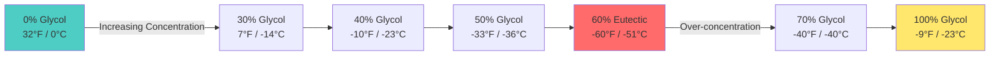

Freezing point depression represents a fundamental colligative property that enables hydronic systems to operate below the freezing point of pure water. Understanding the physical chemistry governing this phenomenon is essential for proper antifreeze solution design in snow melting systems, outdoor unit freeze protection, and cold climate hydronic applications.

## Physical Principles of Freeze Protection

When glycol molecules dissolve in water, they disrupt the hydrogen bonding network that allows water molecules to form ice crystals. The presence of solute molecules reduces the chemical potential of the liquid phase, requiring lower temperatures to achieve the thermodynamic equilibrium between solid and liquid phases.

The freezing point depression follows the colligative relationship:

$$\Delta T_f = K_f \cdot m \cdot i$$

Where:
- $\Delta T_f$ = freezing point depression (°C or °F)
- $K_f$ = cryoscopic constant of the solvent (1.86 °C·kg/mol for water)
- $m$ = molality of the solution (mol solute/kg solvent)
- $i$ = van't Hoff factor (approximately 1.0 for glycols)

For practical HVAC applications, the relationship between weight percent concentration and freezing point is non-linear and determined empirically through laboratory testing. Glycol manufacturers provide freeze point data that accounts for solution non-ideality at high concentrations.

## Concentration vs Freezing Point Relationship

The freeze point depression increases with glycol concentration up to a critical point, beyond which further addition actually raises the freezing point. This behavior defines the eutectic composition.

## Glycol Freeze Point Data

The following table presents freeze protection characteristics for propylene glycol solutions, the standard antifreeze for potable water-compatible systems:

| Concentration (% by weight) | Freeze Point (°F) | Freeze Point (°C) | Protection Level | Specific Gravity (60°F) |
|------------------------------|-------------------|-------------------|------------------|-------------------------|
| 10% | 26 | -3 | Minimal | 1.008 |
| 20% | 19 | -7 | Light | 1.017 |
| 30% | 7 | -14 | Moderate | 1.026 |
| 40% | -10 | -23 | Standard | 1.034 |
| 50% | -33 | -36 | Cold Climate | 1.041 |
| 60% | -60 | -51 | **Eutectic Maximum** | 1.045 |
| 70% | -40 | -40 | Over-concentrated | 1.048 |
| 80% | -15 | -26 | Ineffective | 1.051 |
| 90% | -5 | -21 | Ineffective | 1.053 |

**Note:** Ethylene glycol provides slightly lower freeze points at equivalent concentrations but is toxic and not permitted in systems with potable water connection potential.

## Eutectic Point Considerations

The eutectic point represents the maximum freeze protection achievable in a glycol-water system. For propylene glycol, this occurs at approximately 60% concentration by weight, yielding freeze protection to -60°F (-51°C). At this composition, the solution freezes as a homogeneous solid phase rather than forming ice crystals in equilibrium with concentrated liquid.

Beyond the eutectic concentration, the solution behavior changes fundamentally. The freezing point increases because the glycol itself begins to limit crystal formation. Pure propylene glycol freezes at approximately -74°F (-59°C), but the concentrated solution at 70-80% freezes at higher temperatures due to the formation of glycol hydrate complexes.

## Design Concentration Selection

Proper system design requires selecting a glycol concentration that provides freeze protection to a temperature below the minimum expected ambient condition, with an appropriate safety factor:

$$C_{required} = f(T_{design} - \Delta T_{safety})$$

Standard practice establishes the design temperature as:

- **Outdoor applications:** 10-15°F below the 99% winter design temperature
- **Indoor applications with exposure risk:** 5-10°F below minimum expected temperature
- **Critical systems:** Protection to the lowest recorded temperature for the location

Over-concentration beyond the eutectic point reduces freeze protection while simultaneously increasing fluid viscosity, pumping energy, and initial fill costs. The optimal concentration balances freeze protection requirements against system efficiency.

## Concentration Verification

Field verification of glycol concentration uses refractometer measurements, which correlate refractive index to freeze point protection. The relationship between refractive index and concentration is temperature-dependent and requires correction:

$$n_{20°C} = n_{measured} + 0.00023(T_{measured} - 20)$$

Where $n$ represents the refractive index reading. Refractometer scales are calibrated specifically for propylene glycol or ethylene glycol and are not interchangeable.

## Solution Degradation Effects

Glycol oxidation and thermal degradation over time alter the freeze point protection characteristics. Acidic degradation products can reduce the effective concentration and shift the freeze point upward by 5-10°F over a 5-10 year period in systems without proper inhibitor packages. Annual testing verifies that the solution maintains adequate freeze protection throughout its service life.

The freeze point depression achieved by antifreeze solutions enables hydronic HVAC systems to operate reliably in freezing conditions. Proper selection and maintenance of glycol concentration ensures both freeze protection and optimal energy efficiency across the system design life.
