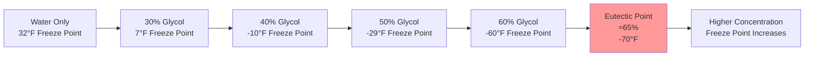
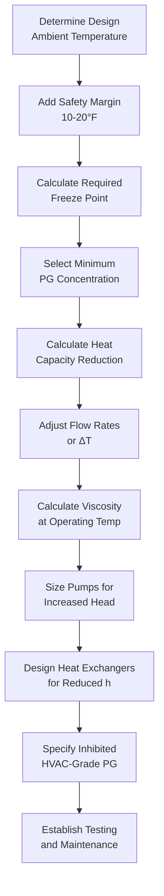

Propylene glycol provides freeze protection for hydronic snow melting systems while maintaining low toxicity classification. The selection of proper concentration balances freeze protection requirements against heat transfer performance degradation and pumping energy penalties.

## Molecular Structure and Physical Properties

Propylene glycol (1,2-propanediol, C₃H₈O₂) consists of a three-carbon chain with two hydroxyl groups that create strong hydrogen bonding with water molecules. This molecular interaction disrupts ice crystal formation and depresses the freezing point below 32°F.

**Fundamental Properties at 77°F:**

| Property | Value | Impact |
|----------|-------|--------|
| Molecular weight | 76.09 g/mol | Concentration calculations |
| Specific gravity | 1.036 | Hydrostatic pressure effects |
| Specific heat (pure) | 0.58 Btu/(lb·°F) | Heat capacity reduction |
| Viscosity (pure) | 50 cP | Pumping energy requirement |
| Thermal conductivity | 0.116 Btu/(h·ft·°F) | Heat transfer coefficient |
| Flash point | 210°F | Fire safety classification |

The hydroxyl groups enable propylene glycol to remain liquid at temperatures where water would solidify, but these same groups increase viscosity substantially compared to water (1.0 cP at 77°F).

## Freezing Point Depression Physics

When propylene glycol dissolves in water, glycol molecules interfere with the ordered arrangement of water molecules required for ice crystal formation. The freezing point depression follows Raoult's Law for ideal solutions, though glycol-water mixtures exhibit non-ideal behavior requiring empirical correction.

**Theoretical Relationship:**

$$\Delta T_f = K_f \cdot m \cdot i$$

Where:
- $\Delta T_f$ = freezing point depression (°F)
- $K_f$ = cryoscopic constant for water (1.86 °C·kg/mol)
- $m$ = molality (mol solute/kg solvent)
- $i$ = van't Hoff factor (approximately 1 for glycol)

However, glycol-water solutions deviate from ideal behavior due to hydrogen bonding. Actual freeze points must be obtained from experimental data.

### Concentration-Temperature Relationship

The eutectic point represents the maximum freezing point depression. Concentrations exceeding 65% by weight provide reduced freeze protection while increasing viscosity penalties.

### Propylene Glycol Freeze Point Data

| Concentration (% by Volume) | Concentration (% by Weight) | Freeze Point (°F) | Burst Protection (°F) | Specific Gravity at 68°F |
|----------------------------|----------------------------|-------------------|----------------------|-------------------------|
| 20% | 19% | 18°F | 12°F | 1.015 |
| 30% | 29% | 7°F | 0°F | 1.022 |
| 40% | 38% | -10°F | -20°F | 1.027 |
| 50% | 48% | -29°F | -45°F | 1.031 |
| 60% | 58% | -60°F | -75°F | 1.034 |

**Note:** Burst protection temperature indicates the point where the solution forms a pumpable slush rather than expanding solid ice. This provides an additional safety margin below the crystallization temperature.

## Concentration Requirements for Snow Melting

Snow melting systems must maintain protection during shutdown periods when fluid remains stationary in buried piping. Concentration selection follows a two-step process.

**Design Calculation:**

$$C_{design} = f(T_{ambient,min} - \Delta T_{safety})$$

Where:
- $C_{design}$ = required glycol concentration
- $T_{ambient,min}$ = lowest expected ambient temperature
- $\Delta T_{safety}$ = safety margin (10-20°F)

**Regional Design Examples:**

| Location | Design Temperature | Safety Margin | Required Freeze Point | Minimum PG Concentration |
|----------|-------------------|---------------|---------------------|-------------------------|
| Chicago, IL | -20°F | 15°F | -35°F | 52% |
| Denver, CO | -15°F | 15°F | -30°F | 50% |
| Boston, MA | -10°F | 15°F | -25°F | 48% |
| Minneapolis, MN | -30°F | 15°F | -45°F | 57% |

### System Shutdown Considerations

Snow melting systems face unique challenges compared to occupied building hydronic systems:

1. **Extended shutdown periods**: Systems remain idle from April through October in most climates
2. **Thermal cycling**: Daily temperature fluctuations create expansion/contraction stress
3. **No heat input**: Unlike building heating systems that maintain elevated temperatures
4. **Underground exposure**: Soil temperatures lag air temperature but can reach design minimums

These factors require conservative concentration selection with adequate safety margins.

## Heat Transfer Performance Degradation

Propylene glycol reduces heat transfer effectiveness through three mechanisms: reduced specific heat, increased viscosity, and decreased thermal conductivity.

### Specific Heat Reduction

The specific heat of propylene glycol solutions decreases with increasing concentration:

$$c_p = c_{p,water} \cdot (1 - 0.008 \cdot C_{vol})$$

Where $C_{vol}$ is the glycol concentration by volume (%).

**Specific Heat Values:**

| Glycol Concentration | Specific Heat at 77°F | Reduction vs. Water |
|---------------------|----------------------|---------------------|
| 0% (water) | 1.00 Btu/(lb·°F) | 0% |
| 30% | 0.92 Btu/(lb·°F) | 8% |
| 40% | 0.88 Btu/(lb·°F) | 12% |
| 50% | 0.84 Btu/(lb·°F) | 16% |
| 60% | 0.80 Btu/(lb·°F) | 20% |

**Flow Rate Compensation:**

To deliver equivalent heat transfer capacity:

$$\dot{m}_{glycol} = \dot{m}_{water} \cdot \frac{c_{p,water}}{c_{p,glycol}}$$

A 50% propylene glycol system requires 19% higher flow rate than water to deliver the same heating capacity at equivalent temperature differential.

### Viscosity Increase Effects

Propylene glycol viscosity increases dramatically with concentration and decreases with temperature. This affects pumping energy and heat transfer coefficients.

**Dynamic Viscosity Data:**

| Temperature | 30% PG | 40% PG | 50% PG | Water (Reference) |
|-------------|--------|--------|--------|------------------|
| 0°F | 22.0 cP | 35.0 cP | 58.0 cP | 1.8 cP |
| 20°F | 11.5 cP | 17.5 cP | 28.0 cP | 1.7 cP |
| 40°F | 7.0 cP | 10.2 cP | 15.0 cP | 1.5 cP |
| 77°F | 3.5 cP | 4.8 cP | 6.8 cP | 1.0 cP |

**Pumping Energy Impact:**

Friction loss in piping follows the Darcy-Weisbach equation:

$$\Delta P = f \cdot \frac{L}{D} \cdot \frac{\rho V^2}{2}$$

Where the friction factor $f$ depends on Reynolds number:

$$Re = \frac{\rho V D}{\mu}$$

For turbulent flow in smooth pipe (Blasius equation):

$$f = \frac{0.316}{Re^{0.25}}$$

The viscosity term $\mu$ appears in the denominator of the Reynolds number. Higher viscosity reduces $Re$, increases $f$, and increases pressure drop.

**Practical Pumping Energy Comparison at 40°F:**

| Fluid | Viscosity (cP) | Relative Friction Factor | Relative Pump Power |
|-------|---------------|-------------------------|-------------------|
| Water | 1.5 | 1.00 | 1.00 |
| 30% PG | 7.0 | 1.35 | 1.35 |
| 40% PG | 10.2 | 1.45 | 1.45 |
| 50% PG | 15.0 | 1.57 | 1.57 |

### Film Coefficient Degradation

The convective heat transfer coefficient decreases with increased viscosity. For turbulent flow in tubes, the Dittus-Boelter equation applies:

$$Nu = 0.023 \cdot Re^{0.8} \cdot Pr^{0.4}$$

Where:
- $Nu$ = Nusselt number = $\frac{h \cdot D}{k}$
- $Pr$ = Prandtl number = $\frac{c_p \cdot \mu}{k}$
- $h$ = convective heat transfer coefficient

The Reynolds number dependence ($Re^{0.8}$) creates sensitivity to viscosity changes. A 50% propylene glycol solution operating at 40°F exhibits approximately 15-20% reduction in heat transfer coefficient compared to water.

**Heat Exchanger Sizing Impact:**

Required heat transfer area increases according to:

$$A_{glycol} = A_{water} \cdot \frac{U_{water}}{U_{glycol}}$$

Design heat exchangers for glycol service with 15-25% additional surface area compared to water-based calculations.

## Environmental Safety Profile

Propylene glycol's primary advantage over ethylene glycol is low toxicity and environmental compatibility.

### Toxicity Classification

The FDA classifies propylene glycol as Generally Recognized As Safe (GRAS) for food contact applications. Propylene glycol appears in:
- Food products (humectant, preservative)
- Pharmaceutical preparations (solvent, carrier)
- Cosmetics and personal care products

**Comparative Toxicity:**

| Parameter | Propylene Glycol | Ethylene Glycol |
|-----------|-----------------|-----------------|
| Oral LD50 (rat) | 20,000 mg/kg | 4,700 mg/kg |
| Dermal LD50 (rabbit) | 20,800 mg/kg | 10,600 mg/kg |
| FDA classification | GRAS | Toxic |
| Fatal dose (human) | Not established | 100 mL |
| Metabolic pathway | Lactic acid (normal) | Oxalic acid (toxic) |

**Biodegradation:**

Propylene glycol biodegrades readily in aerobic conditions:
- BOD (biochemical oxygen demand): 0.63 g O₂/g PG
- Complete mineralization in 7-28 days
- No bioaccumulation
- Low aquatic toxicity (LC50 fish > 40,000 mg/L)

### Code Compliance

Propylene glycol use is permitted without restriction in:
- Potable water proximity applications
- Occupied buildings
- Food processing facilities
- Healthcare facilities
- Schools and daycare centers

Many jurisdictions prohibit or severely restrict ethylene glycol in building systems due to cross-connection concerns. Propylene glycol eliminates these regulatory barriers.

## System Design Process

### Concentration Specification

Specify propylene glycol by volume percentage with ±2% tolerance. Volume-based specification simplifies field measurement and verification using refractometers.

**Example Specification:**
"Provide HVAC-grade inhibited propylene glycol at 50% concentration by volume (±2%) to provide freeze protection to -29°F."

### Quality Requirements

Specify HVAC-grade inhibited propylene glycol containing:
- 96% minimum purity propylene glycol
- Corrosion inhibitor package for multi-metal systems
- pH buffers to maintain pH 8.5-10.5
- Anti-foam agents

Prohibit automotive antifreeze formulations containing silicates that foul heat exchangers and precipitate in system piping.

## Testing and Maintenance

Annual glycol testing verifies concentration and inhibitor effectiveness.

**Required Tests:**

| Parameter | Acceptable Range | Action if Outside Range |
|-----------|-----------------|------------------------|
| Freeze point | Design value ±5°F | Add concentrated glycol |
| pH | 8.0-10.5 | Replace if <8.0 |
| Reserve alkalinity | >50% of new | Replace if depleted |
| Clarity | Clear, no sediment | Filter and investigate |
| Metals (Fe, Cu) | <50 ppm | Investigate corrosion |

**Field Verification Methods:**

1. **Refractometer (preferred)**: Measures refractive index to determine concentration. Temperature-compensated models read freeze point directly. Accuracy: ±2°F.

2. **Hydrometer**: Measures specific gravity to estimate concentration. Requires temperature correction. Accuracy: ±5°F.

3. **Laboratory analysis**: Required annually for complete inhibitor package evaluation.

## ASHRAE References

The following ASHRAE publications provide additional guidance:

- **ASHRAE Handbook - HVAC Systems and Equipment, Chapter 21**: Comprehensive glycol property tables and selection guidance
- **ASHRAE Standard 147**: Reducing the Release of Halogenated Refrigerants from Refrigerating and Air-Conditioning Equipment and Systems
- **ASHRAE Handbook - Fundamentals, Chapter 31**: Physical properties of secondary coolants including glycols

Propylene glycol selection for snow melting systems balances freeze protection requirements against heat transfer and pumping energy penalties while maintaining environmental safety and regulatory compliance. Proper concentration selection, system design adjustments, and ongoing maintenance ensure reliable freeze protection throughout system life.
