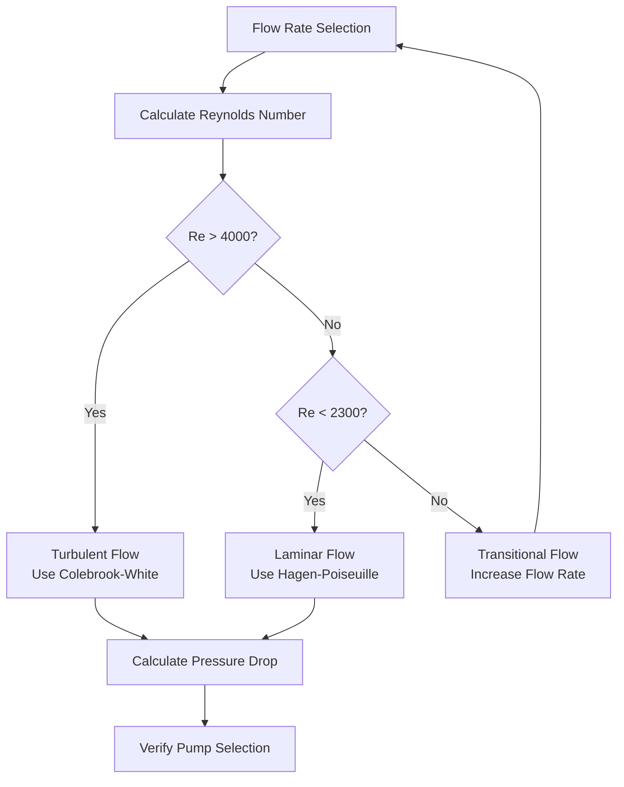

Glycol viscosity fundamentally alters the fluid dynamics and heat transfer characteristics of snow melting systems. The viscosity of propylene glycol and ethylene glycol solutions increases dramatically with concentration and decreases with temperature, requiring significant adjustments to pump selection, piping design, and heat exchanger sizing compared to water-based systems.

## Temperature-Viscosity Relationship

The viscosity of glycol solutions follows an exponential relationship with temperature described by the Andrade equation.

### Viscosity Temperature Dependence

For glycol-water mixtures, the dynamic viscosity $\mu$ varies with absolute temperature $T$ according to:

$$\mu(T) = A \cdot e^{B/T}$$

Where:
- $\mu$ = dynamic viscosity (cP or Pa·s)
- $T$ = absolute temperature (K or °R)
- $A$, $B$ = empirical constants dependent on concentration

**Practical Implications:**
- Viscosity doubles approximately every 20°F decrease in temperature for 50% glycol solutions
- Startup conditions at low temperatures create maximum viscosity and pumping resistance
- System design must accommodate the highest viscosity condition (lowest operating temperature)

### Concentration Effects

Viscosity increases non-linearly with glycol concentration. The relationship exhibits a maximum at approximately 70-80% concentration for both propylene and ethylene glycol.

| Temperature | Water | 30% PG | 50% PG | 30% EG | 50% EG |
|-------------|-------|--------|--------|--------|--------|
| 0°F | 3.2 cP | 9.5 cP | 45 cP | 6.8 cP | 28 cP |
| 20°F | 2.2 cP | 6.2 cP | 25 cP | 4.8 cP | 17 cP |
| 40°F | 1.5 cP | 4.1 cP | 14 cP | 3.2 cP | 10 cP |
| 80°F | 0.86 cP | 2.0 cP | 5.5 cP | 1.6 cP | 4.0 cP |
| 120°F | 0.56 cP | 1.2 cP | 3.0 cP | 1.0 cP | 2.3 cP |

The viscosity ratio between glycol solution and water at the same temperature drives correction factors for pumping, pressure drop, and heat transfer calculations.

## Pressure Drop Increase

Increased viscosity directly affects frictional pressure drop through the friction factor correlation. The relationship depends on flow regime.

### Laminar Flow (Re < 2300)

In laminar flow, the Hagen-Poiseuille equation governs pressure drop:

$$\Delta P = \frac{32 \mu L V}{D^2}$$

Where:
- $\Delta P$ = pressure drop (lbf/ft² or Pa)
- $\mu$ = dynamic viscosity (lbf·s/ft² or Pa·s)
- $L$ = pipe length (ft or m)
- $V$ = average velocity (ft/s or m/s)
- $D$ = pipe inside diameter (ft or m)

**Key Point:** Pressure drop is directly proportional to viscosity in laminar flow. A viscosity increase from 1 cP to 25 cP results in a 25-fold pressure drop increase at constant flow rate.

### Turbulent Flow (Re > 4000)

The Darcy-Weisbach equation applies with the Colebrook-White friction factor correlation:

$$\Delta P = f \frac{L}{D} \frac{\rho V^2}{2}$$

The friction factor $f$ for turbulent flow is calculated from:

$$\frac{1}{\sqrt{f}} = -2.0 \log_{10}\left(\frac{\varepsilon/D}{3.7} + \frac{2.51}{Re\sqrt{f}}\right)$$

Where:
- $f$ = Darcy friction factor (dimensionless)
- $\rho$ = fluid density (lbm/ft³ or kg/m³)
- $\varepsilon$ = absolute pipe roughness (ft or m)
- $Re$ = Reynolds number

**Turbulent Flow Viscosity Effect:**

While not directly proportional, increased viscosity reduces Reynolds number, which increases the friction factor. For commercial steel pipe at Re = 50,000, a viscosity increase from water to 50% propylene glycol at 40°F typically increases pressure drop by 30-45%.

### Reynolds Number Impact

The Reynolds number determines flow regime and affects both pressure drop and heat transfer:

$$Re = \frac{\rho V D}{\mu} = \frac{4\dot{m}}{\pi D \mu}$$

Where $\dot{m}$ is mass flow rate.

**Critical Considerations:**

- Systems designed for turbulent flow with water may operate in transitional flow with glycol
- Transitional flow (2300 < Re < 4000) exhibits unstable behavior unsuitable for design
- Minimum Reynolds number of 4000 should be maintained for reliable turbulent flow predictions



## Pump Sizing Corrections

Pump selection for glycol systems requires correction to both head and hydraulic power calculations.

### Head Correction Factor

The required pump head increases due to higher frictional losses. The head correction factor accounts for viscosity effects on the system curve:

$$H_{glycol} = H_{water} \times C_H$$

Where $C_H$ is the head correction factor determined from:

$$C_H = \frac{(\Delta P)_{glycol}}{(\Delta P)_{water}}$$

For turbulent flow systems, approximate correction factors based on viscosity ratio:

| Viscosity Ratio ($\mu_{glycol}/\mu_{water}$) | Head Correction $C_H$ |
|----------------------------------------------|----------------------|
| 1-2 | 1.05-1.10 |
| 2-5 | 1.10-1.25 |
| 5-10 | 1.25-1.45 |
| 10-20 | 1.45-1.70 |
| 20-30 | 1.70-1.95 |

### Pump Curve Correction

Centrifugal pump performance curves published for water require correction when pumping viscous fluids. The Hydraulic Institute method provides correction factors for head ($C_H$), flow ($C_Q$), and efficiency ($C_{\eta}$).

**Correction Procedure:**

1. Determine water performance at best efficiency point (BEP)
2. Calculate kinematic viscosity: $\nu = \mu/\rho$ (centistokes)
3. Apply correction factors from Hydraulic Institute charts
4. Calculate viscous performance:

$$Q_{viscous} = Q_{water} \times C_Q$$
$$H_{viscous} = H_{water} \times C_H$$
$$\eta_{viscous} = \eta_{water} \times C_{\eta}$$

**Typical Correction Factors for 50% Propylene Glycol at 40°F:**
- Flow correction: $C_Q$ = 0.95-0.98
- Head correction: $C_H$ = 0.90-0.95 (head decreases at given flow)
- Efficiency correction: $C_{\eta}$ = 0.85-0.92

### Power Requirement

The brake horsepower required to pump glycol increases due to both higher head and reduced efficiency:

$$BHP = \frac{Q \times H \times SG}{3960 \times \eta}$$

Where:
- $BHP$ = brake horsepower (hp)
- $Q$ = flow rate (gpm)
- $H$ = total head (ft)
- $SG$ = specific gravity (dimensionless)
- $\eta$ = pump efficiency (decimal)

**Practical Impact:**

A properly sized pump for a 50% propylene glycol snow melting system typically requires 40-60% more power than an equivalent water system at the same flow rate and design temperature differential.

## Flow Rate Impacts

Glycol viscosity affects the required flow rate through multiple mechanisms involving both thermodynamic and transport properties.

### Reduced Specific Heat

Glycol solutions have lower specific heat capacity than water, requiring increased flow rate to deliver equivalent heat transfer:

$$\dot{Q} = \dot{m} c_p \Delta T$$

| Fluid | Specific Heat @ 77°F |
|-------|---------------------|
| Water | 1.00 Btu/(lbm·°F) |
| 30% Propylene Glycol | 0.93 Btu/(lbm·°F) |
| 50% Propylene Glycol | 0.85 Btu/(lbm·°F) |
| 30% Ethylene Glycol | 0.94 Btu/(lbm·°F) |
| 50% Ethylene Glycol | 0.88 Btu/(lbm·°F) |

For constant heat delivery rate and temperature differential, flow rate must increase inversely with specific heat:

$$\frac{\dot{m}_{glycol}}{\dot{m}_{water}} = \frac{(c_p)_{water}}{(c_p)_{glycol}}$$

### Heat Transfer Coefficient Reduction

Film coefficient decreases with increased viscosity according to the Sieder-Tate correlation for turbulent flow in pipes:

$$Nu = 0.027 Re^{0.8} Pr^{1/3} \left(\frac{\mu}{\mu_s}\right)^{0.14}$$

Where:
- $Nu$ = Nusselt number
- $Pr$ = Prandtl number = $c_p \mu / k$
- $\mu$ = bulk fluid viscosity
- $\mu_s$ = viscosity at surface temperature

The heat transfer coefficient is:

$$h = \frac{Nu \cdot k}{D}$$

**Viscosity Impact on Heat Transfer:**

Higher viscosity increases Prandtl number but decreases Reynolds number. The net effect typically reduces heat transfer coefficient by 10-25% for common glycol concentrations.

To maintain design heat flux with reduced film coefficient, either:
1. Increase temperature differential (common in snow melting)
2. Increase flow velocity (increases both Re and heat transfer)
3. Increase heat exchanger surface area

### Combined Flow Rate Factor

The total flow rate increase required for glycol systems results from:

$$\dot{V}_{glycol} = \dot{V}_{water} \times \frac{(c_p)_{water}}{(c_p)_{glycol}} \times \frac{(SG)_{glycol}}{(SG)_{water}} \times C_{HT}$$

Where $C_{HT}$ is a heat transfer correction factor (typically 1.05-1.15 for 30-50% glycol).

**Example Calculation:**

For 50% propylene glycol vs. water:
- Specific heat ratio: 1.00/0.85 = 1.18
- Specific gravity ratio: 1.04/1.00 = 1.04
- Heat transfer correction: 1.10

Total flow correction: $1.18 \times 1.04 \times 1.10 = 1.35$

The glycol system requires 35% higher volumetric flow rate than water to achieve equivalent heating performance.

## Design Calculation Methodology

A systematic approach ensures accurate pump selection and system design for glycol snow melting applications.

```mermaid
flowchart TD
    A[System Requirements] --> B[Select Operating Temperatures]
    B --> C[Determine Glycol Concentration]
    C --> D[Find Fluid Properties at Design Temp]

    D --> E[Calculate Heat Load]
    E --> F[Determine Flow Rate<br/>Q = q/(ρ·cp·ΔT)]

    F --> G[Calculate Reynolds Number]
    G --> H{Re > 4000?}
    H -->|No| I[Increase Velocity or Pipe Size]
    I --> F

    H -->|Yes| J[Calculate Pressure Drop<br/>All Components]
    J --> K[Apply System Curve]

    K --> L[Select Pump from Water Curves]
    L --> M[Apply Hydraulic Institute<br/>Viscosity Corrections]

    M --> N[Verify Operating Point]
    N --> O{Acceptable<br/>Performance?}
    O -->|No| P[Resize Pump]
    P --> L

    O -->|Yes| Q[Calculate Power Requirement]
    Q --> R[Select Motor]
    R --> S[Final Design]
```

### Step-by-Step Procedure

**1. Establish Design Conditions**
- Minimum ambient temperature
- Required slab surface temperature
- Snow melting heat flux requirement
- System geometry and area

**2. Select Glycol Concentration**
- Design freeze point = Minimum ambient - 10°F to 20°F safety factor
- Select concentration from freeze point depression tables
- Typical: 30-50% by volume for most applications

**3. Determine Fluid Properties**
- Dynamic viscosity $\mu$ at supply and return temperatures
- Specific heat $c_p$ at average fluid temperature
- Density $\rho$ at average temperature
- Thermal conductivity $k$ for heat transfer calculations

**4. Calculate Required Flow Rate**

$$\dot{m} = \frac{\dot{Q}}{c_p \Delta T}$$

Convert to volumetric flow:

$$\dot{V} = \frac{\dot{m}}{\rho}$$

Where:
- $\dot{Q}$ = total heat load (Btu/h or W)
- $\Delta T$ = supply-return temperature differential (°F or K)

**5. Verify Flow Regime**

$$Re = \frac{4 \dot{m}}{\pi D \mu}$$

Ensure Re > 4000 in all piping sections. If not, increase flow rate or reduce pipe diameter.

**6. Calculate Pressure Drop**

For each pipe segment:

$$\Delta P_{pipe} = f \frac{L}{D} \frac{\rho V^2}{2}$$

Include all fittings using equivalent length method or K-factors.

Sum total system pressure drop:

$$\Delta P_{total} = \sum \Delta P_{pipes} + \sum \Delta P_{fittings} + \Delta P_{HX}$$

**7. Apply Pump Selection**

Convert total pressure drop to head:

$$H = \frac{\Delta P}{\rho g}$$

Select pump providing required head at design flow rate with minimum 15% margin.

**8. Correct Pump Performance**

Apply Hydraulic Institute correction factors for viscous service. Verify corrected operating point falls within acceptable range on pump curve (70-110% of BEP flow).

**9. Calculate Operating Cost**

$$Annual\ kWh = BHP \times 0.746 \times hours_{operation} / \eta_{motor}$$

## Practical Recommendations

**Piping Design:**
- Limit velocity to 4-8 ft/s to balance pressure drop and heat transfer
- Use larger pipe sizes than water systems to maintain reasonable pressure drop
- Minimize fitting losses through smooth transitions and long-radius elbows

**Pump Selection:**
- Select pumps with flat performance curves to minimize head variation with flow changes
- Specify mechanical seals rated for glycol service
- Provide 10-20% capacity margin beyond calculated requirements

**System Operation:**
- Monitor actual flow rates during commissioning to verify design assumptions
- Account for increased startup power requirements with cold, viscous fluid
- Consider variable speed pumping to reduce energy consumption during mild conditions

**Temperature Management:**
- Higher supply temperatures reduce viscosity and improve system efficiency
- Balance supply temperature against heat losses and material temperature limits
- Typical snow melting systems operate 100-140°F supply, 80-120°F return

**Heat Exchanger Sizing:**
- Apply 15-25% additional surface area for glycol service vs. water
- Verify manufacturer's correction factors for specific heat exchanger geometry
- Consider effectiveness reduction at design conditions

The combination of increased viscosity, reduced specific heat, and altered transport properties requires integrated analysis of the complete system. ASHRAE Handbook - HVAC Systems and Equipment Chapter 51 provides comprehensive design guidance and property data for snow melting applications using glycol solutions.
