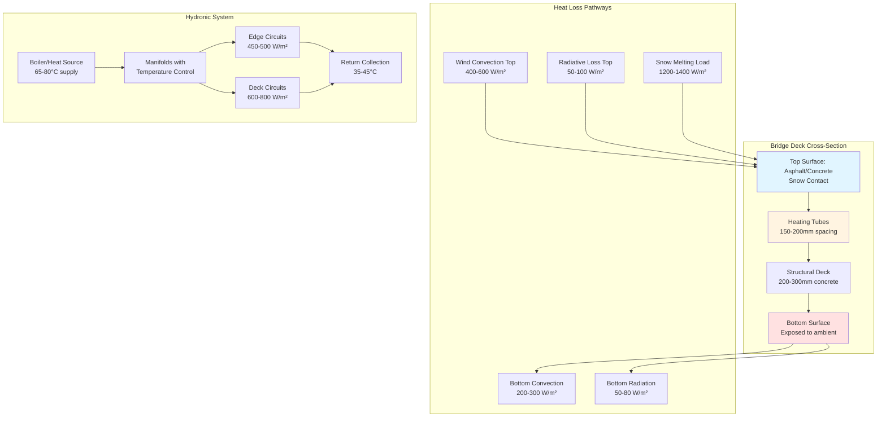

## Physical Principles of Bridge Deck Heat Loss

Bridge decks present uniquely challenging thermal boundary conditions for snow melting systems due to exposure on both upper and lower surfaces. Unlike ground-coupled slabs that benefit from earth insulation (k = 0.8-1.4 W/m·K), bridge decks experience convective and radiative heat loss from all exposed surfaces, resulting in heat flux requirements 2-4 times higher than equivalent ground-level applications.

The fundamental heat balance for a bridge deck heating system operating in snow melting mode:

$$Q_{total} = Q_{snow} + Q_{conv,top} + Q_{conv,bottom} + Q_{rad,top} + Q_{rad,bottom} + Q_{edge}$$

Where each term represents heat flux in W/m². The dual-surface exposure creates a thermal short-circuit effect, where heat delivered to the top surface conducts through the concrete and dissipates from the bottom surface before melting snow.

## Heat Transfer Analysis

### Top Surface Convective Loss

Wind-driven convection dominates top surface heat loss:

$$Q_{conv,top} = h_{top}(T_{surface} - T_{air})$$

The convective coefficient for bridge decks under winter conditions:

$$h_{top} = 5.7 + 3.8v_{wind}$$

Where v_wind is wind velocity in m/s. At 10 m/s wind (common for elevated structures), h_top reaches 43 W/m²·K, compared to 17-23 W/m²·K for sheltered ground applications.

### Bottom Surface Heat Loss

The underside experiences forced convection from traffic-induced air movement and natural convection:

$$Q_{conv,bottom} = h_{bottom}(T_{surface} - T_{ambient})$$

For most bridge applications:

$$h_{bottom} = 12-20 \text{ W/m}^2\cdot\text{K}$$

This represents 25-35% of total system heat loss and is unique to bridge deck applications.

### Snow Melting Component

The thermodynamic requirement for melting snow at precipitation rate s (mm/h):

$$Q_{snow} = s \cdot \rho_{snow} \cdot (h_{fusion} + c_p \Delta T)$$

For typical design conditions (s = 25 mm/h, ρ_snow = 150 kg/m³, melting from -10°C):

$$Q_{snow} = 25 \times 0.15 \times (334 + 2.1 \times 10) = 1,333 \text{ W/m}^2$$

### Edge Beam Analysis

Bridge edge beams create additional thermal bridges:

$$Q_{edge} = U_{beam} \cdot A_{beam}/A_{deck} \cdot (T_{fluid} - T_{air})$$

Edge heating may require dedicated circuits at 350-500 W/m² due to three-dimensional heat loss geometry.

## Design Heat Flux Requirements

Comparison of thermal loads:

| Parameter | Ground Slab | Bridge Deck | Increase Factor |
|-----------|-------------|-------------|-----------------|
| Base heat flux | 300-400 W/m² | 600-800 W/m² | 2.0-2.5× |
| Wind exposure loss | 150-200 W/m² | 400-600 W/m² | 2.5-3.0× |
| Back surface loss | 0 W/m² | 200-300 W/m² | N/A |
| Edge effects | 50-75 W/m² | 150-250 W/m² | 2.5-3.5× |
| **Total design** | **500-675 W/m²** | **1,350-1,950 W/m²** | **2.7-2.9×** |
| Fluid temperature | 35-45°C | 50-65°C | 1.4-1.5× |
| Tube spacing | 200-300 mm | 150-200 mm | 0.67-0.75× |

## System Configuration

## Insulation Strategies

While full thermal decoupling is impractical, strategic insulation reduces heat loss:

### Bottom Surface Insulation

Installing rigid insulation (RSI-2.1 to RSI-3.5) on the deck underside reduces back-side losses by 60-75%:

$$Q'_{bottom} = \frac{Q_{bottom}}{1 + h_{bottom} \cdot R_{insulation}}$$

For RSI-2.1 insulation with h_bottom = 15 W/m²·K:

$$\text{Reduction} = \frac{15 \times 2.1}{1 + 15 \times 2.1} = 0.97 \rightarrow 97\% \text{ effective}$$

This reduces total system load by 15-25%.

### Edge Beam Treatment

Vertical insulation at edge beams prevents lateral conduction. Effective thickness 50-75mm with k ≤ 0.035 W/m·K.

## Control Strategies

Bridge deck systems require anticipatory control due to rapid cooling:

**Slab Temperature Depression Rate:**

$$\frac{dT}{dt} = -\frac{h_{eff} \cdot A}{m \cdot c_p}(T_{slab} - T_{ambient})$$

Where h_eff includes combined top and bottom convection. Bridge decks cool 3-5 times faster than ground slabs, requiring system activation 2-4 hours before precipitation events.

## Standards and Design References

- **ASHRAE Handbook—HVAC Applications, Chapter 51:** Provides bridge deck heat flux calculation methodology
- **ACI 330.1:** Specification for unreinforced concrete paving and overlay snow melting systems
- **ASTM E2551:** Standard specification for bridge deck snow melting hydronic systems
- **State DOT Bridge Heating Guidelines:** Many states publish specific requirements (typical: 1,500-2,000 W/m² peak)

## Practical Design Considerations

### Tube Spacing and Depth

Closer spacing compensates for higher heat loss:

$$\text{Spacing} = 2 \times \sqrt{\frac{k_{concrete} \cdot d \cdot (T_{fluid} - T_{air})}{Q_{required}}}$$

Typical range: 150-200mm at 50-75mm depth.

### System Zoning

Divide bridge decks into zones:

1. **Center lanes:** 600-800 W/m² (partial wind shielding from traffic)
2. **Edge lanes:** 800-1,000 W/m² (full wind exposure)
3. **Edge beams:** 400-500 W/m² (concentrated linear heat)

### Freeze Protection

Even during non-operation, maintain deck temperature above 2-3°C to prevent ice formation from residual moisture. This requires 150-250 W/m² background heat input.

## Economic Analysis

Bridge deck heating systems exhibit higher installation costs (350-550 $/m² vs. 200-300 $/m² for ground slabs) but provide critical safety benefits. The operational cost penalty from elevated heat flux is offset by reduced winter maintenance, accident prevention, and extended deck service life from eliminated freeze-thaw cycles and reduced chloride exposure.

**Operational Heat Load Comparison:**

- Ground slab: 120-150 W·h/m² per snow event
- Bridge deck: 350-500 W·h/m² per snow event

The 2.5-3.5× energy penalty is justified by the elimination of mechanical snow removal on structurally sensitive elevated surfaces.
