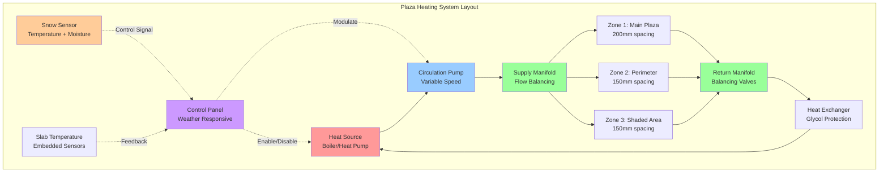

Plaza and courtyard snow melting systems provide pedestrian safety and accessibility in high-traffic outdoor spaces where manual snow removal is impractical or insufficient. These installations require careful thermal design to overcome the significant heat losses from large exposed areas while maintaining surface temperatures sufficient for snow-free operation.

## Physical Principles

Heat transfer from heated plaza surfaces occurs through three mechanisms operating simultaneously. Conduction transfers thermal energy from embedded hydronic tubing through the concrete or pavers to the surface. Convection removes heat from the surface to ambient air, with rates depending on wind speed and temperature differential. Evaporation of melted snow consumes latent heat at 334 kJ/kg, representing the dominant heat load during active snowfall.

The surface energy balance determines required heat flux:

$$q_{total} = q_{sensible} + q_{latent} + q_{radiation} + q_{edges}$$

Where sensible heat loss accounts for convection and conduction to ambient air, latent heat drives snow melting and moisture evaporation, radiation exchanges occur with the sky dome, and edge losses transfer through uninsulated perimeter conditions.

## Plaza Heat Load Calculations

Required heat flux for plaza snow melting depends on design snow intensity, wind speed, and ambient temperature conditions. ASHRAE standard snow melting design uses three classes:

**Class 1 (Light Traffic):** 150-200 W/m² for occasional use areas
**Class 2 (Moderate Traffic):** 250-350 W/m² for pedestrian plazas
**Class 3 (Heavy Traffic):** 400-500 W/m² for critical access areas

The comprehensive heat flux calculation incorporates all transfer mechanisms:

$$q_{req} = q_{conv} + q_{melt} + q_{evap} + q_{rad}$$

Convective heat loss follows forced convection relationships:

$$q_{conv} = h_{conv} \cdot (T_{surface} - T_{ambient})$$

Where convection coefficient depends on wind velocity:

$$h_{conv} = 5.7 + 3.8 \cdot V_{wind}$$

With wind velocity in m/s and resulting coefficient in W/(m²·K).

Melting heat flux relates directly to snowfall rate:

$$q_{melt} = s_{rate} \cdot \rho_{snow} \cdot (h_{fusion} + c_{p,water} \cdot \Delta T)$$

For typical design conditions with 25 mm/hr snowfall rate, snow density 200 kg/m³, and melting from -5°C to 2°C:

$$q_{melt} = (25/3600) \cdot 200 \cdot [334,000 + 4,186 \cdot 7] = 504 \text{ W/m}^2$$

Evaporative heat flux removes water film from the surface:

$$q_{evap} = h_{mass} \cdot h_{fg} \cdot (P_{sat,surface} - P_{ambient})$$

Where mass transfer coefficient couples to convection through the Lewis relation, latent heat of vaporization equals 2,260 kJ/kg, and vapor pressure differential drives mass transfer.

## System Design Considerations

| Design Parameter | Specification | Rationale |
|-----------------|---------------|-----------|
| Surface Temperature | 2-4°C | Prevents ice formation with safety margin |
| Tubing Spacing | 150-200 mm | Balances thermal uniformity and cost |
| Tubing Depth | 50-75 mm cover | Protects tubing while minimizing thermal lag |
| Fluid Temperature | 40-55°C | Provides adequate delta-T for heat transfer |
| Flow Velocity | 0.6-1.2 m/s | Ensures turbulent flow for heat transfer |
| Insulation Thickness | 25-50 mm XPS | Reduces downward heat loss to 10-15% |
| Edge Insulation | 50 mm vertical | Prevents perimeter heat loss |
| Thermal Response | 15-30 minutes | Time to reach operating temperature |

## Hydronic Layout Configuration

Plaza heating systems use serpentine or parallel reverse-return tubing layouts to ensure uniform surface temperature distribution. Tubing spacing determines surface temperature uniformity, with tighter spacing required near edges and in shaded areas.

## Thermal Performance Analysis

Surface temperature uniformity depends on tubing spacing and depth. Temperature variation between tubing centerline and midpoint follows:

$$\Delta T_{surface} = \frac{q \cdot s^2}{8 \cdot k_{concrete} \cdot d}$$

Where spacing (s), thermal conductivity (k), and depth (d) determine surface temperature ripple. For 200 mm spacing at 75 mm depth in 1.4 W/(m·K) concrete with 300 W/m² heat flux:

$$\Delta T_{surface} = \frac{300 \cdot 0.2^2}{8 \cdot 1.4 \cdot 0.075} = 1.4°C$$

This temperature variation remains acceptable for pedestrian comfort and snow melting performance.

## Edge and Perimeter Effects

Plaza perimeters experience elevated heat loss from exposed edges and wind exposure. Edge heat flux increases by 40-60% compared to interior areas. Vertical edge insulation extending 300-600 mm below grade reduces this penalty. Design accounts for edge effects by:

- Reducing tubing spacing to 150 mm within 1 m of perimeter
- Increasing fluid temperature to perimeter zones
- Installing vertical insulation at all exposed edges
- Providing wind barriers where architecturally feasible

## Control Strategy

Weather-responsive control optimizes energy consumption while ensuring timely snow clearing. Control logic monitors:

- Outdoor temperature (initiate below 4°C)
- Precipitation sensor (moisture detection)
- Surface temperature (maintain 2-4°C during events)
- Wind speed (increase heat output above 5 m/s)

Anticipatory control pre-heats the slab 30-60 minutes before predicted snowfall, reducing thermal lag and preventing initial snow accumulation. Slab thermal mass requires this lead time to reach operating temperature.

## Material Selection

Plaza surface materials influence thermal performance and durability. Concrete provides excellent thermal conductivity (1.4 W/(m·K)) and thermal mass for stable operation. Pavers over sand beds reduce thermal contact and require 20-30% higher heat flux. Natural stone varies widely in conductivity (1.5-3.5 W/(m·K)), with granite and limestone performing well for heated applications.

Hydronic tubing uses PEX or PEX-AL-PEX for flexibility and corrosion resistance. Oxygen barrier construction prevents system corrosion in iron components. Tube diameter typically ranges from 12-20 mm, balancing flow resistance and heat transfer performance.

## Architectural Integration

Plaza heating systems integrate with architectural elements including drainage systems, decorative features, and lighting. Surface slope maintains 1-2% grade for drainage of meltwater. Drain locations require heating extension to prevent ice formation at grates. Subsurface drainage removes groundwater and prevents frost heaving beneath the heated slab.

## Performance Verification

Commissioning verifies thermal performance through infrared thermography revealing surface temperature distribution. Testing occurs at design outdoor conditions with full system operation. Surface temperature uniformity within ±2°C indicates proper installation and balancing. Flow rates, supply temperatures, and pressure drops verify against design calculations.
