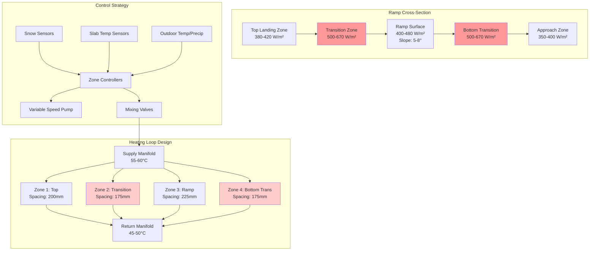

Ramps and loading docks present unique snow melting challenges due to gravity-assisted drainage, vehicle traction requirements, and concentrated traffic patterns. The physics of inclined surfaces demands increased heat flux to compensate for enhanced convective losses and prevent ice accumulation at critical grade transitions.

## Physics of Inclined Surface Snow Melting

### Slope-Enhanced Heat Loss

Inclined surfaces experience amplified convective heat transfer due to boundary layer disruption and increased air velocity along the slope. The effective heat flux requirement increases with slope angle:

$$
q''_{\text{slope}} = q''_{\text{flat}} \cdot \left(1 + k_s \cdot \sin\theta\right)
$$

Where:
- $q''_{\text{slope}}$ = Required heat flux for sloped surface (W/m²)
- $q''_{\text{flat}}$ = Base heat flux for flat surface (W/m²)
- $k_s$ = Slope correction factor (typically 0.15-0.25)
- $\theta$ = Ramp angle from horizontal (degrees)

For a 5° ramp with base requirement of 400 W/m²:

$$
q''_{\text{slope}} = 400 \cdot \left(1 + 0.20 \cdot \sin(5°)\right) = 400 \cdot 1.017 = 407 \text{ W/m}^2
$$

### Gravitational Drainage Enhancement

The slope gradient creates a drainage velocity component that assists melt water removal but requires continuous heat to prevent refreezing at transition zones:

$$
v_{\text{drain}} = \sqrt{2gh \cdot \sin\theta}
$$

Where:
- $v_{\text{drain}}$ = Drainage velocity (m/s)
- $g$ = Gravitational acceleration (9.81 m/s²)
- $h$ = Water film thickness (typically 0.5-2 mm)
- $\theta$ = Slope angle

## Critical Design Zones

### Ramp Transition Points

Grade transitions concentrate stress and ice formation. These zones require heat flux increases of 25-40% over the main ramp surface:

$$
q''_{\text{transition}} = q''_{\text{slope}} \cdot (1.25 \text{ to } 1.40)
$$

**Critical transition locations:**
- Bottom approach (horizontal to incline)
- Top landing (incline to horizontal)
- Grade change points on multi-slope ramps
- Dock leveler interface zones

### Loading Dock Edge Zones

The dock edge experiences maximum thermal stress from:
- Vehicle exhaust impingement
- Repeated heavy loads (concentrated stress)
- Building edge heat loss
- Exposed concrete cantilever

Edge zone heat flux requirement:

$$
q''_{\text{edge}} = q''_{\text{base}} + q''_{\text{load}} + q''_{\text{exhaust}}
$$

Typical edge zone values: 500-650 W/m² depending on exposure.

## Ramp vs Flat Surface Requirements

| Parameter | Flat Surface | Ramp Surface | Loading Dock | Units |
|-----------|--------------|--------------|--------------|-------|
| Base Heat Flux | 350-400 | 400-480 | 450-550 | W/m² |
| Transition Zone Flux | N/A | 500-670 | 600-770 | W/m² |
| Tube Spacing | 225-300 | 200-250 | 175-225 | mm |
| Fluid Temperature | 40-50 | 45-55 | 50-60 | °C |
| Flow Velocity | 0.6-0.9 | 0.8-1.2 | 1.0-1.5 | m/s |
| Slab Depth | 100-150 | 150-200 | 200-300 | mm |
| Reinforcement | #4 @ 450mm | #5 @ 300mm | #6 @ 225mm | - |
| Load Rating | Light | Medium-Heavy | Heavy-Extra Heavy | - |

## Commercial Ramp Standards

### ADA Compliance Considerations

ADA-compliant ramps (max 1:12 slope, 4.76°) require consistent snow-free conditions for accessibility:

- **Maximum slope:** 8.33% (1:12 ratio)
- **Running slope heat flux:** 420-460 W/m²
- **Landing heat flux:** 380-420 W/m²
- **Edge zones:** 500-550 W/m² within 600mm of edges
- **Response time:** System must achieve snow-free conditions within 2 hours of snowfall onset

### Truck Ramp Specifications

Heavy-duty commercial truck ramps demand robust systems:

**Structural loading:**
- Single axle load: 80-100 kN (18,000-22,500 lbf)
- Concentrated tire contact pressure: 800-1200 kPa
- Impact factor: 1.5-2.0 for dynamic loading

**Thermal requirements:**
- Minimum slab depth: 200mm for H-20 loading
- Tube burial depth: 75-100mm from finished surface
- Reinforcement: Minimum #6 rebar @ 225mm each way
- Control joints: Maximum 3.6m spacing

## Mermaid Diagram: Ramp Heating System Design

## Loading Dock Specific Considerations

### Dock Leveler Integration

Heated dock levelers require special attention:

**Heat flux at leveler interface:**

$$
q''_{\text{leveler}} = \frac{k_{\text{steel}} \cdot \Delta T}{L} + q''_{\text{base}}
$$

Where:
- $k_{\text{steel}}$ = Thermal conductivity of steel (45 W/m·K)
- $\Delta T$ = Temperature difference across leveler
- $L$ = Effective heat path length (0.05-0.15m)

Typical leveler zone requirement: 650-800 W/m²

### Vehicle Traffic Pattern Optimization

High-traffic zones experience accelerated snow removal through:
1. Mechanical scraping action of tires
2. Frictional heat generation
3. Compressed snow densification

However, these zones also suffer:
- Increased thermal cycling and cracking risk
- Accelerated wear of heating elements
- Higher maintenance requirements

Design for 1.3× normal heat flux in primary traffic lanes with enhanced tube protection.

## Installation Best Practices

### Tubing Layout for Slopes

**Serpentine pattern orientation:**
- Run tubes perpendicular to slope direction for even heat distribution
- Avoid parallel runs that create thermal striping down the slope
- Use headers at top and bottom rather than sides

**Tube anchoring:**
- Increased chair density: every 600mm on slopes >4%
- Wire tie tubes to rebar at all intersections
- Prevent tube floating during concrete placement with weighted chairs

### Slab Construction Sequence

1. **Subgrade preparation:** Compact to 95% standard Proctor density
2. **Insulation:** Minimum R-3.5 (RSI-0.6) XPS foam under all heated areas
3. **Vapor barrier:** 6-mil polyethylene with sealed joints
4. **Reinforcement:** Lower mat placement
5. **Tubing installation:** Pressure test to 550 kPa for 2 hours minimum
6. **Upper reinforcement:** Maintain 50-75mm cover over tubes
7. **Concrete placement:** Minimum 4000 psi mix with air entrainment
8. **Finishing:** Broom finish perpendicular to slope for traction

### Pressure Testing Requirements

Hydronic systems in commercial ramps must withstand:

$$
P_{\text{test}} = 1.5 \cdot P_{\text{operating}} \geq 550 \text{ kPa}
$$

Maintain test pressure for minimum 2 hours with <35 kPa pressure drop indicating acceptable installation.

## System Sizing and Performance

### Heat Load Calculation Example

For a 30m long × 6m wide truck ramp at 6° slope:

**Area:** $A = 30 \times 6 = 180 \text{ m}^2$

**Average heat flux:** $q'' = 450 \text{ W/m}^2$ (accounting for transitions)

**Total heat load:**

$$
Q_{\text{total}} = q'' \cdot A = 450 \times 180 = 81{,}000 \text{ W} = 81 \text{ kW}
$$

**With 15% safety factor:**

$$
Q_{\text{design}} = 81 \times 1.15 = 93.2 \text{ kW}
$$

### Fluid Flow Requirements

For PEX tubing with 200mm spacing:

**Linear tube length per m²:** $L_{\text{specific}} = \frac{1}{0.20} = 5 \text{ m/m}^2$

**Total tube length:** $L_{\text{total}} = 5 \times 180 = 900 \text{ m}$

**Flow rate per loop (100m circuits):**

$$
\dot{V} = \frac{Q}{c_p \cdot \rho \cdot \Delta T}
$$

For 10°C temperature drop:

$$
\dot{V} = \frac{93{,}200}{4186 \times 1000 \times 10} = 0.00223 \text{ m}^3\text{/s} = 2.23 \text{ L/s}
$$

**Number of circuits:** $N = \frac{900}{100} = 9$ circuits

**Flow per circuit:** $\dot{V}_{\text{circuit}} = \frac{2.23}{9} = 0.25 \text{ L/s}$ (0.9 m³/h)

## Economic Considerations

Ramps and loading docks justify snow melting system investment through:

- **Liability reduction:** Slip-and-fall claims average $50,000-$150,000
- **Operational continuity:** Prevented delivery delays worth $500-$2,000 per incident
- **Labor elimination:** Manual snow removal costs $75-$150 per event
- **Asset protection:** Prevents salt damage to vehicles and concrete

Typical payback period for commercial installations: 4-7 years with high utilization rates.

---

*File: /Users/evgenygantman/Documents/github/gantmane/hvac/content/specialty-applications-testing/specialty-hvac-applications/snow-melting-freeze-protection-systems/application-areas/ramps-loading-docks/_index.md*
