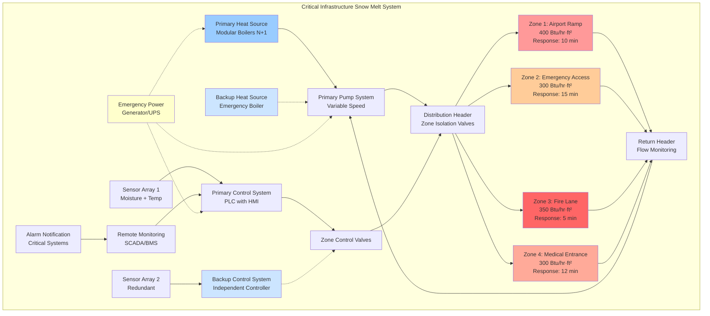

Specialized snow melting applications address mission-critical scenarios where system failure creates immediate safety hazards, operational disruptions, or life-threatening delays. These installations demand elevated performance criteria, redundant control strategies, and accelerated response characteristics compared to conventional residential or commercial systems.

## Defining Characteristics of Specialized Applications

Specialized snow melting systems share common attributes that distinguish them from standard installations:

**Performance Criticality**
System failure directly impacts life safety, emergency response capability, or essential operations. Unlike discretionary applications where delayed activation causes inconvenience, specialized systems must maintain uninterrupted functionality during all weather conditions.

**Regulatory Compliance**
Fire codes, aviation regulations, hospital accreditation standards, and OSHA industrial safety requirements mandate specific performance thresholds. Design must satisfy both ASHRAE engineering standards and jurisdiction-specific operational mandates.

**Accelerated Response Requirements**
Maximum allowable time from snow detection to complete surface clearance typically ranges from 5 to 20 minutes, compared to 30-90 minutes for conventional systems. This necessitates higher installed heat flux capacity and often requires continuous idling mode operation.

**Extended Operating Seasons**
Many specialized applications operate year-round for freeze prevention rather than snow melting exclusively. Airport ramps require ice protection during cold dry conditions. Industrial facilities maintain functionality during all precipitation events regardless of seasonal timing.

## Heat Flux Requirements for Critical Applications

Specialized applications universally demand Class III performance with heat flux values exceeding standard commercial installations. The governing equation accounts for accelerated melting timelines:

$$q_s = \frac{q_m}{\eta_{response}} + q_c + q_r + q_e + q_{margin}$$

Where:
- $q_s$ = Total required system heat flux (Btu/hr·ft²)
- $q_m$ = Heat of fusion for snow melting at design rate
- $\eta_{response}$ = Response time efficiency factor (0.25-0.50 for rapid response)
- $q_c$ = Convective heat loss at design wind conditions
- $q_r$ = Radiative heat exchange with sky
- $q_e$ = Edge losses and downward conduction
- $q_{margin}$ = Safety margin for extreme conditions (typically 20-30%)

The response time efficiency factor accounts for the thermal energy required to rapidly elevate slab temperature from idling to active melting conditions within constrained timeframes.

**Typical Design Heat Flux Values:**

| Application Type | Design Flux | Free Area Ratio | Response Time |
|-----------------|-------------|-----------------|---------------|
| Airport Ramp Deicing | 300-400 Btu/hr·ft² | 0.90-1.0 | 10-15 minutes |
| Emergency Vehicle Access | 250-350 Btu/hr·ft² | 0.85-1.0 | 10-20 minutes |
| Fire Lane Snow Free | 300-400 Btu/hr·ft² | 1.0 | 5-10 minutes |
| Medical Facility Entrance | 250-350 Btu/hr·ft² | 0.90-1.0 | 10-15 minutes |
| Industrial Yard Access | 200-300 Btu/hr·ft² | 0.70-0.90 | 15-25 minutes |

## Airport Ramp Deicing Systems

Aircraft apron and taxiway heating systems prevent ice formation on critical maneuvering surfaces where mechanical snow removal risks foreign object damage (FOD) or equipment interference with aircraft operations.

**Design Constraints:**
- Slab loading capacity must accommodate aircraft wheel loads (ASTM F2550 compliance)
- Fluid temperatures limited to prevent thermal stress cracking in heavy-duty concrete (maximum 160°F)
- Glycol solutions must use aviation-compatible inhibitor packages
- System zones must align with aircraft parking positions and taxiway segments
- Control systems require FAA approval for integration with airfield operations

**Heat Transfer Considerations:**
Airport ramps experience extreme convective loading due to jet blast and propeller wash. Design wind velocities reach 40-60 mph during aircraft operations, increasing convective coefficients to:

$$h_c = 0.99 \cdot v_{wind}^{0.8} = 0.99 \cdot 50^{0.8} = 22.4 \text{ Btu/hr·ft²·°F}$$

This convective coefficient is 3-4 times higher than standard ASHRAE design values, directly increasing required heat flux.

**Tube Spacing and Capacity:**
Closer tube spacing (4-6 inches on center) compared to standard 9-12 inch layouts ensures uniform surface temperature under high convective loads. Manifold sizing must accommodate 30-50% higher flow rates to maintain turbulent flow regimes (Reynolds number > 4000) for effective heat delivery.

## Emergency Vehicle Access Routes

Fire department access roads, ambulance approach lanes, and police rapid response routes require guaranteed clearance within code-mandated timeframes.

**Performance Mandates:**
- International Fire Code (IFC) requires emergency vehicle access within 150 feet of all structures
- Many jurisdictions mandate snow-free access within 15 minutes of snowfall initiation
- System redundancy (dual heat sources or backup power) often required by local ordinance
- Uninterrupted 24/7 monitoring with alarm notification to dispatch centers

**Zoning Strategy:**
Emergency routes utilize graduated heat flux zoning:

1. **Primary access lanes:** 300-350 Btu/hr·ft² for guaranteed clearance
2. **Secondary approach:** 200-250 Btu/hr·ft² for reduced but functional access
3. **Parking/staging areas:** 150-200 Btu/hr·ft² for vehicle positioning

This tiered approach optimizes installed capacity while ensuring critical path reliability.

**Control Integration:**
Emergency systems interconnect with building fire alarm systems, automatically activating heating zones when alarm conditions occur regardless of weather. This prevents equipment failure during prolonged non-use periods and ensures immediate availability during crisis response.

## Fire Lane Continuous Coverage

Fire lanes differ from general emergency access by requiring absolute prohibition of any snow accumulation at any time during winter operations.

**Zero-Tolerance Design:**
Fire marshal authority having jurisdiction (AHJ) approval requires documented capability to:
- Maintain completely bare pavement during maximum credible snowfall rates
- Prevent any ice formation during temperature cycles
- Provide immediate visual confirmation of system operation
- Include independent backup systems for redundancy

**Control Philosophy:**
Fire lanes employ continuous operation rather than demand-based activation:

$$q_{continuous} = q_{idling} + \frac{q_{boost}}{duty_{cycle}}$$

Where continuous idling maintains surface temperature at 38-42°F, with automatic boost to full melting capacity triggered by moisture detection. Average seasonal duty cycle typically ranges from 0.15 to 0.30 depending on climate.

**Visual Indication:**
Many installations include colored concrete or thermochromic additives that provide visual confirmation of proper heating. Surface temperature indicators alert facility managers to system degradation before snow accumulation occurs.

## Medical Facility Entrance Protection

Hospital emergency departments, urgent care centers, and ambulatory surgical facilities require specialized entrance systems that balance accessibility requirements with infection control considerations.

**Patient Safety Requirements:**
- ADA compliance for slip resistance during all conditions
- Ambulatory patient stability for assisted walking devices
- Gurney/wheelchair rolling resistance minimization
- Protection extending to ambulance parking and patient drop-off zones

**Infection Control Considerations:**
Standing water on entrance surfaces creates contamination transfer pathways. Systems must provide complete evaporative drying within 20-30 minutes after precipitation cessation to maintain biosecurity protocols.

The drying phase heat requirement:

$$q_{dry} = \frac{h_{fg} \cdot \rho_{water} \cdot d_{film}}{t_{dry}}$$

Where:
- $h_{fg}$ = Latent heat of vaporization (1050 Btu/lb at 50°F)
- $\rho_{water}$ = Water density (62.4 lb/ft³)
- $d_{film}$ = Water film thickness (typically 0.02-0.05 inches)
- $t_{dry}$ = Required drying time (0.33-0.50 hours)

For a 0.03-inch water film dried in 25 minutes:

$$q_{dry} = \frac{1050 \cdot 62.4 \cdot 0.0025}{0.417} = 395 \text{ Btu/hr·ft²}$$

This substantial drying load often exceeds snow melting requirements and governs system sizing for medical facilities.

## Industrial Yard Access

Manufacturing facilities, distribution centers, and processing plants require reliable heavy vehicle access for continuous operations regardless of weather conditions.

**Loading Considerations:**
- Forklift and heavy truck traffic requires reinforced slab design (8-12 inch thickness)
- Concentrated wheel loads create localized stress requiring reduced tube depth (1.5-2.5 inches below surface)
- Chemical exposure from industrial processes demands corrosion-resistant tubing materials
- Expansion joints must accommodate both thermal cycles and structural loads

**Operational Economics:**
Industrial applications emphasize cost-effectiveness over rapid response. Many facilities implement:
- Partial coverage strategies (tire tracks only)
- Reduced free area ratios (Ar = 0.60-0.70)
- Extended response times (20-30 minutes acceptable)
- Interruptible utility rate structures for operating cost reduction

**Process Integration:**
Facilities with waste heat availability integrate snow melting into overall thermal management:

$$Q_{available} = \dot{m}_{waste} \cdot c_p \cdot (T_{hot} - T_{return})$$

Where waste heat from compressors, process cooling, or power generation offsets dedicated heat source requirements. This approach can reduce snow melting operating costs by 60-80% when adequate waste heat exists.

## Specialized System Components

Critical applications employ enhanced components beyond standard residential/commercial specifications:

**Redundant Controls:**
- Dual independent sensor systems with cross-verification
- Backup power supplies (UPS or generator)
- Failsafe modes that activate heating upon sensor fault detection
- Remote monitoring with cellular/satellite communication

**High-Reliability Heat Sources:**
- Multiple modular boilers (N+1 redundancy)
- Dual-fuel capability (natural gas with propane backup)
- Heat exchanger protection for system isolation during maintenance
- Automated switchover controls requiring no operator intervention

**Accelerated Response Components:**
- High-temperature operation (180-200°F supply) for rapid warm-up
- Variable-speed pumps providing 200-300% of design flow during boost mode
- Thin slab construction (3-4 inches) minimizing thermal mass
- Low-thermal-mass fluid systems (40-50% glycol concentration)

## System Architecture for Critical Applications

## Specialized Application Comparison Matrix

| Design Parameter | Airport Ramps | Emergency Access | Fire Lanes | Medical Entrance | Industrial Yards |
|------------------|---------------|------------------|------------|------------------|------------------|
| **Heat Flux** | 350-400 | 275-325 | 325-375 | 275-325 | 225-275 |
| **Response Time** | 10-15 min | 15-20 min | 5-10 min | 12-18 min | 20-30 min |
| **Free Area Ratio** | 0.95-1.0 | 0.85-0.95 | 1.0 | 0.90-1.0 | 0.65-0.80 |
| **Slab Thickness** | 12-18 in | 6-8 in | 6-8 in | 5-7 in | 10-14 in |
| **Tube Spacing** | 4-6 in | 6-8 in | 6-8 in | 6-9 in | 9-12 in |
| **Operating Mode** | Continuous idling | Demand + idling | Continuous | Continuous idling | Demand |
| **Redundancy Level** | Full N+1 | Partial backup | Full N+1 | Full N+1 | Single source |
| **Control Integration** | FAA systems | Fire alarm | Fire alarm | BMS/security | Process control |
| **Design Wind Speed** | 50 mph | 20 mph | 20 mph | 15 mph | 25 mph |
| **Drying Requirement** | High priority | Moderate | High priority | Critical | Low priority |

## Commissioning and Performance Verification

Specialized systems require rigorous acceptance testing beyond standard residential procedures:

**Thermal Performance Testing:**
Simulated snow application under design weather conditions verifying:
- Measured heat flux at multiple surface locations
- Response time from idling to full melting
- Surface temperature uniformity (±3°F maximum variation)
- Complete melting and drying within specified timeframe

**Reliability Verification:**
- Redundant system failover testing
- Emergency power transfer operation
- Control system fault response
- Sensor accuracy verification and calibration
- Communication system functionality

**Documentation Requirements:**
- Comprehensive operations manual with failure mode analysis
- Preventive maintenance schedule with critical component inventory
- Emergency response procedures
- Operator training certification
- Warranty provisions specific to high-reliability applications

Specialized snow melting applications represent the intersection of life safety requirements, operational criticality, and advanced thermal engineering. Proper design, installation, and maintenance ensure these systems perform their mission-critical functions reliably throughout their service life.
