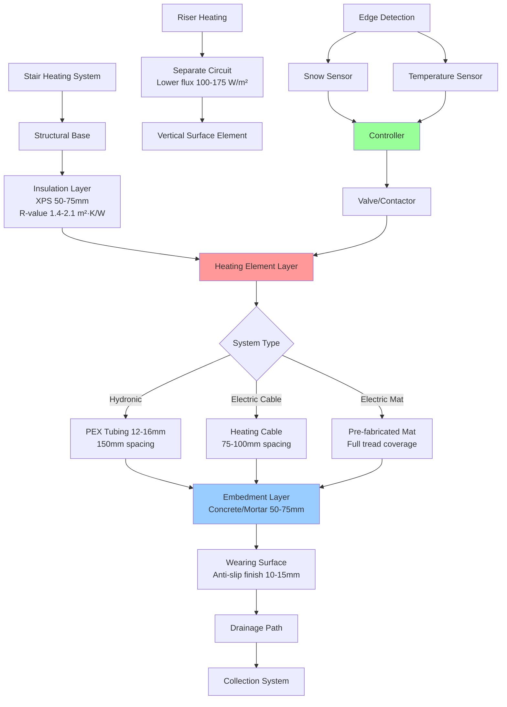

## Physical Principles of Stair Heating

Stair and step snow melting systems present unique thermal and safety challenges distinct from horizontal surface heating. The vertical geometry creates preferential snow accumulation on treads, while risers experience runoff that can refreeze. The critical safety requirement is maintaining complete snow-free conditions during all precipitation events, as even partial snow coverage creates extreme slip hazards.

### Heat Transfer Considerations

Stairs experience three-dimensional heat loss mechanisms:

1. **Tread surface convection** - Enhanced by turbulent airflow around step edges
2. **Riser vertical losses** - Convective cooling from ambient air
3. **Nosing edge effects** - Accelerated heat loss at tread leading edges
4. **Thermal bridging** - Conduction through structural supports

The geometry amplifies wind effects. A step nosing experiences 40-60% higher convective heat transfer coefficients compared to flat surfaces due to flow separation and reattachment zones.

## Heat Flux Requirements

### Tread Surface Load Calculation

The required heat flux for stair treads exceeds flat surface requirements:

$$q_{tread} = q_{melt} + q_{sens} + q_{edge} + q_{backup}$$

Where:
- $q_{melt}$ = Snow melting load (typically 150-250 W/m²)
- $q_{sens}$ = Sensible heat for temperature maintenance (50-100 W/m²)
- $q_{edge}$ = Edge effect compensation (30-60 W/m²)
- $q_{backup}$ = Safety margin (20-30% of total)

For design conditions of -10°C ambient, 5 m/s wind, and 25 mm/hr snowfall:

$$q_{tread} = 200 + 75 + 45 + 96 = 416 \text{ W/m}^2$$

This represents 65-85% higher flux density than comparable horizontal surfaces.

### Riser Heating Requirements

Risers require heating to prevent ice formation from meltwater runoff:

$$q_{riser} = h_c \cdot (T_s - T_a) + \varepsilon \sigma (T_s^4 - T_{sky}^4)$$

Where:
- $h_c$ = Convective coefficient (15-35 W/m²·K for vertical surfaces)
- $T_s$ = Surface temperature (typically 5-10°C)
- $T_a$ = Ambient air temperature
- $\varepsilon$ = Surface emissivity (0.85-0.95 for concrete)
- $\sigma$ = Stefan-Boltzmann constant

For most installations, riser heating requires 100-175 W/m² to prevent ice accumulation.

## Stair Heating System Comparison

| System Type | Heat Flux Capability | Response Time | Tread Depth Limit | Installation Complexity | Operating Cost |
|-------------|---------------------|---------------|-------------------|------------------------|----------------|
| Hydronic (embedded) | 300-500 W/m² | 45-90 min | No limit | High | Low |
| Electric cable | 250-400 W/m² | 20-40 min | ≥250mm optimal | Medium | Medium-High |
| Electric mat | 200-350 W/m² | 15-30 min | 225-400mm | Low | High |
| Heated metal tread | 300-600 W/m² | 10-25 min | Custom | Very High | Medium |
| Infrared radiant | 400-800 W/m² | 5-15 min | No contact | Medium | High |

### System Selection Criteria

**Hydronic systems** provide uniform heat distribution and lower operating costs but require access to boiler infrastructure and careful pitch design for drainage. Optimal for stairs with tread depth >300mm and when integrated with building heating systems.

**Electric cable systems** offer flexibility in layout and faster response but generate higher operating costs. Recommended for retrofit applications and stairs with complex geometries.

**Electric mat systems** provide rapid installation and predictable coverage. Best suited for standard tread dimensions (250-300mm depth) in new construction.

**Heated metal treads** deliver maximum safety through high heat flux and structural integration. Used in critical applications (emergency exits, high-traffic commercial entrances) where failure is unacceptable.

**Infrared radiant** eliminates embedded systems entirely, mounting overhead to deliver directional heating. Effective for historic structures or where tread penetration is prohibited.

## Installation Architecture

## Design Requirements

### Thermal Performance Standards

Stair heating systems must maintain tread surfaces at minimum 2°C during precipitation and prevent ice formation during all weather conditions below 5°C ambient. ASHRAE 90.1 requires automatic controls with both precipitation and temperature sensing to minimize energy consumption.

### Spacing and Coverage

**Tread coverage:** 100% of walking surface from nosing to riser, extending 25mm beyond each side edge.

**Hydronic tube spacing:**

$$s_{tube} = \frac{2k_{concrete} \cdot (T_{tube} - T_{surface})}{q_{required}}$$

For concrete with $k = 1.4$ W/m·K, tube temperature 40°C, surface target 5°C, and required flux 400 W/m²:

$$s_{tube} = \frac{2 \times 1.4 \times (40 - 5)}{400} = 0.245 \text{ m} = 245 \text{ mm}$$

This represents maximum spacing. Practical installations use 150-175mm spacing for uniform surface temperature distribution.

**Electric cable spacing:** 60-75% of hydronic spacing due to higher element temperature and localized heat generation. Typical range: 75-100mm.

### Insulation Requirements

Sub-slab insulation is critical for stair heating efficiency. Heat loss to substrate can represent 40-60% of total input without proper insulation.

Minimum insulation R-value:

$$R_{min} = \frac{T_{surface} - T_{substrate}}{0.3 \times q_{input}}$$

For surface at 5°C, substrate at -5°C, and input flux 400 W/m²:

$$R_{min} = \frac{5 - (-5)}{0.3 \times 400} = 0.083 \text{ m}^2 \cdot \text{K/W}$$

Practical installations use R-1.4 to R-2.1 (50-75mm XPS foam) to achieve 85-92% upward heat delivery efficiency.

## Safety and Code Compliance

### Slip Resistance Requirements

ASTM F1637 specifies minimum Dynamic Coefficient of Friction (DCOF) of 0.42 for exterior stairs. Heated surfaces must maintain this value when wet and during active snow melting. Surface treatments include:

- Textured concrete finish (broom or exposed aggregate)
- Abrasive strip inserts at nosings
- Slip-resistant coating systems rated for heated applications
- Grooved or patterned metal treads

### Electrical Safety

NEC Article 426 governs fixed outdoor electric deicing and snow-melting equipment:
- GFCI protection required for all circuits
- Equipment grounding mandatory
- Maximum surface temperature 80°C to prevent burns
- Thermal cutout protection on all electric systems

### Structural Loading

Additional dead load from heating system components typically adds 50-90 kg/m² to stair structure. Design must account for:
- Embedment layer thickness and density
- Fluid mass in hydronic systems
- Insulation layer weight
- Increased snow load during partial melting (wet snow is 2-3× heavier than dry snow)

## Control Strategies

Advanced stair heating controls integrate multiple sensor inputs for optimal safety and efficiency:

1. **Precipitation detection** at stair location (not remote weather stations)
2. **Surface temperature** measurement on north-facing tread
3. **Ambient temperature** with wind speed correlation
4. **Moisture presence** for detecting frozen precipitation vs. rain

Systems activate when surface temperature drops below 5°C and precipitation is detected, maintaining operation until 30-60 minutes after precipitation ends to ensure complete drying.

## Performance Verification

Infrared thermography conducted during design conditions should show:
- Tread surface temperature uniformity within ±2°C
- No cold spots >5°C below average surface temperature
- Nosing temperatures within 3°C of mid-tread values
- Complete coverage with no unheated zones

These verification standards ensure occupant safety through elimination of refreezing risk and consistent slip resistance across all weather conditions.
