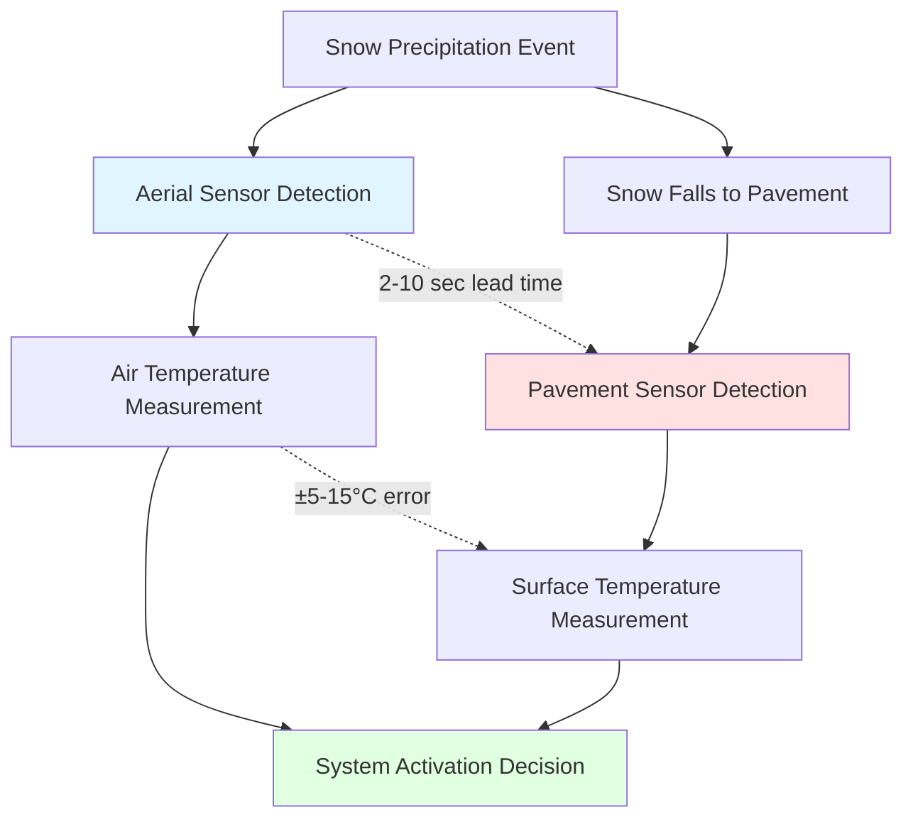

## Physical Principles of Snow Sensor Placement

Snow melting system control depends fundamentally on accurate detection of precipitation and pavement temperature. The mounting location of sensors—aerial versus pavement-embedded—creates distinct thermal environments that affect system performance through different heat transfer mechanisms and response characteristics.

The optimal sensor placement balances three competing requirements: early precipitation detection, accurate surface temperature measurement, and reliable operation under all weather conditions.

## Aerial Sensor Mounting

Aerial sensors mount above the pavement surface, typically on poles or building structures at heights of 6 to 15 feet. These sensors detect precipitation through direct exposure to falling snow or rain while measuring air temperature as a proxy for surface conditions.

### Thermal Environment

The aerial sensor experiences convective heat transfer dominated by ambient air temperature and wind velocity. The sensor's thermal response follows:

$$\rho c V \frac{dT_s}{dt} = hA(T_\infty - T_s) + q_{solar} - q_{rad}$$

Where:
- $\rho$ = sensor material density (kg/m³)
- $c$ = specific heat capacity (J/kg·K)
- $V$ = sensor volume (m³)
- $T_s$ = sensor temperature (K)
- $h$ = convective heat transfer coefficient (W/m²·K)
- $A$ = surface area (m²)
- $T_\infty$ = ambient air temperature (K)
- $q_{solar}$ = solar radiation absorption (W)
- $q_{rad}$ = radiative heat loss (W)

The convective coefficient varies significantly with wind speed:

$$h = C \cdot v^{0.8}$$

Where $v$ represents wind velocity and $C$ is a geometry-dependent constant typically ranging from 5-10 for cylindrical sensors.

### Response Characteristics

Aerial sensors provide the earliest precipitation detection because they intercept falling snow before it reaches the pavement. The detection lead time $\Delta t$ depends on mounting height $h$ and precipitation fall velocity $v_p$:

$$\Delta t = \frac{h}{v_p}$$

For snowfall velocities of 0.5-1.5 m/s and mounting heights of 3-5 m, this provides 2-10 seconds of advance warning.

However, aerial sensors measure air temperature rather than pavement temperature. The temperature differential between air and pavement depends on solar radiation, thermal mass, and recent weather history:

$$\Delta T_{air-pave} = f(Q_{solar}, \rho c_p d_{pave}, \dot{Q}_{stored})$$

This differential can exceed 10°C on sunny winter days, causing premature system activation.

## Pavement-Mounted Sensors

Pavement sensors embed directly in or mount flush with the heating surface, experiencing the same thermal environment as the slab they control. These sensors typically install 25-50 mm below the finished surface.

### Thermal Coupling

The embedded sensor responds to the pavement's thermal state through conduction:

$$\frac{\partial T}{\partial t} = \alpha \nabla^2 T$$

Where $\alpha = k/(\rho c)$ represents thermal diffusivity of the concrete or asphalt matrix.

The sensor temperature lags the surface temperature based on burial depth and material properties:

$$T_{sensor}(t) = T_{surf}(t - \tau)$$

$$\tau = \frac{d^2}{2\alpha}$$

For concrete ($\alpha \approx 0.7 \times 10^{-6}$ m²/s) at 40 mm depth, the thermal lag is approximately 1,200 seconds (20 minutes).

### Moisture Detection

Pavement sensors detect precipitation through resistance changes in moisture-sensing grids or through thermal effects when snow contacts the heated sensing surface. The detection occurs only after precipitation accumulates on the pavement, creating a detection delay compared to aerial sensors.

## Comparative Analysis

### Performance Comparison

| Parameter | Aerial Sensor | Pavement Sensor | Engineering Significance |
|-----------|--------------|-----------------|-------------------------|
| Detection Speed | 2-10 sec advance | Reference point | Affects preheat time |
| Temperature Accuracy | ±5-15°C vs surface | ±1-2°C | Critical for freeze point detection |
| Thermal Mass Effects | Minimal | High | Affects response to rapid changes |
| Solar Gain Impact | Direct on sensor | Integrated with slab | Affects false activation rate |
| Maintenance Access | Easy | Requires excavation | Lifecycle cost consideration |
| Installation Cost | $800-1,500 | $1,200-2,500 | Initial capital requirement |
| Vulnerability | Wind/ice damage | Slab cracking | Reliability factor |
| Coverage Area | 1,500-3,000 m² | 300-500 m² | Sensor density requirement |

## System Design Considerations

### ASHRAE Guidelines

ASHRAE Standard 34P (Snow Melting and Freeze Protection) recommends pavement sensors as the primary control input for critical applications because surface temperature directly determines freeze risk. Aerial sensors serve as supplementary early-warning devices.

The standard specifies sensor placement at representative locations accounting for:
- Shading from adjacent structures
- Wind exposure patterns
- Drainage characteristics
- Traffic patterns that affect snow accumulation

### Hybrid Configurations

Optimal system performance often requires both sensor types in a complementary arrangement:

1. **Aerial sensor** initiates preheat cycle upon precipitation detection
2. **Pavement sensor** maintains operation based on actual surface conditions
3. **Control logic** uses the more conservative reading (lower temperature or moisture present)

The energy balance for the combined system:

$$Q_{required} = Q_{melt} + Q_{sensible} + Q_{evap} + Q_{losses}$$

Must be activated early enough (via aerial sensor) to prevent ice formation, but modulated by actual surface conditions (via pavement sensor) to minimize unnecessary operation.

### Sensor Placement Standards

For pavement sensors:
- Install at locations that snow first or last
- Minimum 2 sensors for areas <500 m²
- Additional sensor per 250-500 m² for larger areas
- Avoid locations with subsurface heat sources

For aerial sensors:
- Mount at representative exposure height
- Ensure unobstructed precipitation path
- Protect from direct heating equipment exhaust
- Position to match predominant wind direction

## Response Time Analysis

The total system response time combines detection delay and heating response:

$$t_{total} = t_{detect} + t_{heat}$$

$$t_{heat} = \frac{\rho c_p d_{pave} \Delta T}{q_{flux}}$$

Where $q_{flux}$ represents the heating system output per unit area (W/m²).

For a typical installation with $q_{flux} = 400$ W/m², 100 mm concrete slab, and 5°C temperature rise requirement, the heating time exceeds 15 minutes. The aerial sensor's 2-10 second detection advantage becomes significant for preventing initial ice formation.

## Conclusion

Aerial sensors provide earlier precipitation detection but measure air temperature with significant deviation from surface conditions. Pavement sensors accurately measure surface temperature but detect precipitation only after surface accumulation occurs.

Physics-based analysis demonstrates that neither mounting location is universally superior—the optimal choice depends on climate conditions, system thermal capacity, and operational priorities. Critical applications benefit from hybrid configurations that combine the early warning of aerial sensors with the accuracy of pavement sensors, allowing control strategies that minimize both freeze risk and energy consumption.

---

*Engineering Note: Sensor selection should be validated through thermal modeling of the specific pavement assembly and climate conditions. The thermal lag equations presented assume homogeneous materials and one-dimensional heat transfer—actual installations may require finite element analysis for complex geometries or layered construction.*
