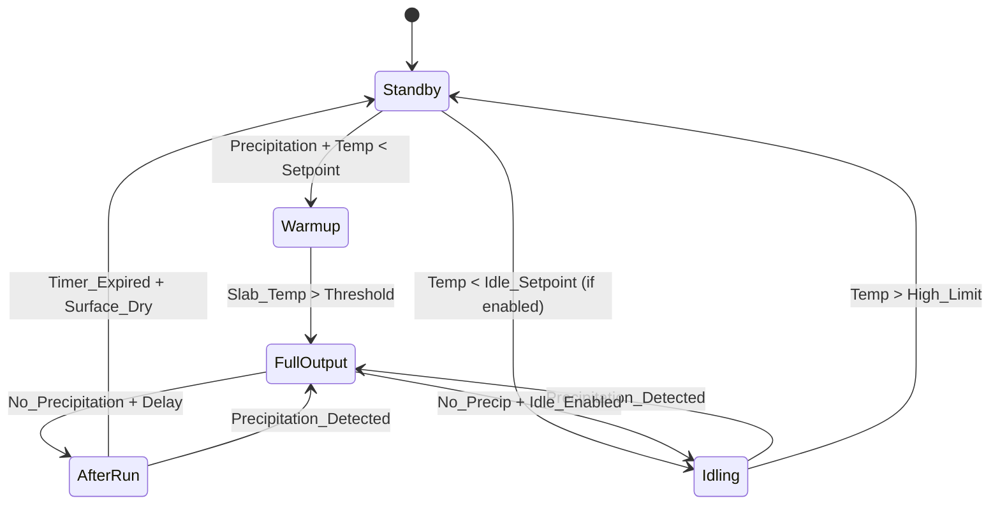
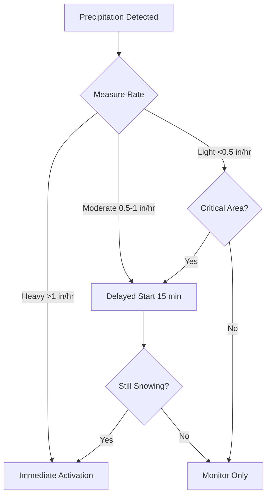

## Operational Control Modes

Snow melting systems operate through distinct control modes that balance response time, energy consumption, and reliability. The control strategy fundamentally determines system effectiveness and annual operating costs, with proper mode selection reducing energy use by 40-70% while maintaining snow-free surfaces.

Control modes fall into three primary categories based on activation criteria and operational intensity: standby (OFF), idling (partial heat input), and full output (design heat flux). The transitions between these states depend on sensor inputs, calculated warmup requirements, and energy optimization algorithms.

### Mode 1: Standby (System OFF)

The system remains completely OFF with no heat input to the slab. This condition exists when:

- Pavement temperature exceeds the high limit setpoint (typically 38-42°F)
- No precipitation detected for the duration of the after-run timer
- Manual shutdown commanded
- Outdoor air temperature above the enable lockout (typically 40-45°F)

During standby, the slab temperature follows ambient conditions according to transient heat conduction. The temperature profile through the slab depth develops from boundary conditions at the surface (convection, radiation, evaporation) and bottom (earth contact or conditioned space below).

The one-dimensional transient heat equation governs slab temperature distribution:

$$\frac{\partial T}{\partial t} = \alpha \frac{\partial^2 T}{\partial z^2}$$

Where thermal diffusivity $\alpha = k/(\rho c)$ determines the rate of temperature penetration. For typical concrete with $k = 1.0$ BTU/hr·ft·°F, $\rho = 145$ lb/ft³, and $c = 0.22$ BTU/lb·°F, the diffusivity equals:

$$\alpha = \frac{1.0}{145 \times 0.22} = 0.0313 \text{ ft}^2/\text{hr}$$

This relatively low diffusivity creates significant thermal lag between surface temperature changes and conditions at the heating pipe depth.

### Mode 2: Idling Operation

Idling mode maintains the slab surface temperature at or slightly above freezing (typically 34-38°F) through continuous low-level heat input. The system operates at reduced output sufficient to offset heat losses and prevent freezing but below the design snow melting capacity.

**Idling heat flux** balances steady-state losses:

$$q_{idle} = h_c(T_s - T_a) + h_r(T_s - T_{sky}) + q_{ground}$$

Where:
- $h_c$ = Combined convection coefficient (2-5 BTU/hr·ft²·°F)
- $h_r$ = Radiation coefficient (≈1 BTU/hr·ft²·°F)
- $T_s$ = Surface setpoint temperature (36°F typical)
- $T_a$ = Ambient air temperature (°F)
- $T_{sky}$ = Effective sky temperature (°F)
- $q_{ground}$ = Heat loss to ground (BTU/hr·ft²)

For a surface maintained at 36°F with ambient air at 20°F, calm wind conditions ($h_c = 2$), and ground losses of 5 BTU/hr·ft²:

$$q_{idle} = 2(36-20) + 1(36-15) + 5 = 32 + 21 + 5 = 58 \text{ BTU/hr·ft}^2$$

This represents approximately 30-40% of typical design snow melting heat flux (150-250 BTU/hr·ft²).

**Idling mode applications:**

- Critical 24/7 access areas (emergency entrances, fire lanes)
- Locations requiring zero snow accumulation tolerance
- Facilities with high-traffic safety requirements
- Slabs with thermal mass exceeding 2-hour warmup time

**Energy penalty:** Continuous idling during the heating season consumes substantial energy. For a 100-hour winter season at 58 BTU/hr·ft²:

$$E_{idle} = 58 \times 100 \times A = 5,800A \text{ BTU per season}$$

Where $A$ = heated area (ft²). A 1,000 ft² area consumes 5.8 million BTU for idling alone, equivalent to 58 therms of natural gas input at 80% boiler efficiency.

### Mode 3: Full Output (Active Snow Melting)

Full output mode delivers design heat flux to melt falling snow and eliminate existing accumulation. The system operates at maximum capacity determined by pipe spacing, fluid temperature, and flow rate.

Activation occurs when all conditions are met:

1. Precipitation detected (moisture sensor active)
2. Pavement temperature below activation setpoint (34-38°F)
3. Start delay timer expired (prevents false starts)
4. Outdoor air temperature below enable limit

The required heat flux combines three components:

$$q_{total} = q_s + q_l + q_e$$

Where:
- $q_s$ = Sensible heat to raise snow from air temperature to 32°F
- $q_l$ = Latent heat of fusion to melt ice (144 BTU/lb)
- $q_e$ = Heat losses during melting (convection, radiation, evaporation)

ASHRAE provides the design heat flux equation:

$$q_o = \frac{0.3 s_r h_{fg}}{\eta} + h_c(T_s - T_a) + \frac{\epsilon \sigma (T_s^4 - T_{sky}^4)}{3.412}$$

Simplified for typical conditions with $s_r$ = snowfall rate (lb/hr·ft²), $h_{fg}$ = 144 BTU/lb, $\eta$ = 0.6-0.8 melting efficiency:

For 1 inch/hr snowfall (0.054 lb/hr·ft² at 6 lb/ft³ density):

$$q_{melt} = \frac{0.3 \times 0.054 \times 144}{0.7} = 3.3 \text{ BTU/hr·ft}^2$$

This represents the direct melting component only. Heat losses typically contribute 80-90% of the total design load.

### Mode 4: After-Run Operation

After-run mode continues full output operation for a preset duration after precipitation cessation. This critical mode ensures complete melting of accumulated snow and evaporation of residual moisture to prevent refreezing.

The after-run timer typically ranges from 30-120 minutes based on:

- Slab thermal mass (higher mass requires longer after-run)
- Typical snow accumulation depth
- Wind conditions (higher wind increases evaporation rate)
- Criticality of surface (hospital entrance vs parking lot)

**Physics of residual drying:**

Evaporation of water film requires substantial energy. The latent heat of vaporization equals 1,050 BTU/lb at 40°F surface temperature. A thin 0.01-inch water film (0.00521 lb/ft²) requires:

$$q_{evap} = 0.00521 \times 1,050 = 5.47 \text{ BTU/ft}^2$$

This heat must be supplied by the system to prevent refreezing of residual moisture. Evaporation rate depends on vapor pressure difference and mass transfer coefficient:

$$\dot{m}_{evap} = h_m(W_s - W_a)$$

Where $h_m$ = mass transfer coefficient, $W_s$ = humidity ratio at saturated surface, $W_a$ = ambient humidity ratio.

## State Transition Logic

Modern controllers implement finite state machines with conditional transitions based on multiple sensor inputs and calculated parameters.

### Transition Conditions

**Standby → Warmup:**
- Precipitation detected for start delay duration (5-15 minutes)
- Pavement temperature < activation setpoint (34-38°F)
- Outdoor air temperature < enable limit (40-45°F)
- Calculated warmup time > 0 minutes

**Warmup → Full Output:**
- Slab surface temperature reaches minimum operating threshold (35°F)
- OR warmup timer expires (prevents indefinite waiting)
- AND precipitation continues

**Full Output → After-Run:**
- No precipitation detected for precipitation clear delay (10-30 minutes)
- OR manual shutdown commanded with after-run enabled

**After-Run → Standby:**
- After-run timer expired
- AND surface moisture sensor indicates dry conditions
- AND no precipitation detected

## Energy Optimization Strategies

### Strategy 1: Activation Setpoint Optimization

Raising the activation temperature setpoint from 32°F to 38°F reduces runtime for marginal precipitation events. Snow falling on pavement above 35°F often melts from ground heat and traffic without mechanical assistance.

**Energy savings mechanism:** Events between 35-38°F do not activate the system, eliminating 15-25% of annual runtime in moderate climates. The tradeoff involves brief snow accumulation (5-15 minutes) before ambient melting occurs.

### Strategy 2: Precipitation Rate Discrimination

Advanced sensors measure precipitation intensity to distinguish light flurries from sustained snowfall. Light snow events (<0.5 inch/hr) may not justify full system activation in low-priority areas.

Control algorithm:

### Strategy 3: Zone Staging

Large installations divide into zones with staggered activation to reduce peak electrical demand and boiler firing rate. Priority zones activate first with subsequent zones delayed by 15-30 minutes.

**Demand reduction:** A 10,000 ft² system at 200 BTU/hr·ft² requires 2,000,000 BTU/hr total. Staged activation in four zones reduces peak demand to 500,000 BTU/hr per stage, allowing smaller boiler selection or reducing electrical demand charges.

Zone staging sequence:

| Stage | Zones | Delay | Peak Demand |
|-------|-------|-------|-------------|
| 1 | Entry drives (25%) | 0 min | 500,000 BTU/hr |
| 2 | Main access (25%) | 15 min | 1,000,000 BTU/hr |
| 3 | Parking (30%) | 30 min | 1,500,000 BTU/hr |
| 4 | Secondary areas (20%) | 45 min | 2,000,000 BTU/hr |

### Strategy 4: Warmup Load Modulation

During slab warmup phase, full design capacity is unnecessary. Modulating output based on temperature rise rate optimizes energy use while meeting time requirements.

The required warmup heat flux derives from thermal mass and target time:

$$q_{warmup} = \frac{m \cdot c \cdot \Delta T}{A \cdot t_{target}}$$

For a 6-inch concrete slab (75 lb/ft²) requiring 20°F rise in 60 minutes:

$$q_{warmup} = \frac{75 \times 0.22 \times 20}{1 \times 1} = 330 \text{ BTU/hr·ft}^2$$

If design capacity exceeds this requirement, modulating to match the calculated warmup load reduces boiler cycling and improves efficiency.

### Strategy 5: Weather Forecast Integration

Internet-connected controllers access forecast data to implement predictive logic:

- Pre-warm slabs before forecast storms (eliminates snow accumulation during warmup)
- Prevent activation for storms forecast to miss the location
- Adjust after-run duration based on predicted weather following precipitation
- Disable idling mode during extended warm periods

**Energy impact:** Forecast integration reduces false starts by 30-40% and prevents unnecessary idling during warm breaks in winter, yielding 15-25% annual energy savings.

## Comparison of Control Strategies

| Strategy | Response Time | Energy Use | Annual Cost | Application |
|----------|---------------|------------|-------------|-------------|
| Manual operation | 30-120 min | High | High | Small residential |
| Auto + standby | 15-60 min | Low | Low | General commercial |
| Auto + idling | 0-5 min | Very high | Very high | Critical access |
| Forecast integration | 0 min (pre-start) | Medium | Medium | Large commercial |
| Zone staging | 0-45 min | Medium-low | Low-medium | Large installations |

## Design Recommendations

Proper control strategy selection requires analysis of:

1. **Criticality** - Emergency access requires idling or forecast integration for zero snow accumulation tolerance
2. **Area size** - Large areas benefit from zoning and staging strategies
3. **Slab thermal mass** - High-mass slabs (>6 inches) require idling or forecast integration to minimize warmup delay
4. **Climate** - Locations with frequent freeze-thaw cycles benefit from optimized setpoints
5. **Energy costs** - High energy costs justify investment in advanced control features

ASHRAE Handbook - HVAC Applications Chapter 51 recommends automatic control with standby mode for most applications, reserving idling operation for critical areas requiring immediate response. The after-run timer should equal at least 30 minutes with extension to 60-90 minutes for high thermal mass installations.

Control system commissioning must verify sensor calibration, setpoint values, time delay settings, and proper state transitions under simulated conditions before the first snow event. Document all control parameters and adjust based on first-season performance observations.
